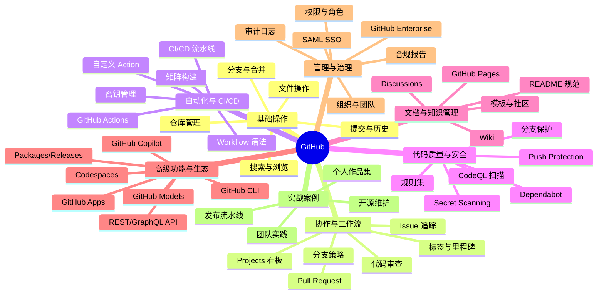
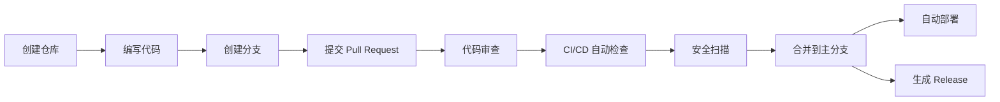

# GitHub 功能全景图

> 一张图纵览 GitHub 全部功能模块，找到你需要的能力起点。

## 概述

GitHub 远不止一个代码托管平台。它是围绕软件开发生命周期构建的完整工具链——从代码编写、版本管理、团队协作，到自动化测试部署、安全保障、文档维护，再到 AI 辅助开发与企业治理，GitHub 几乎覆盖了现代软件工程的每一个环节。

理解 GitHub 的功能全貌，有助于你跳出"只用 Git push"的思维局限，系统性地发掘平台潜力。无论你是个人开发者、团队负责人还是开源维护者，都能从中找到提升效率的关键功能。

> [!NOTE]
> 本课程共 9 个章节（Ch00-Ch08），按"基础 → 协作 → 自动化 → 质量 → 文档 → 高阶 → 治理 → 实战"的递进顺序编排。下方的全景图展示了每个模块对应的章节，方便你按需跳转。

## 核心操作

## 进阶技巧

### 基础操作

一切从这里开始。Repository（仓库）是 GitHub 的核心单元，你在这里管理代码版本、创建分支、提交变更和查看历史。掌握基础操作是使用所有高级功能的前提。

核心能力包括：仓库的创建与配置、分支管理与合并策略、提交信息撰写规范、文件在线编辑与上传、代码搜索与跨仓库浏览。

详见 [01-基础操作](../01-基础操作/)。

### 协作与工作流

GitHub 最强大的价值在于协作。Issue 用于追踪任务和 Bug，Pull Request 是代码变更的协作载体，代码审查确保质量，Projects 提供项目管理的可视化看板。

核心能力包括：Issue 创建与管理（含子任务和依赖关系）、Pull Request 工作流（含三种合并方式）、
代码审查流程与 CODEOWNERS 自动分配、Projects 看板与自动化、GitHub Flow / GitFlow 等分支策略。

详见 [02-协作与工作流](../02-协作与工作流/)。

### 自动化与 CI/CD

GitHub Actions 是内置的自动化引擎，让你无需离开平台即可构建完整的 CI/CD 流水线。通过 YAML 语法定义 Workflow，在代码推送、Issue 创建等事件触发时自动执行测试、构建和部署。

核心能力包括：Workflow 语法与触发事件、Action 市场与自定义 Action 开发、矩阵构建与缓存优化、环境部署与审批流程、密钥安全管理与 OIDC 认证。

详见 [03-自动化与CI-CD](../03-自动化与CI-CD/)。

> [!TIP]
> GitHub 为常见场景提供了大量官方启动模板，无需从零编写 Workflow。
> 访问 [actions/starter-workflows](https://github.com/actions/starter-workflows) 即可直接套用。

### 代码质量与安全

安全不是事后补丁，而是开发流程的内置环节。GitHub 提供从代码扫描、依赖管理到凭据检测的多层安全防护，帮助你尽早发现并修复问题。

核心能力包括：CodeQL 静态分析代码扫描、Dependabot 自动检测并修复依赖漏洞、Secret Scanning 检测意外提交的凭据、Push Protection 在推送前拦截敏感信息、分支保护规则与新一代规则集。

详见 [04-代码质量与安全](../04-代码质量与安全/)。

> [!WARNING]
> 将密钥（API Key、Token、密码）硬编码到代码中是严重的安全隐患。务必启用 Secret Scanning 和 Push Protection，防止敏感信息进入 Git 历史。

### 文档与知识管理

优秀的文档是项目成功的关键。GitHub 内置多种文档工具：Wiki 适合长篇技术文档，Pages 可以托管静态网站，Discussions 提供社区讨论空间，而规范的 README 则是项目的门面。

核心能力包括：Wiki 多页文档与侧边栏定制、GitHub Pages 静态站点托管（支持 Jekyll、Hugo 等）、Discussions 社区分类讨论与问答、README 模板与最佳实践。

详见 [05-文档与知识管理](../05-文档与知识管理/)。

### 高级功能与生态

当你掌握了基础功能后，GitHub 的生态系统将为你打开更高效的工作方式。Copilot 用 AI 辅助编码，CLI 让你告别浏览器，API 支持深度集成，Codespaces 提供云端开发环境。

核心能力包括：GitHub Copilot（代码补全、Chat、Coding Agent、Code Review）、
GitHub CLI（`gh` 命令行工具及扩展）、REST API 与 GraphQL API、
GitHub Apps 开发与 Probot 框架、Codespaces 云端开发容器、
Packages 包管理与 Releases 发布、GitHub Models AI 模型接入。

详见 [06-高级功能与生态](../06-高级功能与生态/)。

### 管理与治理

当团队规模增长到数十甚至数百人时，良好的治理变得至关重要。GitHub 提供组织管理、细粒度权限控制、审计日志和合规报告等企业级能力，帮助你安全、合规地管理开发资产。

核心能力包括：组织与团队层级管理、角色与权限体系（含细粒度 PAT）、审计日志与活动监控、SOC 2 / FedRAMP 合规报告、SAML SSO 与 2FA 强制策略、GitHub Enterprise Server / Cloud。

详见 [07-管理与治理](../07-管理与治理/)。

### 实战案例

理论需要实践来检验。本章节汇总真实场景下的完整实践案例，帮助你将前面学到的知识转化为可落地的方案。

核心能力包括：开源项目创建与维护全流程、GitHub Profile 作品集打造、团队协作最佳实践（代码审查、Issue 管理等）、自动化发布流水线（语义化版本、Docker 镜像、NPM 发布）。

详见 [08-实战案例集](../08-实战案例集/)。

## 功能模块关联

各功能模块并非孤立存在，它们在日常工作流中紧密协作。以下是一个典型的端到端流程：

这个流程串联了基础操作、协作、自动化、安全和发布等多个模块。在实际工作中，你往往需要同时运用多个模块的能力。

> [!NOTE]
> 课程中每个章节都包含实操练习。建议按照 [学习路线建议](./学习路线建议) 中的路径，结合自己的角色和目标有重点地学习。

## 常见问题

### Q: GitHub 和 Git 是什么关系？

Git 是一个分布式版本控制工具，在本地管理代码变更历史。GitHub 是基于 Git 的云端协作平台，
在 Git 的基础上增加了代码托管、Issue 追踪、Pull Request、Actions 等协作和自动化功能。
简单来说，Git 是引擎，GitHub 是围绕引擎构建的完整汽车。

### Q: 哪些功能是免费的，哪些需要付费？

GitHub 对个人开发者提供的免费额度相当慷慨：公开仓库无限制、
2,000 分钟/月的 Actions 运行时间、500MB 的 Packages 存储、Copilot Free 等。
Copilot Pro、Codespaces 扩展额度、Advanced Security（GHAS）和 Enterprise 功能
需要付费订阅。学生可以通过 [GitHub Student Developer Pack](https://education.github.com/pack)
免费获取大量高级功能。

### Q: 我应该从哪个模块开始学？

如果你是 GitHub 新手，从 [01-基础操作](../01-基础操作/) 开始，
掌握仓库、分支、提交的核心概念。如果你已经熟悉基础操作但想提升协作效率，
直接进入 [02-协作与工作流](../02-协作与工作流/)。
具体的学习路线建议参见 [学习路线建议](./学习路线建议)。

### Q: GitHub Actions 和 Jenkins/Lab CI 有什么区别？

GitHub Actions 是 GitHub 原生的自动化平台，与仓库、Pull Request、Issue 深度集成，
无需额外部署和维护服务器。它的优势在于零配置起步、丰富的 Action 市场生态、
以及与 GitHub 事件系统的无缝衔接。Jenkins 和 GitLab CI 则是独立的 CI/CD 工具，
适合更复杂的自托管场景。

### Q: Copilot 会取代程序员吗？

不会。GitHub Copilot 是辅助工具，帮助你更快地编写样板代码、生成测试用例、理解不熟悉的代码库。最终的架构决策、业务逻辑和代码审查仍然需要人类的判断力。将 Copilot 视为一个高效的编程伙伴，而不是替代者。

### Q: 代码安全功能会影响开发效率吗？

短期可能增加一点流程步骤，但长期收益远大于成本。Dependabot 自动修复依赖漏洞，
CodeQL 在代码审查阶段就发现安全隐患，Push Protection 阻止密钥泄露——
这些都避免了事后补救的高昂代价。建议从默认配置起步，逐步调整扫描频率和规则严格度。

## 参考链接

| 标题 | 说明 |
|------|------|
| [GitHub Features](https://github.com/features) | GitHub 官方功能全景页面，涵盖所有核心产品 |
| [GitHub Docs](https://docs.github.com/) | GitHub 官方文档总入口，覆盖使用指南和排错手册 |
| [Get started with GitHub](https://docs.github.com/en/get-started) | GitHub 入门专区，新手起步内容汇总 |
| [Security Features](https://docs.github.com/en/code-security/getting-started/github-security-features) | 安全功能概览 |
| [A complete GitHub overview for 2025](https://www.eesel.ai/blog/github-overview) | 2025 年 GitHub 功能与定价全览 |
| [GitHub Glossary 中文](https://docs.github.com/zh/get-started/learning-about-github/github-glossary) | 官方术语表中文版 |
| [GitHub Git Cheat Sheet](https://training.github.com/downloads/github-git-cheat-sheet.pdf) | GitHub 官方 Git 命令速查表 |
