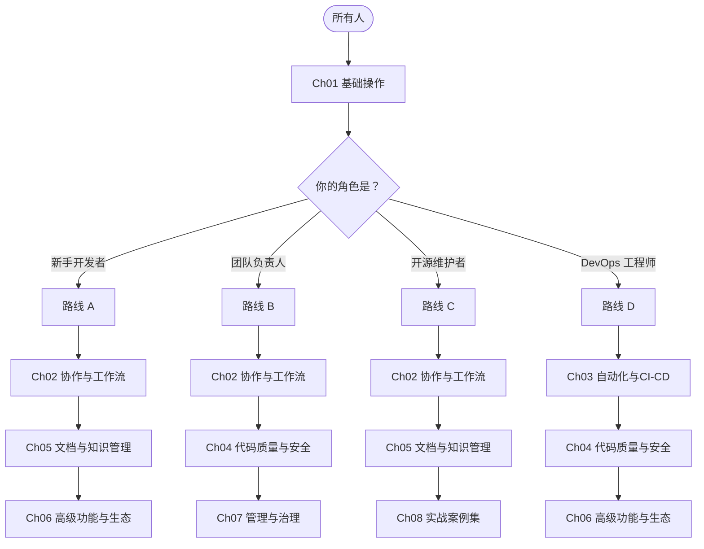

# 学习路线建议

> 根据你的角色和目标，选择最适合你的 GitHub 学习路径。

## 概述

本课程涵盖 9 个章节、数十个功能模块，但你不需要按顺序全部学完。不同的角色对应不同的重点章节。本文件为四种典型角色设计了专属学习路线，标注了预估时间和优先级。

> [!NOTE]
> 所有路线都以 [01-基础操作](../01-基础操作/) 为共同起点。如果你已熟悉 Git 和 GitHub 基础操作（创建仓库、分支、提交），可以跳过基础阶段，直接进入你感兴趣的高级路线。

## 核心操作

## 进阶技巧

**适合人群**：有基本编程经验，刚开始使用 GitHub 的开发者。

**学习目标**：独立管理项目、参与团队协作、使用 AI 辅助编程。

**预估总时长**：4-6 周（每周 5-8 小时）。

### 第一阶段：打基础（1-2 周）

| 优先级 | 章节 | 重点内容 | 预估时间 |
|--------|------|----------|----------|
| 必修 | [01-基础操作](../01-基础操作/) | 仓库创建与管理、分支操作、提交规范、文件操作 | 6-8 小时 |
| 必修 | [GitHub 功能全景图](./GitHub-功能全景图.md) | 浏览全景图，建立对 GitHub 能力边界的认知 | 30 分钟 |

**阶段目标**：能够独立创建仓库、管理分支、撰写规范提交信息。

### 第二阶段：学协作（1-2 周）

| 优先级 | 章节 | 重点内容 | 预估时间 |
|--------|------|----------|----------|
| 必修 | [02-协作与工作流](../02-协作与工作流/) | Issue 管理、Pull Request 完整流程、代码审查基础 | 6-8 小时 |

**阶段目标**：能够提交规范的 Issue、完成一次完整的 Pull Request 流程。

> [!TIP]
> 通过 [first-contributions](https://github.com/firstcontributions/first-contributions) 练习你的第一次开源贡献，只需 15 分钟。

### 第三阶段：写文档（1 周）

| 优先级 | 章节 | 重点内容 | 预估时间 |
|--------|------|----------|----------|
| 必修 | [05-文档与知识管理](../05-文档与知识管理/) | README 撰写、GitHub Pages 搭建个人站点 | 4-5 小时 |

**阶段目标**：写出专业级 README，用 Pages 搭建个人作品集。

### 第四阶段：提效率（1 周）

| 优先级 | 章节 | 重点内容 | 预估时间 |
|--------|------|----------|----------|
| 推荐 | [06-高级功能与生态](../06-高级功能与生态/) | Copilot 使用技巧、GitHub CLI 基本命令、Codespaces | 4-6 小时 |

**阶段目标**：在日常开发中使用 Copilot 辅助编码，用 `gh` 命令行提升操作效率。

## 路线 B：团队负责人

**适合人群**：带领开发团队的技术负责人、工程经理。

**学习目标**：设计团队协作工作流、建立质量门禁、管理组织权限。

**预估总时长**：5-7 周（每周 4-6 小时）。

### 第一阶段：梳理协作流程（1-2 周）

| 优先级 | 章节 | 重点内容 | 预估时间 |
|--------|------|----------|----------|
| 必修 | [02-协作与工作流](../02-协作与工作流/) | Issue 模板、PR 模板、CODEOWNERS、Projects 看板、分支策略选型 | 6-8 小时 |

**阶段目标**：为团队建立统一的 Issue/PR 模板，选择分支策略，搭建 Projects 看板。

### 第二阶段：建立质量门禁（1-2 周）

| 优先级 | 章节 | 重点内容 | 预估时间 |
|--------|------|----------|----------|
| 必修 | [03-自动化与CI-CD](../03-自动化与CI-CD/) | CI Workflow 设计、测试自动化、部署环境配置 | 6-8 小时 |
| 必修 | [04-代码质量与安全](../04-代码质量与安全/) | 分支保护规则、规则集配置、Dependabot 启用 | 5-6 小时 |

**阶段目标**：搭建 CI 流水线，配置分支保护，启用 Dependabot。

> [!WARNING]
> 分支保护规则一旦启用，直接影响团队成员的推送权限。建议先在测试仓库验证，再推广到生产仓库。

### 第三阶段：组织治理（1-2 周）

| 优先级 | 章节 | 重点内容 | 预估时间 |
|--------|------|----------|----------|
| 必修 | [07-管理与治理](../07-管理与治理/) | 组织与团队结构、角色权限体系、审计日志、合规要求 | 6-8 小时 |
| 推荐 | [06-高级功能与生态](../06-高级功能与生态/) | Copilot 团队部署、API 集成、Webhook 配置 | 4-5 小时 |

**阶段目标**：搭建组织架构、配置最小权限模型、建立审计机制。

### 第四阶段：实战落地（1 周）

| 优先级 | 章节 | 重点内容 | 预估时间 |
|--------|------|----------|----------|
| 推荐 | [08-实战案例集](../08-实战案例集/) | 团队协作最佳实践、自动化发布流水线 | 4-5 小时 |

**阶段目标**：参考实战案例，将规范和工具整合到团队工作流中。

## 路线 C：开源维护者

**适合人群**：维护开源项目或计划创建开源项目的开发者。

**学习目标**：搭建开源项目基础设施、管理社区贡献、保障项目安全。

**预估总时长**：4-5 周（每周 5-8 小时）。

### 第一阶段：项目基础设施（1 周）

| 优先级 | 章节 | 重点内容 | 预估时间 |
|--------|------|----------|----------|
| 必修 | [01-基础操作](../01-基础操作/) | 仓库初始化最佳实践、.gitignore、许可证选择 | 3-4 小时 |
| 必修 | [05-文档与知识管理](../05-文档与知识管理/) | README 规范、Wiki 文档、Discussions 社区搭建 | 5-6 小时 |

**阶段目标**：创建具备 README、贡献指南、行为准则和许可证的开源项目。

### 第二阶段：贡献者工作流（1-2 周）

| 优先级 | 章节 | 重点内容 | 预估时间 |
|--------|------|----------|----------|
| 必修 | [02-协作与工作流](../02-协作与工作流/) | Issue 模板与表单、PR 模板、CODEOWNERS、Projects 路线图 | 6-8 小时 |

**阶段目标**：建立清晰贡献流程，让外部贡献者顺畅提交 Issue 和 PR。

> [!NOTE]
> 好的 Issue/PR 模板能显著降低沟通成本。参见 [实战案例集](../08-实战案例集/) 中的开源维护案例。

### 第三阶段：自动化与安全（1-2 周）

| 优先级 | 章节 | 重点内容 | 预估时间 |
|--------|------|----------|----------|
| 必修 | [03-自动化与CI-CD](../03-自动化与CI-CD/) | CI 测试 Workflow、自动发布流水线 | 5-6 小时 |
| 必修 | [04-代码质量与安全](../04-代码质量与安全/) | Dependabot 配置、Security Policy、漏洞报告机制 | 4-5 小时 |

**阶段目标**：配置自动化测试和发布流程，启用安全策略，保障依赖安全。

### 第四阶段：社区运营（1 周）

| 优先级 | 章节 | 重点内容 | 预估时间 |
|--------|------|----------|----------|
| 推荐 | [08-实战案例集](../08-实战案例集/) | 开源项目维护全流程、GitHub Sponsors | 4-5 小时 |
| 选修 | [06-高级功能与生态](../06-高级功能与生态/) | GitHub API（贡献统计）、GitHub Apps（自动化机器人） | 4-5 小时 |

**阶段目标**：建立活跃社区讨论空间，通过 Sponsors 获取项目资金支持。

> [!TIP]
> 在 `.github/` 目录放置 CONTRIBUTING.md、CODE_OF_CONDUCT.md、SECURITY.md，
GitHub 会自动在 Issue 和 PR 页面展示这些指引。

## 路线 D：DevOps 工程师

**适合人群**：负责 CI/CD 流水线和基础设施自动化的开发者。

**学习目标**：精通 Actions、掌握安全自动化、深度集成 API。

**预估总时长**：5-7 周（每周 6-10 小时）。

### 第一阶段：Actions 深度掌握（2 周）

| 优先级 | 章节 | 重点内容 | 预估时间 |
|--------|------|----------|----------|
| 必修 | [03-自动化与CI-CD](../03-自动化与CI-CD/) | Workflow 完整语法、矩阵构建、缓存优化、可复用 Workflow、自定义 Action 开发、密钥管理与 OIDC | 12-15 小时 |

**阶段目标**：能够设计和实现复杂的 CI/CD Workflow，包括多环境部署、审批流程和安全密钥管理。

> [!WARNING]
> GitHub Actions 的 `pull_request_target` 事件可访问仓库密钥。配置不当可能导致密钥泄露，务必理解安全文档中的相关警告。

### 第二阶段：安全自动化（1-2 周）

| 优先级 | 章节 | 重点内容 | 预估时间 |
|--------|------|----------|----------|
| 必修 | [04-代码质量与安全](../04-代码质量与安全/) | CodeQL 扫描自动化、Dependabot 高级配置、Secret Scanning、Push Protection、策略即代码 | 8-10 小时 |

**阶段目标**：将安全扫描集成到 CI 流水线，实现依赖漏洞的自动检测与修复。

### 第三阶段：API 与集成（1-2 周）

| 优先级 | 章节 | 重点内容 | 预估时间 |
|--------|------|----------|----------|
| 必修 | [06-高级功能与生态](../06-高级功能与生态/) | REST API 与 GraphQL API、Webhook 配置、GitHub Apps 开发、GitHub CLI 扩展 | 8-10 小时 |

**阶段目标**：通过 API 和 Webhook 实现平台间的深度集成，开发自定义 GitHub App。

### 第四阶段：企业级实践（1 周）

| 优先级 | 章节 | 重点内容 | 预估时间 |
|--------|------|----------|----------|
| 推荐 | [07-管理与治理](../07-管理与治理/) | 审计日志 API、SAML SSO 集成、GHE 部署 | 5-6 小时 |
| 推荐 | [08-实战案例集](../08-实战案例集/) | 自动化发布流水线（语义化版本、Docker、NPM） | 4-5 小时 |

**阶段目标**：搭建代码提交到生产部署的全自动流水线，具备企业级安全和合规能力。

## 学习节奏建议

以下节奏建议适用于所有路线：

1. **先跟做再创造**——先跟着练习做，再在项目中独立完成。
2. **每周固定时间**——每周 2-3 个时段，比偶尔突击效果好。
3. **做中学**——在项目中应用所学，而非只看文档。
4. **善用官方资源**——[GitHub Skills](https://skills.github.com/) 和 [Docs](https://docs.github.com/) 是最佳参考。

## 常见问题

### Q: 我不属于以上四种角色，应该怎么学？

参考路线 A 的顺序（基础 → 协作 → 文档 → 高级功能）。
学完基础和协作后，根据实际需要选择深入方向。
也可以先浏览 [功能全景图](./GitHub-功能全景图.md)，从吸引你的模块开始。

### Q: 学完整个课程需要多长时间？

全职投入约 4-6 周可以覆盖全部章节。兼职学习（每周 5-8 小时）约需 8-12 周。建议掌握基础后在项目中持续实践。

### Q: 可以跳过某些章节吗？

可以。每条路线都标注了"必修"和"推荐"优先级。章节之间有关联，但各自也尽量独立，方便按需查阅。

### Q: GitHub 更新很快，课程内容会过时吗？

GitHub 持续推出新功能，但本课程聚焦的核心功能和工作原理相对稳定。课程会持续更新，
你也可以关注 [GitHub Blog](https://github.blog/) 获取最新动态。

### Q: 有没有推荐的学习工具和资源？

- [GitHub Skills](https://skills.github.com/)——官方交互式课程，边做边学
- [GitHub Learning Pathways](https://learn.github.com/learning-pathways)——按场景规划的学习路径
- [roadmap.sh/git-github](https://roadmap.sh/git-github)——社区驱动的可视化学习路线图
- [GitHub Student Developer Pack](https://education.github.com/pack)——学生可免费获取 Copilot、Codespaces 等高级功能

### Q: 学完课程后如何继续提升？

本课程提供系统性知识框架，但精通来自实践。建议你：维护开源项目、参与代码审查、
自动化日常工作、探索 GitHub API。
关注 [GitHub Changelog](https://github.blog/changelog/) 了解新功能。

## 参考链接

| 标题 | 说明 |
|------|------|
| [Learning Pathways](https://learn.github.com/learning-pathways) | GitHub 官方学习路径，按业务场景提供引导式课程 |
| [GitHub Skills](https://skills.github.com/) | 官方交互式学习平台，通过实操练习掌握功能 |
| [Introduction to GitHub](https://github.com/skills/introduction-to-github) | 一小时引导新手完成首次贡献的入门课程 |
| [Learn Git and GitHub — roadmap.sh](https://roadmap.sh/git-github) | 社区驱动的可视化学习路线图 |
| [Intro to GitHub](https://learn.microsoft.com/en-us/training/modules/introduction-to-github/) | MS Learn 入门模块 |
| [Student Developer Pack](https://education.github.com/pack) | 学生免费获取高级功能和工具包 |
| [Zero to Hero](https://medium.com/@vidhijaiswal11er/github-learning-roadmap-from-zero-to-hero-36590b9e98b3) | 社区学习路径 |
| [Git Learning Roadmap — Coursera](https://www.coursera.org/resources/git-learning-roadmap) | Coursera 分步骤规划核心技能与实战项目 |
