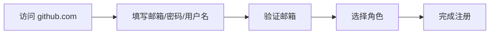

# 注册与账号设置

> 从零建立你的 GitHub 身份——个人资料、密钥认证与通知管理。

## 概述

注册一个 GitHub 账号只需要邮箱和几分钟时间，但真正让账号变得"可用"需要完成几项关键配置：完善个人资料、设置认证方式、调整通知偏好。这些步骤看似琐碎，却是后续所有操作的基础。

GitHub 支持两种账号类型：免费版（Free）和付费版（Pro / Team / Enterprise）。对于个人开发者而言，免费版已经足够应对绝大多数场景——包括公开仓库、GitHub Actions（每月 2000 分钟）和 GitHub Codespaces（每月 120 核心小时）。

> [!NOTE]
> GitHub 的用户名一旦设定便**无法轻松更改**，因为它会嵌入到你所有的仓库 URL、Issue 链接和 Gist 地址中。建议在注册时就选择一个专业、简洁且长期可用的用户名。

本章将引导你完成从注册到"开发环境就绪"的全过程，涵盖个人资料编辑、SSH/GPG 密钥配置以及通知与邮件偏好设置。

## 核心操作

### 注册 GitHub 账号

1. 访问 [github.com](https://github.com)，点击 **Sign up**。
2. 输入你的邮箱地址，设置密码，选择用户名。
3. 完成邮箱验证——GitHub 会向你的注册邮箱发送一封验证邮件，点击其中的链接即可。
4. （可选）选择你的角色定位（Student、Developer、Teacher 等）并完成个性化引导。



> [!WARNING]
> 如果你使用的是企业邮箱或学校邮箱，请注意邮箱策略变化的风险。建议使用长期可控的个人邮箱作为注册邮箱，并在 Settings > Emails 中添加备用邮箱。

### 完善个人资料

1. 点击右上角头像，选择 **Settings**。
2. 在 **Profile** 页面填写：
   - **Name**：你的真实姓名或常用称呼（与用户名不同，可随时修改）。
   - **Bio**：一句话简介，最多 160 个字符。
   - **Company / Location / Website**：公司、地区、个人网站。
3. 上传头像——建议使用清晰可辨识的头像，有利于社区协作中的身份识别。
4. （可选）在 **Social accounts** 中关联你的 Twitter、LinkedIn 等社交账号。

> [!TIP]
> 在 Profile 页面勾选 **"Include contributions from private repositories"** 可以让你的贡献图（contribution graph）也计入私有仓库的贡献，展示更完整的活跃度。

### 配置 SSH 密钥

SSH 密钥让你在 Push、Pull 时无需每次输入密码，是日常开发的基本配置。

1. 在本地终端生成 ED25519 密钥对（推荐）：

```bash
ssh-keygen -t ed25519 -C "<your-email@example.com>"
```

2. 将公钥添加到 ssh-agent：

```bash
eval "$(ssh-agent -s)"
ssh-add ~/.ssh/id_ed25519
```

3. 复制公钥内容：

```bash
cat ~/.ssh/id_ed25519.pub
```

4. 在 GitHub 中添加：**Settings > SSH and GPG keys > New SSH key**，粘贴公钥，保存。

5. 验证连接：

```bash
ssh -T git@github.com
# 成功会显示：Hi <username>! You've successfully authenticated...
```

> [!NOTE]
> 如果你使用的是旧版 RSA 密钥，建议迁移到 ED25519——它更短、更安全、性能更好。GitHub 自 2022 年起已不再支持 DSA 密钥。

### 配置 GPG 签名

GPG 签名可以让你的 Commit 标记为"Verified"，证明该提交确实由你本人发起。

1. 安装 GPG 工具：

```bash
# macOS
brew install gnupg

# Ubuntu / Debian
sudo apt install gnupg
```

2. 生成 GPG 密钥对：

```bash
gpg --full-generate-key
# 选择 RSA and RSA，密钥大小 4096，有效期按需设置
```

3. 获取密钥 ID 并导出公钥：

```bash
gpg --list-secret-keys --keyid-format=long
# 复制 sec 行中 / 后面的密钥 ID
gpg --armor --export <key-id>
```

4. 在 GitHub 中添加：**Settings > SSH and GPG keys > New GPG key**，粘贴公钥，保存。

5. 配置 Git 使用该密钥签名：

```bash
git config --global user.signingkey <key-id>
git config --global commit.gpgsign true
```

> [!WARNING]
> GPG 密钥的 passphrase 请妥善保存。如果你忘记了 passphrase，该密钥将无法使用，需要重新生成并上传。

### 设置通知偏好

GitHub 的通知系统非常灵活，但也容易淹没你的邮箱。合理配置通知是保持效率的关键。

1. 进入 **Settings > Notifications**。
2. 配置以下选项：
   - **Watching**：默认通知你 Watch 的仓库的活动。建议取消 **"Automatically watch repositories"**，改为手动 Watch。
   - **Email 通知**：选择哪些事件通过邮件通知（Issue、PR、Commit 等）。
   - **Participating**：你参与讨论的 Issue 和 PR 的通知建议保持开启。
3. 使用 GitHub 顶部的通知铃铛图标查看和管理通知。

> [!TIP]
> 在每个仓库页面点击 **Watch > Custom** 可以精细控制该仓库的通知类型——只接收 Release 通知、安全告警或完全关闭。

## 进阶技巧

### 使用 Token 替代密码认证

GitHub 自 2021 年 8 月起已不再支持密码方式的 Git 操作认证，你需要使用 Personal Access Token（PAT）。

1. 进入 **Settings > Developer settings > Personal access tokens**。
2. 选择 **Fine-grained tokens**（推荐，支持精细权限控制）或 **Tokens (classic)**。
3. 设置 Token 名称、过期时间和权限范围。
4. 生成后**立即复制**——Token 只显示一次。

```bash
# 使用 Token 克隆仓库
git clone https://<token>@github.com/<username>/<repo>.git
```

> [!WARNING]
> Fine-grained Token 支持按仓库和权限维度授权，比 Classic Token 安全得多。始终遵循最小权限原则，仅授予必要的权限。

### 管理多个 GitHub 账号

如果你同时拥有个人账号和工作账号，可以通过 SSH 配置文件区分：

```bash
# ~/.ssh/config
Host github.com
  HostName github.com
  User git
  IdentityFile ~/.ssh/id_ed25519_personal

Host github-work
  HostName github.com
  User git
  IdentityFile ~/.ssh/id_ed25519_work
```

克隆工作仓库时使用 `github-work` 别名：

```bash
git clone git@github-work:<org>/<repo>.git
```

## 常见问题

### Q: 用户名可以修改吗？

可以，但不推荐。修改用户名后，所有旧 URL（仓库、Issue、Gist 等）会重定向到新用户名，但外部链接、文档中的引用不会被自动更新。操作路径：**Settings > Account > Change username**。

### Q: SSH 连接被拒绝怎么办？

按以下顺序排查：1）确认公钥已添加到 GitHub；2）检查 ssh-agent 是否运行（`ssh-add -l`）；3）测试连接（`ssh -T git@github.com`）；4）检查 `~/.ssh/config` 配置是否正确。

### Q: Commit 显示 "Unverified" 怎么办？

最常见的原因是 GPG 密钥关联的邮箱与 Git 配置的邮箱不一致。确保 `git config --global user.email` 的邮箱已添加到 GitHub 账号的 **Settings > Emails** 中，并且与 GPG 密钥中的 UID 邮箱匹配。

### Q: 如何关闭所有邮件通知？

进入 **Settings > Notifications**，取消勾选所有邮件通知选项，仅保留网页端通知。你也可以在 **Settings > Emails** 中取消勾选 **"Allow my email to be used for Web-finger"** 等选项。

### Q: 免费版和 Pro 版的主要区别是什么？

免费版支持无限公开仓库、2000 分钟/月 Actions、120 核心小时/月 Codespaces。Pro 版（$4/月）增加无限私有仓库协作者、3000 分钟/月 Actions、180 核心小时/月 Codespaces，以及高级代码搜索（Code Search）等功能。

### Q: 如何删除 GitHub 账号？

进入 **Settings > Account > Delete your account**。此操作不可逆，所有仓库、Issue、PR 和贡献记录将被永久删除。操作前建议先备份重要数据。

### Q: 两步验证（2FA）丢失设备怎么办？

启用 2FA 时 GitHub 会提供恢复代码（recovery codes），请务必保存到安全位置。如果设备丢失且没有恢复代码，需要联系 GitHub Support 进行身份验证后手动重置。

### Q: 如何查看账号的登录历史？

进入 **Settings > Password and authentication > Sessions**，可以查看当前所有活跃会话及其 IP 地址、设备和登录时间。发现异常时可以逐个撤销会话。

## 参考链接

| 标题 | 说明 |
|------|------|
| [Setting up your GitHub profile](https://docs.github.com/en/account-and-profile/setting-up-and-managing-your-github-profile) | 官方个人资料配置指南 |
| [About authentication](https://docs.github.com/en/authentication) | GitHub 认证方式总览 |
| [Generating a new SSH key](https://docs.github.com/en/authentication/connecting-to-github-with-ssh/generating-a-new-ssh-key-and-adding-it-to-the-ssh-agent) | SSH 密钥生成与添加教程 |
| [About commit signature verification](https://docs.github.com/en/authentication/managing-commit-signature-verification/about-commit-signature-verification) | Commit 签名验证机制说明 |
| [Managing email preferences](https://docs.github.com/en/account-and-profile/managing-subscriptions-and-notifications-on-github) | 邮件与通知偏好设置指南 |
