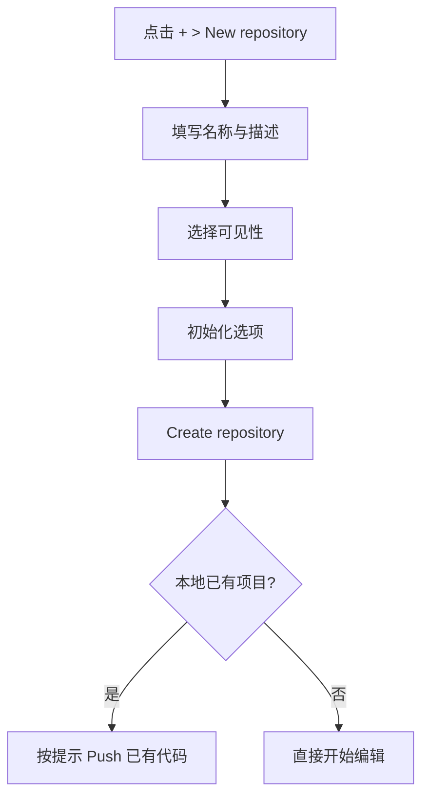

# 仓库创建与管理

> 掌握 Repository 的完整生命周期——从创建到归档或删除。

## 概述

Repository（仓库）是 GitHub 上最基本的组织单元。它不仅存储代码，还承载着 Issue、Pull Request、Actions 工作流、Wiki 文档等一切协作资源。理解仓库的创建、配置、维护和终结流程，是使用 GitHub 的第一步。

每个仓库都拥有独立的可见性设置（Public 或 Private）、权限模型、分支保护规则和自动化配置。对于团队项目来说，合理的仓库结构设计能够显著降低协作摩擦；对于个人项目来说，规范的仓库初始化则有助于长期维护。

> [!NOTE]
> GitHub 免费版支持创建无限数量的公开和私有仓库，但私有仓库的协作者人数受限（免费版最多可邀请无限协作者，但部分高级功能如分支保护仅对公开仓库免费开放）。

本章覆盖仓库从创建到删除的完整生命周期，帮助你建立规范的仓库管理习惯。

## 核心操作

### 创建新仓库

1. 点击 GitHub 右上角的 **+** 号，选择 **New repository**。
2. 填写基本信息：
   - **Repository name**：仓库名称，建议使用小写字母和连字符（如 `my-project`）。
   - **Description**（可选）：一句话描述仓库用途。
   - **Visibility**：选择 Public（公开）或 Private（私有）。
3. 初始化选项（三选一）：
   - **Add a README file**：创建默认的 `README.md` 文件。
   - **Add .gitignore**：选择语言对应的 `.gitignore` 模板。
   - **Choose a license**：添加开源许可证。
4. 点击 **Create repository**。



> [!TIP]
> 如果你的本地已有项目需要上传到 GitHub，不要勾选任何初始化选项（README、.gitignore、License），否则首次 Push 时会产生合并冲突。参见 [文件操作](03-文件操作-创建编辑删除) 了解上传项目的详细步骤。

### 从模板创建仓库

模板仓库（Template Repository）允许你基于现有仓库生成新仓库，保留文件结构和内容但不保留提交历史。

1. 打开目标模板仓库页面。
2. 点击 **Use this template** 按钮（位于 Code 按钮旁）。
3. 选择 **Create a new repository**。
4. 填写新仓库的名称、描述和可见性。
5. 点击 **Create repository**。

> [!NOTE]
> 模板仓库与 Fork 的区别在于：模板仓库会生成全新的提交历史，而 Fork 保留原始仓库的完整历史并维持关联关系。模板仓库适合用作项目脚手架，Fork 适合用于贡献代码。

### 使用 CLI 创建仓库

GitHub CLI（`gh`）可以在终端中快速创建仓库，适合习惯命令行的开发者。

```bash
# 创建公开仓库
gh repo create <repo-name> --public

# 创建私有仓库并添加描述
gh repo create <repo-name> --private --description "<项目描述>"

# 基于当前目录初始化并推送
gh repo create <repo-name> --public --source=. --push
```

### 管理仓库可见性

1. 进入仓库页面，点击 **Settings**。
2. 滚动到页面底部的 **Danger Zone**。
3. 点击 **Change visibility**，选择目标可见性。
4. 按提示确认操作。

可见性选项说明：

| 类型 | 说明 |
|------|------|
| Public | 所有人可见，协作者可编辑 |
| Private | 仅你和你邀请的协作者可见 |
| Internal（仅组织） | 组织内所有成员可见 |

> [!WARNING]
> 将公开仓库转为私有会导致所有 Fork 独立——已 Fork 该仓库的用户仍可访问其副本，但不再与你的仓库同步。如果仓库已被广泛 Fork，请慎重操作。

### 归档仓库

当你不再积极维护某个项目但希望保留其内容时，可以归档仓库。

1. 进入仓库的 **Settings**。
2. 滚动到 **Danger Zone**。
3. 点击 **Archive this repository**，确认操作。

归档后的效果：
- 仓库变为只读状态。
- Issue、Pull Request、Commit 等均不可修改。
- 仓库仍然可以被 Fork 和查看。
- 你可以随时取消归档（Unarchive）。

### 删除仓库

1. 进入仓库的 **Settings**。
2. 滚动到 **Danger Zone**。
3. 点击 **Delete this repository**。
4. 按提示输入仓库名称确认删除。

> [!WARNING]
> 删除仓库是不可逆操作。所有代码、Issue、Pull Request、Actions 运行记录将被永久清除。建议在删除前归档仓库或导出数据。

### 仓库的基本配置

创建仓库后，建议完成以下配置：

1. **添加 README.md**：仓库的门面文件，说明项目用途、安装方式和使用方法。
2. **添加 .gitignore**：排除编译产物、敏感文件等。GitHub 提供 [gitignore 模板集合](https://github.com/github/gitignore)。
3. **选择许可证**：没有许可证的代码意味着他人默认没有使用权限。常见选择：
   - MIT：最宽松，适合大多数项目。
   - Apache 2.0：包含专利授权条款。
   - GPL 3.0：要求衍生作品也开源。

## 进阶技巧

### 仓库转移

当你需要将仓库从一个账号转移到另一个账号（例如从个人账号转移到组织）时：

1. 进入 **Settings > Danger Zone > Transfer**。
2. 输入新所有者名称和仓库名称确认。
3. 转移后，原有 URL 会自动重定向到新地址。


> [!NOTE]
> 转移仓库不会影响 Star、Fork 和 Watcher。但如果目标组织使用了 SAML SSO，你可能需要先授权。

### 仓库间复用：Fork vs Template vs Import

| 方式 | 适用场景 | 保留历史 | 关联原始仓库 |
|------|---------|---------|------------|
| Fork | 向上游贡献代码 | 是 | 是 |
| Template | 基于模板创建新项目 | 否 | 否 |
| Import | 从其他平台迁移 | 是 | 否 |
| Duplicate | 本地复制后 Push | 否 | 否 |

### 用 `gh` 批量管理仓库

```bash
# 列出你的所有仓库
gh repo list --limit 50

# 按语言过滤
gh repo list --language python

# Clone 仓库（自动使用 SSH 或 HTTPS）
gh repo clone <owner>/<repo>

# 在浏览器中打开仓库
gh repo view --web
```

## 常见问题

### Q: 仓库名有什么限制？

仓库名只能包含字母、数字、连字符（`-`）和下划线（`_`），不能以连字符或下划线开头，不能包含连续的连字符。建议使用小写字母加连字符的 kebab-case 风格（如 `my-awesome-project`）。

### Q: README.md 应该包含哪些内容？

一个合格的 README 至少应包含：项目名称与简介、安装步骤、基本用法、许可证信息。更完善的 README 还会包含贡献指南、常见问题、截图或演示链接。

### Q: 如何选择 Public 还是 Private？

如果你的项目面向社区开源，选择 Public。如果是个人练习、内部工具或尚未准备公开的项目，选择 Private。私有仓库随时可以转为公开，但反向操作需谨慎（参见上方可见性管理部分）。

### Q: 归档和删除有什么区别？

归档是"冻结"——仓库变为只读但内容保留，可以随时取消归档恢复。删除是"销毁"——所有数据永久清除，不可恢复。对于不再维护的项目，优先考虑归档。

### Q: 一个账号可以创建多少个仓库？

GitHub 免费版对仓库数量没有上限，但建议将相关项目归类到组织（Organization）中以便管理。组织本身对免费版也是可用的。

### Q: 如何从 GitLab 或 Bitbucket 迁移仓库？

使用 GitHub 的 Import 工具：访问 [github.com/new/import](https://github.com/new/import)，输入源仓库的 URL 和认证信息即可。GitHub 会自动导入代码、提交历史和标签。

### Q: Fork 的仓库可以转为普通仓库吗？

可以。进入 Fork 仓库的 **Settings**，在页面中找到 **Fork 管理** 区域，选择 **Detach fork**。分离后该仓库将变成独立仓库，不再与上游关联。

## 参考链接

| 标题 | 说明 |
|------|------|
| [Quickstart for repositories](https://docs.github.com/en/repositories/creating-and-managing-repositories/quickstart-for-repositories) | 仓库快速入门，从创建到首次提交 |
| [Creating and managing repositories](https://docs.github.com/en/repositories/creating-and-managing-repositories) | 仓库创建、设置、转移与删除全流程 |
| [Best practices for repositories](https://docs.github.com/en/repositories/creating-and-managing-repositories/best-practices-for-repositories) | 仓库最佳实践，README、.gitignore、许可证等 |
| [Hello World — GitHub Quickstart](https://docs.github.com/get-started/quickstart/hello-world) | 官方 Hello World 教程，涵盖创建仓库、分支、提交、合并 |
