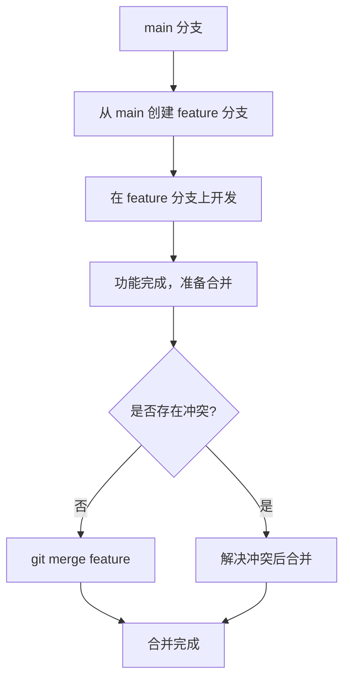
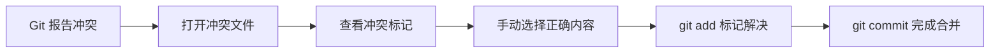

# 分支基础

> 理解 Git 分支模型——并行开发的核心机制，从创建到合并的完整流程。

## 概述

分支（Branch）是 Git 最核心的设计之一。它允许你在不影响主线（通常是 `main` 或 `master`）的情况下，在一个独立的开发线上进行修改。无论是修复 Bug、开发新功能还是实验新想法，分支都是你的安全网。

在 GitHub 上，每个仓库至少有一个默认分支（通常是 `main`）。当你创建新分支时，Git 只是创建了一个指向某个 Commit 的可移动指针——分支操作本身几乎是零成本的。合并（Merge）操作则将分支上的修改整合回目标分支。

> [!NOTE]
> GitHub 在 2020 年将新仓库的默认分支名从 `master` 改为 `main`。如果你有历史仓库仍在使用 `master`，可以在 **Settings > Default branch** 中修改。

本章将系统讲解分支的创建、切换、合并以及冲突解决，帮助你建立规范的分支使用习惯。参见 [提交与提交历史](05-提交与提交历史) 了解 Commit 的详细信息。

## 核心操作

### 查看分支

在仓库页面点击分支下拉菜单（默认显示 `main`），可以查看所有分支列表。在 **Insights > Network** 页面可以可视化查看分支的合并历史。

```bash
# 本地查看所有分支
git branch -a

# 仅查看远程分支
git branch -r
```

### 创建分支

**浏览器端：**

1. 在仓库页面点击分支下拉菜单。
2. 输入新分支名称。
3. 选择基于哪个分支或 Tag 创建。
4. 点击 **Create branch: <name>**。

**命令行：**

```bash
# 创建并切换到新分支
git checkout -b <branch-name>

# 或者使用更新的 switch 命令（Git 2.23+）
git switch -c <branch-name>
```

> [!TIP]
> 分支命名建议使用有意义的名称，如 `feature/login-page`、`fix/null-pointer-bug`、`docs/api-reference`。常用的前缀约定：`feature/`（新功能）、`fix/`（修复）、`docs/`（文档）、`refactor/`（重构）。

### 切换分支

```bash
# 切换到已有分支
git checkout <branch-name>

# 或者使用 switch 命令
git switch <branch-name>
```

在浏览器端，点击分支下拉菜单，选择目标分支即可切换当前查看的分支上下文。

### 合并分支



**命令行合并：**

```bash
# 先切换到目标分支（通常是 main）
git checkout main

# 合并 feature 分支
git merge <branch-name>

# 合并后删除已完成的分支
git branch -d <branch-name>
```

**浏览器端合并（通过 Pull Request）：**

1. 完成分支上的开发后，在 GitHub 上创建 Pull Request。
2. 审查代码变更，确认无问题后点击 **Merge pull request**。
3. 选择合并方式（见下方说明），点击 **Confirm merge**。
4. （可选）删除已合并的分支。

合并方式说明：

| 方式 | 命令 | 说明 |
|------|------|------|
| Merge commit | `--no-ff` | 保留分支历史，创建合并节点 |
| Squash and merge | `--squash` | 将所有 Commit 压缩为一个 |
| Rebase and merge | `--rebase` | 线性历史，无合并节点 |

### 解决合并冲突

当两个分支修改了同一文件的同一位置时，就会产生合并冲突。

1. 执行 `git merge` 后，Git 会提示冲突文件。
2. 打开冲突文件，找到冲突标记：

```text
<<<<<<< HEAD
当前分支的内容
=======
要合并的分支的内容
>>>>>>> <branch-name>
```

3. 手动编辑文件，保留正确的内容，删除冲突标记。
4. 标记冲突已解决并提交：

```bash
git add <resolved-file>
git commit
```



> [!WARNING]
> 永远不要盲目地选择"接受当前修改"或"接受传入修改"来解决冲突。应该逐行理解冲突原因，确保合并后的代码逻辑正确。

## 进阶技巧

### 分支保护规则

对于 `main` 等重要分支，建议设置保护规则，防止误操作：

1. 进入 **Settings > Branches > Branch protection rules**。
2. 点击 **Add rule**，输入分支名称模式（如 `main` 或 `release/*`）。
3. 配置保护规则：
   - **Require a pull request before merging**：所有修改必须通过 PR。
   - **Require status checks to pass**：CI 检查通过后才能合并。
   - **Require signed commits**：要求 Commit 使用 GPG 签名。

### 删除分支

```bash
# 删除已合并的本地分支
git branch -d <branch-name>

# 强制删除未合并的分支（慎用）
git branch -D <branch-name>

# 删除远程分支
git push origin --delete <branch-name>
```

在浏览器端，进入仓库的 **Branches** 页面（`/<repo>/branches`），点击分支旁的垃圾桶图标即可删除远程分支。

### 分支同步：保持分支最新

长时间在功能分支上开发时，主分支可能已经更新。定期同步可以减少最终合并时的冲突：

```bash
# 在功能分支上，拉取 main 的最新修改
git checkout <feature-branch>
git merge main

# 或者使用 rebase 保持线性历史
git rebase main
```

> [!NOTE]
> `git rebase` 会重写 Commit 历史。如果分支已经 Push 到远程并有人基于它开发，请避免使用 rebase，以免给协作者造成困扰。

### 使用 GitHub CLI 管理分支

```bash
# 在 GitHub 上创建分支（基于当前分支）
git checkout -b <branch-name>
git push origin <branch-name>

# 通过 gh 创建 Pull Request
gh pr create --title "<title>" --body "<description>"
```

## 常见问题

### Q: 什么时候应该创建新分支？

几乎所有的修改都应该在独立分支上进行。一个好的经验法则：`main` 分支随时保持可部署状态。新功能用 `feature/*` 分支，Bug 修复用 `fix/*` 分支，文档更新用 `docs/*` 分支。

### Q: Merge、Squash 和 Rebase 应该选哪个？

团队项目建议统一选择一种策略。一般推荐：功能分支使用 Squash merge（保持主线整洁），长期存在的发布分支使用 Merge commit（保留完整历史）。个人项目则可以灵活选择。

### Q: 如何撤销错误的合并？

如果刚完成合并且尚未推送到远程，使用 `git reset --hard HEAD~1` 回退。如果已经推送，使用 `git revert -m 1 <merge-commit>` 创建一个新的 Commit 来撤销合并。

### Q: 分支太多怎么管理？

定期删除已合并的功能分支。可以使用以下命令批量清理本地已合并的分支：

```bash
# 列出所有已合并到 main 的本地分支
git branch --merged main

# 批量删除（排除 main 和当前分支）
git branch --merged main | grep -v "^\*\|main" | xargs -n 1 git branch -d
```

### Q: 如何查看两个分支之间的差异？

```bash
# 查看文件差异
git diff main..feature

# 仅查看文件名列表
git diff --name-only main..feature

# 查看 Commit 差异
git log main..feature --oneline
```

### Q: 远程分支和本地分支有什么关系？

本地分支存在于你的电脑上，远程分支存在于 GitHub 服务器上。`git fetch` 会同步远程分支信息到本地，`git pull` 会合并远程分支到当前本地分支，`git push` 会将本地分支的更新推送到远程。

## 参考链接

| 标题 | 说明 |
|------|------|
| [About branches](https://docs.github.com/articles/about-branches) | 分支概念、作用及基本操作 |
| [Basic Branching and Merging — Pro Git](https://git-scm.com/book/en/v2/Git-Branching-Basic-Branching-and-Merging) | Pro Git 分支创建与合并权威教程 |
| [Git Branch Merge — W3Schools](https://www.w3schools.com/git/git_branch_merge.asp?remote=github) | 零基础 Git 分支与合并教程 |
| [Git 分支管理 — 菜鸟教程](https://www.runoob.com/git/git-branch.html) | 中文 Git 分支管理教程 |
