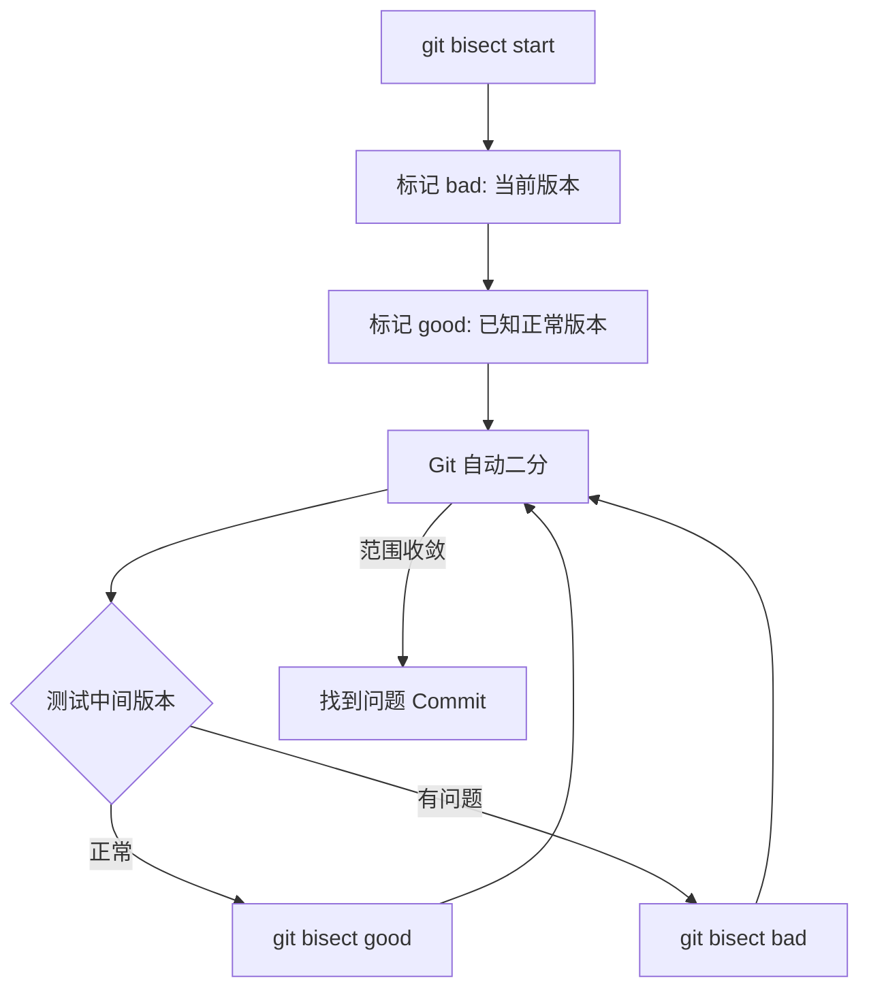

# 提交与提交历史

> 写好每一个 Commit——让提交历史成为项目的"活文档"。

## 概述

Commit（提交）是 Git 记录变更的基本单位。每一次 Commit 都是一个快照，记录了"谁在什么时候修改了什么内容"。良好的提交习惯不仅帮助你回溯问题，也让团队协作更加顺畅。

一个 Commit 包含以下信息：唯一的 SHA-1 哈希值、作者信息、提交时间、提交信息（commit message）以及指向父 Commit 的指针。这些信息共同构成了一条完整的变更时间线。

> [!NOTE]
> 每个 Commit 的 SHA-1 哈希值是唯一的，例如 `ae35082`。在 GitHub 上，你可以通过 `https://github.com/<owner>/<repo>/commit/<sha>` 直接访问任意 Commit 的详情页面。

本章将涵盖如何编写规范的提交信息、查看和搜索提交历史，以及使用 `bisect` 和 `blame` 等工具定位问题。参见 [分支基础](04-分支基础.md) 了解分支操作，参见 [文件操作](03-文件操作-创建编辑删除.md) 了解文件的创建与编辑。

## 核心操作

### 创建提交

**命令行方式：**

```bash
# 暂存修改的文件
git add <file>

# 暂存所有修改
git add .

# 提交并编写提交信息
git commit -m "<提交信息>"

# 或者打开编辑器编写多行提交信息
git commit
```

**浏览器端方式：**

在 GitHub 网页上编辑文件后，页面底部的 **Commit changes** 区域就是提交表单。填写提交信息后点击按钮即可。

> [!TIP]
> 使用 `git commit -a` 可以跳过 `git add` 步骤，直接提交所有已追踪文件的修改。但新增的文件（untracked）仍然需要先 `git add`。

### 编写规范的提交信息

良好的提交信息是项目可维护性的基石。业界广泛采用的是 [Conventional Commits](https://www.conventionalcommits.org/) 规范：

```text
<type>(<scope>): <subject>

<body>

<footer>
```

常用类型（type）：

| 类型 | 说明 |
|------|------|
| `feat` | 新功能 |
| `fix` | Bug 修复 |
| `docs` | 文档变更 |
| `style` | 格式调整（不影响逻辑） |
| `refactor` | 重构（不增加功能也不修复 Bug） |
| `test` | 添加或修改测试 |
| `chore` | 构建过程或辅助工具的变动 |

示例：

```bash
git commit -m "feat(auth): add JWT token refresh logic"
git commit -m "fix(api): handle null response from user endpoint"
git commit -m "docs: update API reference for v2 endpoints"
```

> [!NOTE]
> 提交信息的第一行（subject）应不超过 50 个字符，使用祈使语气（如 "add feature" 而非 "added feature" 或 "adds feature"）。正文部分每行不超过 72 个字符。

### 查看提交历史

**命令行方式：**

```bash
# 查看完整提交历史
git log

# 单行模式，只显示哈希和提交信息
git log --oneline

# 图形化显示分支合并历史
git log --oneline --graph --all

# 查看最近 N 条提交
git log -5

# 查看某个文件的提交历史
git log -- <file-path>

# 查看某个作者的提交
git log --author="<author-name>"
```

**浏览器端方式：**

在仓库页面点击 **N commits** 链接（位于文件列表上方），即可查看完整的提交历史。点击每条 Commit 可以查看具体的文件差异。

### 搜索提交历史

```bash
# 按提交信息内容搜索
git log --grep="<关键词>"

# 按代码内容搜索（查找引入或删除某段代码的 Commit）
git log -S "<代码片段>"

# 按时间范围搜索
git log --since="2024-01-01" --until="2024-12-31"

# 组合搜索
git log --author="<author>" --since="2024-01-01" --grep="<关键词>"
```

在 GitHub 网页上，可以使用搜索语法过滤提交：

```text
repo:<owner>/<repo> keyword author:<username>
```

## 进阶技巧

### 使用 git blame 追踪代码来源

`git blame` 可以逐行显示文件中每一行代码的最后修改者和修改时间：

```bash
# 查看整个文件的 blame 信息
git blame <file>

# 查看指定行范围
git blame -L 10,30 <file>

# 忽略空白修改
git blame -w <file>
```

在浏览器端，打开文件后点击 **Blame** 按钮（位于文件内容右上角），即可查看逐行归属信息。

> [!TIP]
> `git blame` 的目的不是追责，而是帮助你快速找到某行代码的上下文——查看对应的 Commit 信息了解修改原因，或直接联系作者询问细节。

### 使用 git bisect 定位问题 Commit

当你知道项目在某个版本出现了 Bug，但不确定是哪个 Commit 引入的，`git bisect` 可以通过二分查找快速定位：

```bash
# 启动 bisect
git bisect start

# 标记当前版本有 Bug
git bisect bad

# 标记某个已知正常的版本
git bisect good <commit-or-tag>

# Git 会自动 checkout 到中间版本
# 测试后标记为 bad 或 good
git bisect good   # 如果正常
git bisect bad    # # 如果有问题

# 重复直到找到问题 Commit
# 结束 bisect
git bisect reset
```



> [!NOTE]
> `git bisect` 支持 `--first-parent` 选项，只在主线上进行二分，跳过合并进来的分支。这在大型项目中可以显著加快定位速度。

### 修改最近一次提交

```bash
# 修改最近一次提交的信息
git commit --amend -m "<新的提交信息>"

# 将遗漏的文件追加到最近一次提交
git add <forgotten-file>
git commit --amend --no-edit
```

> [!WARNING]
> `git commit --amend` 会修改 Commit 的 SHA-1 哈希值。如果该 Commit 已经 Push 到远程，amend 后需要 `git push --force`，这会覆盖远程历史。在团队协作中请谨慎使用。

### 查看提交差异

```bash
# 查看工作区与暂存区的差异
git diff

# 查看暂存区与最近 Commit 的差异
git diff --staged

# 查看两个 Commit 之间的差异
git diff <commit-a> <commit-b>

# 查看某次 Commit 的具体修改
git show <commit>
```

### 在 GitHub 上比较提交

GitHub 提供了可视化的 Commit 比较功能：

```text
https://github.com/<owner>/<repo>/compare/<commit-a>...<commit-b>
```

你也可以通过 **Insights > Network** 页面图形化查看提交历史和分支关系。

## 常见问题

### Q: 提交信息写错了怎么改？

如果尚未 Push，使用 `git commit --amend -m "<正确信息>"` 修改最近一次提交。如果已经 Push，可以使用 `git rebase -i` 修改历史提交（不推荐在公共分支上操作），或者追加一个修正提交。

### Q: 如何撤销某次 Commit？

- **尚未 Push**：`git reset --soft HEAD~1`（保留修改）或 `git reset --hard HEAD~1`（丢弃修改）。
- **已经 Push**：`git revert <commit>`（创建一个新 Commit 来撤销指定 Commit 的修改，最安全的方式）。

### Q: 一次提交应该包含多少修改？

理想情况下，每个 Commit 只做一件事：修复一个 Bug、添加一个功能或重构一段代码。这样的提交历史更容易阅读、回滚和 bisect。避免将多个不相关的修改混合在一个 Commit 中。

### Q: git rebase 和 git merge 有什么区别？

`git merge` 保留完整的分支历史，创建一个合并节点。`git rebase` 将当前分支的 Commit 重新"播放"到目标分支之上，产生线性的提交历史。两者各有优劣：merge 保留真实历史，rebase 历史更整洁。参见 [分支基础](04-分支基础.md) 了解更多合并策略。

### Q: 如何查看被删除的代码是谁写的？

```bash
# 在文件的历史版本中搜索
git log -p -S "<被删除的代码>" -- <file>

# 或者使用 blame 查看指定 Commit 时的文件状态
git blame <commit> -- <file>
```

### Q: Commit 上的 "Verified" 标签是什么意思？

这表示该 Commit 使用了 GPG 或 SSH 签名，GitHub 验证签名与提交者身份匹配。配置方法参见 [注册与账号设置](01-注册与账号设置.md) 中的 GPG 签名部分。

### Q: 如何查看某个文件在两次 Commit 之间的变化？

```bash
# 命令行
git diff <commit-a> <commit-b> -- <file>

# GitHub 网页
# 访问 /<owner>/<repo>/compare/<commit-a>...<commit-b>
```

### Q: 提交历史的图形化工具有哪些？

除了 `git log --graph`，你还可以使用：`gitk`（Git 自带的 GUI 工具）、`tig`（终端中的交互式浏览器）、VS Code 的 Git Graph 插件，以及 GitHub 的 **Insights > Network** 页面。

## 参考链接

| 标题 | 说明 |
|------|------|
| [About commits](https://docs.github.com/en/pull-requests/committing-changes-to-your-project/creating-and-editing-commits/about-commits) | 提交的概念、构成与最佳实践 |
| [Viewing the Commit History — Pro Git](https://git-scm.com/book/en/v2/Git-Basics-Viewing-the-Commit-History) | git log 命令及多种查看方式 |
