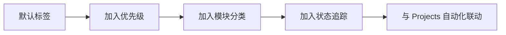

# 标签与里程碑

> 用 Label 分类工作项，用 Milestone 追踪交付进度——构建清晰的项目分类与追踪体系。

## 概述

当仓库中的 Issue 和 Pull Request 数量逐渐增多，你需要一套有效的分类和追踪机制来管理它们。Label（标签）和 Milestone（里程碑）正是 GitHub 提供的两大利器：Label 解决"这是什么类型的工作"的问题，Milestone 解决"这些工作什么时候交付"的问题。

GitHub 为每个新仓库预置了 一组默认 Label，包括 `bug`、`documentation`、`duplicate`、`enhancement` 等。这些 Label 覆盖了基本场景，但对于大多数项目来说远远不够。一个精心设计的标签体系可以让团队成员在几秒钟内过滤出自己关心的内容，也能让项目维护者快速判断 Issue 的优先级和处理方向。

> [!NOTE]
> Label 和 Milestone 是 Issue 与 Pull Request 的共享机制。同一个 Label 可以同时用于分类 Issue 和 PR，Milestone 也可以同时追踪两种类型的工作项。它们与 [项目管理看板](06-项目管理看板.md) 结合使用时，效果更佳。

本章将介绍如何设计标签体系、管理 Milestone，以及利用它们实现进度可视化的最佳实践。

## 核心操作

### 管理 Label

**查看现有 Label：**

1. 进入仓库页面，点击 **Issues** 标签页。
2. 点击 **Labels** 子标签，查看所有 Label 列表。

**创建新 Label：**

1. 在 Labels 页面点击 **New label**。
2. 填写以下信息：
   - **Label name**：标签名称，建议简短且有意义。
   - **Description**：标签说明，鼠标悬停时显示。
   - **Color**：标签颜色，可使用颜色选择器或输入十六进制色值。
3. 点击 **Create label**。

**使用 GitHub CLI：**

```bash
# 创建新 Label
gh label create "priority/high" \
  --color "FF0000" \
  --description "高优先级，需要立即处理"

# 列出所有 Label
gh label list

# 编辑已有 Label
gh label edit "bug" --color "FF6B6B" --description "功能异常或错误行为"

# 删除 Label
gh label delete "wontfix"
```

### 设计标签体系

一个实用的标签体系通常包含以下几个维度：

| 维度 | 示例 | 说明 |
|------|------|------|
| 类型 | `bug`、`enhancement`、`documentation` | 工作项的分类 |
| 优先级 | `priority/critical`、`priority/high`、`priority/low` | 处理的紧急程度 |
| 状态 | `status/in-progress`、`status/blocked`、`status/ready` | 当前工作状态 |
| 模块 | `module/auth`、`module/payment`、`module/api` | 所属代码模块 |
| 难度 | `good first issue`、`help wanted` | 适合贡献者的标签 |

> [!TIP]
> 使用 `类别/具体值` 的命名格式（如 `priority/high`、`module/auth`）可以让 Label 在列表中自动按类别分组，视觉上更整洁。GitHub 会按字母顺序排列 Label，斜杠前缀会自然形成层次结构。

**批量创建标签脚本：**

```bash
#!/bin/bash
# 在仓库根目录运行，批量创建项目标签

# 类型标签
gh label create "type/bug" --color "D73A4A" --description "功能异常或错误"
gh label create "type/feature" --color "0E8A16" --description "新功能或增强"
gh label create "type/docs" --color "0075CA" --description "文档改进"
gh label create "type/refactor" --color "C5DEF5" --description "代码重构，不改变功能"
gh label create "type/test" --color "BFD4F2" --description "测试相关"

# 优先级标签
gh label create "priority/critical" --color "B60205" --description "紧急，阻塞发布"
gh label create "priority/high" --color "FF0000" --description "高优先级"
gh label create "priority/medium" --color "FBCA04" --description "中等优先级"
gh label create "priority/low" --color "0E8A16" --description "低优先级"

# 状态标签
gh label create "status/blocked" --color "000000" --description "被阻塞，需要外部输入"
gh label create "status/in-progress" --color "1D76DB" --description "正在进行中"
gh label create "status/ready" --color "BFDADC" --description "准备好可以开始"
```

### 按 Label 筛选

在 Issue 列表页面，你可以通过搜索语法组合多个 Label 进行筛选：

```bash
# CLI 按标签筛选
gh issue list --label "type/bug" --label "priority/high"

# 搜索语法（浏览器端和 CLI 通用）
# 查找所有高优先级 Bug
# label:type/bug label:priority/high

# 查找某个模块的所有打开 Issue
gh issue list --label "module/auth"

# 排除某个标签
gh issue list --search "-label:status/blocked"
```

在浏览器端的 Issue 列表页面，直接点击任意 Label 即可按该标签筛选；按住 `Alt`（macOS）或 `Alt`（Windows）再点击可以追加筛选条件。

### 管理 Milestone

Milestone 用于将一组 Issue 或 PR 归类到一个交付目标中，例如版本发布或冲刺迭代。

**创建 Milestone：**

1. 进入仓库的 **Issues** 页面。
2. 点击 **Milestones** 子标签。
3. 点击 **New milestone**。
4. 填写以下信息：
   - **Title**：里程碑标题，如 `v2.0` 或 `Sprint 12`。
   - **Due date**：截止日期（可选）。
   - **Description**：里程碑说明（可选）。
5. 点击 **Create milestone**。

**使用 GitHub CLI：**

```bash
# 创建 Milestone
gh api repos/<owner>/<repo>/milestones \
  --method POST \
  -f title="v2.0" \
  -f description="第二次大版本发布" \
  -f due_on="2025-06-30T00:00:00Z" \
  --jq '.number'

# 查看 Milestone 列表
gh api repos/<owner>/<repo>/milestones --jq '.[] | "\(.title) — \(.open_issues) open / \(.closed_issues) closed"'

# 将 Issue 添加到 Milestone
gh issue edit <number> --milestone "v2.0"
```

### 查看进度

Milestone 页面会自动显示进度条，反映已完成和未完成 Issue 的比例。

```bash
# 查看 Milestone 进度
gh issue list --milestone "v2.0" --state all

# 仅查看未完成的
gh issue list --milestone "v2.0" --state open

# 统计完成率
gh api repos/<owner>/<repo>/milestones --jq '.[] |
  "\(.title): \(.closed_issues)/\(.open_issues + .closed_issues) completed"'
```

> [!NOTE]
> Milestone 的进度条仅统计 Issue 数量，不区分 Issue 的大小和复杂度。如果你的 Issue 粒度差异很大，进度条可能无法准确反映真实进度。建议将大型 Issue 拆分为粒度相近的子任务（参见 [Issue 完整指南](01-Issue-完整指南.md) 中的子任务部分）。

### 删除和修改

```bash
# 修改 Milestone 标题或截止日期
gh api repos/<owner>/<repo>/milestones/<number> \
  --method PATCH \
  -f title="v2.0-rc1" \
  -f due_on="2025-07-15T00:00:00Z"

# 关闭 Milestone（不再接受新 Issue）
gh api repos/<owner>/<repo>/milestones/<number> \
  --method PATCH \
  -f state="closed"

# 删除 Milestone（会解除与所有 Issue 的关联）
gh api repos/<owner>/<repo>/milestones/<number> --method DELETE
```

## 进阶技巧

### 标签体系的演进策略

标签体系不是一次性设计的。建议按以下步骤逐步完善：

1. **起步阶段**：使用 GitHub 默认标签，只关注类型分类（`bug`、`enhancement`、`question`）。
2. **成长阶段**：加入优先级和模块标签，满足多维度筛选需求。
3. **成熟阶段**：加入状态标签，与 [项目管理看板](06-项目管理看板.md) 的自动化联动。



### 团队间共享标签

如果多个仓库需要使用相同的标签体系，可以通过脚本批量同步：

```bash
#!/bin/bash
# 从模板仓库导出标签，批量应用到其他仓库

TEMPLATE_REPO="org/template-repo"
TARGET_REPOS=("org/project-a" "org/project-b" "org/project-c")

# 导出模板仓库的所有标签
LABELS=$(gh label list --repo "$TEMPLATE_REPO" --json name,color,description --jq '.')

# 应用到每个目标仓库
for repo in "${TARGET_REPOS[@]}"; do
  echo "Syncing labels to $repo..."
  echo "$LABELS" | jq -r '.[] | "\(.name)\t\(.color)\t\(.description)"' | \
    while IFS=$'\t' read -r name color desc; do
      gh label create "$name" --color "$color" --description "$desc" \
        --repo "$repo" --force 2>/dev/null || true
    done
done
```

### 利用搜索保存常用筛选

GitHub Issues 页面的搜索栏支持将常用筛选条件保存为 URL 书签：

```text
# 所有高优先级未分配的 Bug
https://github.com/<owner>/<repo>/issues?q=is%3Aissue+is%3Aopen+label%3Atype%2Fbug+label%3Apriority%2Fhigh+no%3Aassignee

# 当前里程碑中的未完成工作
https://github.com/<owner>/<repo>/issues?q=is%3Aissue+is%3Aopen+milestone%3Av2.0
```

> [!WARNING]
> 避免创建过多标签。经验法则是：标签总数控制在 20 个以内。超过 30 个标签时，团队成员很难准确选择，维护成本也会急剧上升。如果发现标签过多，考虑合并相近的标签或使用层次化命名。

## 常见问题

### Q: 默认标签可以修改或删除吗？

可以。GitHub 预置的标签（如 `bug`、`duplicate`、`wontfix`）都可以在 Labels 页面编辑或删除。但建议保留 `good first issue` 和 `help wanted` 这两个标签，因为 GitHub 官方会基于它们向新贡献者推荐仓库。

### Q: 一个 Issue 最多可以有多少个 Label？

GitHub 没有硬性上限，但建议控制在 3-5 个以内。过多的标签会降低可读性，也让筛选变得混乱。一个合理的组合是：1 个类型 + 1 个优先级 + 1 个模块。

### Q: Milestone 的截止日期过了会怎样？

GitHub 会在 Milestone 列表中对过期未完成的 Milestone 标记为"overdue"，但不会自动关闭或发送通知。它只是视觉提醒，实际管理仍需团队自行跟进。

### Q: 如何在 Fork 的仓库中管理标签？

Fork 仓库会继承上游仓库的所有标签，但之后两边的标签是独立的。如果你在上游仓库创建了新标签，Fork 仓库不会自动同步。需要手动创建或使用脚本批量同步（参见上文"团队间共享标签"）。

### Q: 标签颜色有推荐方案吗？

建议同类标签使用同一色系的不同深浅。例如：优先级标签统一用红色系（critical 深红、high 红色、medium 橙色、low 绿色），类型标签用蓝色系。这样可以在视觉上快速识别标签类别。

### Q: 如何在不打开 Issue 的情况下查看所有标签统计？

在仓库的 **Issues > Labels** 页面，每个标签右侧会显示使用该标签的 Issue 数量。也可以通过 API 查询：

```bash
gh api repos/<owner>/<repo>/labels --jq '.[] | "\(.name): \(.open_issues_count) issues"'
```

### Q: Milestone 可以用于 PR 吗？

可以。Milestone 可以同时关联 Issue 和 Pull Request。在 PR 页面右侧边栏可以设置 Milestone，这在追踪"某个版本需要合并哪些 PR"时非常有用。

### Q: 如何快速给多个 Issue 添加相同标签？

在 Issue 列表页面，勾选多个 Issue 后，右上角会出现批量操作栏，可以一键为所有选中项添加或移除标签。也可以通过 CLI 结合搜索完成：

```bash
gh issue list --label "type/bug" --json number --jq '.[].number' | \
  xargs -I {} gh issue edit {} --add-label "priority/high"
```

## 参考链接

| 标题 | 说明 |
|------|------|
| [Managing labels](https://docs.github.com/en/issues/using-labels-and-milestones-to-track-work/managing-labels) | Label 创建、编辑与删除操作指南 |
| [About milestones](https://docs.github.com/issues/using-labels-and-milestones-to-track-work/about-milestones) | Milestone 概念与使用方法 |
| [gh issue](https://cli.github.com/manual/gh_issue) | GitHub CLI Issue 相关命令手册 |
