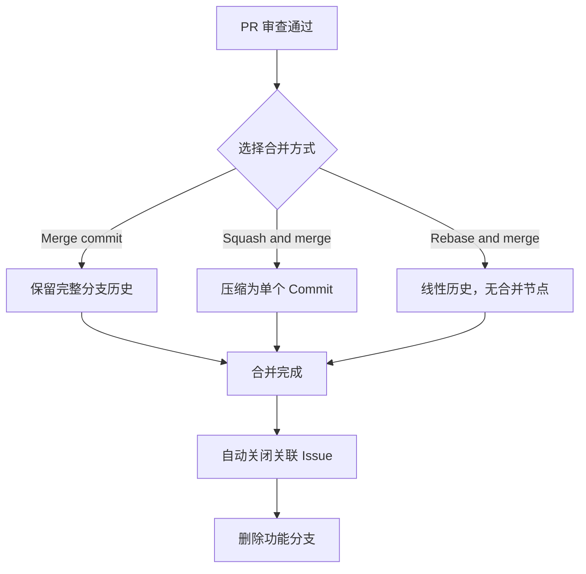

# PR 完整生命周期

> 从创建 Draft 到选择合并策略——深入掌握 Pull Request 的每一个阶段。

## 概述

Pull Request（简称 PR）是 GitHub 协作模型的核心。它不仅仅是一个"代码合并请求"，更是一个集代码展示、讨论、审查和集成为一体的协作空间。一个 PR 的完整生命周期包括：创建、讨论与修改、代码审查、CI 验证、合并以及合并后的清理。

理解 PR 的完整生命周期对于团队协作至关重要。无论你是 PR 的创建者还是审查者，了解每个阶段的最佳实践都能显著提升团队的协作效率和代码质量。PR 与 [Issue 完整指南](01-Issue-完整指南.md) 中的自动关闭机制紧密关联，也与 [代码审查](04-代码审查.md) 中的审查流程密不可分。

> [!NOTE]
> PR 只能在同一个仓库内或 Fork 仓库与上游仓库之间创建。如果你想在仓库之间进行代码合并，需要先 Fork 仓库，然后从 Fork 向上游发起 PR。参见 [分支策略与Git-Flow](05-分支策略与Git-Flow.md) 中的 Forking Workflow 了解详情。

## 核心操作

### 创建 Pull Request

**浏览器端创建：**

1. 确保你的代码已推送到远程仓库的某个分支。
2. 打开仓库页面，GitHub 通常会自动提示 **Compare & pull request** 按钮。你也可以进入 **Pull requests** 标签页手动点击 **New pull request**。
3. 选择 **base** 分支（目标分支，通常是 `main`）和 **compare** 分支（你的功能分支）。
4. 填写 PR 信息：
   - **Title**：简洁描述本次变更，建议使用约定式提交格式（如 `feat: 添加用户注册功能`）。
   - **Description**：详细说明变更内容、原因和测试方法。
   - **Reviewers**：指定审查人。
   - **Assignees**：负责人（通常是自己）。
   - **Labels**：分类标签。
   - **Milestone**：所属里程碑。
   - **Projects**：关联的项目看板。
5. 点击 **Create pull request** 或 **Create draft pull request**。

**使用 GitHub CLI：**

```bash
# 基本创建
gh pr create --title "feat: 添加用户注册功能" \
  --body "实现了邮箱注册流程，包含验证码验证和密码强度检查。"

# 交互式创建（推荐）
gh pr create

# 指定审查人和标签
gh pr create \
  --title "fix: 修复登录按钮样式问题" \
  --body "修复了移动端登录按钮与输入框重叠的问题，fixes #42" \
  --reviewer "alice,bob" \
  --label "bug,fix" \
  --milestone "v1.2" \
  --base main

# 创建 Draft PR
gh pr create --title "WIP: 性能优化" \
  --body "正在进行数据库查询优化" \
  --draft
```

> [!TIP]
> 使用 `gh pr create` 的交互模式可以逐步填写每个字段，比一次性指定所有参数更不容易出错。在终端中运行 `gh pr create` 后按提示操作即可。

### Draft Pull Request

Draft PR 表示这个 PR 还未准备好被审查或合并。它是一种"工作在进行中"的信号：

```bash
# 创建 Draft PR
gh pr create --draft --title "WIP: 重构认证模块" --body "正在重构中，预计本周完成"

# 将 Draft PR 标记为就绪
gh pr ready <number>

# 将就绪的 PR 转回 Draft
gh pr ready <number> --undo
```

Draft PR 的特点：
- 审查者不会收到审查请求通知。
- 不能直接合并，必须先点击 **Ready for review**。
- 可以用来提前展示工作进展，获取初步反馈。

### PR 描述模板

与 Issue 模板类似，PR 也支持自定义模板。在仓库中创建 `.github/PULL_REQUEST_TEMPLATE.md` 文件即可：

```markdown
<!-- .github/PULL_REQUEST_TEMPLATE.md -->

## 变更类型

- [ ] 新功能（feature）
- [ ] Bug 修复（fix）
- [ ] 重构（refactor）
- [ ] 文档更新（docs）
- [ ] 测试（test）

## 变更说明

<!-- 描述本次变更的内容和原因 -->

## 关联 Issue

<!-- 使用 fixes #<number> 或 closes #<number> 自动关闭 -->

## 测试方法

<!-- 描述如何验证本次变更 -->

## 检查清单

- [ ] 代码已自测通过
- [ ] 新代码有对应的测试用例
- [ ] 文档已更新（如适用）
- [ ] 没有引入新的警告
```

如果需要多个模板，可以创建 `.github/PULL_REQUEST_TEMPLATE/` 目录，在其中放置多个模板文件。

### 代码讨论与修改

PR 创建后，审查者可以在 **Files changed** 标签页中对具体代码行添加评论。

**作为 PR 创建者，回应审查意见：**

1. 在 **Conversation** 标签页查看所有评论。
2. 在 **Files changed** 标签页逐条回复代码行级评论。
3. 根据反馈修改代码，推送到同一分支即可自动更新 PR：

```bash
# 在功能分支上修改代码后
git add .
git commit -m "refactor: 根据 code review 反馈优化变量命名"
git push origin <feature-branch>
```

4. 回复审查意见，说明修改内容或解释设计决策。
5. 所有问题解决后，请求审查者重新审查。

### 解决合并冲突

当你的功能分支与目标分支产生冲突时，PR 页面会显示冲突警告。解决方法：

```bash
# 方法一：在功能分支上合并目标分支
git checkout <feature-branch>
git fetch origin
git merge origin/main
# 解决冲突后
git add .
git commit
git push origin <feature-branch>

# 方法二：使用 Rebase 保持线性历史
git checkout <feature-branch>
git fetch origin
git rebase origin/main
# 解决冲突后
git rebase --continue
git push origin <feature-branch> --force-with-lease
```

> [!WARNING]
> 使用 `git rebase` 后推送需要 `--force-with-lease` 参数（而非 `--force`）。`--force-with-lease` 会检查远程分支是否被他人更新，避免覆盖他人的提交。如果你不熟悉 Rebase 的原理，建议使用方法一（Merge）来处理冲突，更安全直观。

### CI 状态检查

PR 页面底部会显示 CI 检查状态。常见的状态：

| 状态 | 含义 |
|------|------|
| Pending | 检查正在进行中 |
| Passing / Success | 所有检查通过 |
| Failing | 有检查未通过 |
| No status | 未配置 CI 检查 |

```bash
# 通过 CLI 查看 PR 的 CI 状态
gh pr checks <number>

# 查看 PR 的详细状态
gh pr view <number> --json statusCheckRollup --jq '.statusCheckRollup[] | "\(.name): \(.status // .conclusion)"'
```

如果仓库配置了 [保护分支](https://docs.github.com/repositories/configuring-branches-and-merges-in-your-repository/managing-protected-branches/about-protected-branches)，CI 检查通过后才能合并。

### 合并 Pull Request

当审查通过、CI 通过且无冲突时，可以合并 PR。

**合并方式对比：**

| 方式 | 效果 | 适用场景 |
|------|------|----------|
| Create a merge commit | 保留所有 Commit，创建合并节点 | 需要完整的项目历史 |
| Squash and merge | 将所有 Commit 压缩为一个 Commit | 保持主线历史整洁 |
| Rebase and merge | 将 Commit 逐一 Rebase 到目标分支 | 需要线性历史 |



**浏览器端合并：**

1. 在 PR 页面底部，点击合并方式下拉菜单选择合适的策略。
2. 编辑合并 Commit 的标题和描述（如需要）。
3. 点击 **Confirm merge**。
4. 点击 **Delete branch** 清理已合并的功能分支。

**使用 GitHub CLI：**

```bash
# 使用 Merge commit 合并
gh pr merge <number> --merge

# 使用 Squash 合并
gh pr merge <number> --squash

# 使用 Rebase 合并
gh pr merge <number> --rebase

# 合并后自动删除远程分支
gh pr merge <number> --squash --delete-branch
```

### 合并后清理

合并后应清理功能分支，保持仓库整洁：

```bash
# 删除远程分支
git push origin --delete <feature-branch>

# 删除本地分支
git checkout main
git pull origin main
git branch -d <feature-branch>

# 清理本地已合并的远程追踪分支
git fetch --prune
```

## 进阶技巧

### CODEOWNERS 自动分配审查者

通过 `CODEOWNERS` 文件可以自动为特定文件的变更分配审查者：

```text
# .github/CODEOWNERS

# 全局默认审查者
* @tech-lead

# 前端代码由前端团队审查
src/components/ @frontend-team
src/styles/ @frontend-team

# 后端 API 由后端团队审查
src/api/ @backend-team
src/models/ @backend-team

# 安全相关文件必须由安全团队审查
**/auth/** @security-team
**/crypto/** @security-team

# 配置文件由运维审查
docker-compose.yml @devops
Dockerfile @devops
.github/** @tech-lead
```

当 PR 修改了被 `CODEOWNERS` 覆盖的文件时，对应的团队或个人会自动被添加为审查者。配合 [保护分支](https://docs.github.com/repositories/configuring-branches-and-merges-in-your-repository/managing-protected-branches/about-protected-branches) 设置，可以要求 CODEOWNERS 的审批是合并的必要条件。

> [!NOTE]
> `CODEOWNERS` 文件的匹配规则从上到下匹配，最后匹配到的规则生效。因此建议将具体的规则放在前面，通配规则放在后面。

### PR 的变更建议功能

审查者可以在 PR 的 **Files changed** 页面直接建议代码修改。点击代码行左侧的 `+` 号，使用以下语法提交建议：

````markdown
```suggestion
// 这里是建议替换的代码
```
````

PR 创建者可以在 **Conversation** 页面一键应用这些建议，无需手动编辑文件。

### 依赖项更新与自动 PR

当你启用 Dependabot 或 Renovate 等依赖管理工具时，它们会自动为依赖更新创建 PR。这些 PR 通常包含：

- 依赖版本变更说明
- 兼容性检查结果
- 更新日志链接

你可以在 `.github/dependabot.yml` 中配置自动 PR 的行为：

```yaml
# .github/dependabot.yml
version: 2
updates:
  - package-ecosystem: "npm"
    directory: "/"
    schedule:
      interval: "weekly"
    open-pull-requests-limit: 5
    labels:
      - "type/dependencies"
      - "priority/medium"
```

### 批量管理 PR

```bash
# 列出所有等待审查的 PR
gh pr list --state open --review-required

# 列出某个审查者需要审查的 PR
gh pr list --reviewer alice

# 查看自己创建的所有 PR
gh pr list --author "@me"

# 快速签出某个 PR 到本地（用于本地测试）
gh pr checkout <number>
```

## 常见问题

### Q: 什么时候应该使用 Draft PR？

当你希望提前展示工作进展、获取初步反馈，但代码尚未完成或测试未通过时，使用 Draft PR。它向团队传达的信号是"请不要合并，但欢迎讨论"。常见场景：大型功能开发中、实验性方案验证、需要提前协调接口设计。

### Q: Squash merge 和 Rebase merge 该选哪个？

如果你希望主线历史保持简洁，每次合并只有一个 Commit，选 Squash merge。如果你希望保留功能分支上的每个 Commit 但不产生合并节点，选 Rebase merge。大多数团队推荐使用 Squash merge，因为它让主线历史更易读。详细对比参见 [分支策略与Git-Flow](05-分支策略与Git-Flow.md)。

### Q: 如何撤销已经合并的 PR？

如果合并后发现问题，可以使用 `git revert` 撤销：

```bash
# 找到合并 Commit 的 SHA
git log --oneline -5

# 撤销合并（-m 1 表示保留第一个父分支，即主线）
git revert -m 1 <merge-commit-sha>
git push origin main
```

这会创建一个新的 Commit 来撤销合并的变更，而不会修改历史。

### Q: PR 被关闭（而非合并）意味着什么？

关闭 PR 表示这些代码变更不会被合并到目标分支。常见原因：方案被否决、已有其他 PR 解决了同一问题、变更不再需要。关闭 PR 并不会删除功能分支上的代码，你随时可以重新创建 PR。

### Q: 如何在 PR 中只展示部分文件的变更？

PR 是基于分支的，会包含该分支相对于目标分支的所有差异。如果你只想展示部分变更，建议创建一个专门的功能分支，只包含相关的 Commit。使用 `git cherry-pick` 可以将特定 Commit 应用到新分支：

```bash
# 从当前分支中挑选特定 Commit 到新分支
git checkout -b clean-feature-branch main
git cherry-pick <commit-sha-1> <commit-sha-2>
git push origin clean-feature-branch
```

### Q: 一个 PR 应该包含多少代码变更？

理想的 PR 大小是 200-400 行代码变更。超过 400 行的 PR 会显著增加审查者的认知负担，降低审查质量。如果变更很大，考虑将其拆分为多个独立的 PR，每个 PR 解决一个明确的问题。

### Q: 如何让 PR 的 CI 检查成为合并的必要条件？

在仓库的 **Settings > Branches > Branch protection rules** 中，为 `main` 分支添加保护规则，勾选 **Require status checks to pass before merging**，然后选择需要通过的检查项。这样 CI 未通过时合并按钮会被禁用。

### Q: 修改已推送的 Commit 会影响 PR 吗？

会的。如果你使用 `git commit --amend` 或 `git rebase` 修改了已推送的 Commit，需要使用 `--force-with-lease` 推送。PR 会自动更新显示新的变更，但之前的审查评论可能会因为行号变化而变得不准确。

## 参考链接

| 标题 | 说明 |
|------|------|
| [About pull requests](https://docs.github.com/pull-requests/collaborating-with-pull-requests/proposing-changes-to-your-work-with-pull-requests/about-pull-requests) | PR 概念与核心机制介绍 |
| [Creating a pull request](https://docs.github.com/articles/creating-a-pull-request) | 创建 PR 的详细步骤 |
| [About pull request merges](https://docs.github.com/articles/about-pull-request-merges) | 合并方式与操作方法 |
| [About merge methods](https://docs.github.com/articles/about-merge-methods-on-github) | 三种合并策略的详细对比 |
| [Addressing merge conflicts](https://docs.github.com/en/pull-requests/collaborating-with-pull-requests/addressing-merge-conflicts) | 合并冲突的识别与解决 |
| [About code owners](https://docs.github.com/repositories/managing-your-repositorys-settings-and-features/customizing-your-repository/about-code-owners) | CODEOWNERS 配置指南 |
| [gh pr](https://cli.github.com/manual/gh_pr) | GitHub CLI PR 命令手册 |
