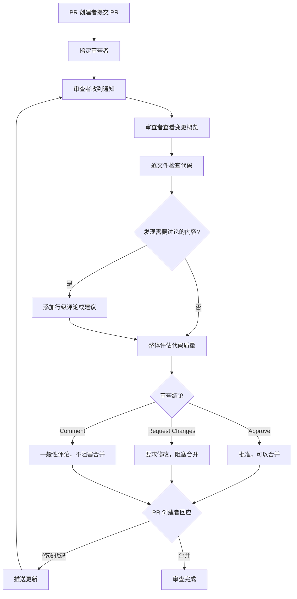
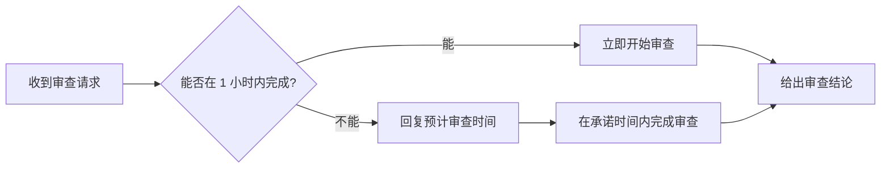

# 代码审查

> 构建高效、有温度的 Code Review 文化——从审查流程到评论技巧的完整指南。

## 概述

Code Review（代码审查）是现代软件开发中最重要的质量保障环节之一。它不仅仅是"找 Bug"——好的 Code Review 能够传播知识、统一编码风格、发现设计缺陷、提升团队整体的技术水平。在 GitHub 上，Code Review 围绕 Pull Request 展开，审查者可以在代码行级别添加评论、提出建议，最终给出审查结论。

一个健康的 Code Review 文化应该是双向的：审查者以建设性的态度提出意见，作者以开放的心态接受反馈。目标不是挑毛病，而是让代码变得更好。Google 的工程实践文档明确指出：Code Review 的核心目的是确保代码库的健康随时间持续改善，而非在每一次审查中追求完美。

> [!NOTE]
> Code Review 不仅仅关乎代码质量，它还是最有效的知识共享方式之一。通过审查他人的代码，团队成员可以了解系统的不同部分，减少知识孤岛。建议轮换审查者，避免同一部分代码只有一个人熟悉的情况。

本章将系统讲解 Code Review 的流程、评论技巧、建议式审查以及团队文化建设。建议与 [PR 完整生命周期](03-PR-完整生命周期) 配合阅读，了解 PR 的创建和管理基础。

## 核心操作

### 审查流程

一个完整的 Code Review 流程通常包括以下步骤：



### 开始审查

**浏览器端审查：**

1. 打开 PR 页面，点击 **Files changed** 标签页。
2. 审阅变更概览：默认隐藏空白行的变更（点击齿轮图标可调整）。
3. 逐文件检查代码：
   - 绿色行表示新增内容。
   - 红色行表示删除内容。
   - 行号左侧的 `+` 号可以添加行级评论。
4. 检查完毕后，点击右上角 **Review changes** 按钮。
5. 选择审查结论并填写总结评论。
6. 点击 **Submit review**。

**使用 GitHub CLI：**

```bash
# 查看 PR 的变更概览
gh pr diff <number>

# 查看 PR 的审查状态
gh pr view <number> --json reviews --jq '.reviews[] | "\(.author.login): \(.state)"'

# 批准 PR
gh pr review <number> --approve --body "代码逻辑清晰，测试覆盖完整，LGTM！"

# 请求修改
gh pr review <number> --request-changes \
  --body "请在 UserService.ts 第 42 行添加空值检查，避免潜在的 NullPointerException。"

# 提交一般性评论
gh pr review <number> --comment --body "整体方向正确，有几个小建议见行级评论。"
```

### 审查结论类型

| 类型 | 含义 | 效果 |
|------|------|------|
| **Comment** | 一般性反馈 | 不影响合并状态 |
| **Approve** | 批准合并 | PR 获得一个通过审查 |
| **Request Changes** | 要求修改 | PR 需要修改后才能合并（配合保护分支） |

> [!TIP]
> 即使你选择 **Approve**，也可以在评论中提出非阻塞性建议。用"建议（nit）"或"可选（optional）"前缀标记，让作者知道这些不是必须修改的。

### 行级评论与建议

行级评论是 Code Review 的核心。审查者可以针对具体的代码行提出意见：

**基本行级评论：**

1. 在 **Files changed** 页面，将鼠标悬停在要评论的代码行上。
2. 点击行号左侧的蓝色 `+` 号。
3. 输入评论内容。
4. 点击 **Start a review**（首次）或 **Add review comment**。

**建议式评论（Suggestion）：**

建议式评论允许审查者直接提供修改后的代码，作者可以一键应用：

````markdown
建议简化这段条件判断：

```suggestion
if (user?.isActive && hasPermission(user, 'write')) {
  return handleWrite(request);
}
```
````

> [!NOTE]
> 建议式评论使用 ` ```suggestion ` 代码块，其中的内容会替换被评论的那一行（或多行）。如果你需要替换多行，将鼠标悬停在起始行，按住 Shift 点击结束行的 `+` 号，即可选择一个范围。

### 多行评论

审查者可以选择一个连续的代码范围进行评论：

1. 点击起始行的 `+` 号。
2. 按住鼠标拖动到结束行，或按住 Shift 点击结束行。
3. 在弹出的评论框中输入意见。

## 进阶技巧

### 审查的关注维度

优秀的审查者不会只关注"代码能不能跑"，而是从多个维度评估：

| 维度 | 关注点 | 示例问题 |
|------|--------|----------|
| 正确性 | 逻辑是否正确 | 边界条件是否处理？空值是否检查？ |
| 设计 | 架构是否合理 | 这个类是否职责单一？接口设计是否清晰？ |
| 可读性 | 代码是否易读 | 变量命名是否准确？复杂逻辑是否有注释？ |
| 可维护性 | 后续是否容易修改 | 是否有硬编码的魔法值？是否过度抽象？ |
| 性能 | 是否存在性能隐患 | 循环中是否有不必要的数据库查询？ |
| 安全 | 是否有安全漏洞 | 用户输入是否做了校验？SQL 是否参数化？ |
| 测试 | 测试是否充分 | 是否覆盖了主要场景和边界条件？ |

### 审查评论的最佳实践

**好的评论示例：**

```markdown
<!-- 建设性 -->
建议在这里使用 Optional 来避免空指针异常：
```suggestion
return Optional.ofNullable(user)
    .map(User::getEmail)
    .orElseThrow(() -> new UserNotFoundException(userId));
```

<!-- 解释原因 -->
这里使用 ThreadLocal 可能会导致线程池中的线程复用时出现数据泄漏。
建议在 finally 块中调用 remove() 方法，或者使用 try-with-resources 模式。

<!-- 提出问题 -->
这里的缓存过期时间是 30 分钟，但业务文档中提到数据最多延迟 5 分钟。
这两个值不一致，请确认哪个是正确的。
```

**应该避免的评论：**

```markdown
<!-- 不要只说"不好"而不解释原因 -->
这代码写得不好。

<!-- 不要使用攻击性语言 -->
你怎么会写出这种代码？

<!-- 不要纠结纯个人偏好的格式问题 -->
我更喜欢把大括号放在下一行。
```

### 审查速度与优先级

Google 的工程实践建议：审查应该在收到请求后的一个工作日内开始。如果无法完成完整审查，可以先给出初步反馈，说明剩余部分会在何时完成。



> [!TIP]
> 将 PR 审查纳入你的日常工作节奏。一种有效的做法是：每次从任务切换时（如完成一个功能、午休后、会议前），先检查是否有待审查的 PR。使用 `gh pr list --reviewer "@me" --state open` 快速查看。

### 小团队审查策略

在 2-3 人的小团队中，审查资源有限。以下是几种实用的策略：

**轮换审查：** 团队成员轮流担任审查者，确保每个人都有机会审查和被审查。

**结对编程 + 快速审查：** 结对编写的代码只需轻量级审查（关注风格和遗漏），未结对编写的代码需要深度审查。

**领域专家审查：** 按模块划分审查责任。修改认证模块的 PR 由最熟悉认证的人审查。

### 大型 PR 的审查方法

当遇到超过 500 行变更的大型 PR 时，建议采用分层审查法：

1. **第一遍：理解意图**。只看 PR 描述和文件列表，理解这次变更的目标和范围。
2. **第二遍：审查设计**。关注架构层面的决策：新增了哪些类？模块间的依赖关系是否合理？
3. **第三遍：审查细节**。逐行检查代码逻辑、命名、错误处理等。
4. **第四遍：审查测试**。检查测试用例是否覆盖了关键场景。

## 常见问题

### Q: 审查者和作者意见不一致怎么办？

首先区分分歧的性质。如果是客观问题（Bug、性能隐患、安全漏洞），用事实和数据说服对方——提供测试用例、性能基准或权威文档链接。如果是主观偏好（命名风格、抽象层级），优先尊重仓库既有的惯例。如果仓库没有明确惯例，记录下讨论结果，将其加入编码规范文档，避免未来重复争论。

### Q: 应该审查测试代码吗？

必须审查。测试代码和生产代码同等重要。审查测试时关注：测试是否覆盖了正常路径和异常路径？断言是否精确（不是永远为真的断言）？测试是否独立（不依赖执行顺序）？测试命名是否清晰表达了测试意图？

### Q: 如何避免 Code Review 成为合并瓶颈？

设置明确的审查时间预期（如 24 小时内响应）。鼓励团队所有成员参与审查，而不是只依赖技术负责人。如果某个人的审查是长期瓶颈，考虑增加审查者或实施轮换机制。使用 [标签与里程碑](02-标签与里程碑) 标记 PR 的优先级，让审查者知道哪些需要优先处理。

### Q: 每次审查都应该 Approve 吗？

不一定。审查的目标是确保代码质量，而不是走流程。如果你发现了严重问题（逻辑错误、安全漏洞），应该选择 **Request Changes**。如果只是一些小建议（命名优化、注释补充），可以选择 **Approve** 并附带说明"以下是可选建议"。如果变更太大难以评估，可以请求拆分 PR。

### Q: 外部贡献者的 PR 需要特别审查什么？

外部贡献者的 PR 需要额外关注以下几点：是否理解了仓库的贡献指南？代码风格是否与项目一致？是否添加了必要的测试？是否签署了贡献者协议（如适用）？建议在仓库中配置 PR 模板和 CI 检查，降低外部贡献的审查成本。

### Q: 如何给初级开发者做 Code Review？

对初级开发者，审查反馈需要更加详细和有教学性。不要只指出问题，要解释"为什么"这是一个问题以及更好的做法是什么。使用"建议"而非"命令"的语气。同时也要认可做得好的地方，增强信心。可以搭配结对编程，在实时交流中传递经验。

### Q: 自动化工具可以替代 Code Review 吗？

不能完全替代。Linter、格式化工具和静态分析可以自动化检查代码风格和常见错误，这些应该通过 CI 流水线在审查前完成。Code Review 的核心价值在于人类审查者对设计、架构和业务逻辑的判断——这些是工具无法替代的。让工具处理它们擅长的部分，让审查者专注于更高层次的判断。

### Q: 如何审查自己不太熟悉的代码？

先阅读 PR 描述和相关 Issue，理解变更的背景和目标。如果有设计文档，先读文档再看代码。在评论中坦诚说明你不熟悉这部分代码，你的反馈侧重于可读性和一般性建议。如果涉及核心业务逻辑，建议邀请领域专家共同审查。

## 参考链接

| 标题 | 说明 |
|------|------|
| [About pull request reviews](https://docs.github.com/articles/about-pull-request-reviews) | GitHub PR 审查功能介绍 |
| [How to review code effectively](https://github.blog/developer-skills/github/how-to-review-code-effectively-a-github-staff-engineers-philosophy/) | GitHub 工程师的审查哲学 |
| [How to improve code with code reviews](https://github.com/resources/articles/how-to-improve-code-with-code-reviews) | 通过 Code Review 提升代码质量 |
| [Google's Engineering Practices](https://github.com/google/eng-practices) | Google 工程实践中的 Code Review 指南 |
| [pull-request-review-guide](https://github.com/mawrkus/pull-request-review-guide) | 社区整理的 PR 审查综合指南 |
