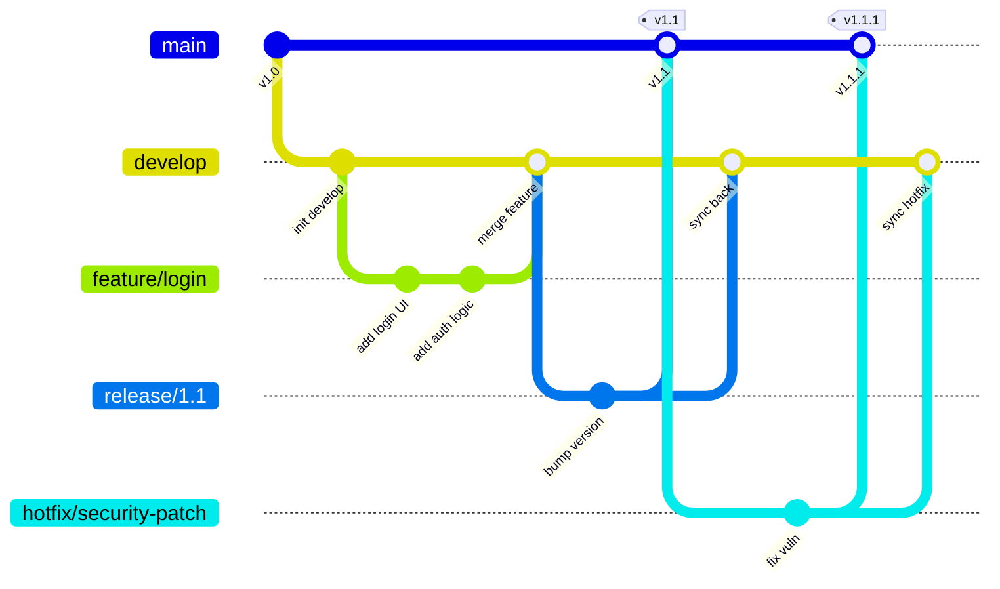
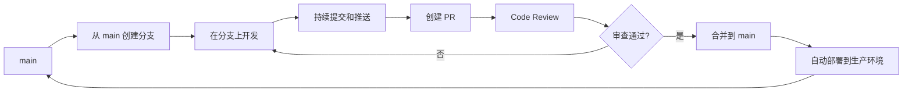
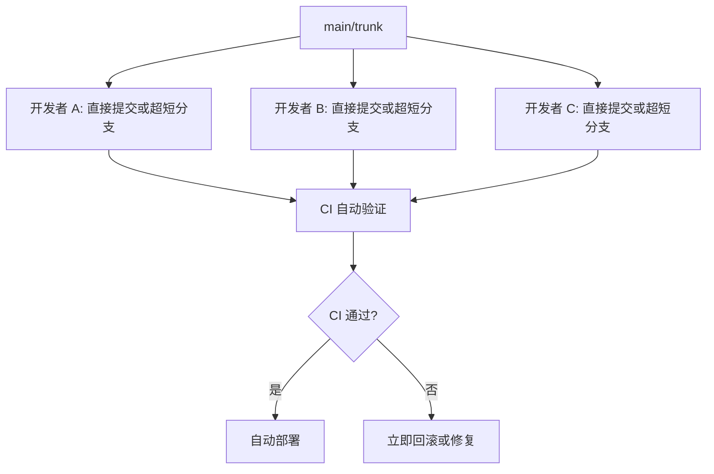
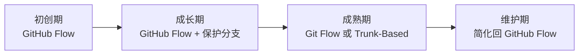

# 分支策略与 Git Flow

> 选择适合团队的分支模型——Git Flow、GitHub Flow 与 Trunk-Based 的取舍与实践。

## 概述

分支策略定义了团队如何使用 Git 分支来组织开发工作。选择合适的分支策略，能够减少合并冲突、加快发布节奏、提高团队协作效率。选错了策略，则可能陷入无休止的冲突解决和发布拖延。

业界最流行的三种分支策略各有侧重：Git Flow 适合有明确版本发布周期的项目，GitHub Flow 适合持续部署的 Web 应用，Trunk-Based Development 适合追求极快迭代速度的成熟团队。没有"最好的"策略，只有"最适合你的团队和项目"的策略。

> [!NOTE]
> 分支策略不是非此即彼的选择。很多团队会在不同策略之间取长补短，形成自己的定制方案。理解每种策略的设计动机和适用场景，比机械地照搬流程更重要。

本章将深入对比三种主流分支策略，帮助你根据团队规模、发布节奏和项目特点做出合适的选择。建议先回顾 [分支基础](../01-基础操作/04-分支基础) 中的分支操作知识。

## 核心操作

### Git Flow

Git Flow 由 Vincent Driessen 于 2010 年提出，是最早被广泛采用的分支策略之一。它定义了五种分支类型和严格的合并规则。

**分支结构：**

| 分支类型 | 命名约定 | 生命周期 | 用途 |
|----------|----------|----------|------|
| `main` | `main` | 永久 | 生产环境代码，每个 Commit 是一个可发布版本 |
| `develop` | `develop` | 永久 | 开发集成分支，包含下一次发布的所有功能 |
| `feature` | `feature/<name>` | 临时 | 功能开发，从 develop 创建，合并回 develop |
| `release` | `release/<version>` | 临时 | 发布准备，从 develop 创建，合并回 main 和 develop |
| `hotfix` | `hotfix/<name>` | 临时 | 紧急修复，从 main 创建，合并回 main 和 develop |



**日常操作流程：**

```bash
# 1. 从 develop 创建功能分支
git checkout develop
git pull origin develop
git checkout -b feature/user-profile

# 2. 在功能分支上开发
git add .
git commit -m "feat: 添加用户个人资料页面"

# 3. 功能完成后，通过 PR 合并回 develop
git push origin feature/user-profile
gh pr create --base develop --title "feat: 用户个人资料页面"

# 4. 准备发布：从 develop 创建 release 分支
git checkout develop
git checkout -b release/1.2.0

# 5. 在 release 分支上修复 Bug、更新版本号
git commit -m "chore: 更新版本号至 1.2.0"

# 6. release 完成，合并到 main（打 Tag）和 develop
git checkout main
git merge --no-ff release/1.2.0
git tag -a v1.2.0 -m "Release v1.2.0"

git checkout develop
git merge --no-ff release/1.2.0

# 7. 删除 release 分支
git branch -d release/1.2.0
```

**Git Flow 适用场景：**

- 有明确版本号的产品（桌面应用、移动应用、库/框架）。
- 发布周期较长（数周到数月）。
- 需要同时维护多个版本。
- 团队规模较大，需要严格的流程规范。

> [!WARNING]
> Git Flow 的主要缺点是复杂度高。多个长期分支并存会导致合并冲突频发，尤其当功能分支存在时间较长时。如果你的项目每天发布多次，Git Flow 的开销通常不值得。

### GitHub Flow

GitHub Flow 是 GitHub 推荐的简化分支策略。它的核心思想只有一条：`main` 分支随时可部署，所有修改都通过功能分支 + PR 进行。

**分支结构：**

| 分支类型 | 命名约定 | 生命周期 | 用途 |
|----------|----------|----------|------|
| `main` | `main` | 永久 | 随时可部署的生产分支 |
| 功能分支 | `<type>/<name>` | 临时 | 所有修改，创建后通过 PR 合并回 main |



**日常操作流程：**

```bash
# 1. 从 main 创建功能分支
git checkout main
git pull origin main
git checkout -b feature/dark-mode

# 2. 开发并频繁提交
git add .
git commit -m "feat: 添加深色模式切换按钮"
git push origin feature/dark-mode

# 3. 创建 PR
gh pr create --title "feat: 添加深色模式" --body "实现深色模式切换，支持系统偏好跟随"

# 4. Code Review 通过后合并
gh pr merge --squash --delete-branch

# 5. 合并后自动部署（通过 CI/CD）
```

**GitHub Flow 适用场景：**

- Web 应用、SaaS 产品等持续部署的项目。
- 发布周期短（每天或每周多次部署）。
- 不需要同时维护多个版本。
- 团队希望保持简单高效的流程。

> [!TIP]
> GitHub Flow 的关键前提是 `main` 分支随时可部署。这意味着你需要完善的自动化测试和 CI/CD 流水线来保障质量。如果没有自动化测试，`main` 分支上的错误会直接影响生产环境。

### Trunk-Based Development

Trunk-Based Development（主干开发）是最激进的分支策略。所有开发者在 `main`（即 trunk）上直接提交，或者使用生命周期极短（不超过一天）的功能分支。

**核心原则：**

- 所有开发者向 `main` 频繁提交（每天至少一次）。
- 功能分支存活时间不超过 24 小时。
- 未完成的功能使用 Feature Flag 控制可见性。
- 大型重构通过渐进式改造完成，不创建长期分支。



**Feature Flag 实践：**

```python
# 使用 Feature Flag 控制未完成功能的可见性
def get_dashboard(user):
    if feature_flags.is_enabled("new_dashboard", user):
        return render_new_dashboard(user)
    return render_legacy_dashboard(user)
```

```bash
# Trunk-Based 的典型工作流
git checkout main
git pull origin main

# 创建极短生命周期的分支
git checkout -b fix/login-error

# 快速修复并提交（目标在几小时内完成）
git add .
git commit -m "fix: 修复登录时的空指针异常"
git push origin fix/login-error

# 立即创建 PR 并请求快速审查
gh pr create --title "fix: 登录空指针修复" --reviewer "tech-lead"

# 合并后立即部署
gh pr merge --squash --delete-branch
```

**Trunk-Based Development 适用场景：**

- 团队成熟度高，代码质量意识和自动化程度都很强。
- 需要极快的迭代速度（一天内多次部署）。
- 有完善的 Feature Flag 基础设施。
- CI/CD 流水线完善，能在几分钟内完成构建和测试。

> [!WARNING]
> Trunk-Based Development 对团队的工程能力要求最高。如果没有完善的自动化测试和 Feature Flag 机制，直接在 main 上开发会导致频繁的生产事故。不建议在自动化程度较低的团队中采用。

### 三种策略对比

| 维度 | Git Flow | GitHub Flow | Trunk-Based |
|------|----------|-------------|-------------|
| 复杂度 | 高 | 低 | 中 |
| 分支数量 | 多（5 种类型） | 少（2 种类型） | 极少 |
| 合并冲突频率 | 较高 | 较低 | 最低 |
| 发布节奏 | 按版本（周/月） | 按需（天） | 持续（小时） |
| 适用团队规模 | 中大型 | 中小型 | 成熟团队 |
| 学习曲线 | 陡峭 | 平缓 | 中等 |
| 自动化要求 | 中等 | 较高 | 最高 |
| 多版本支持 | 原生支持 | 不支持 | 不支持 |

### Forking Workflow

除了以上三种策略，还有一种常用于开源项目的 Forking Workflow：

```bash
# 1. Fork 上游仓库到个人账户（在浏览器端操作）

# 2. 克隆 Fork 仓库到本地
git clone https://github.com/<your-username>/<repo>.git
cd <repo>

# 3. 添加上游仓库为远程
git remote add upstream https://github.com/<original-owner>/<repo>.git

# 4. 创建功能分支
git checkout -b feature/new-feature

# 5. 开发并提交
git add .
git commit -m "feat: 添加新功能"

# 6. 推送到 Fork 仓库
git push origin feature/new-feature

# 7. 从 Fork 向上游创建 PR
gh pr create --repo <original-owner>/<repo> \
  --title "feat: 添加新功能" \
  --body "详细描述变更内容"

# 8. 定期同步上游更新
git fetch upstream
git checkout main
git merge upstream/main
git push origin main
```

> [!NOTE]
> Forking Workflow 通常与 GitHub Flow 或 Trunk-Based 组合使用。外部贡献者通过 Fork + PR 的方式参与开发，内部团队成员则直接在仓库内使用选定的分支策略。

## 进阶技巧

### 混合策略：根据项目阶段调整

很多成功的项目在不同阶段采用不同的分支策略：



- **初创期**：团队小、迭代快，GitHub Flow 足够。
- **成长期**：加入保护分支和 CI 检查，提升质量。
- **成熟期**：根据产品特点选择 Git Flow（版本化产品）或 Trunk-Based（SaaS 产品）。
- **维护期**：开发节奏放缓，简化回 GitHub Flow。

### 分支保护与策略配合

无论选择哪种策略，都应该对 `main` 分支设置保护规则：

```text
Settings > Branches > Branch protection rules > Add rule

推荐配置：
- Require a pull request before merging
  - Require approvals: 1-2
  - Dismiss stale reviews on push: 是
- Require status checks to pass
  - 选择 CI 检查项
- Require signed commits（可选）
- Do not allow force pushes
- Do not allow deletion
```

Git Flow 中还需要对 `develop` 分支设置类似的保护规则。`release/*` 和 `hotfix/*` 分支可以设置较宽松的规则。

### 分支命名约定

统一的分支命名约定可以让团队快速识别分支类型：

```text
feature/<ticket-id>-<short-description>    # 功能开发
fix/<ticket-id>-<short-description>         # Bug 修复
hotfix/<version>-<short-description>        # 紧急修复
release/<version>                            # 发布准备
docs/<short-description>                     # 文档更新
refactor/<short-description>                 # 代码重构
experiment/<short-description>               # 实验性尝试
```

示例：`feature/GH-123-add-user-profile`、`fix/GH-456-login-error`、`release/2.0.0`。

## 常见问题

### Q: 我们团队应该选哪种策略？

根据项目特点选择：如果是有明确版本号的发布型产品（如移动应用、桌面软件），选 Git Flow。如果是持续部署的 Web 应用，选 GitHub Flow。如果团队成熟度高、自动化完善且追求极快迭代，选 Trunk-Based。如果不确定，从 GitHub Flow 开始，根据痛点逐步调整。

### Q: 可以混合使用多种策略吗？

可以，但不建议在同一个仓库内混用。更推荐的做法是：仓库统一使用一种策略，但在不同粒度上灵活调整。例如：整体使用 GitHub Flow，但对发布流程借鉴 Git Flow 的 release 分支概念。

### Q: 功能分支存活太久怎么办？

功能分支存活时间越长，合并冲突越难解决。建议将大型功能拆分为多个可独立合并的小 PR（每个 PR 不超过 400 行变更）。如果确实需要长期开发，至少每天从 main 或 develop 拉取最新变更到功能分支。

### Q: Git Flow 中的 develop 分支是否必要？

对于小团队（3 人以下），可以省略 develop 分支，直接在 main 上做开发集成分支，使用 feature 分支 + PR 的工作流。这实际上就是 GitHub Flow。对于大团队，develop 分支可以避免未完成的功能直接进入 main，提供了一层缓冲。

### Q: 如何处理多版本并行维护？

如果需要同时维护多个版本（如 v1.x 和 v2.x），可以为每个活跃版本创建长期分支（如 `support/1.x`）。Bug 修复先在对应版本的分支上进行，然后根据需要向前合并到更新的版本。Git Flow 对这种场景有天然的支持。

### Q: Trunk-Based 中如何处理大型重构？

大型重构采用"渐进式改造"（Strangler Fig Pattern）：在 main 上逐步替换旧代码，每次提交都保持系统可运行。使用 Feature Flag 控制新旧实现的切换。确保每一步都可以在几小时内完成并审查。

### Q: 开源项目应该使用什么策略？

开源项目通常使用 Forking Workflow + GitHub Flow 的组合。项目维护者直接在仓库内使用 GitHub Flow 开发，外部贡献者通过 Fork + PR 提交代码。具体参见 [PR 完整生命周期](03-PR-完整生命周期) 中的 Fork 相关内容。

### Q: 如何在 CI/CD 中适配不同的分支策略？

为不同类型的分支配置不同的流水线触发规则：

- `main` 分支：触发完整的测试 + 构建 + 部署流水线。
- `feature/*` 分支：触发快速测试 + 构建流水线。
- `release/*` 分支：触发完整测试 + 预发布环境部署。
- `hotfix/*` 分支：触发完整测试 + 快速部署。

这样可以在保证质量的同时，避免每个功能分支都跑完整的部署流程，节省 CI 资源。

## 参考链接

| 标题 | 说明 |
|------|------|
| [GitHub flow](https://docs.github.com/get-started/quickstart/github-flow) | GitHub 官方推荐的简化分支策略 |
| [A successful Git branching model](https://nvie.com/posts/a-successful-git-branching-model/) | Git Flow 原始文章，Vincent Driessen 著 |
| [Gitflow Workflow — Atlassian](https://www.atlassian.com/git/tutorials/comparing-workflows/gitflow-workflow) | Atlassian 对 Git Flow 的详细解读 |
| [Git Feature Branch Workflow](https://www.atlassian.com/git/tutorials/comparing-workflows/feature-branch-workflow) | 功能分支工作流教程 |
| [Forking Workflow](https://www.atlassian.com/git/tutorials/comparing-workflows/forking-workflow) | Fork 工作流详解 |
| [Trunk Based Development](https://trunkbaseddevelopment.com/) | Trunk-Based Development 官方站点 |
