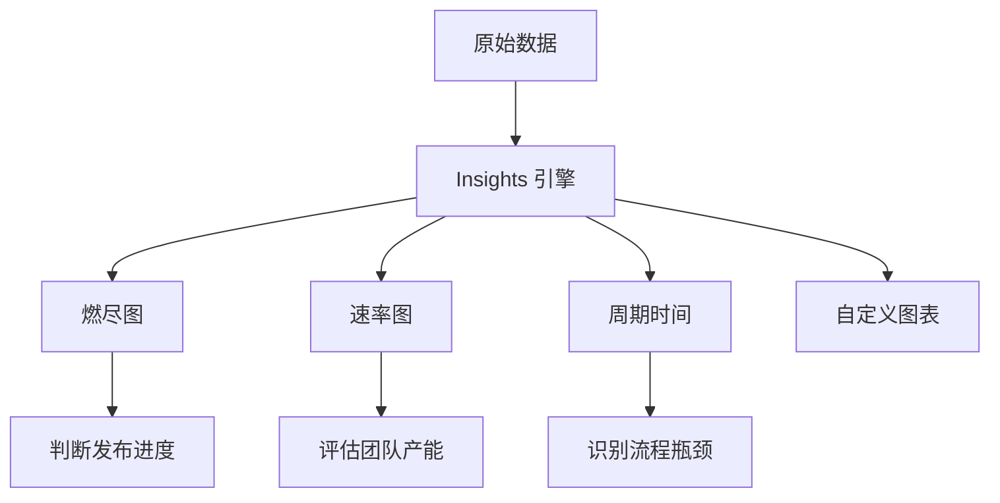

# 项目管理看板

> 用 GitHub Projects V2 搭建可视化看板——自动化流转、多视图切换与数据洞察。

## 概述

GitHub Projects V2 是 GitHub 提供的项目管理工具，它将 Issue、Pull Request 和草稿项统一在一个可定制的看板中管理。与传统的 Projects V1（经典版）不同，Projects V2 基于全新的数据模型，支持自定义字段、多种视图、内置自动化以及数据洞察功能。

无论你是管理个人项目还是协调大型团队，Projects V2 都能帮助你将工作可视化。你可以按看板模式追踪任务状态，按表格模式查看详细字段，按日历模式查看时间安排，甚至按分组模式查看工作分布。这些视图共享同一份数据，一个视图中的修改会实时反映到所有视图中。

> [!NOTE]
> Projects V2 可以跨仓库聚合 Issue 和 PR。你可以在一个看板中同时管理来自多个仓库的工作项，这对于需要协调多个服务的团队来说非常实用。它也可以直接关联 [Issue 完整指南](01-Issue-完整指南) 中创建的 Issue 和 [PR 完整生命周期](03-PR-完整生命周期) 中创建的 PR。

## 核心操作

### 创建项目

**从个人或组织页面创建：**

1. 点击右上角头像，选择 **Your projects**（个人）或进入组织页面选择 **Projects**。
2. 点击 **New project**。
3. 选择起始模板：
   - **Team backlog**：适合团队的待办事项管理。
   - **Bug triage**：适合 Bug 分类和处理。
   - **Feature release**：适合版本发布追踪。
   - **Blank project**：从零开始自定义。
4. 输入项目名称和简短描述。
5. 点击 **Create**。

**使用 GitHub CLI：**

```bash
# 在个人账户下创建项目
gh project create --title "v2.0 发布追踪" --body "追踪 v2.0 版本的所有工作项"

# 在组织下创建项目
gh project create --owner <org-name> --title "团队看板" --body "团队日常工作看板"

# 查看已有项目列表
gh project list --owner <org-name>

# 查看项目详情
gh project view <project-number> --owner <org-name>
```

### 看板基本结构

Projects V2 的核心概念：

| 概念 | 说明 |
|------|------|
| Item（工作项） | 看板中的每一行，可以是 Issue、PR 或草稿项 |
| Field（字段） | 工作项的属性，如状态、优先级、负责人、日期 |
| View（视图） | 同一数据的不同展示方式，如看板、表格、日历 |
| Workflow（自动化） | 自动触发的工作流规则，如状态变更、字段更新 |

### 添加工作项

**从仓库添加 Issue 或 PR：**

1. 打开项目页面。
2. 点击 **+ Add item** 搜索框。
3. 输入 Issue 或 PR 的编号（如 `#42`）或 URL 直接添加。
4. 或者输入文本创建草稿项（Draft），后续可以转换为 Issue。

**从 Issue 页面添加：**

1. 打开任意 Issue 页面。
2. 在右侧边栏找到 **Projects** 区域。
3. 点击 **Add to project**，选择目标项目。

**使用 GitHub CLI：**

```bash
# 添加 Issue 到项目
gh project item-add <project-number> \
  --owner <org-name> \
  --url https://github.com/<owner>/<repo>/issues/42

# 添加草稿项
gh project item-create <project-number> \
  --owner <org-name> \
  --title "调研 GraphQL 方案" \
  --body "对比 GraphQL 和 REST 的优劣势"

# 查看项目中的所有工作项
gh project item-list <project-number> --owner <org-name>

# 从项目中移除工作项
gh project item-delete <item-id> --project-id <project-id>
```

> [!TIP]
> 你可以直接将 GitHub 上的 Issue URL 粘贴到看板的搜索框中，快速将其添加到项目。批量添加时，可以在仓库的 Issue 列表页勾选多个 Issue，然后通过右侧边栏的 **Projects** 一次性添加。

### 自定义字段

Projects V2 的强大之处在于支持丰富的自定义字段：

**创建自定义字段：**

1. 打开项目页面。
2. 点击右上角的 `...` 菜单，选择 **Settings**。
3. 在 **Custom fields** 区域点击 **New field**。
4. 选择字段类型：

| 字段类型 | 说明 | 示例 |
|----------|------|------|
| Text | 单行文本 | 外部链接、备注 |
| Number | 数值 | 工作量估算（故事点） |
| Date | 日期 | 开始日期、截止日期 |
| Single select | 单选下拉 | 状态、优先级、模块 |
| Iteration | 迭代周期 | Sprint 周期（自动生成） |
| Labels | 标签（只读） | 从 Issue 同步的标签 |

```bash
# 通过 CLI 创建自定义字段
gh project field-create <project-number> \
  --owner <org-name> \
  --name "优先级" \
  --single-select-option "P0=紧急" \
  --single-select-option "P1=高" \
  --single-select-option "P2=中" \
  --single-select-option "P3=低"
```

**配置 Status 字段：**

Status 字段是看板视图的核心，默认包含 `Todo`、`In Progress`、`Done` 三个选项。你可以根据团队流程自定义：

```text
推荐的状态字段配置：
- Backlog（待规划）
- Todo（待开始）
- In Progress（进行中）
- In Review（审查中）
- Done（已完成）
```

### 视图管理

Projects V2 支持多种视图模式，帮助你从不同角度审视项目。

**看板视图（Board）：**

最经典的视图。工作项按 Status 字段的值分列显示，通过拖拽卡片在列之间移动来更新状态。

**表格视图（Table）：**

类似电子表格的视图。每行是一个工作项，每列是一个字段。适合批量编辑和快速浏览所有字段的值。

**日历视图（Calendar）：**

按日期字段（如截止日期）在工作日历上显示工作项。适合查看团队的时间安排和工作密度。

**分组视图（Group by）：**

可以按任何单选字段对工作项进行分组。例如按负责人分组查看每个人的工作分配，按模块分组查看各模块的进度。

```bash
# 通过 CLI 查看项目的字段配置
gh project field-list <project-number> --owner <org-name>

# 查看项目的视图列表
gh project view <project-number> --owner <org-name> --json views
```

**创建新视图：**

1. 打开项目页面。
2. 点击视图标签栏右侧的 **+ New view**。
3. 选择视图类型（Board、Table、Calendar 等）。
4. 配置筛选、分组和排序规则。
5. 视图会自动保存。

> [!NOTE]
> 视图的筛选和排序是个人偏好的，每个团队成员可以创建自己的私人视图（Private view），不会影响其他人看到的默认视图。点击视图标签旁的下拉菜单可以切换私人/公共视图。

### 自动化工作流

Projects V2 内置了自动化功能，可以减少手动操作。

**配置内置自动化：**

1. 打开项目页面，点击右上角的 `...` 菜单，选择 **Workflows**。
2. 启用或禁用预置的工作流：

| 工作流 | 触发条件 | 动作 |
|--------|----------|------|
| Item added to project | Issue/PR 被添加到项目 | 自动设置 Status 为 Todo |
| Item reopened | Issue 或 PR 被重新打开 | 自动将 Status 设回 In Progress |
| Pull request merged | PR 被合并 | 自动将 Status 设为 Done |
| Item closed | Issue 被关闭 | 自动将 Status 设为 Done |
| Auto-add to project | 仓库中新建的 Issue/PR | 自动添加到项目 |

**高级自动化（GitHub Actions）：**

当内置自动化不能满足需求时，可以通过 GitHub Actions 实现更复杂的工作流：

```yaml
# .github/workflows/project-automation.yml
name: 项目自动化

on:
  issues:
    types: [opened, labeled]

jobs:
  add-to-project:
    runs-on: ubuntu-latest
    steps:
      - name: 添加带特定标签的 Issue 到项目
        if: contains(github.event.issue.labels.*.name, 'bug')
        uses: actions/add-to-project@v1.0.2
        with:
          project-url: https://github.com/orgs/<org>/projects/<number>
          github-token: ${{ secrets.PROJECT_TOKEN }}

  update-priority:
    runs-on: ubuntu-latest
    steps:
      - name: 高优先级 Issue 自动设置优先级字段
        if: contains(github.event.issue.labels.*.name, 'priority/high')
        env:
          GH_TOKEN: ${{ secrets.PROJECT_TOKEN }}
        run: |
          gh project item-edit \
            --project-id <project-id> \
            --id <item-id> \
            --field-id <priority-field-id> \
            --single-select-option-id <high-priority-option-id>
```

> [!WARNING]
> 使用 GitHub Actions 操作 Projects 时，需要使用具有 `project` 权限的 Token（Personal Access Token 或 GitHub App Token）。默认的 `GITHUB_TOKEN` 权限不足以操作组织级别的项目。建议在仓库 Secrets 中存储专用的 Token。

### 筛选与排序

在项目视图中，你可以使用筛选语法快速定位工作项：

```text
# 按状态筛选
status:"In Progress"

# 按负责人筛选
assignee:@me

# 按标签筛选
label:bug

# 按里程碑筛选
milestone:"v2.0"

# 按日期筛选
due:<2025-06-30

# 组合筛选
status:"In Progress" label:priority/high
```

筛选条件会保存在当前视图中，你可以为常用的筛选组合创建独立视图。

### 数据洞察

Projects V2 提供了内置的洞察（Insights）功能，帮助你了解项目的健康状态。

**启用洞察：**

1. 打开项目页面。
2. 点击右上角的 `...` 菜单，选择 **Insights**。
3. 查看以下指标：

| 指标 | 说明 |
|------|------|
| Burn down | 剩余工作量随时间的变化（燃尽图） |
| Burn up | 已完成工作量随时间的累积（燃起图） |
| Velocity | 每个迭代完成的工作量（速率图） |
| Cycle time | 从开始到完成的平均时间（周期时间） |
| Item age | 工作项从创建到当前的时长分布 |



> [!TIP]
> 周期时间（Cycle time）是最容易被忽视但最有价值的指标。如果周期时间持续增长，说明团队的流程中存在瓶颈——可能是审查太慢、CI 等待太长或外部依赖太多。定期检查周期时间可以帮助你及早发现并解决这些问题。

## 进阶技巧

### 按 Sprint 管理迭代

使用 Iteration 字段可以按 Sprint 管理工作：

1. 在项目设置中创建 Iteration 字段。
2. 配置 Sprint 起始日期和长度（如 2 周）。
3. 自动生成后续 Sprint（如 Sprint 1、Sprint 2...）。
4. 在看板视图中按 Iteration 分组，查看每个 Sprint 的工作分配。

```bash
# 创建迭代字段（需要通过 API）
gh api graphql -f query='
mutation {
  createProjectV2Field(input: {
    projectId: "<project-id>"
    name: "Sprint"
    dataType: ITERATION
  }) {
    projectV2Field { id }
  }
}'
```

### 跨仓库聚合管理

Projects V2 的一个重要优势是可以跨仓库聚合 Issue。设置方法：

1. 在项目中手动添加来自不同仓库的 Issue（通过 URL 或编号）。
2. 配置自动添加工作流，将特定仓库的新 Issue 自动加入项目。
3. 使用仓库字段标识每个工作项的来源仓库。

这样你可以在一个看板中统一管理微服务架构下所有服务的工作项。

### 看板与标签体系联动

将 Projects V2 的自定义字段与 [标签与里程碑](02-标签与里程碑) 体系结合使用：

- **Label** 用于在仓库层面分类（类型、模块），是 Issue 的固有属性。
- **自定义字段** 用于在项目层面管理（优先级、Sprint），是看板的管理属性。
- 两者互为补充：Label 在 Issue 列表页筛选，自定义字段在看板视图中筛选和分组。

### 权限与可见性

Projects V2 的权限管理与仓库权限独立：

- **个人项目**：只有创建者可以查看和编辑。
- **组织项目**：可以设置组织成员的访问权限（Admin、Write、Read）。
- **公开项目**：任何人可以查看，但只有授权用户可以编辑。

配置权限路径：**项目 Settings > Manage access**。

## 常见问题

### Q: Projects V2 和 Projects V1（经典版）有什么区别？

Projects V2 基于全新的数据模型，支持自定义字段、多视图、内置自动化和数据洞察。V1 只支持简单的看板和注解列，功能有限。GitHub 已经停止对 V1 的功能更新，建议所有新项目使用 V2。你可以在项目设置中将 V1 迁移到 V2。

### Q: 一个项目最多可以有多少个工作项？

Projects V2 的单个项目最多支持 120,000 个工作项。对于绝大多数项目来说，这个上限绰绰有余。如果项目中的工作项过多，建议使用筛选和视图功能按模块或时间范围切分查看。

### Q: 看板的自动化会对所有仓库生效吗？

不会。内置的自动化只对你手动添加到项目中的 Issue 和 PR 生效。"Auto-add to project" 工作流需要指定关联的仓库，不会自动包含所有仓库的 Issue。

### Q: 如何让团队成员在创建 Issue 时自动添加到项目？

有两种方式：第一，启用项目的 "Auto-add to project" 工作流，配置关联仓库后，该仓库的新 Issue 会自动加入项目。第二，在 Issue 模板中预设 Projects 字段（目前仅支持通过 API 配置），确保使用模板创建的 Issue 自动关联项目。

### Q: 可以在 Projects V2 中管理非代码任务吗？

可以。Projects V2 支持草稿项（Draft），它们不关联任何 Issue 或 PR，纯粹是看板中的文本项。你可以用草稿项管理会议安排、文档撰写、调研任务等非代码工作。草稿项后续可以转换为 Issue 转化为正式的工作项。

### Q: 如何导出项目数据？

项目数据可以通过 GitHub API 导出。使用 CLI 可以导出工作项列表：

```bash
# 导出项目中的所有工作项为 JSON
gh project item-list <project-number> --owner <org-name> \
  --format json --jq '.[]'

# 导出为 CSV 格式（需要 jq 工具）
gh project item-list <project-number> --owner <org-name> \
  --format json | jq -r '.[] | [.title, .status, .assignees] | @csv'
```

你也可以在项目的表格视图中直接复制数据到电子表格。

### Q: Iteration 字段和 Milestone 有什么区别？

Milestone 是仓库级别的概念，绑定在 Issue 上，用于标记版本目标。Iteration 是 Projects V2 的自定义字段，绑定在看板工作项上，用于标记 Sprint 周期。两者可以同时使用：Milestone 管理版本级别的目标（如 v2.0），Iteration 管理执行层面的时间规划（如 Sprint 5）。

### Q: 如何在看板中追踪 PR 的审查状态？

当 PR 被添加到项目后，你可以为 PR 创建特定的 Status 值（如 `In Review`）。配合自动化工作流，当 PR 进入审查状态时自动将看板卡片移到 `In Review` 列。审查者可以在看板中快速筛选所有处于 `In Review` 状态的 PR，优先处理审查工作。

## 参考链接

| 标题 | 说明 |
|------|------|
| [About Projects](https://docs.github.com/issues/planning-and-tracking-with-projects/learning-about-projects/about-projects) | Projects V2 功能概念介绍 |
| [Best practices for Projects](https://docs.github.com/en/issues/planning-and-tracking-with-projects/learning-about-projects/best-practices-for-projects) | 项目管理最佳实践指南 |
| [Automating your project](https://docs.github.com/en/issues/planning-and-tracking-with-projects/automating-your-project) | 自动化工作流配置方法 |
| [About insights for Projects](https://docs.github.com/en/issues/planning-and-tracking-with-projects/viewing-insights-from-your-project/about-insights-for-projects) | 数据洞察功能介绍 |
| [About protected branches](https://docs.github.com/repositories/configuring-branches-and-merges-in-your-repository/managing-protected-branches/about-protected-branches) | 保护分支配置，配合看板使用 |
| [gh issue](https://cli.github.com/manual/gh_issue) | GitHub CLI Issue 命令手册 |
| [gh pr](https://cli.github.com/manual/gh_pr) | GitHub CLI PR 命令手册 |
