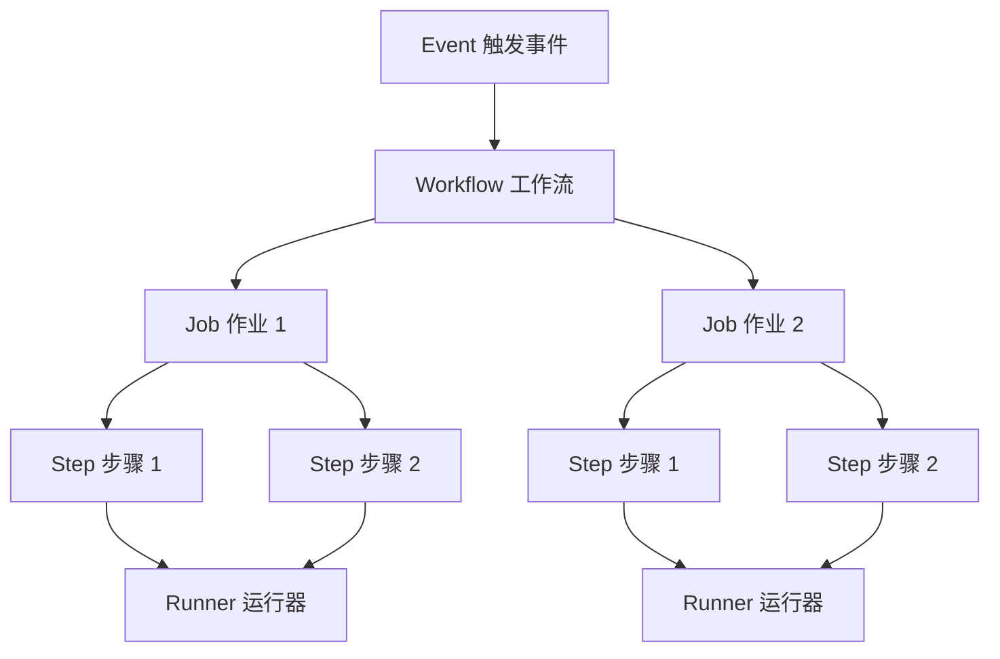
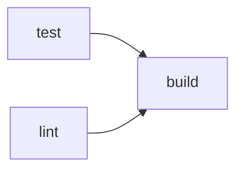

# GitHub Actions 入门

> 从零理解 GitHub Actions 的核心架构——事件、Workflow、Job、Step 与 Runner，迈出自动化的第一步。

## 概述

GitHub Actions 是 GitHub 内置的持续集成与持续交付（CI/CD）平台。它允许你在仓库中直接定义自动化工作流，无需搭建额外的服务器或配置外部服务。每当仓库中发生特定事件（如推送代码、创建 Pull Request、发布 Release），GitHub Actions 就会按照你预先定义的流程自动执行一系列操作。

GitHub Actions 的核心概念包括五个层次：**Workflow**（工作流）、**Event**（触发事件）、**Job**（作业）、**Step**（步骤）和 **Runner**（运行器）。它们之间的关系就像一条流水线：事件触发 Workflow，Workflow 包含若干 Job，Job 由多个 Step 组成，而所有 Step 都在 Runner 上执行。理解这个层次结构是掌握 GitHub Actions 的基础。

> [!NOTE]
> GitHub Actions 的免费额度为每月 2000 分钟（免费版），对于公开仓库则完全免费且不限时长。Runner 类型不同，消耗速率也不同——Windows 和 macOS Runner 的分钟消耗分别是 Linux 的 2 倍和 10 倍。

本章将带你从创建第一个 Workflow 开始，逐步理解每个核心组件的作用与配置方式，为后续深入学习 [Workflow 语法详解](02-Workflow-语法详解) 打下坚实基础。

## 核心操作

### 认识核心架构

GitHub Actions 的执行模型可以用以下流程图表示：



| 概念 | 说明 | 类比 |
|------|------|------|
| Workflow | 自动化流程的定义文件 | 一份流水线蓝图 |
| Event | 触发 Workflow 运行的事件 | 启动流水线的开关 |
| Job | 一组 Step 的集合，在同一 Runner 上执行 | 流水线上的一个工位 |
| Step | Job 中的单个任务 | 工位上的一个操作 |
| Runner | 执行 Job 的服务器 | 流水线的工人 |
| Action | 可复用的 Step 组件 | 标准化的工具 |

### 创建第一个 Workflow

1. 在仓库根目录创建 `.github/workflows/` 目录。
2. 在该目录下创建一个 YAML 文件，例如 `ci.yml`。
3. 编写以下内容并提交到仓库：

```yaml
# .github/workflows/ci.yml
name: 我的第一个 Workflow

on:
  push:
    branches: [ main ]
  pull_request:
    branches: [ main ]

jobs:
  build:
    runs-on: ubuntu-latest
    steps:
      - name: 检出代码
        uses: actions/checkout@v4

      - name: 设置 Node.js
        uses: actions/setup-node@v4
        with:
          node-version: '20'

      - name: 安装依赖
        run: npm ci

      - name: 运行测试
        run: npm test
```

4. 将代码推送到 GitHub，进入仓库的 **Actions** 标签页即可看到 Workflow 的运行状态。

> [!TIP]
> Workflow 文件必须放在 `.github/workflows/` 目录下，扩展名必须是 `.yml` 或 `.yaml`。一个仓库可以包含多个 Workflow 文件，每个文件定义一个独立的自动化流程。

### 使用 Starter Workflow 快速开始

GitHub 提供了大量预置模板，适合快速搭建常用场景：

1. 进入仓库的 **Actions** 标签页。
2. 在搜索框中输入关键词（如 `Node.js`、`Python`、`Docker`）。
3. 选择一个模板，点击 **Configure**。
4. 根据需要修改 YAML 内容，直接提交即可。

你也可以在 [actions/starter-workflows](https://github.com/actions/starter-workflows) 仓库中浏览所有官方模板。

### 理解 Event（触发事件）

Event 是 Workflow 的触发条件。GitHub 支持数十种事件类型，以下是常用的几种：

```yaml
on:
  # 推送到 main 或 develop 分支时触发
  push:
    branches: [ main, develop ]

  # 创建 PR 到 main 分支时触发
  pull_request:
    branches: [ main ]

  # 定时执行（Cron 表达式，UTC 时间）
  schedule:
    - cron: '0 2 * * *'  # 每天凌晨 2 点

  # 手动触发
  workflow_dispatch:

  # 在 Issue 打开时触发
  issues:
    types: [ opened ]
```

> [!NOTE]
> `schedule` 事件使用 POSIX Cron 语法，但最小精度为 5 分钟。GitHub 不保证 Cron 任务的精确执行时间，在高负载期可能会有数分钟的延迟。

### 理解 Job（作业）

Job 是 Step 的容器。一个 Workflow 可以包含多个 Job，它们默认并行执行：

```yaml
jobs:
  test:
    runs-on: ubuntu-latest
    steps:
      - uses: actions/checkout@v4
      - run: npm test

  lint:
    runs-on: ubuntu-latest
    steps:
      - uses: actions/checkout@v4
      - run: npm run lint

  build:
    runs-on: ubuntu-latest
    needs: [ test, lint ]  # 等待 test 和 lint 完成后再执行
    steps:
      - uses: actions/checkout@v4
      - run: npm run build
```

`needs` 关键字用于定义 Job 之间的依赖关系。上面的例子中，`test` 和 `lint` 并行执行，它们都通过后才会执行 `build`。



### 理解 Step（步骤）

Step 是 Job 中最小的执行单元。每个 Step 可以是一个 Shell 命令（`run`）或一个 Action（`uses`）：

```yaml
steps:
  # 使用 Action
  - name: 检出代码
    uses: actions/checkout@v4

  # 执行 Shell 命令
  - name: 安装依赖
    run: |
      npm ci
      npm run build

  # 多行命令
  - name: 显示环境信息
    run: |
      echo "Runner OS: ${{ runner.os }}"
      echo "Branch: ${{ github.ref_name }}"
      echo "Commit: ${{ github.sha }}"
```

`run` 关键字支持多行命令，使用 `|` 即可。每个 `run` 都在一个新的 Shell 进程中执行，所以需要持久化的数据必须通过 Artifact 或环境变量传递。

### 理解 Runner（运行器）

Runner 是执行 Job 的服务器。GitHub 提供了三种类型的 Runner：

| Runner 类型 | 标签 | 规格 | 分钟消耗倍率 |
|-------------|------|------|-------------|
| Linux | `ubuntu-latest` | 2 vCPU / 7 GB / 14 GB SSD | 1x |
| Windows | `windows-latest` | 2 vCPU / 7 GB / 14 GB SSD | 2x |
| macOS | `macos-latest` | 3 vCPU / 14 GB / 14 GB SSD | 10x |

```yaml
jobs:
  linux-build:
    runs-on: ubuntu-latest
    steps:
      - run: echo "Running on Linux"

  macos-build:
    runs-on: macos-latest
    steps:
      - run: echo "Running on macOS"
```

> [!TIP]
> 如果免费额度不够用，或者需要特殊硬件（如 GPU），可以使用 Self-hosted Runner（自托管运行器）。进入仓库的 **Settings > Actions > Runners > New self-hosted runner** 按引导安装即可。

## 进阶技巧

### 使用 workflow_dispatch 手动调试

`workflow_dispatch` 事件支持定义输入参数，非常适合用于手动触发和调试：

```yaml
on:
  workflow_dispatch:
    inputs:
      environment:
        description: '部署环境'
        required: true
        default: 'staging'
        type: choice
        options:
          - staging
          - production
      debug:
        description: '启用调试模式'
        required: false
        type: boolean
        default: false

jobs:
  deploy:
    runs-on: ubuntu-latest
    steps:
      - name: 显示输入参数
        run: |
          echo "环境: ${{ github.event.inputs.environment }}"
          echo "调试模式: ${{ github.event.inputs.debug }}"
```

在 **Actions** 标签页中选择该 Workflow，点击 **Run workflow** 即可手动触发并选择参数。

### 使用 GitHub CLI 查看 Workflow 状态

GitHub CLI 提供了便捷的命令来管理 Workflow：

```bash
# 列出所有 Workflow
gh workflow list

# 查看某次运行的详情
gh run view <run-id>

# 查看运行中的 Job 日志
gh run view <run-id> --log

# 重新运行失败的 Workflow
gh run rerun <run-id>

# 手动触发 Workflow
gh workflow run <workflow-name>
```

### 启用 Workflow 调试日志

当 Workflow 出现问题时，可以开启调试模式获取更详细的日志：

1. 进入仓库的 **Settings > Secrets and variables > Actions**。
2. 添加以下 Repository Secret：
   - `ACTIONS_RUNNER_DEBUG`：设置为 `true`
   - `ACTIONS_STEP_DEBUG`：设置为 `true`
3. 重新运行 Workflow，即可在日志中看到详细的调试信息。

> [!WARNING]
> 调试日志可能包含敏感信息（如环境变量、Token 等），仅在排查问题时临时开启，问题解决后应及时关闭。

## 常见问题

### Q: Workflow 文件放在哪个目录？

Workflow 文件必须放在仓库的 `.github/workflows/` 目录下，文件扩展名为 `.yml` 或 `.yaml`。其他位置的 YAML 文件不会被 GitHub Actions 识别。

### Q: 免费额度用完了怎么办？

免费额度每月重置。如果超出额度，正在运行的 Job 会被终止，新的 Workflow 不会启动。解决方案包括：升级到 Pro/Team 计划、使用 Self-hosted Runner（不消耗分钟数），或优化 Workflow 减少运行时间。

### Q: 如何跳过某次 Push 的 Workflow？

在 Commit 消息中包含 `[skip ci]` 或 `[ci skip]` 即可跳过该 Push 触发的所有 Workflow：

```bash
git commit -m "docs: 更新 README [skip ci]"
```

注意这只对 `on: push` 和 `on: pull_request` 事件有效，`schedule` 等事件不受影响。

### Q: 多个 Workflow 可以同时运行吗？

可以。GitHub 免费版支持最多 20 个并发 Workflow。不同 Workflow 之间默认并行执行，互不影响。如果需要控制并发，可以使用 `concurrency` 关键字。

### Q: 如何查看 Workflow 的运行时间？

在 **Actions** 标签页点击某次运行记录，右侧会显示总运行时间和各 Job 的详细耗时。也可以使用 `gh run view <run-id>` 查看。

### Q: Self-hosted Runner 和 GitHub-hosted Runner 有什么区别？

GitHub-hosted Runner 由 GitHub 提供和维护，开箱即用但规格固定。Self-hosted Runner 是你自己的服务器，需要自行维护，但可以自定义硬件配置且不消耗分钟额度。Self-hosted Runner 适合需要特殊硬件或有合规要求的场景。

### Q: Workflow 中的 `$()` 和 `${{ }}` 有什么区别？

`${{ }}` 是 GitHub Actions 的表达式语法，在 YAML 解析阶段求值，用于访问上下文变量（如 `github.ref`）。`$()` 是 Shell 命令替换语法，在 Shell 运行阶段执行。例如 `run: echo ${{ github.sha }}` 中，`${{ github.sha }}` 会在 YAML 解析时被替换为实际的 Commit SHA。

### Q: 如何禁用某个 Workflow？

在仓库的 **Actions** 标签页中，点击左侧的 Workflow 名称，然后点击右上角的 `...` 菜单选择 **Disable workflow**。也可以在 YAML 文件中临时注释掉触发条件，或直接删除 Workflow 文件。

## 参考链接

| 标题 | 说明 |
|------|------|
| [GitHub Actions 快速入门](https://docs.github.com/zh/actions/get-started/quickstart) | 官方五分钟入门教程 |
| [GitHub Actions 文档主页](https://docs.github.com/zh/actions) | Actions 文档总入口 |
| [GitHub Actions 入门教程](https://www.ruanyifeng.com/blog/2019/09/getting-started-with-github-actions.html) | 阮一峰的中文入门指南 |
| [actions/starter-workflows](https://github.com/actions/starter-workflows) | 官方 Workflow 模板集合 |
| [Understanding GitHub Actions](https://docs.github.com/en/actions/about-github-actions/understanding-github-actions) | 核心概念详细解释 |
