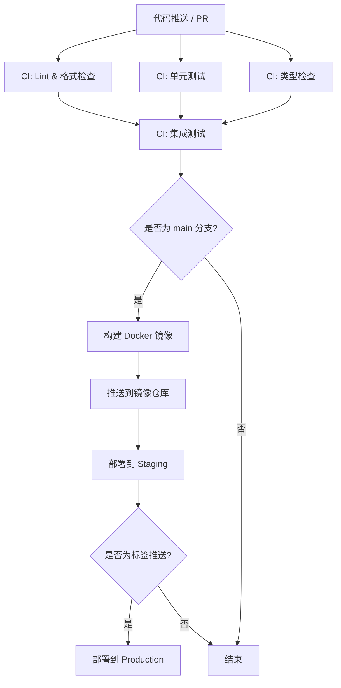

# CI/CD 实战

> 从测试、构建到部署——构建一条端到端的自动化流水线，结合环境、矩阵、缓存与可复用工作流。

## 概述

前三章我们学习了 [GitHub Actions 入门](01-GitHub-Actions-入门.md)、[Workflow 语法详解](02-Workflow-语法详解.md) 和 [常用Action与市场](03-常用Action与市场.md)。本章将把这些知识融会贯通，带你构建一条完整的 CI/CD 流水线——从代码提交到自动部署，覆盖测试、构建、发布和部署的全流程。

CI（Continuous Integration，持续集成）的核心是自动化验证：每次代码变更都自动运行测试、检查代码风格、分析代码质量，确保问题在合并前就被发现。CD（Continuous Delivery / Continuous Deployment，持续交付/部署）则更进一步：将通过验证的代码自动部署到目标环境。GitHub Actions 让你可以在同一个平台内完成从代码提交到生产部署的全部操作。

> [!NOTE]
> CI 和 CD 的区别在于自动化程度。Continuous Delivery 要求每次变更都可以随时部署到生产环境，但部署操作需要手动确认。Continuous Deployment 则是全自动的——代码通过所有检查后直接推送到生产环境，无需人工干预。选择哪种方式取决于团队的风险承受能力和发布策略。

## 核心操作

### 设计流水线架构

在编写 YAML 之前，先设计流水线的整体结构。以下是一个典型的多层流水线：



### 构建完整的 CI 流水线

以下是一个 Node.js 项目的完整 CI 配置：

```yaml
# .github/workflows/ci.yml
name: CI

on:
  push:
    branches: [ main, develop ]
  pull_request:
    branches: [ main ]

concurrency:
  group: ${{ github.workflow }}-${{ github.ref }}
  cancel-in-progress: true

permissions:
  contents: read
  pull-requests: write

env:
  NODE_VERSION: '20'

jobs:
  # 作业 1: 代码质量检查
  lint:
    name: Lint & 格式检查
    runs-on: ubuntu-latest
    steps:
      - uses: actions/checkout@v4
      - uses: actions/setup-node@v4
        with:
          node-version: ${{ env.NODE_VERSION }}
          cache: npm
      - run: npm ci
      - run: npm run lint
      - run: npm run format:check

  # 作业 2: 单元测试（矩阵策略）
  test:
    name: 测试 (Node ${{ matrix.node-version }})
    runs-on: ubuntu-latest
    strategy:
      fail-fast: false
      matrix:
        node-version: [18, 20, 22]
    steps:
      - uses: actions/checkout@v4
      - uses: actions/setup-node@v4
        with:
          node-version: ${{ matrix.node-version }}
          cache: npm
      - run: npm ci
      - run: npm test -- --coverage
      - name: 上传覆盖率报告
        if: matrix.node-version == 20
        uses: actions/upload-artifact@v4
        with:
          name: coverage-report
          path: coverage/

  # 作业 3: 构建验证
  build:
    name: 构建
    needs: [ lint, test ]
    runs-on: ubuntu-latest
    steps:
      - uses: actions/checkout@v4
      - uses: actions/setup-node@v4
        with:
          node-version: ${{ env.NODE_VERSION }}
          cache: npm
      - run: npm ci
      - run: npm run build
      - uses: actions/upload-artifact@v4
        with:
          name: build-output
          path: dist/
          retention-days: 3
```

### 构建 CD 流水线

CD 流水线在 CI 通过后执行构建和部署：

```yaml
# .github/workflows/deploy.yml
name: Deploy

on:
  push:
    branches: [ main ]
    tags: [ 'v*' ]

permissions:
  contents: read
  deployments: write

env:
  REGISTRY: ghcr.io
  IMAGE_NAME: ${{ github.repository }}

jobs:
  # 构建并推送 Docker 镜像
  build-image:
    name: 构建镜像
    runs-on: ubuntu-latest
    outputs:
      image-tag: ${{ steps.meta.outputs.tags }}
    steps:
      - uses: actions/checkout@v4

      - name: 登录 GitHub Container Registry
        uses: docker/login-action@v3
        with:
          registry: ${{ env.REGISTRY }}
          username: ${{ github.actor }}
          password: ${{ secrets.GITHUB_TOKEN }}

      - name: 提取 Docker 元数据
        id: meta
        uses: docker/metadata-action@v5
        with:
          images: ${{ env.REGISTRY }}/${{ env.IMAGE_NAME }}
          tags: |
            type=sha,prefix=
            type=ref,event=branch
            type=semver,pattern={{version}}
            type=semver,pattern={{major}}.{{minor}}

      - name: 构建并推送
        uses: docker/build-push-action@v5
        with:
          context: .
          push: true
          tags: ${{ steps.meta.outputs.tags }}
          labels: ${{ steps.meta.outputs.labels }}
          cache-from: type=gha
          cache-to: type=gha,mode=max

  # 部署到 Staging
  deploy-staging:
    name: 部署到 Staging
    needs: build-image
    runs-on: ubuntu-latest
    environment:
      name: staging
      url: https://staging.example.com
    steps:
      - uses: actions/checkout@v4

      - name: 部署
        run: |
          echo "部署镜像到 Staging 环境"
          echo "镜像标签: ${{ needs.build-image.outputs.image-tag }}"
          # 在此处添加实际的部署命令
          # 例如: kubectl set image deployment/app app=${{ needs.build-image.outputs.image-tag }}

  # 部署到 Production（仅在标签推送时）
  deploy-production:
    name: 部署到 Production
    needs: deploy-staging
    runs-on: ubuntu-latest
    if: startsWith(github.ref, 'refs/tags/v')
    environment:
      name: production
      url: https://example.com
    steps:
      - uses: actions/checkout@v4

      - name: 部署
        run: |
          echo "部署镜像到 Production 环境"
          # 在此处添加实际的部署命令
```

### 配置 Environment（环境）

Environment 提供了部署的保护层——可以设置审批人、等待计时器和环境级密钥：

**在 GitHub 网页端配置：**

1. 进入仓库的 **Settings > Environments**。
2. 点击 **New environment**，输入名称（如 `staging`、`production`）。
3. 配置保护规则：
   - **Required reviewers**：指定必须审批才能部署的人员或团队。
   - **Wait timer**：部署前等待的分钟数。
   - **Deployment branches**：限制哪些分支可以部署到此环境。
4. 添加环境级 Secrets（仅在部署到此环境时可用）。

**在 Workflow 中使用 Environment：**

```yaml
jobs:
  deploy:
    runs-on: ubuntu-latest
    environment:
      name: production
      url: https://example.com
    steps:
      - run: echo "Deploying to ${{ github.environment }}"
      - run: echo "API Key is ${{ secrets.API_KEY }}"
```

> [!WARNING]
> Environment 的审批机制仅在使用 `environment` 关键字时生效。如果你在 Step 中直接引用 `secrets` 而不指定 `environment`，则不会触发审批流程。对于生产部署，务必配置 Required reviewers 并限制 Deployment branches。

### 使用可复用工作流（Reusable Workflow）

当多个项目或多个 Workflow 需要共享相同的逻辑时，可复用工作流是最佳选择：

**定义可复用工作流：**

```yaml
# .github/workflows/_build.yml
name: 构建

on:
  workflow_call:
    inputs:
      node-version:
        required: false
        type: string
        default: '20'
      run-integration-tests:
        required: false
        type: boolean
        default: false
    outputs:
      artifact-name:
        value: build-output
    secrets:
      npm-token:
        required: false

jobs:
  build:
    runs-on: ubuntu-latest
    steps:
      - uses: actions/checkout@v4
      - uses: actions/setup-node@v4
        with:
          node-version: ${{ inputs.node-version }}
          cache: npm
          registry-url: 'https://registry.npmjs.org'

      - run: npm ci
        env:
          NODE_AUTH_TOKEN: ${{ secrets.npm-token }}

      - run: npm run build

      - if: inputs.run-integration-tests == true
        run: npm run test:integration

      - uses: actions/upload-artifact@v4
        with:
          name: build-output
          path: dist/
```

**调用可复用工作流：**

```yaml
# .github/workflows/deploy.yml
name: 部署

on:
  push:
    branches: [ main ]

jobs:
  call-build:
    uses: ./.github/workflows/_build.yml
    with:
      node-version: '20'
      run-integration-tests: true
    secrets:
      npm-token: ${{ secrets.NPM_TOKEN }}

  deploy:
    needs: call-build
    runs-on: ubuntu-latest
    environment: production
    steps:
      - uses: actions/download-artifact@v4
        with:
          name: ${{ needs.call-build.outputs.artifact-name }}
      - run: echo "Deploying..."
```

### 矩阵策略在 CI 中的实际应用

矩阵策略不仅用于多版本测试，还可以用于多平台构建：

```yaml
jobs:
  build:
    strategy:
      matrix:
        include:
          - os: ubuntu-latest
            platform: linux
            arch: x64
          - os: macos-latest
            platform: darwin
            arch: arm64
          - os: windows-latest
            platform: win32
            arch: x64
    runs-on: ${{ matrix.os }}
    steps:
      - uses: actions/checkout@v4
      - uses: actions/setup-node@v4
        with:
          node-version: '20'
          cache: npm
      - run: npm ci
      - run: npm run build -- --platform=${{ matrix.platform }} --arch=${{ matrix.arch }}
      - uses: actions/upload-artifact@v4
        with:
          name: binary-${{ matrix.platform }}-${{ matrix.arch }}
          path: dist/*
```

## 进阶技巧

### 使用 GitHub Actions 部署到云服务

以下示例展示如何部署到常见的云平台：

**部署到 AWS S3（静态网站）：**

```yaml
jobs:
  deploy:
    runs-on: ubuntu-latest
    environment: production
    steps:
      - uses: actions/checkout@v4
      - uses: actions/setup-node@v4
        with:
          node-version: '20'
          cache: npm
      - run: npm ci && npm run build

      - name: 同步到 S3
        run: |
          aws s3 sync dist/ s3://<bucket-name>/ \
            --delete \
            --cache-control "max-age=31536000" \
            --exclude "index.html"
        env:
          AWS_ACCESS_KEY_ID: ${{ secrets.AWS_ACCESS_KEY_ID }}
          AWS_SECRET_ACCESS_KEY: ${{ secrets.AWS_SECRET_ACCESS_KEY }}
          AWS_REGION: ap-northeast-1
```

**部署到 Kubernetes：**

```yaml
jobs:
  deploy:
    runs-on: ubuntu-latest
    environment: production
    steps:
      - uses: actions/checkout@v4

      - name: 配置 kubeconfig
        run: |
          mkdir -p $HOME/.kube
          echo "${{ secrets.KUBE_CONFIG }}" | base64 -d > $HOME/.kube/config

      - name: 部署
        run: |
          kubectl set image deployment/app \
            app=ghcr.io/<owner>/<image>:${{ github.sha }} \
            --namespace production
          kubectl rollout status deployment/app \
            --namespace production \
            --timeout=300s
```

### 自动化发布流程

当推送版本标签时自动创建 Release 并发布构建产物：

```yaml
# .github/workflows/release.yml
name: Release

on:
  push:
    tags: [ 'v*' ]

permissions:
  contents: write

jobs:
  release:
    runs-on: ubuntu-latest
    steps:
      - uses: actions/checkout@v4
        with:
          fetch-depth: 0

      - uses: actions/setup-node@v4
        with:
          node-version: '20'
          cache: npm

      - run: npm ci
      - run: npm run build

      - name: 生成变更日志
        id: changelog
        run: |
          PREVIOUS_TAG=$(git describe --tags --abbrev=0 HEAD^ 2>/dev/null || echo "")
          if [ -n "$PREVIOUS_TAG" ]; then
            LOG=$(git log ${PREVIOUS_TAG}..HEAD --pretty=format:"- %s (%h)" --no-merges)
          else
            LOG=$(git log --pretty=format:"- %s (%h)" --no-merges -20)
          fi
          echo "changelog<<EOF" >> $GITHUB_OUTPUT
          echo "$LOG" >> $GITHUB_OUTPUT
          echo "EOF" >> $GITHUB_OUTPUT

      - name: 创建 GitHub Release
        uses: softprops/action-gh-release@v2
        with:
          files: dist/**
          body: |
            ## 变更日志

            ${{ steps.changelog.outputs.changelog }}

            ## 安装

            ```bash
            npm install <package>@${{ github.ref_name }}
            ```
        env:
          GITHUB_TOKEN: ${{ secrets.GITHUB_TOKEN }}
```

### 缓存优化 CI 性能

合理的缓存策略可以将 CI 时间缩短 50% 以上：

```yaml
jobs:
  build:
    runs-on: ubuntu-latest
    steps:
      - uses: actions/checkout@v4

      # 缓存 npm 依赖
      - uses: actions/cache@v4
        id: npm-cache
        with:
          path: ~/.npm
          key: npm-${{ runner.os }}-${{ hashFiles('package-lock.json') }}

      # 缓存构建产物
      - uses: actions/cache@v4
        with:
          path: |
            .cache
            dist
          key: build-${{ runner.os }}-${{ hashFiles('src/**', 'package-lock.json') }}
          restore-keys: |
            build-${{ runner.os }}-

      - uses: actions/setup-node@v4
        with:
          node-version: '20'

      - run: npm ci
      - run: npm run build

      - name: 输出缓存命中信息
        if: steps.npm-cache.outputs.cache-hit == 'true'
        run: echo "npm 缓存命中，跳过部分安装步骤"
```

> [!TIP]
> 使用 `id` 和 `outputs.cache-hit` 判断缓存是否命中，可以跳过不必要的步骤。例如缓存命中时可以只运行 `npm ci`（验证完整性）而不是完全重新安装。

## 常见问题

### Q: CI 和 CD 应该放在同一个 Workflow 还是分开？

视项目规模而定。小型项目可以放在一个 Workflow 中，通过 `if` 条件区分 CI 和 CD 阶段。中大型项目建议分开：CI Workflow 处理测试和检查，CD Workflow 处理构建和部署。这样 CI 可以更快完成反馈，CD 可以独立触发和管理。

### Q: 如何处理部署失败时的回滚？

建议在部署步骤中实现回滚逻辑。对于 Kubernetes，可以使用 `kubectl rollout undo` 回滚到上一版本。对于 Docker，可以记录上一次成功的镜像标签，失败时重新部署该版本。更安全的做法是使用蓝绿部署或金丝雀发布策略。

### Q: Environment 的审批人可以设为团队吗？

可以。在 Organization 仓库中，Environment 的 Required reviewers 支持设置为个人用户或 Team。团队中任何一人审批即可通过。注意，免费版仓库最多支持 1 个审批人。

### Q: 如何在 PR 中显示 CI 状态？

GitHub 会自动在 PR 页面底部显示所有 Check 的状态。你只需要确保 Workflow 在 `on: pull_request` 事件上触发即可。如果需要在 PR 中添加评论，可以使用 `actions/github-script` 结合 [常用Action与市场](03-常用Action与市场.md) 中介绍的方法。

### Q: 如何控制部署的并发？

使用 `concurrency` 关键字，以环境名作为分组：

```yaml
concurrency:
  group: deploy-${{ github.environment }}
  cancel-in-progress: false
```

设置 `cancel-in-progress: false` 可以让新的部署排队等待而不是取消正在运行的部署，避免中断线上服务。

### Q: 如何实现多环境按顺序部署？

使用 `needs` 和 `environment` 的组合。例如 Staging 部署完成后自动触发 Production 部署，但 Production 环境设置了 Required reviewers，需要人工审批后才会继续。

### Q: 可复用工作流可以调用其他可复用工作流吗？

可以，但最多支持 4 层嵌套。可复用工作流不能调用自身（递归）。如果逻辑过于复杂，建议使用 [自定义 Action 开发](05-自定义Action开发.md) 中的 Composite Action 来封装。

### Q: 如何在 CD 流水线中使用 OIDC 认证？

OIDC（OpenID Connect）允许 GitHub Actions 在不存储长期密钥的情况下访问云服务。详细配置参见 [安全与密钥管理](06-安全与密钥管理.md) 中的 OIDC 配置章节。

## 参考链接

| 标题 | 说明 |
|------|------|
| [Reuse workflows](https://docs.github.com/en/actions/how-tos/reuse-automations/reuse-workflows) | 可复用工作流完整文档 |
| [Using environments for deployment](https://docs.github.com/en/actions/deployment/targeting-different-environments/using-environments-for-deployment) | 环境配置与保护规则 |
| [GitHub Actions Matrix Strategy](https://codefresh.io/learn/github-actions/github-actions-matrix/) | 矩阵策略详解 |
| [Caching in GitHub Actions](https://lalits77.medium.com/caching-in-github-actions-speed-up-your-workflows-the-right-way-675c599da09d) | 缓存优化实践 |
| [Creating Your First CI/CD Pipeline](https://brandonkindred.medium.com/creating-your-first-ci-cd-pipeline-using-github-actions-81c668008582) | CI/CD 入门实战教程 |
