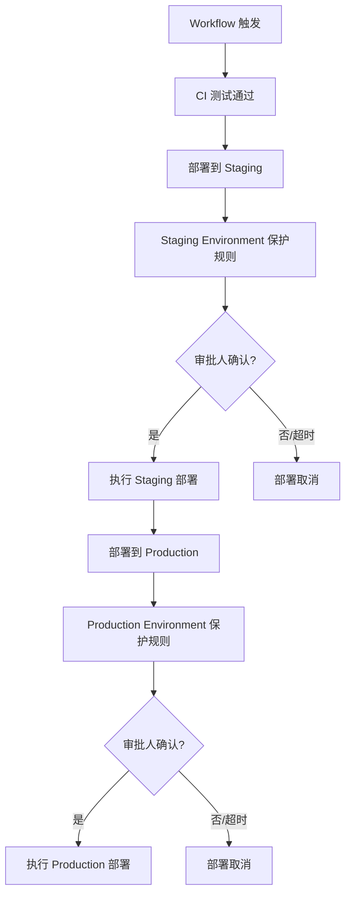
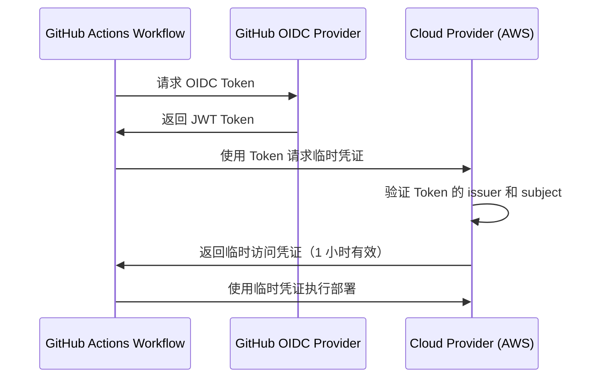

# 安全与密钥管理

> 保护你的自动化流水线——Secrets 管理、环境密钥、OIDC 无密认证与 Actions 安全加固。

## 概述

GitHub Actions 的 Workflow 经常需要访问敏感资源：API 密钥、数据库凭证、云服务证书、部署 Token 等。如果这些凭证管理不当，可能导致数据泄露、供应链攻击甚至生产环境被入侵。安全不仅是"不要把密码写在代码里"，更是一套涵盖凭证存储、访问控制、审计日志和运行时防护的完整体系。

本章将深入探讨 GitHub Actions 中的安全管理机制，包括 Secrets 的层级与生命周期、Environment 级密钥与保护规则、OIDC（OpenID Connect）无密认证以及安全加固的最佳实践。这些内容与 [CI/CD 实战](04-CI-CD实战) 中的部署流程和 [自定义 Action 开发](05-自定义Action开发) 中的 Action 编写密切相关。

> [!WARNING]
> Secrets 一旦写入就无法再读取其值，只能更新或删除。这是 GitHub 的安全设计——即使仓库管理员也无法查看其他人员设置的 Secret 明文。因此，在创建 Secret 之前请确保你已妥善保存了原始凭证的备份。

## 核心操作

### Secrets 管理层级

GitHub Actions 提供了四个层级的 Secrets 管理：

| 层级 | 创建位置 | 可用范围 | 适用场景 |
|------|----------|----------|----------|
| Repository | 仓库 Settings | 该仓库的所有 Workflow | 项目级凭证 |
| Environment | 仓库 Settings > Environments | 指定环境的部署 Job | 生产部署凭证 |
| Organization | 组织 Settings | 组织内所有仓库 | 共享凭证（如 npm Token） |
| GitHub Actions 默认 | 自动生成 | 所有 Workflow | `GITHUB_TOKEN` |

### 创建和管理 Repository Secrets

**通过浏览器创建：**

1. 进入仓库的 **Settings > Secrets and variables > Actions**。
2. 点击 **New repository secret**。
3. 输入名称（如 `NPM_TOKEN`）和值。
4. 点击 **Add secret**。

**通过 GitHub CLI 管理：**

```bash
# 设置 Repository Secret（值从 stdin 读取）
echo "my-secret-value" | gh secret set NPM_TOKEN

# 从环境变量设置
gh secret set NPM_TOKEN --body "$NPM_TOKEN"

# 从文件读取
gh secret set SSH_KEY < ~/.ssh/id_rsa

# 列出所有 Secrets（只显示名称，不显示值）
gh secret list

# 删除 Secret
gh secret delete NPM_TOKEN
```

**在 Workflow 中使用 Secrets：**

```yaml
jobs:
  publish:
    runs-on: ubuntu-latest
    steps:
      - uses: actions/checkout@v4
      - uses: actions/setup-node@v4
        with:
          node-version: '20'
          registry-url: 'https://registry.npmjs.org'

      - run: npm publish
        env:
          NODE_AUTH_TOKEN: ${{ secrets.NPM_TOKEN }}
```

> [!NOTE]
> `secrets` 上下文在 Workflow 的 `env` 块和 `run` 块中可用，但不能直接在 `if` 条件中使用（因为条件求值阶段日志可能泄露比较结果）。如果需要基于 Secret 做判断，建议在 Step 内部使用环境变量比较。

### 创建和管理 Variables

与 Secrets 不同，Variables 用于存储非敏感的配置信息，值是可见的：

```bash
# 设置 Repository Variable
gh variable set DEPLOY_REGION --body "ap-northeast-1"

# 列出所有 Variables
gh variable list

# 删除 Variable
gh variable delete DEPLOY_REGION
```

```yaml
jobs:
  deploy:
    runs-on: ubuntu-latest
    steps:
      - run: echo "部署到 ${{ vars.DEPLOY_REGION }} 区域"
```

**Secrets 与 Variables 的区别：**

| 特性 | Secrets | Variables |
|------|---------|-----------|
| 值可见性 | 加密存储，不可读取 | 明文存储，可读取 |
| 日志脱敏 | 自动脱敏（显示为 `***`） | 不脱敏 |
| 适用内容 | API 密钥、Token、证书 | 区域名、版本号、URL |
| 最大大小 | 48 KB | 48 KB |

### GITHUB_TOKEN 自动令牌

每个 Workflow 运行都会自动生成一个 `GITHUB_TOKEN`，用于认证 GitHub API 请求：

```yaml
jobs:
  build:
    runs-on: ubuntu-latest
    permissions:
      contents: read
      pull-requests: write
    steps:
      - uses: actions/github-script@v7
        with:
          script: |
            // GITHUB_TOKEN 自动可用
            await github.rest.issues.createComment({
              owner: context.repo.owner,
              repo: context.repo.repo,
              issue_number: context.issue.number,
              body: 'CI 检查通过！'
            });
```

`GITHUB_TOKEN` 的权限范围由 Workflow 的 `permissions` 关键字控制。默认权限取决于仓库设置（**Settings > Actions > General > Workflow permissions**），建议设置为 **Read repository contents permission** 并按需提权。

### Environment 级密钥与保护规则

Environment 提供了更精细的密钥隔离和部署保护：

**创建 Environment Secret：**

1. 进入仓库的 **Settings > Environments**。
2. 选择或创建一个环境（如 `production`）。
3. 在 **Environment secrets** 区域点击 **Add environment secret**。
4. 输入名称和值。

**Environment 保护规则配置：**

```yaml
jobs:
  deploy:
    runs-on: ubuntu-latest
    environment:
      name: production
      url: https://example.com
    steps:
      - run: |
          echo "部署到生产环境"
          echo "使用数据库密码: ${{ secrets.DB_PASSWORD }}"
```

Environment 支持的保护规则：

| 规则 | 说明 |
|------|------|
| Required reviewers | 部署前需要指定人员审批 |
| Wait timer | 部署前等待指定分钟数 |
| Deployment branches | 限制可部署的分支（支持通配符） |
| Environment secrets | 仅在该环境中可用的密钥 |



### OIDC 无密认证

OIDC（OpenID Connect）是 GitHub Actions 推荐的云服务认证方式。它通过短期令牌替代长期密钥，从根本上消除了凭证泄露的风险：

**原理：**



**配置 AWS OIDC 认证：**

```yaml
jobs:
  deploy:
    runs-on: ubuntu-latest
    permissions:
      id-token: write      # 必需，允许请求 OIDC Token
      contents: read
    steps:
      - uses: actions/checkout@v4

      - name: 配置 AWS 凭证（OIDC）
        uses: aws-actions/configure-aws-credentials@v4
        with:
          role-to-assume: arn:aws:iam::<account-id>:role/github-actions
          aws-region: ap-northeast-1

      - name: 部署到 S3
        run: aws s3 sync dist/ s3://<bucket-name>/
```

AWS 端的 IAM Role 配置：

```json
{
  "Version": "2012-10-17",
  "Statement": [
    {
      "Effect": "Allow",
      "Principal": {
        "Federated": "arn:aws:iam::<account-id>:oidc-provider/token.actions.githubusercontent.com"
      },
      "Action": "sts:AssumeRoleWithWebIdentity",
      "Condition": {
        "StringEquals": {
          "token.actions.githubusercontent.com:aud": "sts.amazonaws.com"
        },
        "StringLike": {
          "token.actions.githubusercontent.com:sub": "repo:<owner>/<repo>:ref:refs/heads/main"
        }
      }
    }
  ]
}
```

**配置 GCP OIDC 认证：**

```yaml
jobs:
  deploy:
    runs-on: ubuntu-latest
    permissions:
      id-token: write
      contents: read
    steps:
      - uses: actions/checkout@v4

      - name: 认证 GCP
        uses: google-github-actions/auth@v2
        with:
          workload_identity_provider: projects/<project-id>/locations/global/workloadIdentityPools/<pool>/providers/<provider>
          service_account: github-actions@<project-id>.iam.gserviceaccount.com

      - name: 部署到 Cloud Run
        uses: google-github-actions/deploy-cloudrun@v2
        with:
          service: my-app
          region: asia-east1
```

> [!TIP]
> OIDC 认证的 `subject` 条件可以精确控制哪些仓库、分支和 Workflow 可以获取临时凭证。建议在云服务端的信任策略中使用最小范围的条件，例如只允许 `main` 分支的 Workflow 获取生产环境的凭证。

## 进阶技巧

### 使用 Harden Runner 加固运行环境

[step-security/harden-runner](https://github.com/step-security/harden-runner) 是一个广泛使用的安全加固 Action，它会在 Job 开始时安装一个网络代理，监控并阻止异常的网络请求：

```yaml
jobs:
  build:
    runs-on: ubuntu-latest
    steps:
      - name: 加固 Runner 环境
        uses: step-security/harden-runner@v2
        with:
          egress-policy: audit    # audit 模式：只记录不阻止
          # block 模式：只允许白名单的出站连接
          # allowed-endpoints: >
          #   github.com:443
          #   registry.npmjs.org:443
          #   api.github.com:443

      - uses: actions/checkout@v4
      - run: npm ci && npm test
```

`audit` 模式推荐在初始阶段使用，它可以帮你了解 Workflow 需要哪些网络请求，之后切换到 `block` 模式限制为只允许必要的连接。

### 防止 Secret 泄露的最佳实践

```yaml
jobs:
  secure-deploy:
    runs-on: ubuntu-latest
    steps:
      # 1. 最小权限原则——只授予必要的权限
      - uses: actions/checkout@v4

      # 2. 在 run 块中通过环境变量引用 Secret
      - name: 部署
        env:
          API_KEY: ${{ secrets.API_KEY }}
        run: |
          # 正确：通过环境变量使用
          curl -H "Authorization: Bearer $API_KEY" https://api.example.com/deploy

          # 错误：直接在命令中引用（日志会显示为 ***）
          # curl -H "Authorization: Bearer ${{ secrets.API_KEY }}" ...

      # 3. 使用 GitHub CLI 处理 GitHub API 请求
      - name: 创建 Release
        env:
          GH_TOKEN: ${{ secrets.GITHUB_TOKEN }}
        run: gh release create v1.0.0 --title "v1.0.0"

      # 4. 清理敏感环境变量
      - name: 清理
        if: always()
        run: unset API_KEY
```

### 审计 Secret 使用记录

GitHub 提供 Secret 的审计日志，帮助你追踪凭证的使用情况：

1. 进入仓库的 **Settings > Secrets and variables > Actions**。
2. 每个 Secret 右侧显示最后更新时间和更新者。
3. 在 **Security > Audit log** 中可以查看所有与 Secret 相关的操作记录。

对于 Organization 级别的审计，进入 **Organization > Settings > Audit log**，筛选 `actions.secret` 相关事件。

### 使用 pull_request_target 处理 Fork PR

`pull_request_target` 事件允许 Workflow 访问仓库的 Secrets，即使 PR 来自 Fork：

```yaml
# 注意：pull_request_target 有安全风险，必须谨慎使用
on:
  pull_request_target:
    branches: [ main ]

jobs:
  test:
    runs-on: ubuntu-latest
    steps:
      # 只检出 PR 的代码，但不执行其中可能包含的恶意命令
      - uses: actions/checkout@v4
        with:
          ref: ${{ github.event.pull_request.head.sha }}

      # 只执行只读操作
      - run: npm ci && npm run lint
```

> [!WARNING]
> `pull_request_target` 与 `pull_request` 的关键区别在于：`pull_request_target` 在基础仓库的上下文中运行，可以访问 Secrets。这意味着 Fork 仓库的代码可能包含恶意内容。在使用 `pull_request_target` 时，绝对不要在 `run` 步骤中执行来自 Fork 的代码或脚本，也不要将 Secrets 暴露给 Fork 的代码。

### 管理密钥轮换

定期轮换密钥是安全运维的基本要求：

```yaml
# .github/workflows/rotate-keys.yml
name: 密钥轮换提醒
on:
  schedule:
    - cron: '0 0 1 */3 *'  # 每季度提醒一次

jobs:
  check:
    runs-on: ubuntu-latest
    steps:
      - uses: actions/github-script@v7
        with:
          script: |
            const secrets = [
              'AWS_ACCESS_KEY_ID',
              'NPM_TOKEN',
              'DOCKERHUB_TOKEN'
            ];

            const body = `## 密钥轮换提醒\n\n以下密钥已存在超过 90 天，建议尽快轮换：\n\n${
              secrets.map(s => `- \`${s}\``).join('\n')
            }\n\n轮换步骤：\n1. 在服务端生成新密钥\n2. 更新 GitHub Secret\n3. 验证新密钥生效\n4. 禁用旧密钥`;

            await github.rest.issues.create({
              owner: context.repo.owner,
              repo: context.repo.repo,
              title: '定期密钥轮换提醒',
              body: body,
              labels: ['security', 'maintenance']
            });
```

## 常见问题

### Q: Secret 的值能在日志中看到吗？

不能。GitHub 会自动将已知的 Secret 值在日志中替换为 `***`。但有一种例外：如果通过字符串拼接或子串操作改变了 Secret 的格式，可能绕过脱敏。因此建议始终通过环境变量引用 Secret，不要对其进行字符串操作。

### Q: Secrets 能在 Fork 的 PR 中使用吗？

默认情况下，来自 Fork 仓库的 PR 无法访问基础仓库的 Secrets。`pull_request` 事件触发的 Workflow 对 Fork 的代码运行在一个隔离环境中，`secrets` 上下文是空的。只有使用 `pull_request_target` 事件时才能访问 Secrets，但这带来了安全风险。

### Q: 一个 Secret 最大可以多大？

单个 Secret 的值最大为 48 KB。如果需要存储更大的凭证（如证书文件），可以对其进行 Base64 编码后存储，或者使用 Environment 的 Secrets 分段存储。

### Q: 如何检测 Secret 是否已经泄露？

1. 在 **Security > Audit log** 中查看异常的 Secret 使用记录。
2. 使用 `truffleHog` 或 `git-secrets` 等工具扫描仓库历史中的凭证泄露。
3. 启用 GitHub 的 Secret Scanning 功能（公开仓库默认启用，私有仓库需在 Settings 中开启）。
4. 一旦确认泄露，立即在服务端撤销凭证并更新 GitHub Secret。

### Q: OIDC 和传统 Secrets 方式可以共存吗？

可以。你可以逐步从 Secrets 迁移到 OIDC，两种认证方式在同一个 Workflow 中可以并存。建议优先为新项目使用 OIDC，旧项目按计划迁移。

### Q: 如何为 Organization 设置统一的 Secrets？

Organization 管理员可以在 **Organization > Settings > Secrets and variables > Actions** 中创建 Organization 级 Secret。在创建时可以选择 **Repository access**——指定哪些仓库可以使用该 Secret，或者设为所有仓库可用。

### Q: `permissions` 设置和 Secret 安全有什么关系？

`permissions` 控制 `GITHUB_TOKEN` 的权限范围，间接影响安全。即使你的自定义 Token 存储在 Secrets 中，`GITHUB_TOKEN` 如果权限过大也可能被恶意 Step 利用。建议在每个 Workflow 中显式设置最小权限。

### Q: 如何在 Container 中使用 Secrets？

在 Docker 容器中使用 Secrets 需要通过环境变量或构建参数传入。注意不要将 Secrets 作为构建参数传入 Dockerfile——构建参数可能被缓存在镜像层中。推荐的做法是在容器启动时通过环境变量注入：

```yaml
steps:
  - name: 运行容器
    run: |
      docker run -e API_KEY=${{ secrets.API_KEY }} \
        my-app:latest
```

## 参考链接

| 标题 | 说明 |
|------|------|
| [Using secrets in GitHub Actions](https://docs.github.com/en/actions/security-guides/using-secrets-in-github-actions) | Secrets 创建与使用完整文档 |
| [Security for GitHub Actions](https://docs.github.com/en/actions/security-guides) | Actions 安全指南总入口 |
| [Secure use reference](https://docs.github.com/en/actions/reference/security/secure-use) | 安全使用参考手册 |
| [GitHub Actions Security Best Practices](https://engineering.salesforce.com/github-actions-security-best-practices-b8f9df5c75f5/) | Salesforce 工程团队的安全实践 |
| [Hardening GitHub Actions](https://www.wiz.io/blog/github-actions-security-guide) | Wiz 博客的安全加固指南 |
| [step-security/harden-runner](https://github.com/step-security/harden-runner) | Runner 安全加固 Action |
| [Configuring OpenID Connect](https://docs.github.com/en/actions/deployment/security-hardening-your-deployments/configuring-openid-connect-in-cloud-providers) | OIDC 云服务配置指南 |
