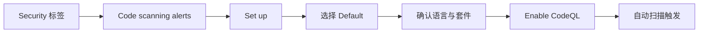

# 代码扫描与 CodeQL

> 用静态分析在漏洞进入生产环境之前把它捕获——CodeQL 是 GitHub 原生的代码安全引擎。

## 概述

Code Scanning 是 GitHub 提供的静态应用安全测试（SAST）能力，
它能在每次 Push 或 Pull Request 时自动扫描你的代码，
发现潜在的安全漏洞和编码错误。GitHub 原生的扫描引擎是 CodeQL——一种由语义驱动的查询语言，
支持 C/C++、C#、Go、Java、JavaScript/TypeScript、Python、Ruby、Swift 等主流语言。

Code Scanning 提供两种配置模式：Default Setup 和 Advanced Setup。
Default Setup 只需几次点击即可启用，适合大多数项目；
Advanced Setup 允许你自定义查询套件、扫描频率和工作流触发条件，满足更精细的安全策略需求。

> [!NOTE]
> Code Scanning 对公开仓库免费开放。私有仓库需要 GitHub Advanced Security（GHAS）许可，
> 该许可包含在 GitHub Enterprise Cloud 和 GitHub Enterprise Server 中。
> 个人开发者可以将公开仓库的安全特性作为学习和实践的基础。

除了 CodeQL，你还可以集成第三方扫描工具（如 SonarCloud、Semgrep、Bandit 等），
通过 GitHub Actions 将扫描结果统一汇总到 Repository 的 Security 标签页，
实现一站式的安全态势管理。

## 核心操作

### 启用 Default Setup

Default Setup 是最快速的启用方式，GitHub 会自动检测项目语言并使用推荐的查询套件。

1. 进入 Repository 页面，点击 **Security** 标签。
2. 在 **Code scanning alerts** 区域点击 **Set up**。
3. 选择 **Default** 配置模式。
4. 确认 GitHub 检测到的语言列表，按需调整。
5. 选择查询套件（推荐 `Default`，如需更严格可选 `Extended`）。
6. 点击 **Enable CodeQL** 完成配置。



> [!TIP]
> Default Setup 会在每次 Push 到默认分支和每次 Pull Request 时自动触发扫描。
> 如果项目较大，建议在非高峰时段手动触发首次扫描，避免影响 CI 资源配额。

### 配置 Advanced Setup

当你需要自定义查询、调整扫描计划或与其他 Actions 工作流集成时，使用 Advanced Setup。

1. 在 **Code scanning alerts** 区域点击 **Set up**，选择 **Advanced**。
2. GitHub 会在 `.github/workflows/` 目录下生成一个 CodeQL 工作流文件。
3. 根据项目需求修改工作流配置：

```yaml
name: "CodeQL Advanced"

on:
  push:
    branches: ["main"]
  pull_request:
    branches: ["main"]
  schedule:
    - cron: "0 2 * * 1"  # 每周一凌晨 2 点扫描

jobs:
  analyze:
    runs-on: ubuntu-latest
    permissions:
      security-events: write
      actions: read
      contents: read

    strategy:
      fail-fast: false
      matrix:
        language: ["javascript", "python"]

    steps:
      - name: Checkout repository
        uses: actions/checkout@v4

      - name: Initialize CodeQL
        uses: github/codeql-action/init@v3
        with:
          languages: ${{ matrix.language }}
          queries: security-extended,security-and-quality

      - name: Autobuild
        uses: github/codeql-action/autobuild@v3

      - name: Perform CodeQL Analysis
        uses: github/codeql-action/analyze@v3
        with:
          category: "/language:${{ matrix.language }}"
```

4. 提交工作流文件，扫描将按配置自动触发。

> [!WARNING]
> 对于需要编译的语言（如 C/C++、Java、Go），CodeQL 需要在分析前完成编译。
> 如果 `autobuild` 无法正确构建你的项目，需要手动添加构建步骤，否则扫描结果将不完整。

### 查看和处理扫描告警

1. 进入 Repository 的 **Security > Code scanning alerts**。
2. 告警列表按严重程度（Critical、High、Medium、Low）排序。
3. 点击单条告警查看详情：
   - **问题描述**——漏洞类型、严重程度、CVE 关联。
   - **代码路径**——从数据源到漏洞点的完整数据流。
   - **修复建议**——具体的代码修改指引。
4. 处理告警的选项：
   - **修复代码**——按建议修改代码后推送，告警自动关闭。
   - **Dismiss**——标记为误报或可接受风险，需填写关闭理由。
   - **创建 Issue**——将告警转化为 Issue 跟踪处理进度。

### 集成第三方扫描工具

Code Scanning 支持 SARIF（Static Analysis Results Interchange Format）格式的结果导入。
任何能输出 SARIF 的工具都可以接入。

```yaml
- name: Run Semgrep
  uses: returntocorp/semgrep-action@v1
  with:
    config: >-
      p/security-audit
      p/secrets
      p/owasp-top-ten

- name: Upload SARIF results
  uses: github/codeql-action/upload-sarif@v3
  if: always()
  with:
    sarif_file: semgrep.sarif
```

常见的第三方工具包括：

| 工具 | 语言 | 特点 |
|------|------|------|
| Semgrep | 多语言 | 轻量、自定义规则丰富 |
| SonarCloud | 多语言 | 代码质量与安全并重 |
| Bandit | Python | Python 安全专项检查 |
| Brakeman | Ruby | Rails 安全扫描 |
| CodeClimate | 多语言 | 可维护性分析 |

## 进阶技巧

### 自定义 CodeQL 查询

CodeQL 允许你编写自定义查询来检测项目特有的安全问题。
查询使用 CodeQL 语言（基于 Datalog）编写。

1. 创建自定义查询文件（`.ql` 后缀）：

```ql
/**
 * @name 检测不安全的正则表达式
 * @description 查找可能引发 ReDoS 攻击的正则表达式
 * @kind path-problem
 * @problem.severity error
 * @security-severity 7.5
 * @id js/unsafe-regex
 */

import javascript

from RegExpLiteral regex
where regex.isVulnerable()
select regex, "不安全的正则表达式，可能导致 ReDoS 攻击"
```

2. 创建查询套件文件（`.qls` 后缀）引用自定义查询：

```yaml
- query::
    name: "检测不安全的正则表达式"
```

3. 在工作流中引用自定义查询：

```yaml
- name: Initialize CodeQL
  uses: github/codeql-action/init@v3
  with:
    queries: ./custom-queries/
```

### 配置扫描排除路径

大型项目中，某些目录（如第三方库、生成代码）不需要扫描。通过配置文件排除它们：

```yaml
# .github/codeql/codeql-config.yml
name: "Custom CodeQL Configuration"
paths-ignore:
  - "node_modules"
  - "vendor"
  - "**/generated/**"
  - "**/*.min.js"
queries:
  - uses: security-and-quality
```

在工作流中引用此配置：

```yaml
- name: Initialize CodeQL
  uses: github/codeql-action/init@v3
  with:
    config-file: ./.github/codeql/codeql-config.yml
```

> [!NOTE]
> 排除路径只能减少扫描时间和噪声告警，但不能完全替代依赖项的安全检查。
> 对于第三方依赖的漏洞，应使用 [Dependabot](02-依赖审查与Dependabot.md) 进行管理。

### 在 Pull Request 中展示扫描结果

CodeQL 支持在 Pull Request 的 Checks 区域和 diff 视图中直接展示新引入的安全问题。
这需要确保工作流的 `pull_request` 触发器已配置，
并且在仓库 Settings 中开启了 **"Use code scanning in pull requests"** 选项。

团队可以设置"扫描未通过则阻止合并"的规则，
将安全检查嵌入到 [分支保护](04-分支保护与规则集.md) 策略中，
确保每一行代码在合并前都经过安全审查。

### 使用 CodeQL 数据库进行本地分析

除了在 CI 中运行，你还可以在本地下载和分析 CodeQL 数据库，方便离线调试：

```bash
# 下载 CodeQL CLI
# 访问 https://github.com/github/codeql-cli-binaries/releases

# 创建数据库
codeql database create ./codeql-db --language=javascript --source-root=./src

# 运行标准查询
codeql database analyze ./codeql-db \
  javascript-security-extended \
  --format=sarif-latest \
  --output=results.sarif

# 在 VS Code 的 CodeQL 扩展中打开数据库进行交互式分析
```

## 常见问题

### Q: CodeQL 扫描消耗多少 Actions 分钟？

扫描耗时取决于代码库大小和语言数量。
一个中等规模的单语言项目，单次扫描通常需要 5-15 分钟。
多语言项目使用矩阵策略并行扫描时，总分钟数会乘以语言数量。
建议使用 `schedule` 触发器做定期全量扫描，而 PR 只做增量扫描。

### Q: Default Setup 和 Advanced Setup 可以切换吗？

可以。从 Default 切换到 Advanced 时，GitHub 会基于当前配置生成工作流文件，
你可以在其基础上进一步定制。
从 Advanced 切换回 Default 时，需要先删除 `.github/workflows/` 中的 CodeQL 工作流文件，
然后在 Security 标签页重新选择 Default Setup。

### Q: 如何减少误报？

三种策略：1）在告警详情中点击 **Dismiss** 并注明理由，同类问题将被学习；
2）使用自定义配置文件排除不需要扫描的路径；3）编写 `codeql-config.yml`，
在 `queries` 中选择更精准的查询套件。注意不要过度排除，否则可能遗漏真正的安全问题。

### Q: CodeQL 支持哪些语言？

目前支持 C/C++、C#、Go、Java/Kotlin、JavaScript/TypeScript、Python、Ruby、Swift。
对于未直接支持的语言（如 Rust、PHP），可以通过 SARIF 上传功能集成第三方扫描工具的结果。

### Q: 扫描告警可以自动创建 Issue 吗？

可以。在告警详情页中点击 **Create issue** 按钮，告警信息会自动填充到 Issue 模板中。
如果需要批量创建，可以通过 GitHub Actions 工作流调用 GitHub API 自动将高危告警转化为 Issue。
也可以结合 [Actions 入门](../03-自动化与CI-CD/01-GitHub-Actions-入门.md) 的知识编写自动化脚本。

### Q: 如何查看组织级别的安全态势？

如果你拥有 Organization 管理权限，
可以在 **Organization > Security > Code security** 页面查看所有仓库的安全配置状态。
GitHub Enterprise Cloud 还提供 Security Overview 仪表板，
集中展示整个组织的扫描结果、告警趋势和合规指标。

### Q: CodeQL 分析编译型语言时构建失败怎么办？

`autobuild` 对常见构建系统（Maven、Gradle、npm、pip 等）有良好的支持，
但对于自定义构建流程可能失败。
此时需要在工作流中手动添加构建步骤，替代 `autobuild`。
确保构建命令在 CI 环境中能正确编译整个项目，CodeQL 才能捕获完整的数据流。

### Q: 如何为 monorepo 配置 CodeQL？

Monorepo 中的多个项目可以共用一个 CodeQL 工作流。通过 `paths` 过滤器只在相关路径变更时触发扫描，
使用 `matrix.language` 并行分析不同语言，并通过 `config-file` 分别排除各子项目不需要的路径。
确保每个子项目的构建步骤都在工作流中正确配置。

## 参考链接

| 标题 | 说明 |
|------|------|
| [About code scanning with CodeQL](https://docs.github.com/en/code-security/code-scanning/introduction-to-code-scanning/about-code-scanning-with-codeql) | CodeQL 扫描原理与架构介绍 |
| [CodeQL 官方文档](https://codeql.github.com/docs/) | CodeQL 语言参考与查询编写指南 |
| [github/codeql](https://github.com/github/codeql) | CodeQL 引擎与标准查询库开源仓库 |
| [github/codeql-action](https://github.com/github/codeql-action) | CodeQL GitHub Action 使用文档 |
| [Configuring default setup](https://docs.github.com/en/code-security/code-scanning/enabling-code-scanning/configuring-default-setup-for-code-scanning) | Default Setup 配置步骤 |
| [Configuring advanced setup](https://docs.github.com/en/code-security/how-tos/find-and-fix-code-vulnerabilities/configure-code-scanning/configuring-advanced-setup-for-code-scanning) | Advanced Setup 工作流配置 |
| [How to setup CodeQL（视频）](https://www.youtube.com/watch?v=syNCq7h-CNA) | CodeQL 实操演示视频教程 |
