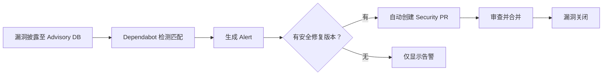
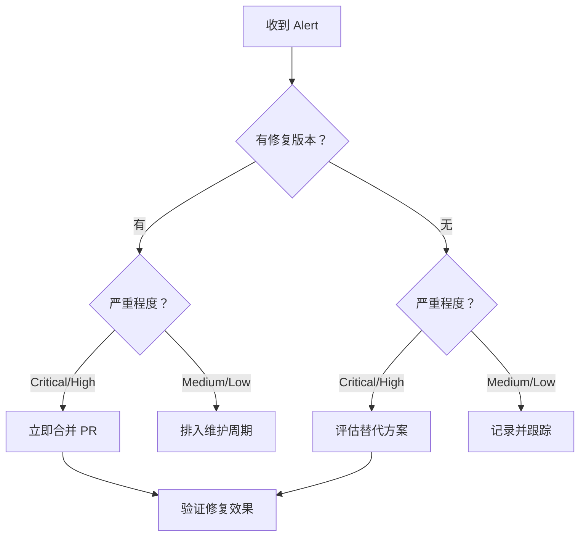

# 依赖审查与 Dependabot

> 自动守护你的依赖供应链——从漏洞告警到版本更新，Dependabot 让依赖管理从被动变为主动。

## 概述

现代软件项目中，超过 70% 的代码来自第三方依赖。这些依赖带来了效率，也引入了供应链风险：
一个依赖包中的已知漏洞可能直接影响你的项目安全。Dependabot 是 GitHub 提供的依赖管理工具，
它持续监控你的依赖项，在有已知漏洞时发出告警，并自动创建更新 Pull Request 帮助你修复。

Dependabot 提供三个核心能力：**Dependabot Alerts**——当你的依赖存在已知漏洞时发出告警；
**Dependabot Security Updates**——自动为漏洞依赖创建修复 Pull Request；
**Dependabot Version Updates**——按计划自动将依赖更新到最新版本。
三者协同工作，构成完整的依赖安全防线。

> [!NOTE]
> Dependabot Alerts 对所有公开仓库免费开放，私有仓库同样可用。
> Dependabot Security Updates 需要仓库开启 Dependency Graph。
> GitHub 的漏洞数据来自 [Advisory Database](https://github.com/advisories)，
> 涵盖 npm、Maven、PyPI、RubyGems、NuGet、Composer、Go modules 等主流包管理器的已知漏洞。

除了自动更新，GitHub 还提供 **Dependency Review** 功能——在 Pull Request 中展示依赖变更的安全影响，
让你在合并前就能判断新增依赖是否引入了已知漏洞或不受信任的包。

## 核心操作

### 启用 Dependency Graph

Dependency Graph 是 Dependabot 的数据基础，它解析你的依赖清单文件并构建依赖关系图。

1. 进入 Repository 的 **Settings > Code security**。
2. 在 **Dependency graph** 区域点击 **Enable**。
3. GitHub 会自动识别并解析以下文件：
   - `package.json` / `package-lock.json`（npm）
   - `requirements.txt` / `Pipfile.lock`（Python）
   - `pom.xml` / `build.gradle`（Java）
   - `Gemfile` / `Gemfile.lock`（Ruby）
   - `go.mod` / `go.sum`（Go）
   - `*.csproj` / `packages.lock.json`（.NET）
   - `composer.json` / `composer.lock`（PHP）

> [!TIP]
> 始终提交锁文件（`package-lock.json`、`yarn.lock`、`Gemfile.lock` 等）到仓库。
> 锁文件让 Dependabot 能精确识别你实际使用的依赖版本，而非声明版本，从而减少误报和漏报。

### 配置 Dependabot Alerts

1. 在 **Settings > Code security** 中找到 **Dependabot alerts**。
2. 点击 **Enable**。
3. 配置通知方式：
   - **Repository 通知**——告警出现在 Security 标签页。
   - **Email 通知**——选择接收告警的管理员和团队成员。
   - **Webhook 通知**——通过 Webhook 推送到 Slack、Teams 等外部系统。

告警按严重程度分级：Critical（红色）、High（橙色）、Medium（黄色）、Low（绿色）。
每条告警包含漏洞描述、CVE 编号、受影响版本和修复建议。

### 启用 Dependabot Security Updates

Security Updates 在漏洞告警的基础上进一步自动化——直接创建修复 Pull Request。

1. 在 **Settings > Code security** 中找到 **Dependabot security updates**。
2. 点击 **Enable**。
3. 当 Dependabot 检测到漏洞且有安全修复版本可用时，会自动创建 Pull Request。



> [!WARNING]
> 自动创建的 Security Update PR 只更新到最低的安全修复版本，而非最新版本。
> 这是为了最小化变更范围，降低引入不兼容变更的风险。
> 如需更新到最新版本，请使用 Version Updates。

### 配置 Dependabot Version Updates

Version Updates 按计划自动将依赖更新到最新兼容版本，
帮助你在安全漏洞出现前就保持依赖的时效性。

1. 在仓库根目录创建 `.github/dependabot.yml` 文件：

```yaml
version: 2
updates:
  # npm 包更新
  - package-ecosystem: "npm"
    directory: "/"
    schedule:
      interval: "weekly"
      day: "monday"
    open-pull-requests-limit: 10
    reviewers:
      - "<team-slug>"
    labels:
      - "dependencies"
      - "automated"

  # Python 依赖更新
  - package-ecosystem: "pip"
    directory: "/backend"
    schedule:
      interval: "monthly"
    allow:
      - dependency-type: "direct"

  # GitHub Actions 版本更新
  - package-ecosystem: "github-actions"
    directory: "/"
    schedule:
      interval: "weekly"
```

2. 提交文件后，Dependabot 会按计划自动运行并创建更新 Pull Request。

> [!TIP]
> 建议将 Version Updates 的执行时间安排在周一或周二，这样团队在当周内就有足够时间审查。
> 设置 `open-pull-requests-limit` 防止一次性创建过多 PR 导致审查压力过大。

### 使用 Dependency Review Action

Dependency Review Action 在 Pull Request 中展示依赖变更的安全影响，阻止引入包含已知漏洞的新依赖。

1. 创建工作流文件：

```yaml
name: "Dependency Review"
on:
  pull_request:
    paths:
      - "package-lock.json"
      - "yarn.lock"
      - "requirements.txt"
      - "Gemfile.lock"

permissions:
  contents: read

jobs:
  dependency-review:
    runs-on: ubuntu-latest
    steps:
      - name: Checkout
        uses: actions/checkout@v4

      - name: Dependency Review
        uses: actions/dependency-review-action@v4
        with:
          fail-on-severity: high
          deny-licenses:
            - GPL-3.0
            - AGPL-3.0
          allow-dependencies-licenses:
            - MIT
            - Apache-2.0
            - BSD-3-Clause
```

2. 此后每个涉及依赖变更的 Pull Request 都会经过安全审查。

> [!WARNING]
> 配置 `fail-on-severity: high` 意味着 High 及以上级别的漏洞都会阻止合并。
> 如果你的项目依赖较多，可以暂时设置为 `critical` 以减少初始阻力，
> 之后逐步收紧到 `high` 甚至 `moderate`。

## 进阶技巧

### 精细化控制更新策略

`dependabot.yml` 提供丰富的配置选项，帮助你精确控制更新行为：

```yaml
version: 2
updates:
  - package-ecosystem: "npm"
    directory: "/"
    schedule:
      interval: "weekly"
    # 忽略特定包的大版本更新
    ignore:
      - dependency-name: "express"
        update-types: ["version-update:semver-major"]
      - dependency-name: "lodash"
        versions: [">=5.0.0"]

    # 仅更新直接依赖
    allow:
      - dependency-type: "direct"

    # 分组更新，减少 PR 数量
    groups:
      development-dependencies:
        dependency-type: "development"
        update-types: ["minor", "patch"]
      production-dependencies:
        dependency-type: "production"
        update-types: ["patch"]
```

分组功能是减少 PR 噪声的关键——将多个相关的依赖更新合并为一个 Pull Request，
大幅降低审查工作量。

### 自动合并低风险更新

对于测试覆盖良好的项目，可以配置自动合并 Dependabot 创建的低风险更新：

```yaml
name: "Auto-merge Dependabot PRs"
on:
  pull_request_target:
    types: [opened, synchronize]

permissions:
  pull-requests: write
  contents: write

jobs:
  auto-merge:
    runs-on: ubuntu-latest
    if: github.actor == 'dependabot[bot]'
    steps:
      - name: Enable auto-merge for patch updates
        run: |
          PR_NUMBER=${{ github.event.pull_request.number }}
          gh pr merge "$PR_NUMBER" --auto --squash
        env:
          GITHUB_TOKEN: ${{ secrets.GITHUB_TOKEN }}
```

配合 [分支保护](04-分支保护与规则集) 中要求的 CI 通过检查，
只有测试全部通过的 Dependabot PR 才会自动合并。

### 使用 `gh` CLI 管理告警

GitHub CLI 提供了便捷的命令行接口来批量管理 Dependabot 告警：

```bash
# 列出所有 Dependabot 告警
gh api repos/<owner>/<repo>/dependabot/alerts \
  --jq '.[] | select(.state=="open") | "\(.number)\t\(.security_advisory.severity)\t\(.security_vulnerability.package.name)"'

# 批量关闭低危误报
gh api repos/<owner>/<repo>/dependabot/alerts/<alert-number> \
  -X PATCH -f state=dismissed -f dismissed_reason=no_bandwidth_in_free_time

# 查看 Dependabot PR 列表
gh pr list --author=app/dependabot --state=open
```

### 优先处理告警的策略

面对大量 Dependabot 告警时，推荐以下优先级策略：

1. **Critical / High 且有修复版本**——立即处理，合并 Security Update PR。
2. **Critical / High 但无修复版本**——评估替代方案或临时缓解措施。
3. **Medium / Low**——安排到下一个维护周期处理。
4. **误报**——标记 Dismiss 并注明理由。



## 常见问题

### Q: Dependabot 支持哪些包管理器？

Dependabot 支持主流的包管理器，包括：npm、yarn、pnpm（JavaScript）、pip、pipenv、poetry（Python）、
Maven、Gradle（Java）、Bundler（Ruby）、NuGet（.NET）、Composer（PHP）、Go modules、
Cargo（Rust）、Mix（Elixir）、Swift Package Manager 以及 GitHub Actions。完整的支持列表参见官方文档。

### Q: Dependabot Alerts 和 Security Updates 有什么区别？

Alerts 是通知——告诉你某个依赖存在已知漏洞。
Security Updates 是行动——自动创建修复该漏洞的 Pull Request。
Alerts 默认开启，Security Updates 需要手动启用。
两者协同工作：Alerts 发现问题，Security Updates 提供修复方案。

### Q: 如何处理依赖没有安全修复版本的情况？

如果漏洞依赖暂时没有安全修复版本，你有几个选择：
1）在 Advisory 详情页查看是否有官方建议的缓解措施；
2）寻找功能类似的替代包并迁移；3）自行 Fork 并修补漏洞，
然后在 `dependabot.yml` 中忽略该依赖的原版本。
无论选择哪种方案，都应记录在 [安全策略](03-安全策略与漏洞披露) 中。

### Q: dependabot.yml 修改后多久生效？

修改 `dependabot.yml` 后，Dependabot 会在下一次计划运行时读取新配置。
你也可以在仓库的 **Insights > Dependency graph > Dependabot** 标签页中
点击 **Last checked** 旁的刷新按钮手动触发。
注意，如果你删除了 `dependabot.yml`，Version Updates 会停止，但 Security Updates 仍然会继续运行。

### Q: 如何让 Dependabot 跳过某些依赖？

在 `dependabot.yml` 中使用 `ignore` 配置：

```yaml
ignore:
  - dependency-name: "problematic-package"
    update-types: ["version-update:semver-major"]
```

这会忽略 `problematic-package` 的大版本更新，但仍然允许小版本和补丁更新。
如果是完全不需要更新的依赖，可以指定所有更新类型。

### Q: Dependency Review 和 Dependabot Alerts 有什么关系？

Dependency Review 是 Pull Request 级别的实时光栅——在你合并依赖变更前检查安全性。
Dependabot Alerts 是仓库级别的持续监控——在漏洞数据库更新时扫描所有现有依赖。
两者互补：Review 防止引入新漏洞，Alerts 发现已存在的漏洞。

### Q: Dependabot 创建的 PR 测试失败怎么办？

Dependabot 创建的 PR 与普通 PR 一样会触发你的 CI 工作流。如果测试失败，你可以：
1）在 PR 中直接添加 commit 修复兼容性问题；2）在 PR 留言 `@dependabot rebase` 让它重新基于最新分支；
3）在 PR 留言 `@dependabot recreate` 让它完全重新创建。更多交互命令参见 Dependabot 官方文档。

### Q: 如何在 Organization 级别统一管理 Dependabot？

Organization 管理员可以在 **Organization > Settings > Code security** 中为所有仓库配置默认的安全设置，
包括 Dependabot Alerts 和 Security Updates 的全局开关。
对于 Version Updates，每个仓库需要单独配置 `dependabot.yml`，
但可以通过仓库模板或 [safe-settings](https://github.com/github/safe-settings) 工具批量部署统一配置。

## 参考链接

| 标题 | 说明 |
|------|------|
| [About Dependabot alerts](https://docs.github.com/en/code-security/dependabot/dependabot-alerts/about-dependabot-alerts) | Dependabot 告警机制介绍 |
| [About Dependabot version updates](https://docs.github.com/en/code-security/concepts/supply-chain-security/about-dependabot-version-updates) | 版本更新功能概述 |
| [Configuring Dependabot version updates](https://docs.github.com/en/code-security/how-tos/secure-your-supply-chain/secure-your-dependencies/configuring-dependabot-version-updates) | dependabot.yml 配置指南 |
| [Dependabot options reference](https://docs.github.com/en/code-security/reference/supply-chain-security/dependabot-options-reference) | 完整配置选项参考 |
| [About dependency review](https://docs.github.com/en/code-security/supply-chain-security/understanding-your-software-supply-chain/about-dependency-review) | 依赖审查功能说明 |
| [actions/dependency-review-action](https://github.com/actions/dependency-review-action) | Dependency Review Action 使用文档 |
| [How to prioritize Dependabot alerts](https://github.blog/security/application-security/cutting-through-the-noise-how-to-prioritize-dependabot-alerts/) | 告警优先级处理策略 |
| [Dependabot quickstart guide](https://docs.github.com/en/code-security/tutorials/secure-your-dependencies/dependabot-quickstart-guide) | 快速入门教程 |
