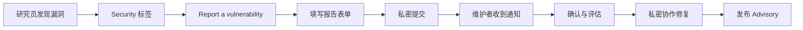

# 安全策略与漏洞披露

> 建立清晰的安全响应流程——从 SECURITY.md 到私密报告，再到 CVE 发布的全链路管理。

## 概述

安全漏洞是软件开发生命周期中不可避免的风险。与其在漏洞被公开利用后被动应对，
不如提前建立一套规范的漏洞披露与响应流程。GitHub 为此提供了一整套工具：
SECURITY.md 声明安全策略、私密漏洞报告通道、Security Advisory 管理与 CVE 申请，
以及 Secret Scanning 和 Push Protection 防止密钥泄露。

一个成熟的安全流程至少包含三个环节：**接收报告**（让安全研究员能方便地报告漏洞）、
**评估与修复**（在私密环境中协作修复）、**公开披露**（发布 Advisory 和 CVE，通知受影响方）。
GitHub 的安全工具链覆盖了这三个环节，帮助你在整个生命周期中安全地处理漏洞。

> [!NOTE]
> GitHub 的安全漏洞披露遵循"协调披露"（Coordinated Disclosure）原则：
> 发现者先私密报告，维护者在合理时间内修复，之后双方协调公开。
> 这比"完全公开"更负责任，比"私下修补不公开"更透明。
> 你可以在 SECURITY.md 中明确你的披露时间线预期。

本章将引导你从编写安全策略文档开始，逐步配置私密报告通道、管理 Security Advisory，
并启用 Secret Scanning 与 Push Protection 防止敏感信息泄露。

## 核心操作

### 编写 SECURITY.md

SECURITY.md 是仓库的安全策略文档，告诉外部安全研究员如何负责任地报告漏洞。

1. 在仓库根目录或 `.github/` 目录下创建 `SECURITY.md` 文件。
2. 编写安全策略内容：

```markdown
# 安全策略

## 支持的版本

| 版本 | 支持状态 |
| --- | --- |
| 2.x | :white_check_mark: 持续支持 |
| 1.x | :warning: 仅安全修复 |
| < 1.0 | :x: 不再支持 |

## 报告漏洞

如果你发现了安全漏洞，请**不要**通过公开 Issue 报告。

请使用 GitHub 的私密漏洞报告功能（Security > Report a vulnerability），
或发送邮件至 <security@example.com>。

我们在收到报告后 <72 小时> 内确认，<90 天> 内完成修复或给出修复计划。

## 漏洞处理流程

1. 确认接收报告并分配跟踪编号
2. 评估漏洞严重程度和影响范围
3. 在私密分支中开发修复方案
4. 通过 Security Advisory 发布补丁
5. 协调公开披露时间
```

3. 提交并推送到默认分支。GitHub 会自动在仓库页面的 Security 标签页中展示此文档。

> [!TIP]
> SECURITY.md 应当包含：支持的版本列表、报告方式（私密报告链接或邮箱）、响应时间承诺、
> 披露政策以及可能的赏金信息。保持内容简洁明了，避免让报告者产生困惑。

### 启用私密漏洞报告

私密漏洞报告允许安全研究员直接在 GitHub 上提交漏洞报告，无需通过邮件或外部平台。

1. 进入 Repository 的 **Settings**。
2. 在 **Security** 区域找到 **Private vulnerability reporting**。
3. 点击 **Set up** 或 **Enable** 开启此功能。
4. 确认报告模板（可选自定义）。



报告者提交后，仓库维护者会收到私密通知。
整个过程在私密通道中进行，直到维护者决定公开披露。

> [!WARNING]
> 如果你的项目涉及用户数据或金融交易，强烈建议启用私密报告。
> 公开 Issue 讨论未修复的漏洞会让攻击者在补丁发布前利用该漏洞，造成实际损害。

### 管理 Security Advisory

Security Advisory 是 GitHub 提供的漏洞记录与发布工具，支持关联 CVE 编号。

1. 进入 **Security > Advisories**。
2. 点击 **New draft advisory** 创建草稿。
3. 填写漏洞详情：
   - **Title**——简明的漏洞描述。
   - **Description**——技术细节与影响范围。
   - **CVE**——可申请 GitHub 分配的 CVE 编号。
   - **Severity**——使用 CVSS 评分系统评估。
   - **Affected versions**——受影响的版本范围。
   - **Patched versions**——已修复的版本。
4. （可选）在草稿阶段邀请安全研究员协作。
5. 发布 Advisory：点击 **Publish advisory**。

GitHub 会自动将发布的 Advisory 同步到 [GitHub Advisory Database](https://github.com/advisories)，
通知依赖此项目的开发者。

### 申请 CVE 编号

GitHub 是 CVE 编号颁发机构（CNA），可以直接为你分配 CVE。

1. 在创建 Advisory 草稿时，在 **CVE** 字段点击 **Request CVE**。
2. GitHub 会自动分配一个 CVE 编号（格式为 `CVE-YYYY-NNNNN`）。
3. Advisory 发布后，CVE 记录会同步到 [MITRE CVE 数据库](https://cve.mitre.org/) 和 [NVD](https://nvd.nist.gov/)。

> [!NOTE]
> 只有已发布的 Advisory 才会同步 CVE 信息。草稿状态的 Advisory 仅对协作者可见，
> CVE 编号虽已分配但不会出现在公开数据库中，直到你正式发布 Advisory。

### 启用 Secret Scanning

Secret Scanning 会自动检查仓库中是否意外提交了密钥、Token 和其他敏感凭证。

1. 进入 Repository 的 **Settings > Code security**。
2. 在 **Secret scanning** 区域点击 **Enable**。
3. GitHub 会立即扫描整个仓库历史记录中已知的密钥模式。

启用后，Secret Scanning 会在以下场景触发：

- **Push 扫描**——每次 Push 时检查新增内容。
- **历史扫描**——对整个 Git 历史进行回溯扫描。
- **实时告警**——检测到密钥后立即通知仓库管理员和密钥颁发方。

> [!WARNING]
> Secret Scanning 检测到的密钥应被视为已泄露。
> 即使你随后从代码中删除了它，Git 历史中仍然保留着。
> 正确的做法是立即吊销该密钥，生成新密钥，然后更新所有引用位置。

### 启用 Push Protection

Push Protection 是 Secret Scanning 的主动防线，在你尝试将密钥推送到 GitHub 时直接阻止。

1. 进入 **Settings > Code security**。
2. 在 **Push protection** 区域点击 **Enable**。
3. 现在，任何包含已知密钥模式的 Push 都会被拦截。

当 Push 被拦截时，推送者有三个选择：

- **移除密钥**——从代码中删除密钥后重新推送。
- **绕过保护**——如果是误报或测试密钥，可以填写理由后绕过。
- **查看详情**——了解被拦截的密钥类型和位置。

```bash
# Push 被拦截时的终端输出示例
remote: Resolving deltas: 100% (3/3), completed with 3 local objects.
remote: ERROR: [push protection] detected a secret in your changes.
remote:
remote: ——GitHub Personal Access Token—————————————————
remote:   locations: config/settings.yml:42
remote:
remote:  To push, remediate the secret or bypass push protection.
remote:  visit: https://docs.github.com/en/code-security/secret-scanning
To github.com:<owner>/<repo>.git
 ! [remote rejected] main -> main (push declined due to secret detection)
```

> [!TIP]
> 对于团队项目，建议在 **Settings > Code security > Push protection** 中配置
> **"Allow specific actors to bypass push protection"**，
> 让特定团队成员（如安全工程师）有权绕过保护，同时为所有其他贡献者保留强制保护。

## 进阶技巧

### 自定义 Secret Scanning 模式

除了 GitHub 内置的密钥模式，你还可以定义自定义模式来检测项目特有的敏感信息：

1. 进入 **Settings > Code security > Secret scanning > Custom patterns**。
2. 点击 **New pattern**。
3. 定义正则表达式模式：

```yaml
# 示例：检测自定义 API 密钥格式
Pattern name: "Internal API Key"
Secret pattern: "INT_API_[A-Za-z0-9]{32}"
# 可选：定义匹配前的字符串和匹配后的字符串以减少误报
Before secret: 'api_key\s*=\s*["'']'
After secret: '["'']'
```

4. 选择扫描范围（整个仓库或指定路径）。
5. 保存并运行测试。

### 自动化漏洞响应工作流

结合 GitHub Actions，你可以自动化漏洞响应流程中的多个环节：

```yaml
name: "Security Response Automation"
on:
  security_advisory:
    types: [published, updated]

jobs:
  notify:
    runs-on: ubuntu-latest
    steps:
      - name: Notify security team
        uses: slackapi/slack-github-action@v1
        with:
          payload: |
            {
              "text": "Security Advisory published: ${{ github.event.security_advisory.summary }}",
              "severity": "${{ github.event.security_advisory.severity }}"
            }
        env:
          SLACK_WEBHOOK_URL: ${{ secrets.SLACK_WEBHOOK }}

  create-fix-branch:
    runs-on: ubuntu-latest
    steps:
      - uses: actions/checkout@v4
      - name: Create fix branch
        run: |
          git checkout -b security-fix/${{ github.event.security_advisory.ghsa_id }}
          git push origin security-fix/${{ github.event.security_advisory.ghsa_id }}
```

### 在安全区域使用私密 Fork 协作

当处理高危漏洞时，GitHub 提供私密 Fork 协作机制：

1. 从 Advisory 页面点击 **Create private fork**。
2. 安全研究员和内部团队在这个私密 Fork 中协作开发修复方案。
3. 修复完成后，通过 **Create pull request** 将补丁合并到私密分支。
4. 在 Advisory 发布时，私密分支的 PR 会合并到公开分支，修复方案同步公开。

这种方式确保了修复过程中的所有讨论和代码变更都是私密的，直到你准备好公开披露。

### 安全策略的 Organization 级别管理

如果你管理多个仓库，可以在 Organization 级别统一管理安全配置：

1. 在 Organization 的 **Settings > Code security** 中配置默认安全策略。
2. 使用 `.github` 仓库存放组织级别的 `SECURITY.md` 模板。
3. 通过 [safe-settings](https://github.com/github/safe-settings)
   或 [policy-as-code](https://github.com/advanced-security/policy-as-code)
   以代码方式管理安全配置，确保所有仓库都符合统一的安全基线。

更多关于组织级别管理的策略，参见 [分支保护与规则集](04-分支保护与规则集)
和 [Security Overview](https://docs.github.com/en/code-security/concepts/security-at-scale/about-security-overview)。

## 常见问题

### Q: SECURITY.md 放在根目录还是 .github 目录？

两个位置都可以，GitHub 都会识别。如果仓库根目录已经比较整洁，建议放在 `.github/` 目录下。
对于 Organization 级别的安全策略，放在 `.github` 仓库中，所有成员仓库会自动继承。
如果仓库根目录和 `.github/` 目录都有 `SECURITY.md`，根目录的优先级更高。

### Q: 私密漏洞报告和公开 Issue 有什么区别？

私密报告是加密的，只有仓库维护者和指定的安全团队可见。
公开 Issue 对所有人可见，包括潜在的攻击者。
私密报告支持直接关联 Security Advisory 和 CVE 申请，整个修复流程都可以在私密环境中完成。
Issue 则适合非安全类的 Bug 报告和功能请求。

### Q: 如何决定何时发布 Security Advisory？

推荐遵循以下原则：1）严重和高危漏洞应在修复补丁就绪后尽快发布；
2）中低危漏洞可以与常规发布周期同步披露；
3）如果漏洞已被公开披露（零日漏洞），应立即发布 Advisory 并提供缓解措施。
始终在 SECURITY.md 中声明你的披露时间线预期，让报告者有合理的期待。

### Q: Secret Scanning 误报太多怎么办？

可以通过三种方式减少误报：1）在告警详情中点击 **Dismiss** 并选择 **"This is a false positive"**，
帮助 GitHub 改进检测模型；2）配置自定义模式的 `Before secret` 和 `After secret` 字段增加上下文约束；
3）在 `.gitignore` 中排除包含测试密钥的文件路径。但不要为了减少告警而关闭 Secret Scanning——
漏掉一个真实泄露的代价远高于处理几个误报。

### Q: Push Protection 可以在 CI 中使用吗？

可以。除了在推送时自动拦截，GitHub 还提供了 `github/codeql-action` 中的 `push-protection` 功能，
可以在 CI 工作流中以独立步骤运行。
这对于使用间接推送方式（如通过 API 或第三方工具推送代码）的团队特别有用。

### Q: 已发布的 Advisory 可以修改吗？

可以。已发布的 Advisory 可以随时更新——修改描述、调整受影响版本范围、添加补丁版本信息等。
CVE 编号不会改变，但 MITRE 和 NVD 数据库中的记录会在更新后同步刷新。
注意，Advisory 一旦发布就无法删除，只能更新。

### Q: 如何追踪外部依赖的漏洞通告？

GitHub Advisory Database 汇总了所有已知的安全漏洞。你可以通过 **Security > Advisory** 浏览，
或使用 `gh api` 命令行查询。更实用的方式是启用 [Dependabot](02-依赖审查与Dependabot) 告警，
它会自动监测你的依赖项是否受已知漏洞影响，并在有安全更新时创建 Pull Request。

### Q: 如何为私有仓库启用安全功能？

私有仓库的安全功能（Code Scanning、Secret Scanning、Push Protection）需要 GitHub Advanced Security 许可。
如果你使用的是 GitHub Enterprise Cloud，可以在 Organization 或仓库的 **Settings > Code security** 中逐项启用。
对于个人私有仓库，Secret Scanning 的推送保护对 GitHub Free 的私有仓库同样可用。

## 参考链接

| 标题 | 说明 |
|------|------|
| [Adding a security policy](https://docs.github.com/en/code-security/getting-started/adding-a-security-policy-to-your-repository) | SECURITY.md 编写与配置指南 |
| [Privately reporting a security vulnerability](https://docs.github.com/en/code-security/security-advisories/guidance-on-reporting-and-writing/privately-reporting-a-security-vulnerability) | 私密漏洞报告使用方法 |
| [About coordinated disclosure](https://docs.github.com/en/code-security/concepts/vulnerability-reporting-and-management/about-coordinated-disclosure-of-security-vulnerabilities) | 协调披露原则与最佳实践 |
| [GitHub Advisory Database](https://github.com/advisories) | 全局安全漏洞数据库 |
| [Quickstart for securing your repository](https://docs.github.com/en/code-security/getting-started/quickstart-for-securing-your-repository) | 仓库安全配置快速入门 |
| [About secret scanning](https://docs.github.com/en/code-security/secret-scanning/about-secret-scanning) | Secret Scanning 功能概述 |
| [About push protection](https://docs.github.com/en/code-security/concepts/secret-security/about-push-protection) | Push Protection 工作原理 |
