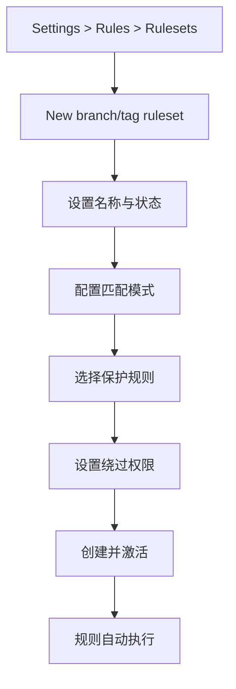
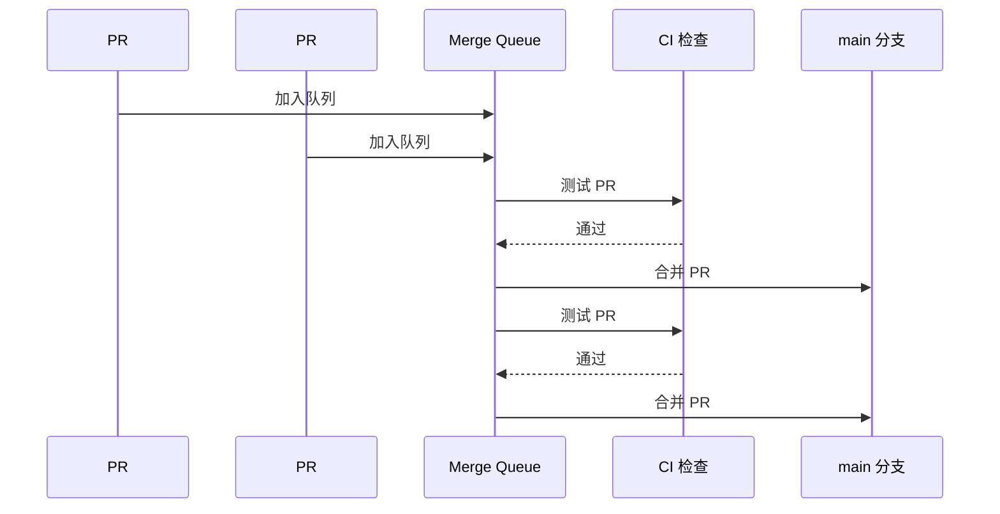

# 分支保护与规则集

> 为你的代码仓库设置门禁——从 Branch Protection 到 Rulesets，确保每一行合并的代码都经过审查和验证。

## 概述

分支保护是代码质量的最后一道防线。无论你的团队有多少自动化检查，如果没有强制执行，
贡献者仍然可以绕过流程直接将未审查的代码推送到主分支。
Branch Protection 和 Rulesets 就是 GitHub 提供的两套代码门禁机制，
确保关键的分支和 Tag 只能按照既定规则被修改。

Branch Protection 是经典的分支级保护方案，你在单个分支上配置保护规则。
Rulesets 是 GitHub 在 2023 年推出的新一代策略引擎，它不仅覆盖 Branch Protection 的所有能力，
还支持 Tag 保护、按路径条件匹配、Organization 级别统一管理以及更精细的权限控制。
对于新项目，推荐直接使用 Rulesets；对于已有 Branch Protection 配置的项目，可以逐步迁移。

> [!NOTE]
> Branch Protection 和 Rulesets 可以在同一仓库中共存。当两者都对同一分支生效时，
> 规则会叠加——所有保护条件都必须满足才能执行操作。
> GitHub 建议逐步从 Branch Protection 迁移到 Rulesets，而非一次性替换，以降低迁移风险。

两者都要求仓库使用 GitHub 的 Pull Request 工作流。如果团队成员习惯直接 Push 到主分支，
启用保护后需要先适应 Fork + PR 的工作方式。
你可以参考 [协作与工作流](../02-协作与工作流/README) 章节来了解 PR 工作流的最佳实践。

## 核心操作

### 配置 Branch Protection Rules

Branch Protection 适合对单个关键分支（如 `main`、`release/*`）设置保护。

1. 进入 Repository 的 **Settings > Branches**。
2. 在 **Branch protection rules** 区域点击 **Add branch protection rule**。
3. 在 **Branch name pattern** 中输入要保护的分支名或模式（如 `main`、`release/*`）。
4. 配置保护选项：

**基本保护：**

- **Require a pull request before merging**——禁止直接 Push，所有变更必须通过 Pull Request。
  - **Require approvals**（推荐）——要求至少 1-2 人审查通过。
  - **Dismiss stale pull request approvals when new commits are pushed**——新提交后清除之前的审批。
  - **Require review from Code Owners**——要求 `CODEOWNERS` 文件中指定的审查者批准。

**代码质量保护：**

- **Require status checks to pass before merging**——要求所有指定的 CI 检查通过。
  - **Require branches to be up to date before merging**——要求 PR 分支与目标分支同步。

**安全性保护：**

- **Require signed commits**——要求所有提交都有 GPG 签名（Verified 标记）。
- **Require linear history**——禁止合并提交，保持线性历史。

**权限控制：**

- **Do not allow bypassing the above settings**——禁止管理员绕过保护规则（企业版功能）。
- **Restrict who can push to matching branches**——限制可推送的人员或团队。

5. 点击 **Create** 或 **Save changes** 保存规则。

> [!WARNING]
> **"Do not allow bypassing the above settings"** 一旦启用，仓库管理员也无法绕过保护规则。
> 如果团队中只有少数管理员，建议先在测试仓库中验证所有工作流后再开启此选项，
> 避免因 CI 故障导致无法紧急合并修复。

### 配置 Repository Rulesets

Rulesets 提供更灵活的策略管理，支持按条件匹配分支和 Tag。

1. 进入 Repository 的 **Settings > Rules > Rulesets**。
2. 点击 **New ruleset**，选择 **New branch ruleset** 或 **New tag ruleset**。
3. 设置规则集名称和执行模式：
   - **Active**——规则立即生效。
   - **Disabled**——规则已创建但不生效，适合逐步启用。
4. 在 **Target** 区域配置匹配条件：

```yaml
# 分支名模式匹配示例
targets:
  - pattern: "main"
  - pattern: "release/*"
  - pattern: "hotfix/*"

# 排除特定分支
conditions:
  exclude:
    - pattern: "release/0.*"  # 排除早期版本分支
```

5. 配置规则（Rulesets 提供比 Branch Protection 更丰富的规则）：

**合并控制：**
- **Require a pull request before merging**——与 Branch Protection 相同。
- **Require merge queue**——合并队列，自动排队并验证 PR 合并。
- **Required deployments**——要求特定环境部署成功后才能合并。

**代码验证：**
- **Require status checks**——指定必须通过的 CI 检查。
- **Require code scanning results**——要求 [CodeQL 扫描](01-代码扫描与Code-QL) 无高危告警。

**签名与历史：**
- **Require signed commits**——强制 GPG 签名。
- **Require linear history**——线性提交历史。

**Tag 保护：**
- **Restrict creations**——限制谁可以创建 Tag。
- **Restrict updates**——限制谁可以更新 Tag。
- **Restrict deletions**——限制谁可以删除 Tag。

**权限绕过：**
- **Bypass list**——指定可以绕过规则的角色或团队（如仓库管理员、特定团队）。

6. 点击 **Create** 保存规则集。



> [!TIP]
> Rulesets 支持先创建为 **Disabled** 状态，再逐步启用单个规则。
> 这样可以安全地测试规则效果，确认不会阻断正常工作流后再全面激活。
> 这比 Branch Protection 的"一刀切"方式更友好。

### 配置 Tag 保护

Tag 保护是 Rulesets 的独有功能，用于防止发布 Tag 被意外修改或删除。

1. 进入 **Settings > Rules > Rulesets**。
2. 点击 **New ruleset > New tag ruleset**。
3. 配置 Tag 匹配模式：
   - `v*`——保护所有以 `v` 开头的 Tag（如 `v1.0.0`、`v2.1.3`）。
   - `release-*`——保护所有发布 Tag。
4. 启用以下规则：
   - **Restrict deletions**——防止 Tag 被删除。
   - **Restrict updates**——防止 Tag 被移动到其他提交。
   - **Restrict creations**——限制谁可以创建 Tag。
5. 配置允许操作的角色和团队。

> [!WARNING]
> 如果你的项目使用自动化发布流程
> （如通过 [Actions](../03-自动化与CI-CD/01-GitHub-Actions-入门) 创建 Release 并打 Tag），
> 确保自动化使用的 Token 或机器人账号在绕过列表中，否则发布流程会被 Tag 保护规则阻断。

### 配置 CODEOWNERS 文件

CODEOWNERS 文件与 Branch Protection 配合，自动指定代码审查者。

1. 在仓库根目录、`docs/` 目录或 `.github/` 目录下创建 `CODEOWNERS` 文件：

```codeowners
# 默认所有代码的审查者
*       @org/team-lead

# 前端代码由前端团队审查
/src/frontend/**    @org/frontend-team

# 后端 API 由后端团队审查
/src/api/**         @org/backend-team

# 安全相关代码必须由安全团队审查
/src/auth/**        @org/security-team
**/security/**      @org/security-team

# CI 配置由 DevOps 审查
/.github/workflows/**  @org/devops-team

# 特定文件指定个人审查
/package.json      @username1 @username2
```

2. 提交文件后，当 PR 涉及对应路径时，GitHub 会自动将指定的审查者添加为 Required Reviewer。

## 进阶技巧

### Organization 级别的 Rulesets

对于管理多个仓库的组织，可以在 Organization 级别统一配置 Rulesets：

1. 进入 **Organization > Settings > Rules > Rulesets**。
2. 点击 **New ruleset**，选择作用范围：
   - **All repositories**——应用于组织内所有仓库。
   - **Only selected repositories**——选择特定仓库。
   - **By repository metadata**——按 Topic 或自定义属性匹配。
3. 配置统一的保护规则。

Organization 级别的 Rulesets 优先级高于仓库级别的配置。
这意味着仓库管理员无法降低组织设定的保护标准，但可以在此基础上添加更严格的规则。

> [!NOTE]
> Organization Rulesets 需要 GitHub Enterprise Cloud 或 GitHub Enterprise Server。
> 免费版和 Pro 版的 Organization 只能使用仓库级别的 Branch Protection。
> 对于大型组织的统一安全治理，
> 参见 [Security Overview](https://docs.github.com/en/code-security/concepts/security-at-scale/about-security-overview)。

### 使用 Policy-as-Code 管理规则

当仓库数量增多时，手动配置保护规则既耗时又容易出错。
Policy-as-Code 将规则定义转化为可版本管理的配置文件：

```yaml
# 使用 advanced-security/policy-as-code 管理安全策略
name: "Security Policy Enforcement"
on:
  push:
    paths:
      - "policies/**"

jobs:
  enforce:
    runs-on: ubuntu-latest
    steps:
      - uses: actions/checkout@v4
      - name: Apply security policies
        uses: advanced-security/policy-as-code@v2
        with:
          policy-path: policies/
          token: ${{ secrets.GITHUB_TOKEN }}
```

这种方式的优势在于：规则变更通过 Pull Request 审查，历史可追溯，回滚方便。
结合 [safe-settings](https://github.com/github/safe-settings) 工具，
还可以批量管理仓库的分支保护、团队权限和功能开关。

### 合并队列（Merge Queue）

合并队列是 Rulesets 的高级功能，解决了多个 PR 同时等待合并时的竞争问题。

1. 在 Ruleset 中启用 **Require merge queue**。
2. 配置合并策略：
   - **Merge**——保留所有提交，创建合并提交。
   - **Squash**——将所有提交压缩为一个。
   - **Rebase**——逐个变基提交，保持线性历史。
3. 配置合并条件——CI 必须通过的检查列表。



合并队列确保每个 PR 都在与最新代码合并后通过 CI 验证，
避免了"合并后 CI 失败"的尴尬情况。

### 配置 Required Deployments

Required Deployments 要求代码先成功部署到指定环境后才能合并：

1. 在 Ruleset 中启用 **Required deployments**。
2. 添加部署环境（如 `staging`、`production`）。
3. 当 PR 创建后，代码必须先部署到 `staging` 环境并通过验证，然后才能合并到 `main`。

这特别适合需要端到端测试的项目——代码先部署到预发布环境，
自动化测试或人工验证通过后才允许合并。

## 常见问题

### Q: Branch Protection 和 Rulesets 应该选哪个？

对于新项目，推荐直接使用 Rulesets——它功能更全面，支持 Tag 保护和条件匹配，
未来 GitHub 也会在 Rulesets 上持续投入。对于已有 Branch Protection 配置的项目，
可以保持现有规则不变，新需求用 Rulesets 实现，两者可以共存。
GitHub 建议最终将所有规则迁移到 Rulesets。

### Q: 管理员可以绕过保护规则吗？

默认情况下，仓库管理员可以绕过 Branch Protection 规则。在 Rulesets 中，
你可以通过 **Bypass list** 精确控制哪些角色可以绕过——
支持 Repository admin、Organization admin、Maintainer 以及特定团队。
如果勾选 **"Do not allow bypassing"**，则所有人都必须遵守规则。

### Q: 保护规则会影响 CI 工作流吗？

Branch Protection 和 Rulesets 本身不影响 CI 触发，但它们会阻止不合规的合并操作。
如果 CI 工作流需要直接推送到受保护分支（如自动发布流程），
确保使用具有适当权限的 Token（如 `contents: write`），并将其添加到绕过列表中。
也可以使用 [Actions](../03-自动化与CI-CD/01-GitHub-Actions-入门) 的 `pull-request` 触发器避免直接推送。

### Q: 如何对 Fork 的 Pull Request 启用保护？

来自 Fork 的 PR 默认无法访问仓库的 Secret，因此 CI 检查可能无法运行。
你需要在 CI 工作流中使用 `pull_request_target` 触发器（而非 `pull_request`），
并在 Branch Protection 中确保 Status Checks 包含来自 Fork PR 的检查结果。
对于安全性要求高的仓库，建议只允许组织成员提交 PR。

### Q: Rulesets 的 Disabled 模式有什么用？

Disabled 模式允许你创建规则但不立即生效。这在以下场景中很有用：
1）提前配置好规则，在特定时间点统一激活；2）测试规则配置是否正确，确认无误后再激活；
3）作为文档记录预期的保护策略。Disabled 规则不会影响任何操作，但可以在列表中随时启用。

### Q: 如何保护所有的长期分支？

在 Branch Protection 中使用通配符模式（如 `release/*`、`hotfix/*`）。
在 Rulesets 中使用条件匹配，可以更灵活地定义模式——
例如 `~*release*` 匹配所有包含 "release" 的分支名。
也可以创建多个 Ruleset 分别管理不同类型的分支，每个 Ruleset 有不同的保护强度。

### Q: CODEOWNERS 的审查者可以跳过审查吗？

不能。如果你的 Branch Protection 或 Rulesets 要求 Code Owner 审查，指定的审查者必须亲自批准 PR——
即使他们是仓库管理员也是如此。如果某个 CODEOWNERS 条目指向的团队或个人无法及时审查，
建议及时更新 `CODEOWNERS` 文件，将审查权委托给活跃的成员。

### Q: 如何查看保护规则对仓库的影响？

在 **Settings > Branches** 中查看所有 Branch Protection Rules 及其覆盖的分支。
在 **Settings > Rules > Rulesets** 中查看所有 Rulesets 及其状态。
对于具体的 PR，可以在 PR 页面的 **Checks** 区域看到所有必须通过的检查项。
Organization 管理员可以在 **Organization > Settings > Audit log** 中追踪规则变更历史。

## 参考链接

| 标题 | 说明 |
|------|------|
| [About protected branches](https://docs.github.com/en/repositories/configuring-branches-and-merges-in-your-repository/managing-protected-branches/about-protected-branches) | Branch Protection 概述 |
| [Managing a branch protection rule](https://docs.github.com/en/repositories/configuring-branches-and-merges-in-your-repository/managing-protected-branches/managing-a-branch-protection-rule) | 分支保护规则配置步骤 |
| [About rulesets](https://docs.github.com/en/repositories/configuring-branches-and-merges-in-your-repository/managing-rulesets/about-rulesets) | Rulesets 功能介绍与架构 |
| [Available rules for rulesets](https://docs.github.com/en/repositories/configuring-branches-and-merges-in-your-repository/managing-rulesets/available-rules-for-rulesets) | 所有可用规则类型参考 |
| [Branch Protection vs Rulesets](https://dev.to/piyushgaikwaad/branch-protection-rules-vs-rulesets-the-right-way-to-protect-your-git-repos-305m) | 两者对比与迁移建议 |
| [github/safe-settings](https://github.com/github/safe-settings) | 批量管理仓库配置的开源工具 |
| [advanced-security/policy-as-code](https://github.com/advanced-security/policy-as-code) | 以代码方式管理安全策略 |
| [About security overview](https://docs.github.com/en/code-security/concepts/security-at-scale/about-security-overview) | 组织级安全态势仪表板 |
