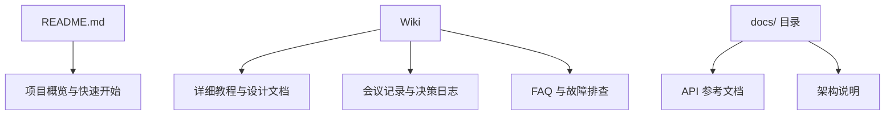

# Wiki 使用指南

> 用 Git 管理的项目知识库，从侧栏导航到离线编辑的完整方案。

## 概述

GitHub Wiki 是每个 Repository 自带的文档系统，适合存放教程、设计文档、会议记录等长篇内容。
与 README 不同，Wiki 支持多页面、侧栏导航和版本历史，能够承载更复杂的知识结构。

Wiki 本质上是一个独立的 Git 仓库，这意味着你可以用熟悉的 Git 工作流来编辑它——
本地编写、分支管理、合并冲突，全部适用。同时它也提供网页编辑器，方便非技术贡献者参与文档维护。

> [!NOTE]
Wiki 默认对所有有仓库写权限的人可见可编辑。对于公开仓库，任何人都可以查看 Wiki 内容；
对于私有仓库，只有协作者和团队成员才能访问。你可以在仓库 Settings 中关闭 Wiki 功能。

## 核心操作

### 启用 Wiki

1. 进入 Repository 页面，点击 **Settings** 标签。
2. 在 **Features** 区域勾选 **Wikis**。
3. 返回仓库主页，侧栏会出现 **Wiki** 入口链接。
4. 点击进入 Wiki 页面后，点击 **Create the first page** 开始编写。

### 创建和编辑 Wiki 页面

1. 进入仓库的 **Wiki** 标签页。
2. 点击右上角的 **New Page** 按钮。
3. 在编辑器中输入页面标题和内容（支持 Markdown 格式）。
4. 在底部填写编辑摘要（Edit message），类似 Git commit message。
5. 点击 **Save Page** 保存。

在编辑页面时，可以使用工具栏插入标题、列表、代码块和链接。
也可以直接使用 Markdown 语法，Wiki 编辑器支持完整的 GFM 渲染。

> [!TIP]
每次保存 Wiki 页面都会生成一条修订记录。你可以点击页面右上角的 **Page History** 查看所有历史版本，
还可以逐行对比（Side-by-side diff）不同版本的差异，必要时回滚到任意版本。

### 添加侧栏导航

侧栏（Sidebar）显示在所有 Wiki 页面的右侧，用于提供全局导航。创建方法如下：

1. 进入 Wiki 页面，点击右下角的 **Add a custom sidebar** 链接。
2. 编辑侧栏内容，推荐使用链接列表格式：

```markdown
## 导航

- [首页](Home)
- [快速开始](Quick-Start)
- [架构设计](Architecture)
- [API 文档](API-Reference)
- [常见问题](FAQ)

## 相关资源

- [贡献指南](../CONTRIBUTING.md)
- [更新日志](../CHANGELOG.md)
```

3. 保存后，侧栏会自动出现在所有 Wiki 页面上。

### 添加页脚

页脚（Footer）显示在所有 Wiki 页面的底部，通常用于版权声明或联系方式：

1. 在 Wiki 页面底部点击 **Add a custom footer** 链接。
2. 输入页脚内容，例如：

```markdown
---
本文档由项目维护团队维护。如有疑问请在 [Issue](../../issues) 中提出。
```

### 通过 Git 克隆和编辑 Wiki

Wiki 是一个独立的 Git 仓库，可以克隆到本地进行批量编辑：

```bash
# 克隆 Wiki 仓库（注意 wiki.git 后缀）
git clone https://github.com/<owner>/<repo>.wiki.git

# 进入 Wiki 目录
cd <repo>.wiki

# 创建或编辑页面（文件名即页面名）
touch Architecture.md

# 编辑内容后提交并推送
git add .
git commit -m "添加架构设计文档"
git push origin master
```

> [!WARNING]
Wiki 仓库使用 `master` 作为默认分支，而非 `main`。推送时请确保分支名正确。
如果推送失败，先执行 `git branch -a` 查看远程分支名称。

## 进阶技巧

### 用本地编辑器批量管理 Wiki

当 Wiki 页面增多时，网页编辑器会显得低效。推荐的工作流是：

1. 将 Wiki 克隆到本地。
2. 使用 VS Code 或其他 Markdown 编辑器批量编写。
3. 利用编辑器的拼写检查、格式化插件提升质量。
4. 使用 Git 提交和推送，所有修改会自动同步到 GitHub。

这种方式特别适合大规模文档迁移或内容重构。

### Wiki 与主仓库文档的分工

合理的分工能让文档体系更清晰。推荐的策略是：



- **README.md**——项目门面，控制在一屏内
- **docs/ 目录**——随代码版本管理的正式文档
- **Wiki**——频繁更新的知识库，适合协作编辑

### 链接到 Wiki 和从 Wiki 链出

Wiki 内部链接使用页面名作为路径：

```markdown
<!-- Wiki 内部链接 -->
详见 [架构设计](Architecture) 页面。

<!-- 从 Wiki 链接到主仓库文件 -->
参考 [贡献指南](../CONTRIBUTING.md)。

<!-- 从主仓库 README 链接到 Wiki -->
详细教程请查看 [Wiki](../../wiki)。
```

### Wiki 页面组织最佳实践

当 Wiki 页面数量超过十个时，良好的组织结构就变得至关重要。以下是几个实践建议：

1. **首页作为目录**——在 `Home` 页面中列出所有重要页面的链接，按主题分组。
2. **使用一致的命名规范**——推荐使用 PascalCase（如 `API-Reference`）或 kebab-case（如 `api-reference`），
避免使用空格和特殊字符。
3. **按内容类型分组**——将教程、设计文档、会议记录等分到不同的逻辑区域，侧栏中体现这种分组。
4. **保持页面粒度适中**——每个页面聚焦一个主题，控制在几百行以内。过长的页面应拆分为多个子页面。

### 使用图片和媒体

Wiki 支持在页面中嵌入图片。你可以通过以下方式管理图片资源：

```markdown
<!-- 引用主仓库中的图片 -->


<!-- 使用完整 URL 引用外部图片 -->

```

推荐的做法是在主仓库中维护图片资源，然后在 Wiki 中通过相对路径引用。
这样图片会随代码一起版本管理，不会因为 Wiki 重新创建而丢失。

## 常见问题

### Q: Wiki 页面名可以使用中文吗？

可以。GitHub Wiki 支持中文页面名，但 URL 中中文会被编码为百分号形式。
在 Wiki 内部链接中使用中文页面名是正常的，不过建议在文件名中使用英文或拼音，
中文标题则通过页面内的标题（`#` 语法）来展示，这样更便于 Git 操作和跨平台兼容。

### Q: Wiki 支持 Mermaid 图表吗？

支持。Wiki 编辑器完全支持 GFM 语法，包括 Mermaid 代码块。
你可以像在 README 中一样使用 ` ```mermaid ` 语法绘制流程图、时序图等。
参见 [README 与文档最佳实践](04-README与文档最佳实践.md) 中的 Mermaid 示例。

### Q: 如何限制谁可以编辑 Wiki？

Wiki 的编辑权限与仓库的写权限一致。要限制 Wiki 编辑：
在仓库 Settings → Manage access 中调整协作者权限；或使用 Teams 功能给不同团队分配不同权限级别。
目前 GitHub 不支持单独控制 Wiki 的编辑权限——它完全继承仓库的权限模型。

### Q: Wiki 页面可以回滚到历史版本吗？

可以。在 Wiki 页面点击 **History** 标签，找到目标版本，点击对应的 commit hash 进入差异页面，
然后点击 **Revert** 按钮即可回滚。回滚操作会产生一条新的修订记录，不会丢失中间版本。

### Q: 为什么克隆 Wiki 时提示仓库不存在？

最常见的原因是 Wiki 功能尚未启用，或者仓库中还没有任何 Wiki 页面。
请先在 GitHub 网页上创建至少一个 Wiki 页面，之后 Wiki 的 Git 仓库才会被创建。
另一个可能的原因是私有仓库的认证信息未配置——确保你的 Git 凭据可以访问该仓库。

### Q: Wiki 的搜索功能好用吗？

GitHub Wiki 本身没有独立的搜索引擎。用户需要使用 GitHub 全局搜索
（按 `/` 快捷键），然后在筛选条件中限定仓库。对于文档量大的项目，
建议在 Wiki 首页或侧栏中提供清晰的目录索引，方便读者手动导航。

### Q: 如何将 Wiki 内容迁移到 docs/ 目录？

将 Wiki 克隆到本地后，将 `.md` 文件复制到主仓库的 `docs/` 目录即可。
需要注意几点：Wiki 内部链接格式需要调整为相对路径；图片资源需要一并迁移；
Wiki 的侧栏和页脚内容可以整合到 `docs/` 目录的导航文件中。

### Q: Wiki 有页面数量限制吗？

GitHub 没有公开声明硬性的页面数量限制，但每个 Wiki 仓库的总大小不应超过 1 GB。
对于绝大多数项目来说，这个限制绰绰有余。单个页面建议控制在合理长度内，
如果某个页面超过几千行，考虑拆分为多个子页面。

## 参考链接

| 标题 | 说明 |
|------|------|
| [About wikis](https://docs.github.com/en/communities/documenting-your-project-with-wikis/about-wikis) | GitHub 官方 Wiki 概述 |
| [Adding or editing wiki pages](https://docs.github.com/en/communities/documenting-your-project-with-wikis/adding-or-editing-wiki-pages) | Wiki 页面创建与编辑指南 |
| [Creating a footer or sidebar for your wiki](https://docs.github.com/en/communities/documenting-your-project-with-wikis/creating-a-footer-or-sidebar-for-your-wiki) | Wiki 侧栏和页脚配置方法 |
