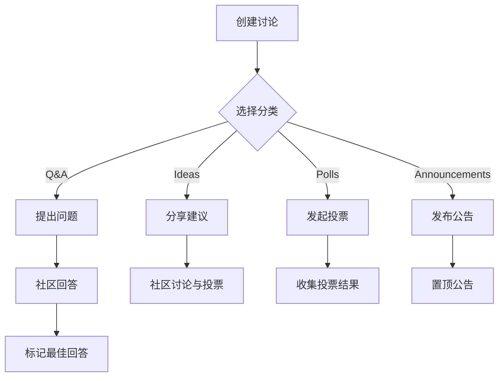

# Discussions 社区

> 用 GitHub Discussions 搭建活跃的开源社区，从分类管理到投票与公告的完整实践。

## 概述

GitHub Discussions 是内置于 Repository 的论坛功能，为项目提供了一个有别于 Issue 的讨论空间。
Issue 专注于 bug 报告和功能请求，而 Discussions 则面向问答、想法分享、公告发布等更开放的交流场景。
这种分离让仓库的协作更加有序。

Discussions 支持分类、投票、标记最佳回答、置顶帖子等功能，
能够有效组织社区对话，帮助新成员快速找到有价值的信息。
对于活跃的开源项目，Discussions 是构建社区文化的重要工具。

> [!NOTE]
Discussions 默认不启用。仓库管理员需要在 Settings 中手动开启。
启用后，Discussions 标签会出现在仓库导航栏中。组织级别的 Discussions 也可以在
组织页面上启用，用于跨仓库的全局讨论。

## 核心操作

### 启用 Discussions

1. 进入 Repository 页面，点击 **Settings** 标签。
2. 在 **Features** 区域勾选 **Discussions**。
3. 返回仓库主页，导航栏会出现 **Discussions** 标签。
4. 点击进入后，GitHub 会自动生成欢迎帖（Welcome post），引导社区参与。

### 配置讨论分类

分类是 Discussions 组织结构的基础。GitHub 提供多种默认分类，你也可以自定义：

| 分类类型 | 图标颜色 | 适用场景 |
|---------|---------|---------|
| Announcements | 绿色 | 官方公告、版本发布通知 |
| General | 灰色 | 开放式讨论、经验分享 |
| Ideas | 橡胶色 | 功能建议、改进提案 |
| Q&A | 紫色 | 问答，支持标记最佳回答 |
| Show and Tell | 蓝色 | 展示作品、案例分享 |
| Polls | 棕褐色 | 社区投票、意见征集 |

管理分类的步骤：

1. 进入 Discussions 页面，点击右侧的齿轮图标（**Edit categories**）。
2. 点击 **New category** 创建自定义分类。
3. 填写分类名称、描述和 emoji 图标。
4. 拖拽分类列表调整显示顺序。
5. 点击 **Save changes** 保存。

> [!TIP]
分类数量建议控制在 4-8 个。过多的分类会让用户不知如何选择，增加发帖门槛。
可以根据社区活跃度逐步调整——先从 Q&A、General、Announcements 三个基础分类开始，
随着社区成长再添加 Ideas 和 Show and Tell。

### 发起讨论

1. 进入 Discussions 页面，点击 **New discussion**。
2. 选择合适的分类。
3. 填写标题和正文（支持完整 GFM 语法，包括代码块、图片、Mermaid 图表）。
4. 点击 **Start discussion** 发布。

在正文中可以使用 `@mention` 提及其他用户或团队，也可以使用 Markdown 格式化内容。

### 回复与标记最佳回答

在 Q&A 分类的讨论中，提问者可以标记最佳回答：

1. 找到解决问题的回复。
2. 点击回复下方的 **Mark as answer** 按钮。
3. 该回复会被高亮显示在讨论顶部，方便后来者快速找到答案。

标记最佳回答后，讨论标题前会显示绿色对勾图标，表明问题已解决。

### 创建投票

投票（Poll）是收集社区意见的有效方式：

1. 点击 **New discussion**，选择 **Polls** 分类。
2. 输入投票标题和描述。
3. 添加投票选项（至少 2 个，最多 12 个）。
4. 发布后社区成员可以点击选项投票。



### 置顶讨论

重要讨论可以置顶，确保所有访客都能看到：

1. 进入目标讨论页面。
2. 点击右侧边栏的 **Pin this discussion**。
3. 置顶的讨论会显示在 Discussions 页面顶部，带有图钉标记。
4. 最多可以置顶 4 个讨论。取消置顶同样在右侧边栏操作。

> [!WARNING]
置顶讨论时应保持克制。过多置顶会削弱其醒目效果。
推荐只置顶社区规范、贡献指南和最新版本公告等关键信息。

## 进阶技巧

### Issue 与 Discussions 的协同

合理区分 Issue 和 Discussions 能让项目协作更高效：

- **Issue**——bug 报告、功能请求、具体任务跟踪，需要明确的解决方案
- **Discussions**——开放式问答、设计讨论、社区交流、经验分享

当讨论中产生了具体的 bug 或功能需求时，可以从讨论中创建 Issue：

1. 在讨论中点击 **Convert to issue**。
2. 选择目标仓库（支持跨仓库转换）。
3. 讨论的上下文会自动带入新创建的 Issue。

反过来，当 Issue 需要更广泛的社区讨论时，也可以将其转为讨论。

### 使用 Discussion 模板

你可以为不同分类创建发帖模板，引导用户提供完整信息：

1. 在仓库根目录创建 `.github/DISCUSSION_TEMPLATE/` 目录。
2. 为每个模板创建 YAML 文件，例如 `.github/DISCUSSION_TEMPLATE/bug_report.yml`：

```yaml
title: "[Bug] "
labels: ["bug"]
body:
  - type: dropdown
    attributes:
      label: 分类
      options:
        - Q&A
        - Bug Report
        - Feature Request
    validations:
      required: true
  - type: textarea
    attributes:
      label: 问题描述
      description: 请详细描述你遇到的问题
    validations:
      required: true
  - type: textarea
    attributes:
      label: 复现步骤
      description: 提供复现该问题的详细步骤
    validations:
      required: true
  - type: textarea
    attributes:
      label: 期望行为
      description: 描述你期望的正确行为
  - type: textarea
    attributes:
      label: 环境信息
      description: 操作系统、浏览器版本、项目版本等
```

### 通过 CLI 管理讨论

使用 GitHub CLI（`gh`）可以批量管理讨论：

```bash
# 查看仓库的所有讨论
gh api repos/<owner>/<repo>/discussions

# 创建新讨论
gh api repos/<owner>/<repo>/discussions \
  -f title="如何配置自定义域名？" \
  -f body="请教一下 GitHub Pages 自定义域名的配置步骤。" \
  -f "category[q&a]"=q-a

# 搜索讨论中的关键词
gh api "search/discussions?q=repo:<owner>/<repo>+自定义域名"
```

结合脚本，你可以实现讨论的定期汇总、未回答问题提醒等自动化流程。
参见 [GitHub Pages 建站](02-GitHub-Pages建站.md) 了解更多自动化部署的实践。

### 与 GitHub Actions 集成

你可以通过 Actions 自动管理社区讨论：

```yaml
name: Weekly Discussion Summary

on:
  schedule:
    - cron: '0 9 * * 1'  # 每周一上午 9 点

jobs:
  summary:
    runs-on: ubuntu-latest
    steps:
      - name: 获取本周新讨论
        env:
          GH_TOKEN: ${{ secrets.GITHUB_TOKEN }}
        run: |
          gh api "search/discussions?q=repo:${{ github.repository }}+created:>=$(date -d '7 days ago' +%Y-%m-%d)" \
            --jq '.items[] | "- [\(.title)](\(.html_url))"' \
            > weekly-summary.md

      - name: 创建汇总讨论
        env:
          GH_TOKEN: ${{ secrets.GITHUB_TOKEN }}
        run: |
          gh api repos/${{ github.repository }}/discussions \
            -f title="每周讨论汇总 - $(date +%Y-%m-%d)" \
            -f body=@"weekly-summary.md" \
            -f "category[Announcements]"=announcements
```

## 常见问题

### Q: Discussions 和 Issue 有什么本质区别？

核心区别在于定位：Issue 是面向维护者的任务跟踪工具，每个 Issue 代表一个待解决的工作项；
Discussions 是面向社区的交流平台，强调互动和共识。Issue 有打开/关闭两种状态，
而 Discussions 可以被标记为已解决、已过期等，但不会"关闭"。如果你不确定该用哪个，
问自己一个问题：这需要一个具体的代码变更来解决吗？如果是，用 Issue；否则用 Discussions。

### Q: 如何删除一个讨论？

只有仓库管理员和讨论作者可以删除讨论。进入讨论页面，点击右侧边栏的 **Delete discussion**。
删除操作不可恢复，建议优先考虑关闭（Close）而非删除，以保留讨论历史。

### Q: 讨论可以被编辑吗？

可以。讨论的作者和仓库协作者可以编辑讨论的标题和正文。
每次编辑都会保留历史记录，点击 **edited** 链接可以查看修改历史。
建议在编辑时注明修改原因，保持社区透明度。

### Q: 如何让 Discussions 在组织层面可见？

组织管理员可以在组织 Settings 中启用组织级别的 Discussions。
组织讨论适合跨仓库的全局话题，如社区规范讨论、年度回顾等。
启用后，组织首页会出现 Discussions 标签，所有组织成员都可以参与讨论。

### Q: 讨论的搜索功能怎么用？

在 Discussions 页面顶部有搜索栏，支持按关键词、作者、分类等条件筛选。
也可以使用 GitHub 全局搜索，在查询中加上 `type:discussion` 过滤器。
GitHub CLI 中的 `gh api search/discussions` 则适合批量查询场景。

### Q: 可以为讨论分配负责人吗？

目前 GitHub 不支持为讨论分配 Assignee，这与 Issue 不同。
如果你需要将讨论转化为可跟踪的任务，可以将其转为 Issue 后再分配负责人。
标签（Labels）可以应用于讨论，用于分类和筛选。

### Q: 如何减少重复提问？

几个有效的策略：在 Q&A 分类中鼓励使用搜索功能；创建 FAQ 讨论并置顶；
使用 Discussion 模板引导用户在发帖前查看相关讨论；
及时标记最佳回答，让后来者能快速找到答案。

### Q: Discussions 支持代码高亮吗？

完全支持。Discussions 的编辑器支持 GFM 语法，包括代码块和语法高亮。
使用三个反引号加语言名即可，与 README 和 Wiki 中的写法一致。
参见 [README 与文档最佳实践](04-README与文档最佳实践.md) 中的代码片段写法。

## 参考链接

| 标题 | 说明 |
|------|------|
| [About Discussions](https://docs.github.com/en/discussions/collaborating-with-your-community-using-discussions/about-discussions) | GitHub Discussions 功能概述 |
| [Managing categories for discussions](https://docs.github.com/en/discussions/managing-discussions/managing-categories-for-discussions-in-your-repository) | 讨论分类管理指南 |
| [GitHub Community Guidelines](https://docs.github.com/en/site-policy/github-terms/github-community-guidelines) | GitHub 社区行为准则 |
| [GitHub CLI Discussions API](https://docs.github.com/en/graphql/guides/using-the-graphql-api-for-discussions) | 通过 GraphQL API 管理讨论 |
