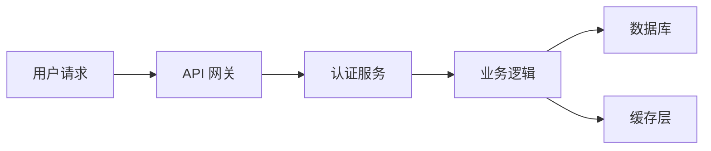

# README 与文档最佳实践

> 从零写出专业级 README，让项目第一印象赢得信任。

## 概述

README.md 是访问者在你的 Repository 中看到的第一份文件。GitHub 会自动将其渲染在仓库首页，
这意味着一份结构清晰、内容完整的 README 可以立刻回答"这个项目做什么、怎么用、如何参与"三个核心问题。

无论项目规模大小，README 都是最低成本、最高回报的文档投入。一份糟糕的 README 会直接劝退潜在用户和贡献者；
而一份优秀的 README 则是项目质量的门面。

> [!NOTE]
GitHub 支持在多个目录中放置 README 文件——不仅限于仓库根目录。每个子目录的 README 会显示在该目录的文件列表上方，
非常适合为大型项目提供层级化文档。

## 核心操作

### README 的推荐结构

一个成熟的 README 通常包含以下模块，你可以根据项目规模进行裁剪：

1. **项目标题与一句话描述**——让人 3 秒内理解项目定位。
2. **徽章（Badges）**——可视化展示构建状态、版本号、许可证等关键信息。
3. **安装说明**——提供可直接复制粘贴的安装命令。
4. **快速开始**——一个最小可运行示例，帮助用户在 5 分钟内上手。
5. **用法示例**——展示核心功能的典型用法。
6. **配置说明**——列出可配置项及其默认值。
7. **贡献指南**——指向 CONTRIBUTING.md 或给出简要流程。
8. **许可证**——指明开源协议。
9. **致谢与联系方式**——维护者信息和相关资源链接。

> [!TIP]
不必在每个项目中都包含全部模块。小型工具项目通常只需标题、安装和用法即可；
框架或库则需要更完整的结构。关键是让读者快速找到他需要的信息。

### 添加徽章

徽章使用 Shields.io 生成的 SVG 图片，以一行 Markdown 即可为项目增添专业感。

```markdown


```

徽章应放在项目标题下方、正文开始之前，保持紧凑排列。常用的徽章类型包括：

- **CI 状态**——展示构建是否通过
- **版本号**——npm、PyPI、Maven 等包管理器版本
- **许可证**——MIT、Apache-2.0 等
- **社交指标**——Star 数、Fork 数
- **覆盖率**——测试覆盖率百分比

### 使用 GFM 告示语法

GitHub Flavored Markdown（GFM）支持告示块语法，可在 Markdown 文件中创建醒目的提示框：

```markdown
> [!NOTE]
> 这是一条需要用户注意的补充信息。

> [!TIP]
> 这是一个能帮助用户节省时间的实用建议。

> [!WARNING]
> 这是一条关于安全风险或数据丢失的警告。

> [!IMPORTANT]
> 这是一条不可忽略的关键信息。

> [!CAUTION]
> 这条建议可能导致负面结果，请谨慎操作。
```

> [!WARNING]
告示语法仅在 GitHub 平台上渲染为彩色提示框。其他 Markdown 渲染器（如 VS Code 预览、npm 仓库页面）
会将其显示为普通引用块，不会带有颜色区分。

### 编写安装与快速开始

安装部分应提供可直接运行的命令，并按操作系统或包管理器分类：

````markdown
## 安装

使用 npm：

```bash
npm install <package-name>
```

使用 yarn：

```bash
yarn add <package-name>
```

## 快速开始

```javascript
import { greet } from '<package-name>';

greet('GitHub'); // => Hello, GitHub!
```
````

## 进阶技巧

### 目录式 README 与详情分离

当项目文档较多时，可以将 README 作为目录页，用相对链接指向各专题文档：

```markdown
## 文档索引

| 文档 | 说明 |
|------|------|
| [安装指南](docs/installation) | 详细的安装步骤与环境要求 |
| [API 参考](docs/api-reference) | 完整的 API 文档 |
| [贡献指南](CONTRIBUTING) | 如何参与项目开发 |
| [变更日志](CHANGELOG) | 版本更新记录 |
```

这样做的好处是 README 保持简洁，而详细内容分布在独立文件中，方便维护和协作。

### 使用 Mermaid 绘制架构图

GitHub 原生支持 Mermaid 语法，可以在 README 中嵌入流程图、时序图等可视化内容：

````markdown

````

Mermaid 支持多种图表类型：`graph`（流程图）、`sequenceDiagram`（时序图）、`classDiagram`（类图）、
`gantt`（甘特图）、`pie`（饼图）等。选择最能清晰表达逻辑的图表类型即可。
这比维护外部图片文件更方便，且随代码一起版本管理。

### README 文件的多语言策略

如果你的项目面向国际用户，可以考虑提供多语言版本的 README：

```markdown
[English](README) | [简体中文](README.zh-CN) | [日本語](README.ja)
```

推荐做法是将英文作为默认 `README.md`，其他语言版本使用 `README.<lang>.md` 命名。
在文件顶部放置语言切换链接，方便读者快速跳转。

### 动态徽章进阶

Shields.io 支持通过 URL 参数自定义样式，实现更灵活的视觉效果：

```markdown
<!-- 自定义颜色和标签 -->


<!-- 使用 JSON 端点的动态徽章 -->


<!-- 端点徽章：从自定义 API 获取数据 -->

```

## 常见问题

### Q: README 文件名必须大写吗？

GitHub 支持 README、readme、Readme 等多种大小写组合，但推荐使用全大写的 `README.md`。
这是社区约定俗成的惯例，也便于在终端中通过 `ls` 快速定位。如果你的仓库需要支持大小写
不敏感的文件系统（如 Windows），务必保持一致的大小写风格。

### Q: README 中应该放多少内容？

遵循"渐进展开"原则：README 包含 80% 用户需要的核心信息（安装、用法、配置），
其余 20% 的详细内容通过链接指向专题文档。一个好的经验法则是：README 在 GitHub
渲染后不应超过 3-4 屏滚动。

### Q: 徽章太多会影响页面加载吗？

不会显著影响。徽章是外部托管的 SVG 图片，体积很小（通常几百字节）。
但如果徽章超过 8-10 个，建议只保留最重要的（CI 状态、版本、许可证），
其余移到文档深处。过多的徽章会分散注意力，适得其反。

### Q: 如何在 README 中嵌入视频或 GIF？

GitHub 不支持直接嵌入视频播放器，但可以通过以下方式实现类似效果：
使用 GIF 动图展示操作流程（推荐工具：asciinema、LICEcap）；
在 Markdown 中用图片语法引用 GIF 文件，GitHub 会自动播放。

### Q: 私有仓库的 README 会被搜索引擎索引吗？

不会。私有仓库的 README 只有被授权的协作者才能查看，搜索引擎无法抓取。
但要注意：如果仓库从私有转为公开，历史中的所有 README 版本都会变为可访问的。

### Q: 除了 README.md，还有哪些文档文件值得关注？

以下是社区常用的文档文件约定：
- `CONTRIBUTING.md`——贡献流程与规范
- `CHANGELOG.md`——版本变更记录
- `CODE_OF_CONDUCT.md`——行为准则
- `LICENSE`——开源许可证
- `SECURITY.md`——安全漏洞报告流程

### Q: 如何让 README 在 npm 或 PyPI 页面上也正常显示？

npm 和 PyPI 会自动读取 README.md 作为包描述页，但它们使用的渲染器不完全兼容 GFM。
避免使用 GFM 特有语法（如告示块、自动链接引用），改用标准 Markdown 语法。
对于复杂排版，建议在发布前使用 `markdown-it` 或 `readme-so` 等工具预览渲染效果。

### Q: 可以用其他格式代替 Markdown 吗？

GitHub 支持 Markdown（.md）、reStructuredText（.rst）、Textile（.textile）等多种格式。
但 Markdown 是事实标准，拥有最好的工具生态和渲染效果。强烈建议统一使用 `.md` 格式。

### Q: 如何保持 README 与代码同步更新？

一个实用的习惯是在 CI 流程中加入 README 检查：
使用 `markdown-link-check` 检测死链接；用 `remark-lint` 统一 Markdown 格式；
在 Pull Request 模板中提醒贡献者同步更新 README。另外，将 README 中容易过期的信息
（如安装版本号）提取到配置文件或 CI 脚本中，通过徽章动态展示，可以减少手动维护的成本。
参见 [Wiki 使用指南](01-Wiki-使用指南) 了解如何用 Wiki 分担详细文档的维护压力。

## 参考链接

| 标题 | 说明 |
|------|------|
| [About READMEs](https://docs.github.com/en/repositories/managing-your-repositorys-settings-and-features/customizing-your-repository/about-readmes) | GitHub 官方关于 README 的说明 |
| [Shields.io](https://shields.io/) | 徽章生成服务，覆盖数百种数据源 |
| [GitHub Skills: Communicate using Markdown](https://github.com/skills/communicate-using-markdown) | GitHub 官方 Markdown 交互式教程 |
| [GitHub Flavored Markdown Spec](https://github.github.com/gfm/) | GFM 完整规范文档 |
| [Make a README](https://www.makeareadme.com/) | 社区维护的 README 编写指南 |
