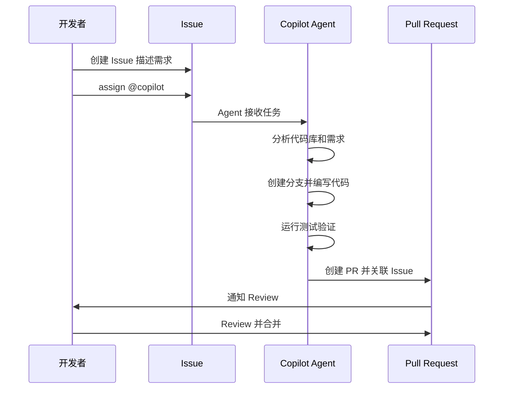

# GitHub Copilot 深度使用

> 从代码补全到自主编程 Agent，掌握 AI 编程助手的完整能力图谱。

## 概述

GitHub Copilot 是基于 AI 的编程助手，深度集成在 VS Code、JetBrains、Neovim 等主流编辑器中。它不仅能根据上下文自动补全代码，还支持自然语言对话（Copilot Chat）、自动代码审查（Copilot Code Review）和自主执行任务（Copilot Coding Agent）。从单行补全到端到端的功能实现，Copilot 覆盖了开发的各个环节。

Copilot 的核心能力分为四个层次：内联补全（Inline Suggestions）在你编码时实时给出建议；Chat 面板支持自由对话和代码解释；Edits 模式可以批量修改多个文件；Coding Agent 能够自主分析 Issue、编写代码并创建 Pull Request。理解每个层次的适用场景，是用好 Copilot 的关键。

> [!NOTE]
> Copilot 提供多个订阅级别：Copilot Free（每月 2,000 次补全和 50 次 Chat）、
> Copilot Business（无限补全和 Chat，含代码审查）、Copilot Enterprise（含 Coding Agent、
> 知识库索引和企业定制）。不同级别支持的 AI 模型也有所不同。

## 核心操作

### 内联代码补全

Copilot 最基础的能力是根据上下文实时给出代码建议：

1. 在编辑器中正常编写代码，Copilot 会以灰色文本显示建议。
2. 按 `Tab` 接受建议，按 `Esc` 拒绝。
3. 按 `Alt+]`（Mac: `Option+]`）查看下一个建议。
4. 按 `Ctrl+Enter` 打开 Copilot 建议面板，一次浏览多个候选方案。

提升补全质量的技巧：

- **写出清晰的注释**——Copilot 会根据注释生成对应的实现代码。
- **提供示例输入输出**——在注释中描述期望的行为，比模糊的需求更有效。
- **保持相关文件打开**——Copilot 会参考同仓库中打开的文件作为上下文。
- **使用有意义的命名**——变量名和函数名是 Copilot 理解意图的重要线索。

```javascript
// 良好的注释示例——Copilot 能生成精确的代码
// 将驼峰命名转换为下划线命名
// 例：camelCase -> camel_case
function camelToSnake(str) {
  // Copilot 会根据注释和示例自动补全实现
```

### Copilot Chat 对话

Copilot Chat 让你用自然语言与 AI 交流，直接在编辑器中获取帮助：

1. 在 VS Code 侧栏点击 **Chat** 图标，或按 `Ctrl+Shift+I`（Mac: `Cmd+Shift+I`）打开 Chat。
2. 使用 `@` 符号指定对话参与者：
   - `@workspace`——基于整个工作区回答问题。
   - `@vscode`——回答 VS Code 使用问题。
   - `@terminal`——解释终端命令的输出。
3. 使用 `/` 符号快速执行命令：
   - `/explain`——解释选中的代码。
   - `/tests`——为选中代码生成测试。
   - `/fix`——修复选中的代码问题。
   - `/doc`——为函数生成文档注释。

> [!TIP]
> 在 Chat 中使用 `#` 引用文件或符号，让 Copilot 聚焦于特定上下文。
> 例如输入 `@workspace #src/auth.ts 这个模块的安全风险是什么？` 可以获得更精准的分析。

### Copilot Edits 批量修改

Edits 模式允许你一次修改多个文件，适合大规模重构：

1. 在 Chat 面板切换到 **Edit** 模式。
2. 描述你想要的修改，例如"将所有 REST API 调用改为使用 fetch 替代 axios"。
3. Copilot 会展示每个文件的修改建议，你可以逐个接受或拒绝。
4. 修改完成后一键应用所有变更。

### 自定义指令（Custom Instructions）

自定义指令让 Copilot 了解你的项目规范和偏好，使其建议始终符合团队标准：

1. 在仓库根目录创建 `.github/copilot-instructions.md` 文件。
2. 写入项目特定的指导信息：

```markdown
# 项目规范

## 技术栈
- 前端使用 React 18 + TypeScript
- 状态管理使用 Zustand，不使用 Redux
- 样式使用 Tailwind CSS，不使用 styled-components

## 编码规范
- 使用函数式组件，不使用类组件
- 自定义 Hook 以 use 前缀命名
- 所有 API 调用放在 src/services/ 目录下
- 错误处理使用 try/catch，统一通过 handleError 函数处理

## 测试要求
- 使用 Vitest + React Testing Library
- 每个组件至少包含一个快照测试
- Mock 数据放在 __mocks__/ 目录
```

3. 在 VS Code 设置中启用自定义指令：
   - 打开 Settings → 搜索 "copilot instructions"。
   - 勾选 **Use custom instructions from files**。

> [!NOTE]
> Copilot Spaces 提供了更强大的上下文管理能力，允许你将多个仓库、文档和对话组织在一起，
> 为 Copilot 提供更丰富的项目背景。参见 [Copilot Spaces 文档](https://docs.github.com/en/copilot/concepts/context/spaces)。

### Copilot Code Review

Copilot 可以自动审查 Pull Request，提供代码质量反馈：

1. 在仓库 Settings → Copilot → Code review 中启用。
2. 创建 PR 时，Copilot 会自动审查并发表评论。
3. 你也可以在 PR 页面手动触发 Review：点击 **Request Copilot Review**。
4. Copilot 会分析代码变更，指出潜在问题并提供改进建议。

使用 CLI 触发 Copilot Review：

```bash
# 为 PR 请求 Copilot Review
gh pr edit 123 --add-reviewer copilot
```

### Copilot Coding Agent

Coding Agent 是 Copilot 最高级别的自主能力——它能够独立完成完整的开发任务：

1. 在 Issue 页面assign 给 `@copilot`，或添加 `copilot` 标签。
2. Copilot 分析 Issue 描述，理解需求。
3. 创建一个新的分支，自主编写代码和测试。
4. 提交 Pull Request 供你 Review。

Agent 工作流程：



> [!WARNING]
> Coding Agent 拥有对仓库的写权限，可以创建分支和提交代码。建议在分支保护规则中
> 要求 PR Review，确保 Agent 的输出经过人工审核后再合并。同时限制 Agent 可以操作的
> 仓库范围，避免对关键分支产生意外修改。

### 选择 AI 模型

Copilot 支持多种 AI 模型，你可以根据任务需求切换：

| 模型 | 特点 | 适用场景 |
|------|------|----------|
| GPT-4o | 平衡速度和质量 | 日常补全和对话 |
| Claude Sonnet | 强推理能力 | 复杂逻辑和重构 |
| o1 | 深度推理 | 架构设计和难题 |
| Gemini 2.0 Flash | 极速响应 | 简单补全 |

在 VS Code 中切换模型：点击 Chat 面板底部的模型选择器，选择当前可用的模型。

## 进阶技巧

### Prompt 工程最佳实践

向 Copilot 提问的质量直接影响回答的质量。以下是编写有效 Prompt 的原则：

1. **明确目标**——说明你要做什么，而不是怎么做。
2. **提供上下文**——引用相关文件、函数或错误信息。
3. **给出约束**——说明不希望使用的技术或模式。
4. **请求格式**——指定输出格式（代码、列表、步骤等）。

```javascript
// 差的 Prompt
// 写一个登录函数

// 好的 Prompt（通过注释引导）
// 创建一个 login 函数：
// - 接受 email 和 password 参数
// - 使用 bcrypt 验证密码
// - 成功返回 JWT token（有效期 24 小时）
// - 失败抛出 AuthenticationError
// - 使用 async/await 语法
async function login(email, password) {
```

### 索引仓库提升 Copilot 理解

对于大型仓库，Copilot 的上下文窗口可能无法覆盖所有代码。索引功能可以让 Copilot 更好地理解整个代码库：

1. 在仓库 Settings → Copilot 中启用 **Codebase indexing**。
2. Copilot 会对仓库代码建立语义索引。
3. Chat 中使用 `@workspace` 参与者时，Copilot 会利用索引搜索相关代码。

### 将 Copilot Chat 结果嵌入工作流

Chat 的输出可以直接转化为代码操作：

- **从 Chat 创建文件**——当 Copilot 生成完整文件内容时，点击"Insert into editor"。
- **从 Chat 启动终端命令**——当 Copilot 建议执行命令时，点击"Run in terminal"。
- **从 Chat 创建 PR**——描述完需求后，让 Copilot 直接创建分支和 PR。

### 在 Codespaces 中使用 Copilot

Copilot 在 Codespaces 中同样可用，且配置会自动继承：

1. Codespace 创建时自动启用 Copilot 扩展。
2. 自定义指令（`.github/copilot-instructions.md`）随仓库一起加载。
3. Chat、补全和 Edits 功能与本地开发环境完全一致。

关于 Codespaces 的配置和使用，参见 [Codespaces 云开发](05-Codespaces云开发.md)。

### 团队级 Copilot 管理

作为团队管理员，你可以统一管理 Copilot 的使用策略：

1. 在组织 Settings → Copilot 中配置策略。
2. 设置哪些仓库可以使用 Copilot。
3. 配置内容过滤策略（如阻止建议与公开代码匹配的片段）。
4. 查看团队成员的 Copilot 使用统计。
5. 统一管理自定义指令模板。

## 常见问题

### Q: Copilot 会将我的代码用于训练吗？

对于 Copilot Business 和 Enterprise 用户，代码不会被用于训练 AI 模型。
Copilot Individual 用户可以选择退出数据共享。所有用户的代码在传输过程中都经过加密，
不会被存储在 GitHub 的持久化存储中。详细的隐私政策请参考 GitHub 的数据保护文档。

### Q: 如何让 Copilot 的建议更准确？

三个关键技巧：第一，编写清晰的注释描述意图，包含输入输出示例；第二，使用 `.github/copilot-instructions.md`
提供项目规范；第三，保持相关文件打开，让 Copilot 参考更多上下文。对于复杂任务，
优先使用 Chat 面板而非依赖内联补全，因为 Chat 允许你迭代式地细化需求。

### Q: Copilot 支持哪些编程语言？

Copilot 支持绝大多数主流编程语言，包括 Python、JavaScript、TypeScript、Java、C#、
Go、Rust、Ruby、PHP、C/C++、Swift、Kotlin 等。对于语言生态中的框架和库也有很好的支持。
语言的支持质量与该语言在公开代码库中的占比正相关——Python 和 JavaScript 的建议通常最准确。

### Q: Coding Agent 可以处理多大的任务？

Coding Agent 适合处理边界清晰、描述明确的任务，例如"为 User 模型添加邮箱验证功能"。
它不太适合处理涉及大规模架构重构或需要深度业务理解的模糊需求。建议将大任务拆分为
多个小 Issue，每个 Issue 聚焦一个具体功能点，分别交给 Agent 处理。

### Q: Copilot Chat 和 ChatGPT 有什么区别？

Copilot Chat 深度集成在你的开发环境中：它知道你打开的文件、项目结构、终端状态，
甚至可以执行代码和终端命令。ChatGPT 是通用的对话 AI，不了解你的代码上下文。
对于编程任务，Copilot Chat 的上下文感知能力使其回答更加精准和可操作。

### Q: 如何在团队中推广 Copilot 的使用？

建议分阶段推进：第一阶段让早期采用者试用并总结最佳实践；第二阶段编写团队特定的
自定义指令文件（copilot-instructions.md）；第三阶段组织分享会，展示 Copilot 在
代码审查、测试编写和文档生成等场景的实际效果。团队内部积累的 Prompt 模板和技巧
可以整理为共享文档。

### Q: Copilot 生成的代码有安全风险吗？

Copilot 生成的代码可能包含安全漏洞，与任何开发者编写的代码一样需要 Review。
建议：始终 Review Copilot 生成的代码，特别是涉及认证、加密和数据库操作的部分；
启用 Copilot 的重复代码检测功能，避免引入有已知漏洞的代码模式；结合
GitHub 的代码扫描（CodeQL）对生成代码进行自动化安全检查。

### Q: Copilot Free 和 Copilot Business 的主要区别是什么？

Copilot Free 每月限制 2,000 次补全和 50 次 Chat 消息，不支持 Chat 中切换模型。
Copilot Business 无限制使用，支持组织策略管理、代码审查、IP 赔偿保障和
企业级 SSO。Enterprise 版本额外包含 Coding Agent、知识库索引和自定义模型微调。
个人开发者通常 Free 就足够日常使用。

## 参考链接

| 标题 | 说明 |
|------|------|
| [GitHub Copilot Documentation](https://docs.github.com/copilot) | 官方完整文档 |
| [GitHub Copilot Features](https://docs.github.com/en/copilot/get-started/features) | 功能特性概览 |
| [Best Practices for Using GitHub Copilot](https://docs.github.com/en/copilot/get-started/best-practices) | 使用最佳实践 |
| [Adding Repository Custom Instructions](https://docs.github.com/copilot/customizing-copilot/adding-custom-instructions-for-github-copilot) | 自定义指令配置 |
| [5 Tips for Writing Better Custom Instructions](https://github.blog/ai-and-ml/github-copilot/5-tips-for-writing-better-custom-instructions-for-copilot/) | 指令编写技巧 |
| [About GitHub Copilot Coding Agent](https://docs.github.com/copilot/concepts/agents/coding-agent/about-coding-agent) | Coding Agent 介绍 |
| [Copilot Coding Agent 101](https://github.blog/ai-and-ml/github-copilot/github-copilot-coding-agent-101-getting-started-with-agentic-workflows-on-github/) | Agent 入门教程 |
| [About GitHub Copilot Code Review](https://docs.github.com/en/copilot/concepts/agents/code-review) | 自动代码审查 |
| [Introduction to Prompt Engineering](https://learn.microsoft.com/en-us/training/modules/introduction-prompt-engineering-with-github-copilot/) | Prompt 工程入门 |
| [Leveling Up Code Reviews](https://learn.microsoft.com/en-us/training/modules/code-reviews-pull-requests-github-copilot/) | Copilot 代码审查教程 |
| [About GitHub Copilot Spaces](https://docs.github.com/en/copilot/concepts/context/spaces) | Spaces 上下文管理 |
| [Indexing Repositories for Copilot](https://docs.github.com/copilot/concepts/indexing-repositories-for-copilot-chat) | 仓库索引配置 |
| [AI Model Comparison](https://docs.github.com/en/copilot/reference/ai-models/model-comparison) | 模型对比参考 |
| [Autonomous Coding with Copilot Agent](https://www.youtube.com/watch?v=YD4hxzKxiZ8) | Agent 演示视频 |
