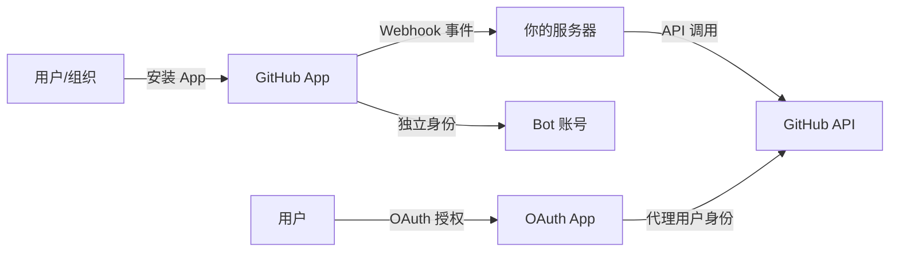
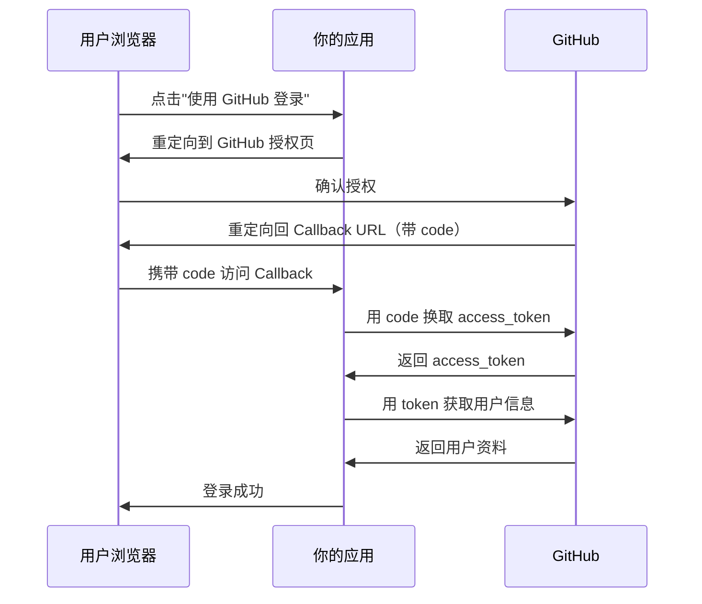

# GitHub Apps 与 OAuth App

> 构建以 GitHub 为核心的集成应用，从注册认证到权限管理的全流程指南。

## 概述

GitHub Apps 和 OAuth Apps 是两种在 GitHub 平台上构建第三方集成的方式。GitHub Apps 是现代推荐方案——它以精细的权限控制、事件驱动的 Webhook 和独立的身份体系成为官方首选；OAuth Apps 则是传统方案，适合需要以用户身份代理操作的场景。

选择哪种方式取决于你的需求：如果你要构建一个响应仓库事件的自动化工具（如自动 Review、标签管理），选择 GitHub Apps；如果你只需要让用户用 GitHub 账号登录你的网站，OAuth Apps 更简单直接。

> [!NOTE]
> GitHub 官方强烈推荐新项目使用 GitHub Apps。OAuth Apps 的功能不会移除，
> 但新功能（如细粒度权限、安装事件）只在 GitHub Apps 中提供。
> 如果你已有 OAuth App，GitHub 提供了迁移指南帮助你逐步过渡。

## 核心操作

### GitHub Apps 与 OAuth Apps 的区别

| 特性 | GitHub Apps | OAuth Apps |
|------|-------------|------------|
| 身份 | 独立身份（bot） | 代理用户身份 |
| 权限模型 | 细粒度（按仓库、按权限） | 粗粒度 scope |
| 安装方式 | 安装到仓库或组织 | 用户授权 |
| Webhook | 支持丰富的事件订阅 | 仅支持 OAuth 事件 |
| 速率限制 | 5,000 次/小时（每安装） | 5,000 次/小时（每用户） |
| Token 有效期 | 1 小时（可刷新） | 无固定过期 |



### 注册 GitHub App

1. 前往 **Settings → Developer settings → GitHub Apps → New GitHub App**。
2. 填写基本信息：
   - **GitHub App name**——应用名称（全局唯一）。
   - **Homepage URL**——你的应用主页。
   - **Webhook URL**——接收事件的端点。
   - **Webhook secret**——用于验证请求来源。
3. 配置权限（Permissions & events）：
   - 在 **Repository permissions** 中按需开启读取/写入权限。
   - 在 **Subscribe to events** 中勾选需要监听的事件。
4. 设置 **Where can this GitHub App be installed?**——选择 Public（任何人可安装）或 Only on this account。
5. 点击 **Create GitHub App**。

创建完成后，你会获得 App ID，并可以生成 Private Key（PEM 格式）用于 JWT 签名。

> [!WARNING]
> Private Key 是 GitHub App 认证的核心凭证，等效于密码。下载后请妥善保管，
> 绝不要提交到公开仓库。建议将 Key 存储在密钥管理服务中（如 AWS Secrets Manager、HashiCorp Vault）。

### 生成和刷新安装令牌

GitHub App 使用 JWT（JSON Web Token）获取安装令牌（Installation Access Token），流程如下：

```javascript
import jwt from 'jsonwebtoken';
import { Octokit } from 'octokit';

// 从环境变量读取配置
const APP_ID = process.env.GITHUB_APP_ID;
const PRIVATE_KEY = process.env.GITHUB_APP_PRIVATE_KEY;

// 生成 JWT
function generateJwt() {
  const now = Math.floor(Date.now() / 1000);
  return jwt.sign(
    { iat: now - 60, exp: now + 600, iss: APP_ID },
    PRIVATE_KEY,
    { algorithm: 'RS256' }
  );
}

// 获取安装令牌
async function getInstallationToken(installationId) {
  const appOctokit = new Octokit({ auth: generateJwt() });
  const { data } = await appOctokit.rest.apps.createInstallationAccessToken({
    installation_id: installationId,
  });
  return data.token; // 有效期 1 小时
}
```

使用 `gh` 命令也可以生成安装令牌：

```bash
# 使用 gh 获取 App 的安装令牌
gh api app/installations --jq '.[0].id' | \
  xargs -I {} gh api app/installations/{}/access-tokens --method POST --jq '.token'
```

### 使用 Probot 快速开发 GitHub App

Probot 是一个基于 Node.js 的 GitHub App 框架，极大简化了开发流程：

```bash
# 创建 Probot 项目
npx create-probot-app my-github-app
cd my-github-app
```

Probot 应用的核心代码示例：

```javascript
// app.js
module.exports = (app) => {
  // 监听新建 Issue 事件
  app.on('issues.opened', async (context) => {
    const issueComment = context.issue({
      body: '感谢你提交 Issue！维护团队会尽快查看。',
    });
    await context.octokit.issues.createComment(issueComment);
  });

  // 监听 PR 打开事件，自动添加标签
  app.on('pull_request.opened', async (context) => {
    await context.octokit.issues.addLabels(
      context.issue({ labels: ['needs-review'] })
    );
  });

  // 监听 Star 事件
  app.on('star.created', async (context) => {
    app.log.info(`${context.payload.sender.login} 加星了仓库！`);
  });
};
```

Probot 开发环境使用 `.env` 文件配置：

```bash
# .env
APP_ID=12345
PRIVATE_KEY_PATH=./private-key.pem
WEBHOOK_PROXY_URL=https://smee.io/your-channel
WEBHOOK_SECRET=your-webhook-secret
```

> [!TIP]
> 使用 [smee.io](https://smee.io/) 可以将 GitHub Webhook 转发到本地开发服务器，
> 无需部署到公网即可调试。运行 `npx smee -u https://smee.io/your-channel` 即可启动代理。

### OAuth App 注册与授权流程

1. 前往 **Settings → Developer settings → OAuth Apps → New OAuth App**。
2. 填写 **Application name**、**Homepage URL** 和 **Authorization callback URL**。
3. 注册完成后获取 **Client ID**，在应用设置页生成 **Client Secret**。

OAuth 授权码流程：



实现 OAuth 授权的 Express.js 示例：

```javascript
const express = require('express');
const app = express();

const CLIENT_ID = process.env.GITHUB_CLIENT_ID;
const CLIENT_SECRET = process.env.GITHUB_CLIENT_SECRET;

// 第一步：重定向用户到 GitHub 授权页
app.get('/auth/github', (req, res) => {
  const redirectUrl = `https://github.com/login/oauth/authorize?client_id=${CLIENT_ID}&scope=read:user,user:email`;
  res.redirect(redirectUrl);
});

// 第二步：处理 GitHub 回调，用 code 换取 token
app.get('/auth/github/callback', async (req, res) => {
  const { code } = req.query;

  const tokenResponse = await fetch(
    'https://github.com/login/oauth/access_token',
    {
      method: 'POST',
      headers: {
        'Content-Type': 'application/json',
        Accept: 'application/json',
      },
      body: JSON.stringify({
        client_id: CLIENT_ID,
        client_secret: CLIENT_SECRET,
        code: code,
      }),
    }
  );
  const { access_token } = await tokenResponse.json();

  // 第三步：用 token 获取用户信息
  const userResponse = await fetch('https://api.github.com/user', {
    headers: { Authorization: `Bearer ${access_token}` },
  });
  const user = await userResponse.json();
  res.send(`欢迎，${user.login}！`);
});
```

### 配置 App 权限

GitHub App 的权限分为三类：

- **Repository permissions**——仓库级别（Issue、PR、代码读取等）。
- **Organization permissions**——组织级别（成员管理、团队等）。
- **Account permissions**——用户账号级别（邮箱、Profile 等）。

常用权限配置：

| 权限 | 用途 | 推荐级别 |
|------|------|----------|
| Issues — Read & Write | 读写 Issue | 自动化标签、评论 |
| Pull requests — Read & Write | 读写 PR | 自动 Review、合并 |
| Contents — Read | 读取代码 | 代码分析、CI |
| Metadata — Read | 基础信息（必选） | 所有 App 必须 |
| Commit statuses — Read & Write | 读写提交状态 | CI 状态报告 |

> [!WARNING]
> 遵循最小权限原则，只申请你的 App 实际需要的权限。过多的权限会让用户在安装时产生安全顾虑，
> 也会增加 Token 被滥用时的风险影响范围。

## 进阶技巧

### 使用 GitHub App 而非 Bot 账号

很多团队使用"Bot 用户"（一个共享密码的普通账号）执行自动化操作。这存在明显问题：
密码泄露影响大、难以审计操作来源、无法限制仓库范围。GitHub App 是官方推荐的替代方案：

- 独立身份，不占用用户席位。
- 权限精确到仓库级别。
- 操作记录清晰标识 App 身份。
- Token 自动过期，无需手动管理。

### 将 GitHub App 部署到 GitHub Marketplace

如果你的 App 面向公众提供服务，可以发布到 GitHub Marketplace：

1. 确保 App 满足 [Marketplace 要求](https://docs.github.com/en/apps/publishing-apps-to-github-marketplace/requirements-for-listing-an-app)。
2. 在 App 设置页点击 **Marketplace → List your app**。
3. 提交审核，GitHub 团队会检查安全性、功能完整性和文档质量。
4. 审核通过后，你的 App 将出现在 Marketplace 中供所有人安装。

### 在 Actions 中使用 GitHub App Token

在 Actions 中使用 GitHub App 比 `GITHUB_TOKEN` 拥有更大灵活性（例如触发后续 Workflow）：

```yaml
jobs:
  build:
    runs-on: ubuntu-latest
    steps:
      - name: 获取 App Token
        id: app-token
        uses: actions/create-github-app-token@v1
        with:
          app-id: ${{ secrets.APP_ID }}
          private-key: ${{ secrets.APP_PRIVATE_KEY }}

      - name: 使用 App Token
        env:
          GH_TOKEN: ${{ steps.app-token.outputs.token }}
        run: |
          gh api repos/{owner}/{repo}/dispatches \
            --method POST \
            -f event_type=app-triggered
```

### Webhook 安全验证

每个 Webhook 请求都携带签名，你必须在服务端验证它：

```javascript
const crypto = require('crypto');

function verifyWebhookSignature(payload, signatureHeader, secret) {
  if (!signatureHeader) {
    throw new Error('缺少签名 Header');
  }
  const signature = crypto
    .createHmac('sha256', secret)
    .update(payload)
    .digest('hex');
  const expected = `sha256=${signature}`;
  try {
    return crypto.timingSafeEqual(
      Buffer.from(expected),
      Buffer.from(signatureHeader)
    );
  } catch {
    return false;
  }
}

// Express 中间件
app.post('/webhook', (req, res) => {
  const signature = req.headers['x-hub-signature-256'];
  const payload = JSON.stringify(req.body);

  if (!verifyWebhookSignature(payload, signature, process.env.WEBHOOK_SECRET)) {
    return res.status(401).send('签名验证失败');
  }

  // 处理事件
  const event = req.headers['x-github-event'];
  console.log(`收到事件: ${event}`);
  res.status(200).send('OK');
});
```

## 常见问题

### Q: GitHub App 可以安装在组织中的特定仓库吗？

可以。安装 GitHub App 时，你可以选择"All repositories"或"Only select repositories"。
组织管理员还可以配置 App 的安装策略——限制哪些仓库可以被 App 访问。
已安装的 App 可以随时修改安装范围，不需要重新授权。

### Q: 一个 GitHub App 可以监听多少种事件？

GitHub App 可以订阅 70 多种 Webhook 事件。你可以在 App 设置的"Permissions & Webhooks"页面
按需勾选。注意：开启某种事件的监听通常需要授予对应的权限。例如，监听 `issues` 事件需要
至少 Issues 的读取权限。

### Q: OAuth App 的 Token 会过期吗？

Classic OAuth App 的 Token 默认不过期。但你可以在 App 设置中启用"Expire user authorization tokens"，
使 Token 在一段时间后失效。启用后，GitHub 会同时返回 `refresh_token`，用于获取新的 Access Token。
强烈建议启用此选项以提高安全性。

### Q: 如何调试 GitHub App 的 Webhook？

推荐以下调试方法：
1. 使用 [smee.io](https://smee.io/) 将 Webhook 转发到本地。
2. 在 GitHub App 设置页的"Advanced"标签中查看最近的 Webhook 投递记录和响应状态。
3. 在该页面可以重新投递（Redeliver）失败的 Webhook。
4. 在服务端记录完整的请求头和请求体，用于排查签名验证失败等问题。

### Q: GitHub App 和 GitHub Action 有什么关系？

它们是互补的工具。GitHub Action 是事件驱动的自动化 Workflow，运行在 GitHub 的运行器上；
GitHub App 是可编程的集成服务，运行在你自己的服务器上。当 Actions 无法满足需求时
（如需要持久连接、自定义 UI、跨仓库操作），GitHub App 是更好的选择。
在 Actions 中也可以通过 App Token 获取更大的 API 权限。

### Q: 多个仓库需要相同的自动化，用 App 还是 Action？

如果自动化逻辑涉及多个仓库、需要集中管理，GitHub App 更合适——一次安装即可覆盖多个仓库，
修改逻辑只需更新 App 服务端。如果自动化逻辑与单个仓库紧密耦合（如该仓库特有的 CI 流程），
GitHub Actions 更直观。两者也可以结合使用。

### Q: 如何让 GitHub App 在 PR 中自动 Review？

```javascript
module.exports = (app) => {
  app.on('pull_request.opened', async (context) => {
    // 获取 PR 的变更文件
    const files = await context.octokit.pulls.listFiles(context.repo({
      pull_number: context.payload.pull_request.number,
    }));

    const hasLargeFiles = files.data.some(f => f.changes > 500);

    if (hasLargeFiles) {
      await context.octokit.pulls.createReview(context.repo({
        pull_number: context.payload.pull_request.number,
        body: '本次 PR 包含单文件超过 500 行的变更，请仔细 Review。',
        event: 'COMMENT',
      }));
    }
  });
};
```

### Q: Private Key 过期了怎么办？

GitHub App 的 Private Key 本身不会过期，但你可以随时轮换。在 App 设置页的"Private keys"区域，
你可以添加新 Key、删除旧 Key。建议定期轮换（如每 90 天），并保留一个短暂的过渡期
（新旧 Key 同时有效），确保服务不中断。

## 参考链接

| 标题 | 说明 |
|------|------|
| [GitHub Apps Documentation](https://docs.github.com/en/apps) | GitHub Apps 完整文档 |
| [About Creating GitHub Apps](https://docs.github.com/en/apps/creating-github-apps/about-creating-github-apps/about-creating-github-apps) | GitHub App 创建概述 |
| [Quickstart for Building GitHub Apps](https://docs.github.com/en/apps/creating-github-apps/writing-code-for-a-github-app/quickstart) | 快速入门教程 |
| [probot/probot](https://github.com/probot/probot) | Probot 框架源码 |
| [Probot 官方网站](https://probot.github.io/) | Probot 文档和示例 |
| [Developing My First GitHub App with Probot](https://dev.to/github/developing-my-first-github-app-with-probot-3g0p) | 实战教程 |
