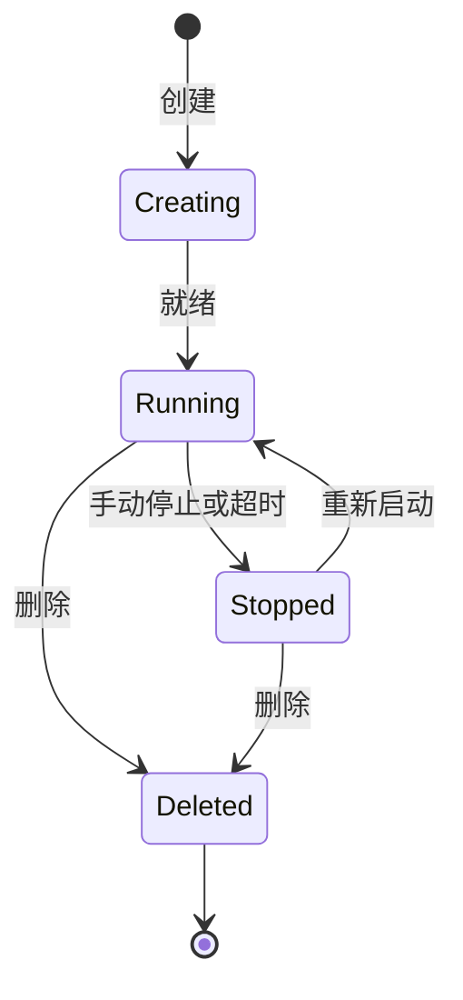

# Codespaces 云开发

> 一键启动云端完整开发环境，预配置、预构建，从任何设备随时编码。

## 概述

GitHub Codespaces 是 GitHub 提供的云端开发环境。每个 Codespace 是一个运行在云端的完整开发容器（dev container），包含操作系统、运行时、工具链和编辑器。你可以在浏览器中使用 VS Code Web 版直接编码，也可以用本地 VS Code 或 JetBrains 远程连接。

Codespaces 的核心价值在于"环境一致性"——所有团队成员使用相同的容器配置，彻底消除"在我机器上能跑"的问题。结合预构建（prebuild）功能，新环境可以在几秒内就绪，无需手动安装依赖。

> [!NOTE]
> Codespaces 对个人用户每月提供 120 核心小时和 15 GB 存储的免费额度。
> 组织和企业可以根据需要为成员配置更高的额度限制。超出免费额度的部分按使用量计费，
> 价格取决于你选择的虚拟机规格（2 核心约 $0.18/小时）。

## 核心操作

### 创建 Codespace

1. 在仓库页面点击 **Code** 按钮。
2. 切换到 **Codespaces** 标签。
3. 点击 **Create codespace on main**（或选择其他分支）。
4. 等待环境就绪，浏览器会自动打开 VS Code Web 编辑器。

使用 CLI 创建：

```bash
# 在当前仓库创建 Codespace
gh codespace create

# 指定仓库和分支
gh codespace create -r owner/repo -b feature-branch

# 查看所有 Codespaces
gh codespace list

# 在浏览器中打开
gh codespace code --web
```

> [!TIP]
> 在任意 GitHub 页面按 `.` 键（句号），即可用当前文件打开 Web 编辑器。
> 这是最快浏览和编辑代码的方式，无需创建完整的 Codespace。

### 配置 dev container

dev container 是 Codespaces 的核心配置文件，定义了开发环境的一切：

1. 在仓库根目录创建 `.devcontainer` 目录。
2. 创建 `devcontainer.json` 配置文件：

```json
{
  "name": "Node.js 开发环境",
  "image": "mcr.microsoft.com/devcontainers/javascript-node:20",
  "features": {
    "ghcr.io/devcontainers/features/github-cli:1": {},
    "ghcr.io/devcontainers/features/docker-in-docker:2": {}
  },
  "forwardPorts": [3000, 5432],
  "postCreateCommand": "npm install",
  "postStartCommand": "npm run db:migrate",
  "customizations": {
    "vscode": {
      "extensions": [
        "dbaeumer.vscode-eslint",
        "esbenp.prettier-vscode",
        "bradlc.vscode-tailwindcss"
      ],
      "settings": {
        "editor.formatOnSave": true,
        "editor.defaultFormatter": "esbenp.prettier-vscode"
      }
    }
  },
  "remoteUser": "node"
}
```

3. 提交配置文件到仓库，后续创建的 Codespace 将自动使用此配置。

### 使用预定义模板

Microsoft 提供了大量预定义的开发容器模板，覆盖常见技术栈：

```bash
# 查看 dev container 功能列表
# 前往 https://github.com/devcontainers/features 查看所有可用 Feature
```

常用基础镜像：

| 镜像 | 适用场景 |
|------|----------|
| `mcr.microsoft.com/devcontainers/javascript-node:20` | Node.js 项目 |
| `mcr.microsoft.com/devcontainers/python:3.12` | Python 项目 |
| `mcr.microsoft.com/devcontainers/go:1.22` | Go 项目 |
| `mcr.microsoft.com/devcontainers/dotnet:8.0` | .NET 项目 |
| `mcr.microsoft.com/devcontainers/typescript-node:20` | TypeScript 项目 |
| `mcr.microsoft.com/devcontainers/universal:2` | 多语言通用环境 |

### 多容器配置（Docker Compose）

如果项目需要多个服务（如 Web + 数据库 + 缓存），使用 Docker Compose：

```json
{
  "name": "全栈开发环境",
  "dockerComposeFile": "docker-compose.yml",
  "service": "app",
  "workspaceFolder": "/workspace",
  "forwardPorts": [3000, 5432, 6379],
  "postCreateCommand": "npm install && npm run db:setup"
}
```

配合 `docker-compose.yml`：

```yaml
version: '3.8'
services:
  app:
    build:
      context: .
      dockerfile: Dockerfile
    volumes:
      - ..:/workspace:cached
    command: sleep infinity

  db:
    image: postgres:16
    environment:
      POSTGRES_DB: myapp
      POSTGRES_USER: dev
      POSTGRES_PASSWORD: devpassword
    volumes:
      - postgres-data:/var/lib/postgresql/data

  redis:
    image: redis:7-alpine
    volumes:
      - redis-data:/data

volumes:
  postgres-data:
  redis-data:
```

### 端口转发

Codespaces 自动检测并转发常用端口，你也可以手动配置：

1. 在 Codespace 中打开 **Ports** 面板（底部面板 → Ports 标签）。
2. 点击 **Forward a Port** 输入端口号。
3. 右键端口可以设置可见性：
   - **Private**——仅自己可访问（默认）。
   - **Organization**——组织成员可访问。
   - **Public**——任何人都可访问。

在 `devcontainer.json` 中预配置端口：

```json
{
  "forwardPorts": [3000, 8080],
  "portsAttributes": {
    "3000": {
      "label": "Web 应用",
      "onAutoForward": "notify"
    },
    "8080": {
      "label": "API 服务",
      "onAutoForward": "openBrowser"
    }
  }
}
```

### 管理 Codespace 生命周期

```bash
# 列出所有 Codespaces
gh codespace list

# 停止 Codespace（节省费用）
gh codespace stop

# 删除 Codespace
gh codespace delete

# 查看正在运行的 Codespace 的 SSH 连接信息
gh codespace ssh

# 通过 SSH 连接到 Codespace
gh codespace ssh -c codespace-name

# 在 Codespace 中执行命令（无需进入）
gh codespace exec -c codespace-name -- npm test
```

Codespace 生命周期状态：



> [!WARNING]
> Codespace 停止后不活跃的磁盘仍会占用存储配额。长期不用的 Codespace 请及时删除。
> 默认情况下，Codespace 在 30 分钟无活动后自动停止，你可以在 Settings 中调整超时时间。

### 配置 Secrets

Codespaces 可以安全地访问敏感信息（API Key、数据库密码等）：

1. **用户级别**——Settings → Codespaces → Secrets → New secret。
2. **仓库级别**——仓库 Settings → Secrets and variables → Codespaces → New repository secret。
3. **组织级别**——组织 Settings → Codespaces → Secrets → New organization secret。

在 Codespace 中，Secret 以环境变量形式可用：

```bash
# 在 Codespace 终端中访问
echo $MY_API_KEY
```

在 `devcontainer.json` 中声明需要的 Secrets：

```json
{
  "remoteEnv": {
    "DATABASE_URL": "${localEnv:DATABASE_URL}",
    "API_KEY": "${localEnv:API_KEY}"
  }
}
```

## 进阶技巧

### 配置预构建（Prebuild）

预构建将环境初始化步骤提前执行，让新 Codespace 几秒内就绪：

1. 在仓库 Settings → Codespaces → Prebuilds configuration 中创建配置。
2. 选择目标分支和区域。
3. 配置触发条件（每次 push 或定时执行）。

预构建的 Workflow 文件示例（`.github/workflows/codespace-prebuild.yml`）：

```yaml
name: Codespace Prebuild
on:
  push:
    branches: [main]
  schedule:
    - cron: '0 0 * * 1'  # 每周一重建

jobs:
  prebuild:
    runs-on: ubuntu-latest
    steps:
      - uses: actions/checkout@v4
      - name: 缓存依赖
        run: |
          npm ci
          npm run build
```

> [!TIP]
> 对于依赖安装耗时较长的项目（如大型 monorepo），预构建可以将 Codespace 启动时间
> 从几分钟缩短到 10 秒以内。建议至少在主分支上启用预构建。

### 自定义 dotfiles

Codespaces 支持自动应用你的个人 dotfiles（shell 别名、Git 配置等）：

1. 创建一个名为 `dotfiles` 的仓库。
2. 在仓库中放入 `.bashrc`、`.zshrc`、`.gitconfig` 等文件。
3. 如果有 `install.sh`，它会自动执行。
4. 在 Settings → Codespaces → Dotfiles 中勾选启用。

### 使用本地编辑器连接 Codespace

除了浏览器，你还可以使用本地编辑器远程连接：

```bash
# 使用 VS Code 连接
gh codespace code -c codespace-name

# 使用 JetBrains Gateway 连接
# 在 JetBrains Gateway 中选择 GitHub Codespaces 插件
```

VS Code 需要安装 **GitHub Codespaces** 扩展。安装后通过命令面板（Cmd+Shift+P）搜索
"Codespaces: Connect to Codespace" 即可。

### 团队标准化开发环境

为团队统一开发环境的最佳实践：

1. **将 `.devcontainer` 纳入版本控制**——所有成员共享同一配置。
2. **使用 Dockerfile 而非预构建镜像**——精确控制每个安装步骤。
3. **结合 Features 添加工具**——`ghcr.io/devcontainers/features/*` 提供模块化工具安装。
4. **在 `postCreateCommand` 中安装项目依赖**——确保环境与 `package.json` / `requirements.txt` 同步。
5. **配置 `.editorconfig` 和 VS Code 设置**——统一代码格式。

### 使用 Codespace 进行 Code Review

Codespaces 非常适合用来 Review PR——你可以直接在 PR 页面打开 Codespace：

```bash
# 为特定 PR 创建 Codespace
gh pr checkout 123
gh codespace create -b the-pr-branch

# 或直接在 PR 页面点击 "Open in Codespace"
```

这样你可以在完整环境中运行代码、执行测试，而不是仅仅在网页上查看 diff。

## 常见问题

### Q: Codespaces 的费用如何计算？

费用由两部分组成：计算核心时间和存储空间。个人账号每月免费 120 核心小时和 15 GB 存储。
超出部分按核心规格计费：2 核心约 $0.18/小时，4 核心约 $0.36/小时，8 核心约 $0.72/小时。
存储约 $0.07/GB/月。组织管理员可以为成员设置月度支出上限。

### Q: Codespace 的默认超时时间可以修改吗？

可以。在 GitHub Settings → Codespaces → Default idle timeout 中设置超时时间（5-240 分钟）。
你也可以在 `devcontainer.json` 中通过 `hostRequirements` 设置，或使用 `gh codespace edit` 修改。
推荐设置为 30 分钟，平衡费用和便利性。

### Q: 如何在 Codespace 中访问 GitHub Container Registry？

Codespace 内置的 `GITHUB_TOKEN` 自动拥有包读取权限。拉取镜像时：

```bash
docker pull ghcr.io/owner/image:tag
```

如果需要推送镜像，需要配置额外的 Personal Access Token 或使用 Codespace Secrets
存储具有 `write:packages` 权限的 Token。

### Q: devcontainer.json 放在子目录中可以吗？

可以。如果你的仓库包含多个项目，可以在子目录中创建 `.devcontainer/devcontainer.json`。
创建 Codespace 时可以选择使用哪个配置。你也可以使用 `devcontainer.json` 的
`"workspaceFolder"` 指定工作目录。

### Q: Codespaces 支持 GPU 吗？

支持。部分区域提供 GPU 加速的 Codespace（使用 `"hostRequirements": {"gpu": true}` 配置）。
GPU Codespace 的费用更高，适合机器学习开发场景。可用性取决于区域和资源配额。

### Q: 如何将本地 SSH Key 传入 Codespace？

不推荐直接复制 SSH Key。更好的做法是使用 GitHub CLI 的 SSH 转发功能：

```bash
gh codespace ssh -c codespace-name
```

这会自动将你的本地 SSH Agent 转发到 Codespace 中。如果需要持久化的 Key，
将 SSH 私钥存储为 Codespace Secret，在 `postCreateCommand` 中写入。

### Q: 多人可以共享一个 Codespace 吗？

不可以。每个 Codespace 绑定一个用户。如果需要实时协作，推荐使用
VS Code 的 Live Share 扩展——在 Codespace 中启动 Live Share 后，
其他开发者可以在自己的编辑器中实时看到和编辑代码。

### Q: Codespace 中如何调试端口转发不生效的问题？

首先检查服务是否真的在监听指定端口（`lsof -i :3000`）。然后查看 Ports 面板是否显示该端口。
如果端口未自动检测，手动添加。确认端口的可见性设置是否正确。如果使用自定义域名，
确保在 Codespace 设置中配置了对应的端口属性。

## 参考链接

| 标题 | 说明 |
|------|------|
| [Codespaces Documentation](https://docs.github.com/en/codespaces) | 官方完整文档 |
| [Quickstart for GitHub Codespaces](https://docs.github.com/codespaces/getting-started/quickstart) | 快速入门指南 |
| [Introduction to Dev Containers](https://docs.github.com/en/codespaces/setting-up-your-project-for-codespaces/adding-a-dev-container-configuration/introduction-to-dev-containers) | Dev Container 概念介绍 |
| [Adding a Dev Container Configuration](https://docs.github.com/en/codespaces/setting-up-your-project-for-codespaces/adding-a-dev-container-configuration) | 配置文件编写指南 |
| [Understanding the Codespace Lifecycle](https://docs.github.com/en/codespaces/about-codespaces/understanding-the-codespace-lifecycle) | 生命周期管理 |
| [Forwarding Ports in Your Codespace](https://docs.github.com/en/codespaces/developing-in-a-codespace/forwarding-ports-in-your-codespace) | 端口转发详解 |
| [Security in GitHub Codespaces](https://docs.github.com/en/codespaces/reference/security-in-github-codespaces) | 安全最佳实践 |
| [Codespaces Configuration](https://www.youtube.com/watch?v=ldAlq4e4W5w) | 视频配置教程 |
