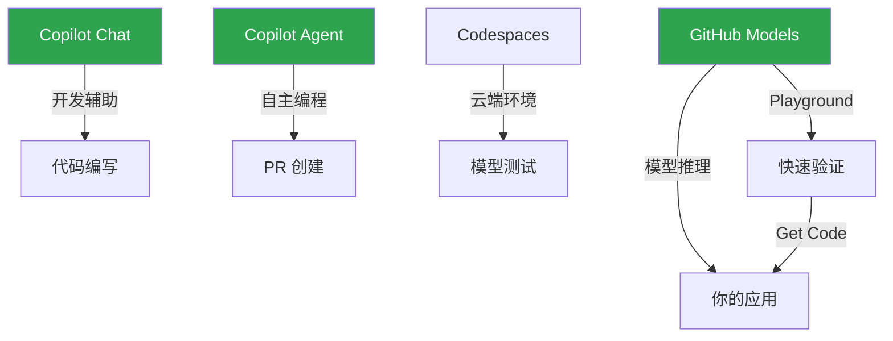

# GitHub Models 与 AI 生态

> 在 GitHub 平台上直接访问和评估主流 AI 模型，从原型验证到生产集成的全链路方案。

## 概述

GitHub Models 是 GitHub 提供的 AI 模型市场和推理平台。你可以在 GitHub 上直接浏览、试用和集成来自 OpenAI、Meta、Microsoft、Google、Mistral 等厂商的主流大语言模型，无需分别注册各家 API。它提供了一个统一的 Playground 用于快速验证模型效果，并通过标准化的 REST API 将模型能力集成到你的应用中。

GitHub Models 的核心价值在于降低 AI 集成门槛。你不需要管理 API Key 的多平台分发，不需要对比不同模型的接口差异——GitHub 提供统一的端点和计费方式。结合 GitHub Codespaces 和 GitHub Actions，你可以在熟悉的开发工作流中完成从模型选型、Prompt 调优到部署上线的全过程。

> [!NOTE]
> GitHub Models 目前支持通过 GitHub Marketplace 发现模型，通过 Playground 交互测试，
> 以及通过 REST API 调用推理。Copilot 中使用的模型列表与 Models 市场有重叠但不完全一致——
> Copilot 侧重编程场景，Models 面向通用 AI 应用。

## 核心操作

### 浏览和发现模型

1. 在 GitHub 导航栏点击 **Marketplace** → **Models**，或直接访问 `github.com/marketplace/models`。
2. 浏览可用模型列表，每个模型卡片展示名称、提供者、参数规模和简介。
3. 点击模型卡片进入详情页，查看模型描述、使用限制和定价信息。
4. 使用筛选器按提供者（OpenAI、Meta、Mistral 等）或任务类型（文本生成、代码、嵌入）过滤。

部分可用模型：

| 模型 | 提供者 | 适用场景 |
|------|--------|----------|
| GPT-4o | OpenAI | 通用对话、复杂推理 |
| GPT-4o-mini | OpenAI | 轻量级任务、高吞吐 |
| Llama 3.3 70B | Meta | 开源替代、多语言 |
| Mistral Large | Mistral AI | 欧洲合规场景 |
| Phi-4 | Microsoft | 小模型高效率 |
| Cohere Command R+ | Cohere | RAG 和检索增强 |
| embedding-3-large | Google | 文本嵌入和语义搜索 |

### 使用 Playground 测试模型

Playground 提供了一个交互式界面，让你在不写代码的情况下测试模型效果：

1. 进入模型详情页，点击 **Playground** 标签。
2. 在 **System message** 区域输入系统提示词，定义模型角色和行为约束。
3. 在聊天输入框中输入用户消息，按回车发送。
4. 查看模型响应，调整参数（温度、最大 Token 数等）后重新测试。
5. 满意后点击 **Get code** 按钮，生成可直接使用的 API 调用代码。

> [!TIP]
> Playground 支持实时切换模型对比效果。在同一个对话中测试不同模型对同一 Prompt 的响应，
> 可以快速找到最适合你场景的模型。切换后对话历史会保留，方便直接对比。

### 通过 REST API 调用模型

GitHub Models 提供与 OpenAI 兼容的 REST API 端点，迁移成本极低：

```bash
# 调用 Chat Completion API
curl -X POST \
  -H "Authorization: Bearer <your-github-token>" \
  -H "Content-Type: application/json" \
  https://models.inference.ai.azure.com/chat/completions \
  -d '{
    "model": "gpt-4o",
    "messages": [
      {"role": "system", "content": "你是一个有帮助的助手。"},
      {"role": "user", "content": "解释什么是 RAG 技术"}
    ],
    "temperature": 0.7,
    "max_tokens": 1000
  }'
```

使用 `gh` 命令调用：

```bash
gh api models.inference.ai.azure.com/chat/completions \
  --method POST \
  -f model=gpt-4o \
  -f messages='[{"role":"user","content":"用一句话解释量子计算"}]' \
  --jq '.choices[0].message.content'
```

### 在应用中集成 GitHub Models

GitHub Models 的 API 与 OpenAI SDK 兼容，只需修改 base_url 和 api_key：

**Python 示例**（使用 OpenAI SDK）：

```python
import os
from openai import OpenAI

# 使用 GitHub Token 作为 API Key
client = OpenAI(
    base_url="https://models.inference.ai.azure.com",
    api_key=os.environ["GITHUB_TOKEN"],
)

response = client.chat.completions.create(
    model="gpt-4o",
    messages=[
        {"role": "system", "content": "你是一个代码审查助手。"},
        {"role": "user", "content": "审查这段代码是否有安全问题：def login(user, pwd): query = f\"SELECT * FROM users WHERE name='{user}' AND pass='{pwd}'\""},
    ],
    temperature=0.3,
)

print(response.choices[0].message.content)
```

**JavaScript 示例**（使用 OpenAI SDK）：

```javascript
import OpenAI from 'openai';

const client = new OpenAI({
  baseURL: 'https://models.inference.ai.azure.com',
  apiKey: process.env.GITHUB_TOKEN,
});

async function chat(message) {
  const response = await client.chat.completions.create({
    model: 'gpt-4o',
    messages: [
      { role: 'system', content: '你是一个技术文档翻译助手。' },
      { role: 'user', content: message },
    ],
    temperature: 0.3,
  });
  return response.choices[0].message.content;
}

const result = await chat('将以下内容翻译为中文：GitHub Models provides a unified API for AI model inference.');
console.log(result);
```

### 在 GitHub Actions 中使用 Models

结合 Actions 实现自动化 AI 工作流：

```yaml
name: AI Code Review
on:
  pull_request:
    types: [opened, synchronize]

jobs:
  ai-review:
    runs-on: ubuntu-latest
    permissions:
      models: read
      pull-requests: write
    steps:
      - uses: actions/checkout@v4

      - name: 获取 PR 变更
        id: diff
        env:
          GH_TOKEN: ${{ secrets.GITHUB_TOKEN }}
        run: |
          DIFF=$(gh pr diff ${{ github.event.pull_request.number }})
          echo "diff<<EOF" >> $GITHUB_OUTPUT
          echo "$DIFF" >> $GITHUB_OUTPUT
          echo "EOF" >> $GITHUB_OUTPUT

      - name: AI 审查代码
        id: review
        env:
          GH_TOKEN: ${{ secrets.GITHUB_TOKEN }}
        run: |
          RESPONSE=$(curl -s -X POST \
            -H "Authorization: Bearer $GH_TOKEN" \
            -H "Content-Type: application/json" \
            https://models.inference.ai.azure.com/chat/completions \
            -d "{
              \"model\": \"gpt-4o\",
              \"messages\": [
                {\"role\": \"system\", \"content\": \"你是代码审查专家。请审查以下代码变更，指出潜在的安全问题、性能问题和最佳实践违反。用中文回复。\"},
                {\"role\": \"user\", \"content\": $(echo '${{ steps.diff.outputs.diff }}' | jq -Rs .)}
              ],
              \"temperature\": 0.3,
              \"max_tokens\": 2000
            }")
          echo "comment=$(echo $RESPONSE | jq -r '.choices[0].message.content')" >> $GITHUB_OUTPUT

      - name: 发布审查评论
        env:
          GH_TOKEN: ${{ secrets.GITHUB_TOKEN }}
        run: |
          gh pr comment ${{ github.event.pull_request.number }} \
            --body "## AI 代码审查

          ${{ steps.review.outputs.comment }}

          ---
          *此评论由 GitHub Models (gpt-4o) 自动生成*"
```

> [!WARNING]
> 在 Actions 中使用 GitHub Models 需要声明 `permissions: models: read`。
> 注意模型的输出可能包含不准确或不当的内容，生产环境中应添加输出过滤和人工审核环节。
> 敏感代码不应发送到外部模型——确保 PR 中不包含密钥或凭证信息。

### 模型评估与对比

GitHub Models 支持对模型进行系统化评估：

1. 在模型详情页点击 **Evaluations** 标签。
2. 上传测试数据集（JSONL 格式），包含输入和期望输出。
3. 选择要评估的模型和指标（准确率、相似度、延迟等）。
4. 运行评估并查看各模型的对比报告。

评估数据集格式示例：

```jsonl
{"input": "什么是闭包？", "expected": "闭包是一个函数与其词法环境的组合"}
{"input": "解释 REST API", "expected": "REST 是一种基于 HTTP 的架构风格，使用标准方法操作资源"}
{"input": "什么是 Docker？", "expected": "Docker 是一个容器化平台，用于打包和运行应用"}
```

## 进阶技巧

### 使用 Embedding 模型构建语义搜索

GitHub Models 提供 Embedding 模型，用于将文本转换为向量进行语义搜索：

```python
import os
from openai import OpenAI
import numpy as np

client = OpenAI(
    base_url="https://models.inference.ai.azure.com",
    api_key=os.environ["GITHUB_TOKEN"],
)

def get_embedding(text):
    response = client.embeddings.create(
        model="text-embedding-3-large",
        input=text,
    )
    return response.data[0].embedding

def cosine_similarity(a, b):
    return np.dot(a, b) / (np.linalg.norm(a) * np.linalg.norm(b))

# 构建文档索引
documents = [
    "GitHub Actions 是 CI/CD 自动化平台",
    "Copilot 是 AI 编程助手",
    "GitHub Packages 支持多种包管理器",
]

doc_embeddings = [get_embedding(doc) for doc in documents]

# 语义搜索
query = "如何自动化部署？"
query_embedding = get_embedding(query)

scores = [cosine_similarity(query_embedding, emb) for emb in doc_embeddings]
best_idx = np.argmax(scores)
print(f"最相关的文档：{documents[best_idx]}")
print(f"相似度：{scores[best_idx]:.4f}")
```

### 多模型编排策略

不同模型有不同的优势和成本，你可以根据任务类型动态选择模型：

```javascript
const MODEL_CONFIG = {
  // 简单任务用轻量模型
  simple: { model: 'gpt-4o-mini', temperature: 0.3, maxTokens: 500 },
  // 复杂推理用强模型
  complex: { model: 'gpt-4o', temperature: 0.5, maxTokens: 2000 },
  // 代码生成用专用模型
  code: { model: 'gpt-4o', temperature: 0.2, maxTokens: 1500 },
};

function selectConfig(taskType) {
  return MODEL_CONFIG[taskType] || MODEL_CONFIG.simple;
}

// 根据输入长度和复杂度自动选择
function autoSelect(input) {
  if (input.length > 2000 || /架构|设计|分析/.test(input)) {
    return MODEL_CONFIG.complex;
  }
  if (/代码|函数|实现|bug/.test(input)) {
    return MODEL_CONFIG.code;
  }
  return MODEL_CONFIG.simple;
}
```

### 流式响应处理

对于长文本生成，使用流式响应提升用户体验：

```python
stream = client.chat.completions.create(
    model="gpt-4o",
    messages=[{"role": "user", "content": "详细解释微服务架构"}],
    stream=True,
)

for chunk in stream:
    if chunk.choices[0].delta.content:
        print(chunk.choices[0].delta.content, end="", flush=True)
```

### 结合 Copilot 和 Models 构建完整 AI 工具链

GitHub 的 AI 生态各组件协同工作：



推荐的工作流：使用 Models Playground 快速验证 Prompt 效果，在 Codespaces 中编写集成代码，
通过 Copilot 加速开发，最终部署为 GitHub App 或 Actions Workflow。

### 速率限制与成本优化

GitHub Models 的调用有速率限制，合理的优化可以降低成本：

1. **缓存常见请求**——对相同输入的请求结果做缓存，避免重复调用。
2. **使用轻量模型**——简单任务使用 `gpt-4o-mini` 等轻量模型，成本降低 90% 以上。
3. **控制输出长度**——通过 `max_tokens` 限制输出长度，避免生成过长内容。
4. **批量处理**——将多个小请求合并为一个大请求，减少 API 调用次数。
5. **异步处理**——非实时场景使用异步调用，避免阻塞主流程。

## 常见问题

### Q: GitHub Models 和直接调用 OpenAI API 有什么区别？

主要区别在于认证和计费。GitHub Models 使用你的 GitHub Token 认证，无需单独管理 OpenAI API Key。
计费通过 GitHub 账户统一结算。API 端点不同，但请求格式与 OpenAI 兼容。
此外，GitHub Models 提供多厂商模型的统一访问，你可以用同一套代码切换不同模型。

### Q: GitHub Models 的定价是怎样的？

GitHub Models 对 GitHub Copilot 订阅者提供一定的免费调用额度。超出额度的部分按 Token 数量计费，
不同模型的价格不同。具体定价可在模型详情页查看。对于高频率使用场景，建议对比直接使用
各模型厂商的 API 价格，选择最经济的方案。

### Q: 可以在本地开发中测试 GitHub Models 吗？

可以。在本地开发时，设置环境变量 `GITHUB_TOKEN` 为你的 Personal Access Token
（需要 `models:read` 权限），然后就可以调用 Models API。你也可以在 Codespaces 中
直接使用，Token 会自动注入。Playground 生成的代码片段可以直接复制到本地项目使用。

### Q: GitHub Models 支持微调（Fine-tuning）吗？

目前 GitHub Models 主要提供基础模型的推理服务，暂不支持对模型进行微调。
如果你需要微调模型，建议使用 Azure AI Foundry 或直接使用模型厂商的微调服务。
微调后的模型可以部署到 Azure 并通过类似的方式调用。

### Q: 如何监控 Models API 的调用量和费用？

在 GitHub Settings → Billing 页面可以查看 Models API 的使用统计和费用明细。
你也可以通过 API 响应头中的 `x-ratelimit-remaining` 字段监控剩余配额。
建议在应用中添加用量记录逻辑，跟踪每个功能和用户的模型调用量。

### Q: 模型输出质量不稳定怎么办？

AI 模型的输出本身存在随机性。提升稳定性的方法：降低 `temperature` 参数（如设为 0.1-0.3），
使输出更确定性；在 System Message 中提供详细的输出格式要求；使用 Few-shot 示例引导模型
按预期格式输出；对关键场景进行多次调用并交叉验证结果。

### Q: GitHub Models 支持图片输入吗？

支持。部分多模态模型（如 GPT-4o）支持图片输入。你可以在消息中使用 `image_url` 类型
传递图片。 Playground 中也支持上传图片进行测试。注意图片会增加 Token 消耗，
建议在上传前对图片进行压缩。

### Q: 如何在 Codespaces 中快速开始使用 Models？

最快的方式是使用 Playground 生成的代码片段。步骤：
1. 在模型 Playground 中测试你的 Prompt。
2. 点击 **Get code** 选择 Python 或 JavaScript。
3. 在 Codespace 终端中创建文件并粘贴代码。
4. 运行文件，`GITHUB_TOKEN` 已自动配置。

## 参考链接

| 标题 | 说明 |
|------|------|
| [GitHub Models Documentation](https://docs.github.com/github-models) | 官方完整文档 |
| [Quickstart for GitHub Models](https://docs.github.com/en/github-models/quickstart) | 快速入门指南 |
| [Prototyping with AI Models](https://docs.github.com/github-models/prototyping-with-ai-models) | 原型验证教程 |
| [Evaluating AI Models](https://docs.github.com/en/github-models/use-github-models/evaluating-ai-models) | 模型评估指南 |
| [REST API Endpoints for Models Inference](https://docs.github.com/en/rest/models/inference) | 推理 API 参考 |
| [REST API Endpoints for Models Catalog](https://docs.github.com/en/rest/models/catalog) | 模型目录 API |
| [GitHub Models 产品页](https://github.com/features/models) | 产品介绍和功能概览 |
| [Supported AI Models in Copilot](https://docs.github.com/copilot/reference/ai-models/supported-models) | Copilot 支持的模型列表 |
| [Integrate ALL AI Models with GitHub Models](https://www.youtube.com/watch?v=EnJxConauUg) | 集成演示视频 |
