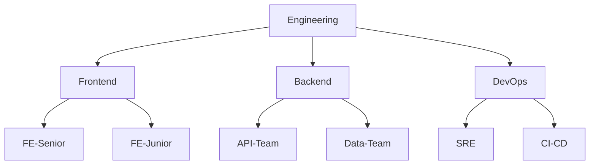

# 组织与团队管理

> 用 Organization 和 Team 构建可扩展的协作架构，从小团队到企业级的组织治理方案。

## 概述

当你的项目从个人仓库演进到多人协作时，GitHub Organization 成为管理代码、人员和权限的核心容器。Organization 不是"大号个人账号"——它提供了独立的计费体系、细粒度的权限控制和团队管理能力，是规模化协作的基础设施。

Team 是 Organization 内部的逻辑分组单元。通过 Team，你可以批量授权仓库访问、管理代码审查分配、控制通知流向。Team 支持嵌套层级结构，父团队的成员自动继承子团队的权限，这使得大规模组织的权限管理变得可行。

> [!NOTE]
GitHub 提供三种账号类型：个人账号（Personal Account）、Organization 和 Enterprise。Organization 适合中小型团队和企业部门，Enterprise 适合需要统一治理多个 Organization 的大型企业。三者的权限边界和计费模型各不相同，选择前应充分评估。

本章将系统讲解 Organization 的创建与配置、Team 的层级设计，以及 SAML SSO 的集成方法。关于 Organization 内的角色权限细节，参见 [权限与角色体系](02-权限与角色体系)；关于企业级统一治理方案，参见 [企业级功能 GHE](04-企业级功能-GHE)。

## 核心操作

### 创建 Organization

1. 点击 GitHub 右上角的 **`+`** 按钮，选择 **New organization**。
2. 输入 Organization 名称和联系邮箱。名称一旦确定不可更改，请谨慎选择。
3. 选择计划：**Free**（基础功能）、**Team**（团队协作）或 **Enterprise**（完整治理能力）。
4. 邀请初始成员（也可以稍后邀请）。
5. 点击 **Create organization** 完成创建。

```bash
# 使用 GitHub CLI 创建 Organization（需要 Enterprise 账号）
gh api --method POST /admin/organizations \
  -f login="<org-name>" \
  -f admin="<your-username>" \
  -f profile_name="<display-name>"
```

### 配置 Organization 基本信息

1. 进入 Organization 页面，点击 **Settings**。
2. 在 **Profile** 区域设置头像、描述和官方网站。
3. 在 **Billing** 页面关联支付方式并查看用量。
4. 在 **Member privileges** 中配置默认权限：
   - **Default repository permission**——新成员对新建仓库的基础权限（None / Read / Write / Admin）。
   - **Members can create repositories**——是否允许普通成员创建仓库。

> [!TIP]
在 **Settings > Member privileges** 中将"默认仓库权限"设为 **Read**，然后通过 Team 授予额外权限。这种"最小权限"策略能有效防止误操作和信息泄漏。

### 创建和管理 Team

1. 进入 Organization 的 **Teams** 页面（`/orgs/<org-name>/teams`）。
2. 点击 **New team** 按钮。
3. 填写团队名称、描述，选择可见性（Visible 或 Secret）。
4. （可选）选择父团队，建立层级关系。
5. 点击 **Create team**。

```bash
# 使用 GitHub CLI 创建 Team
gh api --method POST /orgs/<org-name>/teams \
  -f name="<team-name>" \
  -f description="<description>" \
  -f privacy="closed"

# 向 Team 添加成员
gh api --method PUT /orgs/<org-name>/teams/<team-slug>/memberships/<username> \
  -f role="member"

# 向 Team 授予仓库访问权限
gh api --method PUT /orgs/<org-name>/teams/<team-slug>/repos/<org-name>/<repo-name> \
  -f permission="push"
```

### Team 层级设计

合理的 Team 层级能够简化权限管理。典型的层级结构如下：



层级设计的核心原则：

- **父团队包含子团队的所有成员**——成员关系向上继承。
- **仓库权限向下传递**——父团队对某仓库的权限会被子团队继承。
- **建议层级不超过 3 层**——过深的嵌套会增加管理复杂度。

> [!WARNING]
Secret Team 不会出现在 Organization 的公开页面中，但其成员仍然可以正常访问被授权的仓库。Secret 仅影响可见性，不影响权限。不要将 Secret Team 作为安全保障手段——安全控制应依赖仓库权限和访问策略。

### 配置 SAML SSO

SAML Single Sign-On 将 GitHub Organization 与企业身份提供商（IdP）集成，实现统一认证。

1. 进入 **Organization Settings > Authentication security**。
2. 点击 **Enable SAML authentication**。
3. 输入 IdP 的 **Sign on URL**、**Issuer URL** 和 **Public certificate**。
4. 点击 **Test SAML configuration** 验证配置是否正确。
5. 测试通过后，点击 **Save** 启用 SAML SSO。
6. （可选）启用 **SAML single sign-on enforcement**——强制所有成员通过 SAML 认证。

```yaml
# 常见 IdP 配置参考（以 Okta 为例）
saml_configuration:
  sign_on_url: "https://<org>.okta.com/app/github/<app-id>/sso/saml"
  issuer_url: "https://www.okta.com/<org-id>"
  certificate: |
    -----BEGIN CERTIFICATE-----
    <certificate-content>
    -----END CERTIFICATE-----
```

SAML SSO 启用后的影响：

- 现有成员需要在授权期限内完成 SAML 认证，否则会失去访问权限。
- Personal Access Token（PAT）和 SSH Key 需要单独授权才能在 SAML 保护下使用。
- 组织管理员可以在 **Authentication security** 页面查看成员的 SAML 认证状态。

## 进阶技巧

### 用 Team 同步自动管理成员

如果你使用 Azure AD 或 Okta 作为 IdP，可以启用 Team Synchronization，将 GitHub Team 与 IdP 中的安全组自动同步：

1. 在 **Organization Settings > Authentication security** 中配置 IdP 连接。
2. 进入目标 Team 的设置页面，点击 **Enable IdP team sync**。
3. 选择要关联的 IdP 安全组。
4. 保存后，IdP 安全组的成员变更会自动反映到 GitHub Team 中。

这种方式避免了手动维护两套成员列表，特别适合人员变动频繁的大型团队。当员工在企业 IdP 中被加入或移出安全组时，对应的 GitHub Team 成员会自动同步更新，大大减少了因人员变动导致的权限管理遗漏。同步间隔通常为几分钟，具体取决于 IdP 的配置。

### Organization 级别的安全策略

在 **Settings > Security** 中可以强制执行组织级安全策略：

- **Two-factor authentication（2FA）**——要求所有成员启用双因素认证，显著降低账户被盗用的风险。
- **SSH certificate authorities**——通过 SSH CA 签发证书替代传统 SSH Key，集中管控 SSH 访问。
- **IP allow list**——限制只有特定 IP 地址范围可以访问 Organization 资源，适用于需要限制办公网络访问的场景。

以上三项策略可以组合使用。例如，同时启用 2FA 和 IP 白名单，确保成员只能从办公网络并通过双因素认证访问代码仓库。这种"纵深防御"策略在金融、医疗等强监管行业尤为常见。

> [!WARNING]
启用 2FA 强制策略后，未启用 2FA 的成员将在规定时间内被自动移除 Organization。执行前务必通知所有成员提前启用 2FA，避免意外锁人。

### 批量管理 Team 的脚本

对于大型 Organization，手动管理 Team 效率很低。以下脚本展示了批量操作的方法：

```bash
# 从 CSV 文件批量添加成员到 Team
# CSV 格式：username,team-slug
while IFS=',' read -r username team_slug; do
  gh api --method PUT "/orgs/<org-name>/teams/${team_slug}/memberships/${username}" \
    -f role="member"
  echo "Added ${username} to ${team_slug}"
done < members.csv

# 列出 Organization 下所有 Team 及其成员数量
gh api /orgs/<org-name>/teams --paginate \
  --jq '.[] | "\(.slug): \(.members_count) members"'
```

### 使用 @mentions 通知整个 Team

在 Issue、Pull Request 和评论中使用 `@<org>/<team-slug>` 可以通知整个 Team：

```markdown
@my-org/frontend-team 请审查这个 UI 变更的方案。
```

在 Team 设置中可以启用 **Team discussions**，为团队提供内部讨论空间，适合非代码类的协作交流。Team discussions 支持Markdown 格式，可以组织问答、公告和投票。与 Issue 不同，discussions 不绑定到特定仓库，适合跨项目的团队沟通。

## 常见问题

### Q: Organization 名称可以修改吗？

不可以。Organization 名称一旦创建就无法更改。如果你需要更换名称，只能创建新 Organization 并迁移所有仓库。建议在创建时选择简洁、稳定、与品牌一致的名称。

### Q: Free 计划和 Team 计划的主要区别是什么？

Free 计划支持无限的公开仓库和私有仓库、基础的 Team 功能和 2,000 分钟/月的 GitHub Actions 额度。Team 计划在此基础上增加了：保护的分支（Branch Protection）、仓库访问权限的细粒度控制、以及 GitHub Support 的优先响应。对于需要治理能力的中型团队，Team 计划通常是必要的。

### Q: 一个用户可以属于多个 Team 吗？

可以。一个用户可以同时属于 Organization 内的任意多个 Team。权限取并集——如果 Team A 对某仓库有 Read 权限，Team B 对同一仓库有 Write 权限，那么同时属于两个 Team 的用户将拥有 Write 权限。

### Q: Secret Team 和 Visible Team 有什么区别？

Visible Team 对 Organization 内所有成员可见，成员可以看到团队列表和成员。Secret Team 只有团队成员和 Organization Owner 才能看到。Secret Team 适合管理敏感项目团队（如安全团队、审计团队），但其成员仍然会出现在 Organization 的成员列表中——Secret 只隐藏团队本身，不隐藏成员身份。

### Q: SAML SSO 配置失败怎么办？

首先检查 IdP 侧的配置：确保 Assertion Consumer Service（ACS）URL 设置为 `https://github.com/orgs/<org-name>/saml/consume`；确认 NameID 格式为 `persistent`；检查证书是否过期。然后使用 GitHub 的 **Test SAML configuration** 功能查看详细的错误信息。常见问题包括时钟偏差和属性映射错误。

### Q: 如何从个人账号迁移到 Organization？

创建 Organization 后，将仓库 Transfer 到新 Organization：进入仓库的 **Settings > Danger Zone**，点击 **Transfer** 按钮。Transfer 操作会保留仓库的完整历史、Star 和 Fork 关系。迁移后需要重新配置 CI/CD 中涉及仓库路径的配置，并更新本地 Git Remote URL：

```bash
git remote set-url origin https://github.com/<new-org>/<repo>.git
```

### Q: Team 的成员数量有上限吗？

单个 Team 没有公开声明的硬性上限。但 Organization 的总成员数受计划限制：Free 和 Team 计划没有明确上限，但大规模组织（超过数百人）建议使用 Enterprise 计划以获得更好的管理工具。

### Q: 如何审计 Team 的权限变更？

所有 Team 的创建、删除、成员变更都会记录在 Organization 的 Audit Log 中。参见 [审计日志与合规](03-审计日志与合规) 了解如何查询和导出审计日志。

## 参考链接

| 标题 | 说明 |
|------|------|
| [Best practices for organizations](https://docs.github.com/en/organizations/collaborating-with-groups-in-organizations/best-practices-for-organizations) | GitHub 官方的组织管理最佳实践 |
| [Best practices for GHE Cloud](https://github.blog/enterprise-software/devops/best-practices-for-organizations-and-teams-using-github-enterprise-cloud/) | Enterprise Cloud 下的团队组织建议 |
| [Organizing members into teams](https://docs.github.com/en/organizations/organizing-members-into-teams) | Team 创建、管理和层级配置指南 |
| [Best practices for managing developer teams](https://blog.gitguardian.com/best-practices-for-managing-developer-teams-in-github-orgs/) | 开发者团队管理的实践经验 |
