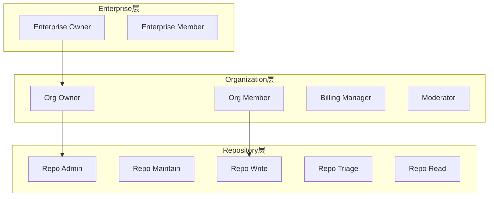
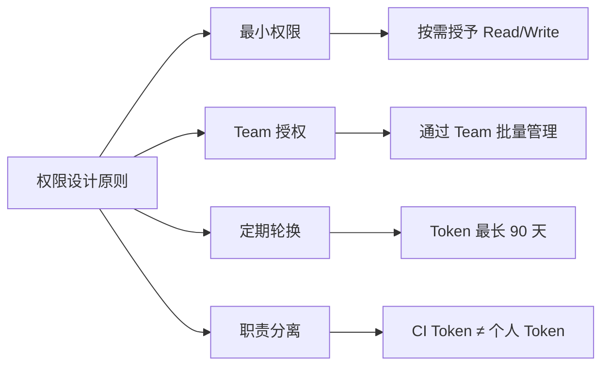

# 权限与角色体系

> 掌握 GitHub 的多层权限模型，从 Organization 角色到 Fine-grained Token 的精细访问控制。

## 概述

GitHub 的权限模型是一个多层结构：Enterprise 层管理 Organization，Organization 层管理 Repository，Repository 层管理代码和资源。每一层都有各自的角色体系，权限逐层继承和叠加。理解这个模型是安全治理的基础。

在最底层，每个 Repository 有自己的协作者权限（Read、Triage、Write、Maintain、Admin）。Organization 级别则引入了 Owner、Billing Manager 等全局角色，能够跨仓库施加影响。当多个 Organization 被纳入 Enterprise 时，Enterprise Owner 拥有最高管理权限。这种分层设计允许你在大规模组织中实现"最小权限"原则。

> [!NOTE]
GitHub 权限的核心原则是"权限取最高值"。如果一个用户通过 Team A 获得了仓库的 Read 权限，通过 Team B 获得了同一仓库的 Write 权限，那么该用户的实际权限是 Write。理解这一点对于设计权限策略至关重要。

本专题将详细讲解各层角色定义、Personal Access Token 的演进，以及权限设计的最佳实践。关于 Team 层面的权限分配，参见 [组织与团队管理](01-组织与团队管理.md)；关于审计权限变更的方法，参见 [审计日志与合规](03-审计日志与合规.md)。

## 核心操作

### 理解 Organization 角色

Organization 内有五种内置角色，权限从低到高排列：

| 角色 | 权限范围 |
|------|----------|
| **Guest** | 仅能查看被明确授权的内部仓库，无法查看 Organization 概览 |
| **Member** | 查看 Organization 概览、创建 Team（如允许）、创建仓库（如允许） |
| **Moderator** | Member 权限 + 管理评论和 Issue、屏蔽扰乱用户 |
| **Billing Manager** | 仅管理账单和付款信息，无代码访问权限 |
| **Owner** | 完全管理权限，包括删除 Organization、管理所有设置 |



> [!TIP]
Organization 至少需要一名 Owner。建议设置 2-3 名 Owner 以防单点故障，但不要过多——Owner 权限过大，过多 Owner 会增加安全风险。

### 理解 Repository 级别权限

Repository 有五种权限级别，适用于单个仓库：

| 权限 | 能力说明 |
|------|----------|
| **Read** | 克隆、拉取、查看代码和 Issue |
| **Triage** | Read + 管理 Issue 和 Pull Request 的标签、分配、关闭 |
| **Write** | Triage + 推送代码、合并 Pull Request |
| **Maintain** | Write + 管理仓库设置（不含危险操作） |
| **Admin** | 完全控制仓库，包括删除、Transfer、管理协作者 |

1. 进入仓库的 **Settings > Collaborators and teams**。
2. 点击 **Add people** 或 **Add teams**。
3. 搜索用户或 Team，选择权限级别。
4. 点击 **Add <name> to this repository**。

### 管理 Personal Access Token

GitHub 提供两种类型的 PAT：

**Classic Token（传统令牌）：**

1. 进入 **Settings > Developer settings > Personal access tokens > Tokens (classic)**。
2. 点击 **Generate new token (classic)**。
3. 选择过期时间和权限范围（Scopes）。
4. 点击 **Generate token** 并立即保存——令牌只显示一次。

**Fine-grained Token（细粒度令牌）：**

1. 进入 **Settings > Developer settings > Personal access tokens > Fine-grained tokens**。
2. 点击 **Generate new token**。
3. 选择 **Token name**、**Expiration** 和 **Resource owner**（即哪个 Organization）。
4. 在 **Repository access** 中选择 All repositories 或 Only select repositories。
5. 在 **Permissions** 区域配置权限：
   - **Repository permissions**——代码、Issue、Pull Request、Actions 等。
   - **Account permissions**（Organization 级别）——成员、Team、项目等。
6. 点击 **Generate token** 并保存。

> [!WARNING]
Fine-grained Token 的权限是传统 Classic Token 的超集，但两者不能互相替代。建议所有新创建的 Token 都使用 Fine-grained 类型。Classic Token 的权限范围过于宽泛（例如 `repo` scope 授予所有仓库的完整写权限），一旦泄漏影响面极大。

### Fine-grained Token 权限矩阵

Fine-grained Token 允许你对每种资源设置独立的读写权限：

| 资源类型 | 可选权限 | 典型用途 |
|----------|----------|----------|
| Contents | Read / Write | 代码推送、文件读取 |
| Issues | Read / Write | Issue 管理和自动化 |
| Pull requests | Read / Write | PR 创建和合并 |
| Actions | Read / Write | 触发和管理工作流 |
| Metadata | Read（必选） | 仓库基本信息 |
| Administration | Read / Write | 仓库设置管理 |
| Members | Read / Write | 组织成员管理 |

```bash
# 使用 Fine-grained Token 调用 API 的示例
curl -H "Authorization: Bearer <fine-grained-token>" \
  https://api.github.com/repos/<owner>/<repo>/contents/README.md

# 在 GitHub Actions 中使用 Fine-grained Token
# 需要在仓库 Secrets 中存储 Token
gh secret set FINE_GRAINED_PAT --body "<token>" --repo <owner>/<repo>
```

## 进阶技巧

### 权限设计最佳实践

设计权限体系时应遵循以下原则：

1. **最小权限原则**——只授予完成任务所需的最低权限。宁可在后续按需提升，也不要一次性授予过高权限。
2. **使用 Team 授权而非个人授权**——通过 Team 管理仓库访问，便于审计和调整。当成员离职或转岗时，只需调整 Team 成员即可批量修改权限。
3. **定期轮换 Token**——为 Token 设置合理的过期时间（不超过 90 天）。过期的 Token 自动失效，即使泄漏也不会造成长期风险。
4. **分离职责**——CI/CD 使用的 Token 不应与个人开发使用的 Token 相同。每个自动化流程应使用独立的 Token，便于追踪和撤销。



### Token 安全管理

> [!WARNING]
永远不要将 Token 硬编码在代码中或提交到 Git 仓库。使用 GitHub Secrets、环境变量或密钥管理服务存储 Token。如果不慎将 Token 提交到公开仓库，GitHub 会自动检测并撤销该 Token，但这不应作为安全保障手段。秘密泄漏的窗口期可能已经足够攻击者获取敏感数据。

管理 Token 安全的具体措施：

```bash
# 设置 Token 环境变量（推荐方式）
export GH_TOKEN="<your-token>"

# 在 CI 中使用 GitHub 官方操作（自动获取临时 Token）
# .github/workflows/ci.yml 中使用 GITHUB_TOKEN
# 该 Token 由 GitHub 自动创建，仅在工作流运行期间有效
```

### 使用 GitHub App 替代长期 Token

对于自动化场景，GitHub App 比长期 Token 更安全：

1. 创建 GitHub App（**Settings > Developer settings > GitHub Apps**）。
2. 配置所需的 Permissions 和 Webhook events。
3. 将 App 安装到目标 Organization 或 Repository。
4. 在代码中使用 App 的 Private Key 获取临时 Access Token：

```bash
# 通过 GitHub App 获取临时安装 Token（有效期 1 小时）
# 需要先使用 Private Key 生成 JWT
jwt=$(ruby -e '
  require "jwt"
  payload = { iat: Time.now.to_i - 60, exp: Time.now.to_i + 600, iss: "<app-id>" }
  puts JWT.encode(payload, OpenSSL::PKey::RSA.new(File.read("<private-key-path>")), "RS256")
')

# 使用 JWT 获取安装 Token
installation_id=$(curl -s -H "Authorization: Bearer ${jwt}" \
  -H "Accept: application/vnd.github+json" \
  https://api.github.com/app/installations | jq '.[0].id')

access_token=$(curl -s -X POST -H "Authorization: Bearer ${jwt}" \
  -H "Accept: application/vnd.github+json" \
  "https://api.github.com/app/installations/${installation_id}/access_tokens" | jq -r '.token')

echo "Temporary token: ${access_token}"
```

### 审查现有权限

定期审查权限配置是安全治理的重要环节。建议至少每季度执行一次全面审查，重点关注以下方面：是否存在直接授予个人的仓库权限（应改为 Team 授权）、是否有长期未使用的 Token（应撤销）、是否有离职人员残留的访问权限。以下是审查常用的命令：

```bash
# 列出 Organization 所有成员及其角色
gh api /orgs/<org-name>/members --paginate \
  --jq '.[] | "\(.login): \(.type)"'

# 列出仓库的所有协作者及权限
gh api /repos/<owner>/<repo>/collaborators --paginate \
  --jq '.[] | "\(.login): \(.role_name)"'

# 列出 Organization 所有 Team 及其仓库权限
gh api /orgs/<org-name>/teams --paginate \
  --jq '.[] | .slug' | while read slug; do
    gh api "/orgs/<org-name>/teams/${slug}/repos" --paginate \
      --jq ".[] | \"${slug}: \(.full_name) — \(.role_name)\""
  done
```

## 常见问题

### Q: Member 和 Guest 有什么区别？

Guest 是 Organization 成员的最低级别。Guest 无法查看 Organization 的公开信息（成员列表、仓库列表等），只能访问被明确邀请的内部仓库。Guest 通常用于外部合作者，让他们在不暴露整个 Organization 结构的前提下参与特定项目。Member 则可以查看 Organization 的基本信息、创建仓库和 Team（取决于 Organization 设置）。

### Q: Triage 权限适合什么场景？

Triage 权限适合社区维护者和 Issue 管理员。他们不需要推送代码，但需要管理 Issue 的标签、分配、关闭等操作。在开源项目中，Triage 权限可以授予活跃的贡献者，让他们帮助管理社区，而不必给予代码写入权限。

### Q: Fine-grained Token 和 Classic Token 应该选哪个？

所有新场景都应使用 Fine-grained Token。Classic Token 仅在需要兼容旧版工具或 API 时使用。Fine-grained Token 提供了仓库级别的权限控制、明确的过期时间和完整的审计追踪，安全性远高于 Classic Token。如果你的团队仍在大量使用 Classic Token，建议制定迁移计划，逐步替换为 Fine-grained Token。

### Q: 如何撤销已经泄漏的 Token？

如果是 Fine-grained Token 或 Classic Token，进入 **Settings > Developer settings > Personal access tokens** 找到对应 Token 并点击 **Delete**。如果是 OAuth App 或 GitHub App 的 Token，在 App 设置中撤销。GitHub 会自动扫描公开仓库中的 Token 并撤销已泄漏的凭据，但你不应依赖这个机制——发现泄漏后应立即手动撤销。

### Q: Organization Owner 能看到所有私有仓库吗？

默认情况下，Owner 可以管理所有仓库的设置，包括访问权限。但 Owner 不会自动获得所有仓库的代码读取权限——他们需要先将自己添加为协作者或通过 Team 授权。不过 Owner 随时有能力将自己添加到任何仓库，因此在权限层面 Owner 拥有事实上的完全访问能力。

### Q: 如何限制成员创建公开仓库？

在 Organization 的 **Settings > Member privileges** 中，找到 **Repository creation** 设置。你可以选择允许成员创建的仓库类型：公开、私有、内部，或完全禁止成员创建仓库。对于需要严格控制代码可见性的组织，建议仅允许创建私有仓库。

### Q: 权限变更会立即生效吗？

是的。当你修改 Team 的成员或仓库权限时，变更会立即生效。但如果用户已经克隆了仓库并且有活跃的 SSH 或 HTTPS 会话，缓存的凭据可能需要几分钟才会刷新。对于 SAML SSO 相关的权限变更，用户需要重新认证才能生效。

### Q: 如何实现跨 Organization 的权限管理？

跨 Organization 的统一权限管理需要 Enterprise 计划。Enterprise Owner 可以管理旗下所有 Organization 的策略和设置。参见 [企业级功能 GHE](04-企业级功能-GHE.md) 了解 Enterprise 层级的治理能力。如果你没有 Enterprise 计划，需要分别在各个 Organization 中管理权限。

## 参考链接

| 标题 | 说明 |
|------|------|
| [Roles in an organization](https://docs.github.com/en/organizations/managing-peoples-access-to-your-organization-with-roles/roles-in-an-organization) | Organization 角色定义和权限详情 |
| [Access permissions on GitHub](https://docs.github.com/get-started/learning-about-github/access-permissions-on-github) | GitHub 各层级权限体系总览 |
| [Abilities of roles in an enterprise](https://docs.github.com/enterprise-cloud@latest/admin/managing-accounts-and-repositories/managing-roles-in-your-enterprise/abilities-of-roles) | Enterprise 层级的角色能力矩阵 |
| [GitHub access control management](https://entro.security/blog/github-access-management-best-practices/) | 访问控制管理的实践指南 |
| [Introducing fine-grained PAT](https://github.blog/security/application-security/introducing-fine-grained-personal-access-tokens-for-github/) | Fine-grained Token 的官方介绍 |
| [Permissions for fine-grained PAT](https://docs.github.com/en/rest/authentication/permissions-required-for-fine-grained-personal-access-tokens) | Fine-grained Token 每种权限的详细说明 |
