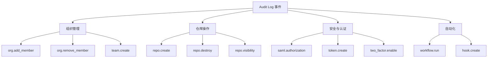

# 审计日志与合规

> 用 Audit Log 实现全链路可观测性，从事件追踪到合规框架的治理闭环。

## 概述

当 Organization 规模增长，"谁在什么时候做了什么"不再是口头问询能回答的问题。GitHub Audit Log 记录了组织内几乎所有敏感操作：成员增删、权限变更、仓库设置修改、Webhook 配置、Branch Protection 规则调整等。这些数据是安全审计、合规审查和事件响应的基础。

Audit Log 不同于 Git 提交历史。提交历史记录的是代码变更，而 Audit Log 记录的是平台级操作——包括用户登录、Token 使用、App 安装等非代码事件。两者互补，共同构成完整的可审计链路。对于需要满足合规要求的企业来说，Audit Log 是证明"已采取合理控制措施"的关键证据来源。

> [!NOTE]
Audit Log 的可用性取决于你的 GitHub 计划。Organization 级别的 Audit Log 需要 Team 或 Enterprise 计划；Enterprise 级别的 Audit Log 仅在 Enterprise 计划中提供。Free 计划的 Organization 只能查看最近的事件，且无法通过 API 导出。

本专题将讲解 Audit Log 的查询与分析、日志导出与集成、以及常见合规框架的对接方法。关于日志中涉及的权限操作细节，参见 [权限与角色体系](02-权限与角色体系.md)；关于企业级审计策略的强制执行，参见 [企业级功能 GHE](04-企业级功能-GHE.md)。

## 核心操作

### 访问 Audit Log

**Organization 级别：**

1. 进入 Organization 主页，点击 **Settings**。
2. 在左侧菜单中点击 **Audit log**。
3. 使用搜索栏输入查询条件进行筛选。

**Enterprise 级别：**

1. 进入 Enterprise 账户的 **Settings**。
2. 在左侧菜单的 "Audit log" 区域查看全局日志。

```bash
# 使用 GitHub CLI 查询 Organization Audit Log
gh api /orgs/<org-name>/audit-log \
  --paginate \
  -q '.[] | "\(.created_at) | \(.action) | \(.actor) | \(.name // .repo)"'

# 查询特定类型的操作（例如成员变更）
gh api "/orgs/<org-name>/audit-log?phrase=action:org.add_member" \
  --paginate
```

### 理解 Audit Log 事件

每条 Audit Log 事件包含以下关键字段：

| 字段 | 说明 | 示例 |
|------|------|------|
| `action` | 操作类型 | `org.add_member`、`repo.create` |
| `actor` | 执行操作的用户或 App | `alice`、`github-actions[bot]` |
| `created_at` | 操作时间（UTC） | `2025-06-15T08:30:00Z` |
| `name` | 操作对象名称 | 仓库名、用户名 |
| `user` | 被操作的目标用户 | 被添加的成员 |
| `repo` | 涉及的仓库（如有） | `my-org/my-repo` |

常见的审计事件分类：



### 搜索和筛选 Audit Log

Audit Log 支持丰富的搜索语法：

```text
# 按操作类型
action:org.add_member

# 按操作者
actor:alice

# 按用户（被操作的对象）
user:bob

# 按仓库
repo:my-org/my-repo

# 按时间范围
created:>=2025-01-01 created:<2025-02-01

# 组合查询
action:team.add_member actor:alice created:>=2025-06-01
```

1. 在 Audit Log 页面的搜索栏中输入查询条件。
2. 按回车执行搜索，结果会实时更新。
3. 使用页面右侧的筛选按钮快速选择常见条件。
4. 点击任意事件可展开查看完整详情。

> [!TIP]
在搜索栏中直接输入关键词即可快速定位事件。GitHub 支持自然语言搜索——例如输入 "created repository" 会自动匹配 `repo.create` 事件。

### 导出 Audit Log

**网页导出：**

1. 在 Audit Log 页面设置好筛选条件。
2. 点击页面右上角的 **Export** 按钮。
3. 选择导出格式（JSON 或 CSV）。
4. 点击 **Export** 下载文件。

**API 导出：**

```bash
# 导出最近 7 天的 Audit Log（JSON 格式）
gh api "/orgs/<org-name>/audit-log?per_page=100" \
  --paginate > audit-log.json

# 导出特定时间范围的日志
gh api "/orgs/<org-name>/audit-log?phrase=created:>=2025-01-01+created:<2025-02-01&per_page=100" \
  --paginate > audit-log-january.json

# 将 JSON 转为 CSV 方便分析
gh api "/orgs/<org-name>/audit-log?per_page=100" \
  --paginate --jq '.[] | [.created_at, .action, .actor, (.name // .repo // "")] | @csv' \
  > audit-log.csv
```

## 进阶技巧

### 将 Audit Log 流式传输到外部系统

GitHub Enterprise Cloud 支持将 Audit Log 实时流式传输到外部存储和分析平台：

1. 进入 **Organization Settings > Audit log**。
2. 点击 **Log streaming** 标签。
3. 选择目标平台（支持的端点包括）：
   - **Amazon S3**——以 JSON 格式存储到 S3 存储桶
   - **Azure Event Hubs**——流式传输到 Azure 事件中心
   - **Datadog**——直接集成 Datadog 监控平台
   - **Splunk**——通过 HEC（HTTP Event Collector）接收日志
4. 配置端点连接信息并验证连通性。
5. 启用流式传输后，新的 Audit Log 事件会实时推送。

> [!WARNING]
Log streaming 仅在 GitHub Enterprise Cloud 计划中提供。Team 计划和 GitHub Free 的 Organization 无法使用此功能。对于非 Enterprise 用户，只能通过 API 定期拉取日志并自行转发。

### 构建合规监控仪表盘

将 Audit Log 数据导入分析平台后，可以构建实时合规监控仪表盘。以下是关键的监控指标：

| 监控指标 | 对应事件 | 告警条件 |
|----------|----------|----------|
| 新成员加入 | `org.add_member` | 未经审批的加入 |
| 权限提升 | `org.update_member_role` | 角色变更为 Owner |
| 仓库可见性变更 | `repo.visibility` | 私有仓库变为公开 |
| Branch Protection 修改 | `branch_protection_rule` | 保护规则被删除或弱化 |
| Token 创建 | `personal_access_token.create` | 高权限 Token 创建 |
| Webhook 修改 | `hook.create`、`hook.update` | 新增外部 Webhook |

在实际操作中，建议将这些指标配置为自动告警规则。例如，当检测到 `repo.visibility` 事件将私有仓库变为公开时，立即通过 Slack 或邮件通知安全团队。这种实时响应能力可以将安全事件的发现时间从"事后审查"缩短到"分钟级别"。

### 对接合规框架

GitHub 支持多种国际合规认证，你可以下载官方合规报告来满足审计要求：

1. 进入 **Enterprise Settings > Compliance**。
2. 在 **Compliance reports** 区域查看可用的报告：
   - **SOC 1 Type II**——财务报告相关的内部控制
   - **SOC 2 Type II**——安全性、可用性、机密性
   - **ISO 27001**——信息安全管理体系
   - **FedRAMP**——美国联邦风险与授权管理程序
3. 下载 PDF 格式的合规报告。

> [!NOTE]
合规报告的访问权限仅限于 Enterprise Owner 和 Billing Manager。如果你的 Organization 未加入 Enterprise，可以访问 GitHub Trust Center 查看公开的安全白皮书和合规声明，但无法下载详细报告。

### 自动化合规检查脚本

以下脚本展示了如何定期检查常见的安全合规问题：

```bash
#!/bin/bash
# compliance-check.sh — 检查 Organization 的安全合规状态

ORG="<org-name>"

echo "=== 合规检查报告 ==="
echo "组织：${ORG}"
echo "日期：$(date +%Y-%m-%d)"
echo ""

# 检查 1：列出未启用 2FA 的成员（需要 SAML 或 2FA 策略）
echo ">>> 检查成员 2FA 状态"
echo "（如果 Organization 已启用 2FA 强制策略，则所有成员均已启用）"

# 检查 2：列出所有 Admin 权限的协作者
echo ""
echo ">>> 检查仓库 Admin 权限分配"
gh api "/orgs/${ORG}/repos?per_page=100" --paginate \
  --jq '.[] | .name' | while read repo; do
    gh api "/repos/${ORG}/${repo}/collaborators?affiliation=direct" \
      --jq '.[] | select(.role_name == "admin") | "  Admin: \(.login) → ${repo}"'
  done

# 检查 3：列出最近 7 天的敏感操作
echo ""
echo ">>> 最近 7 天的敏感操作"
SINCE=$(date -v-7d +%Y-%m-%d 2>/dev/null || date -d "7 days ago" +%Y-%m-%d)
gh api "/orgs/${ORG}/audit-log?phrase=created:>=${SINCE}+action:org.update_member_role&per_page=100" \
  --jq '.[] | "  \(.created_at): \(.actor) → \(.user) (\(.action))"'

echo ""
echo "=== 检查完成 ==="
```

## 常见问题

### Q: Audit Log 保留多长时间？

Organization 级别的 Audit Log 默认保留 180 天。Enterprise 级别的 Audit Log 保留 400 天。如果需要更长的保留期，应使用 Log Streaming 将日志转发到外部存储系统（如 Amazon S3、Azure Blob Storage）。许多合规框架（如 SOC 2、ISO 27001）要求日志保留至少一年，因此导出和长期存储是必要的。GitHub Free 的 Organization 只能查看最近的事件，没有明确的保留期限保证。

### Q: Audit Log 能追踪到具体的代码行变更吗？

不能。Audit Log 记录的是平台级操作（如"谁推送了代码"），不包含具体的文件差异。代码行级别的变更追踪需要依赖 Git 提交历史和 Pull Request 记录。不过 Audit Log 会记录 `git.push` 事件及其推送的提交 SHA，你可以据此关联到具体的代码变更。

### Q: 如何追踪 Fine-grained Token 的使用情况？

Audit Log 会记录所有通过 Fine-grained Token 执行的操作。在 `actor` 字段中，Token 发起的操作会显示为 Token 的创建者用户名，但在事件详情中会包含 Token 的 SHA 指纹。你可以通过 `actor` 和 `token_id` 字段筛选特定 Token 的所有操作。

### Q: 第三方 GitHub App 的操作会出现在 Audit Log 中吗？

会。所有通过 GitHub App 执行的操作都会记录在 Audit Log 中。`actor` 字段会显示为 App 的名称（如 `dependabot[bot]`），事件详情中包含 App 的 ID 和安装信息。这对于审查自动化工具的行为非常有用。

### Q: 可以用 Audit Log 检测安全事件吗？

可以，但 Audit Log 不是实时入侵检测系统，它更适合事后审计和取证。你可以设置定期查询来检测可疑行为：例如查看非工作时间的权限变更、短时间内的大量仓库创建、异常的 Webhook 配置等。对于实时告警需求，建议将 Audit Log 流式传输到 SIEM 平台（如 Splunk、Datadog）并设置实时告警规则。配合 GitHub 的 Webhook 功能，你还可以在关键事件发生时立即触发通知。

### Q: 如何满足 GDPR 的数据审计要求？

GitHub Audit Log 记录了所有个人数据的访问操作，可以作为 GDPR 审计的证据来源。建议配合以下措施：启用 Log Streaming 实现长期存储；定期导出并归档日志；建立数据访问请求的标准流程；使用 Organization 的数据分类标签标记包含个人信息的仓库。GitHub 本身的合规认证（SOC 2、ISO 27001）也覆盖了 GDPR 的相关要求。

### Q: Audit Log API 有速率限制吗？

有。Audit Log API 遵循 GitHub REST API 的标准速率限制。对于认证请求，每小时的限制是 5,000 次。单次查询最多返回 100 条记录（通过 `per_page` 参数控制），使用 `--paginate` 可以自动翻页获取全部数据。频繁拉取日志时注意控制请求频率，避免触发速率限制。

### Q: 删除的仓库的 Audit Log 还能查到吗？

可以。Audit Log 中的 `repo.destroy` 事件会记录仓库删除操作，但仓库被删除后，该仓库相关的后续事件将不再产生。已记录的历史事件不受影响，你仍然可以通过 Audit Log 查询该仓库被删除之前的所有操作记录。

## 参考链接

| 标题 | 说明 |
|------|------|
| [Audit log for an enterprise](https://docs.github.com/en/enterprise-cloud@latest/admin/concepts/security-and-compliance/audit-log-for-an-enterprise) | Enterprise 级别的 Audit Log 概述 |
| [Audit log events](https://docs.github.com/github-ae@latest/admin/monitoring-activity-in-your-enterprise/reviewing-audit-logs-for-your-enterprise/audit-log-events-for-your-enterprise) | 完整的审计事件类型参考 |
| [Accessing compliance reports](https://docs.github.com/enterprise-cloud@latest/admin/overview/accessing-compliance-reports-for-your-enterprise) | 如何下载 GitHub 官方合规报告 |
| [FedRAMP and GitHub](https://government.github.com/fedramp-faq) | GitHub FedRAMP 合规常见问题 |
| [Establishing a governance framework](https://docs.github.com/en/enterprise-server@3.20/admin/overview/establishing-a-governance-framework-for-your-enterprise) | 企业治理框架的建立指南 |
| [About SAML SSO and 2FA](https://docs.github.com/enterprise-cloud@latest/organizations/granting-access-to-your-organization-with-saml-single-sign-on/about-two-factor-authentication-and-saml-single-sign-on) | SAML SSO 与 2FA 的关系说明 |
| [Configuring SAML SSO](https://docs.github.com/en/enterprise-cloud@latest/admin/managing-iam/using-saml-for-enterprise-iam/configuring-saml-single-sign-on-for-your-enterprise) | SAML SSO 配置步骤 |
