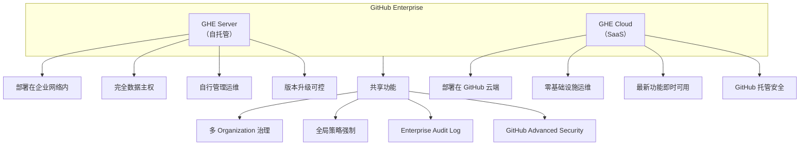
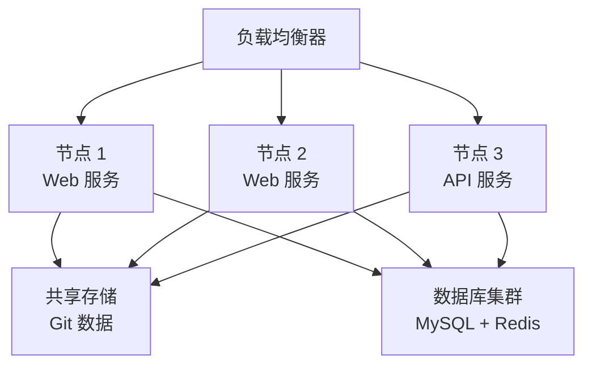

# 企业级功能 GHE

> 从 GitHub Enterprise Server 到 Enterprise Cloud，掌握企业部署、策略强制和统一治理的完整方案。

## 概述

GitHub Enterprise（GHE）是 GitHub 面向大型组织的企业级产品线，包含两种部署形态：**GHE Server**（本地或私有云部署）和 **GHE Cloud**（托管在 GitHub 基础设施上的 Enterprise Cloud）。两种形态共享核心功能（统一策略、全局审计、高级安全），但在部署方式、运维责任和数据驻留方面各有侧重。

GHE 的核心价值在于"统一治理"。一个 Enterprise 账户可以管理多个 Organization，Enterprise Owner 能够跨组织强制执行安全策略、审查全局 Audit Log、统一管理计费和许可。这种多组织治理能力是 GHE 区别于普通 Organization 的关键特性。

> [!NOTE]
GHE Server 和 GHE Cloud 的功能并非完全一致。GHE Server 提供完全的数据主权控制（代码不出企业网络），但需要自行管理基础设施、备份和升级。GHE Cloud 提供最新功能和零运维体验，但代码存储在 GitHub 的云基础设施上。选择哪种形态取决于企业的安全合规要求和 IT 运维能力。

本专题将讲解 GHE 的部署选择、策略强制机制、计费模型和高级治理功能。关于 Organization 级别的管理操作，参见 [组织与团队管理](01-组织与团队管理)；关于审计日志的使用，参见 [审计日志与合规](03-审计日志与合规)。

## 核心操作

### 理解 GHE 的部署形态



两种形态的关键差异：

| 维度 | GHE Server | GHE Cloud |
|------|-----------|-----------|
| 部署位置 | 企业自有基础设施 | GitHub 云端 |
| 数据驻留 | 完全本地 | GitHub 数据中心 |
| 运维责任 | 企业自行负责 | GitHub 负责 |
| 功能更新节奏 | 按版本发布，自行升级 | 持续交付，自动更新 |
| 网络访问 | 可完全内网隔离 | 需要互联网访问 |
| 高可用 | 需要自行配置集群 | GitHub 内置冗余 |

### 初始化 Enterprise 账户

**GHE Cloud：**

1. 联系 GitHub Sales 或访问 Enterprise 页面创建 Enterprise 账户。
2. 在 **Enterprise Settings** 中配置基本信息（名称、Logo）。
3. 创建或关联 Organization 到 Enterprise 账户。
4. 邀请 Enterprise Owner 和 Billing Manager。
5. 配置计费信息并分配许可席位。

**GHE Server：**

```bash
# GHE Server 初始化流程（首次部署）
# 1. 在虚拟化平台上部署 GHE Server 虚拟机
# 支持的虚拟化平台：VMware、Hyper-V、KVM、Azure、AWS、GCP

# 2. 通过管理控制台初始化（HTTPS 访问）
# https://<ghe-server-host>:8443/setup

# 3. 上传许可证文件（.ghl 格式）
# 从 GitHub Enterprise 官网下载

# 4. 配置基础设置
# - 主机名、SSL 证书
# - SMTP 邮件服务
# - 认证方式（内置 / LDAP / SAML / CAS）
```

> [!TIP]
GHE Server 的管理控制台默认使用 8443 端口（`https://<host>:8443`），与用户的 Web 界面端口（443）分离。建议在防火墙中仅允许管理员 IP 访问 8443 端口，避免未授权访问。

### 配置 Enterprise 策略

Enterprise 策略是 GHE 治理的核心机制。Enterprise Owner 可以定义全局策略，所有 Organization 必须遵守：

1. 进入 **Enterprise Settings > Policies**。
2. 选择要配置的策略类别：

**组织管理策略：**

| 策略 | 说明 | 可选值 |
|------|------|--------|
| Base permissions | 成员默认仓库权限 | No policy / Read / Write |
| Repository creation | 是否允许成员创建仓库 | No policy / Allow / Deny |
| Repository visibility change | 是否允许更改仓库可见性 | No policy / Allow / Deny |
| Repository deletion | 是否允许删除仓库 | No policy / Allow / Deny |
| Repository forking | 是否允许 Fork | No policy / Allow / Deny |
| Project creation | 是否允许创建项目 | No policy / Allow / Deny |
| Team discussions | 是否启用 Team 讨论功能 | No policy / Allow / Deny |

3. 对每条策略选择**强制级别**：
   - **No policy**——不强制，各 Organization 自行决定。
   - **Allow**——允许操作，但 Organization 可以进一步限制。
   - **Deny**——禁止操作，Organization 无法覆盖。

### 配置 Enterprise Rulesets

Rulesets 是 GitHub 推荐的策略执行机制，替代传统的 Branch Protection：

1. 进入 **Enterprise Settings > Rules > Rulesets**。
2. 点击 **New ruleset**，选择目标类型（Repository、Tag 或 Branch）。
3. 配置规则适用范围：
   - **Target repositories**——按名称模式或仓库属性筛选。
   - **Bypass actors**——指定可以绕过规则的用户或 Team。
4. 定义具体规则：
   - **Require a pull request before merging**——必须通过 PR 合并。
   - **Require status checks to pass**——CI 检查通过后才能合并。
   - **Require signed commits**——要求提交签名。
   - **Restrict creation**——限制分支或标签的创建。
5. 点击 **Create** 保存规则集。

```yaml
# 通过 API 创建 Enterprise 级别的 Ruleset 示例
# 规则：所有仓库的 main 分支必须通过 PR 合并且通过 CI
ruleset_config:
  name: "Enterprise Main Branch Protection"
  target: "branch"
  enforcement: "active"
  conditions:
    ref_name:
      include:
        - "refs/heads/main"
      exclude: []
    repository_name:
      include:
        - "*"
  rules:
    - type: "pull_request"
      parameters:
        required_approving_review_count: 1
        dismiss_stale_reviews_on_push: true
        require_code_owner_review: false
    - type: "required_status_checks"
      parameters:
        required_status_checks:
          - context: "ci/lint"
          - context: "ci/test"
        strict_required_status_checks_policy: true
```

### 管理 Enterprise 成员和角色

Enterprise 层级有三种核心角色：

| 角色 | 权限 |
|------|------|
| **Enterprise Owner** | 管理所有 Organization、全局策略、计费和审计日志 |
| **Enterprise Member** | 访问被授权的 Organization 和仓库 |
| **Billing Manager** | 仅管理 Enterprise 的计费和许可 |

```bash
# 使用 GitHub CLI 管理 Enterprise 成员
# 列出所有 Enterprise Owner
gh api /enterprises/<enterprise-slug>/owners \
  --paginate --jq '.[] | "\(.login): \(.name // "N/A")"'

# 邀请 Organization 加入 Enterprise
gh api --method POST /enterprises/<enterprise-slug>/organizations \
  -f org_id="<org-id>"
```

### 理解计费模型

GHE 采用按席位（Per-seat）计费模型：

```mermaid
flowchart LR
    A[Enterprise 许可] --> B[席位数量]
    B --> C[每个活跃用户占一个席位]
    C --> D[包含所有功能]
    D --> D1[Organization 管理]
    D --> D2[策略强制"]
    D --> D3[Audit Log"]
    D --> D4[Advanced Security<br/>（需单独购买）"]
```

计费要点：

- **席位数量**——按实际活跃用户计算，而非注册用户。休眠用户不消耗席位。
- **Advanced Security**——GitHub Advanced Security（GHAS）需要额外购买，提供代码扫描、密钥检测和依赖审查。
- **Actions 额度**——Enterprise 包含更多的 GitHub Actions 运行分钟数。
- **GHE Server 许可**——按年订阅，包含技术支持和版本更新。

> [!WARNING]
GHE 的席位许可与用户绑定，不是与 Organization 绑定。同一个用户属于 Enterprise 下的多个 Organization 只消耗一个席位。但如果用户离开 Enterprise 后重新加入，可能会产生短暂的席位冲突，需要管理员在许可页面手动清理。

## 进阶技巧

### GHE Server 的备份与恢复

GHE Server 提供内置的备份工具，支持定时快照和灾难恢复：

```bash
# 使用 ghe-backup 工具创建备份
# 在独立的备份主机上运行
ghe-backup -c -r -s <backup-host>

# 备份包含的内容：
# - Git 仓库数据
# - 数据库（MySQL、Redis、Elasticsearch）
# - 配置数据
# - 用户上传的附件
# - Pages 内容

# 从备份恢复（在新的 GHE Server 实例上执行）
ghe-restore <target-host>

# 配置定时备份（cron）
# 每天凌晨 2 点执行备份
0 2 * * * /usr/local/bin/ghe-backup -c -r -s /backup/ghe >> /var/log/ghe-backup.log 2>&1
```

> [!WARNING]
GHE Server 的备份不包含 SSH Key 和 GPG Key。建议将密钥管理纳入企业的密钥管理服务（KMS）中统一管理，而非依赖 GHE Server 的本地存储。

### 跨 Organization 治理的最佳实践

当 Enterprise 包含多个 Organization 时，以下实践有助于统一治理：

1. **统一的命名规范**——制定 Organization 和仓库的命名规则，例如 `<部门>-<项目>` 格式。
2. **统一的安全基线**——在 Enterprise 层面强制启用 2FA、IP 白名单和 SAML SSO。
3. **分层策略设计**——Enterprise 层面设置最低安全基线（Deny 策略），Organization 层面可以在此基础上增加更严格的限制。
4. **集中审计**——通过 Enterprise Audit Log 统一查看所有 Organization 的操作记录。
5. **定期权限审查**——每季度审查 Enterprise Owner 和 Organization Owner 列表，确保权限分配合理。

### 使用 Enterprise Properties 精细化管理

Enterprise 支持为仓库设置自定义属性（Properties），然后基于属性值应用 Rulesets：

1. 进入 **Enterprise Settings > Properties**。
2. 定义自定义属性名称和可选值（如 `department: frontend`、`compliance: pci-dss`）。
3. 在各仓库中设置属性值。
4. 创建 Rulesets 时，使用属性条件筛选目标仓库：

```yaml
# 基于属性的 Rulesets 条件示例
conditions:
  repository_property:
    - name: "compliance"
      property_values:
        - "pci-dss"
        - "hipaa"
```

这种方式特别适合需要按合规等级、业务部门或项目类型进行差异化治理的大型企业。

### GHE Server 的集群部署

对于大型企业或高可用需求，GHE Server 支持集群（Cluster）部署：



集群部署的关键配置步骤：

1. 准备至少 3 个节点（推荐 5 个以上用于生产环境）。
2. 在主节点上运行 `ghe-cluster-init` 初始化集群配置。
3. 将集群配置分发到所有节点。
4. 配置负载均衡器（HAProxy 或 Nginx）分发流量。
5. 设置共享存储后端（NFS、对象存储等）用于 Git 数据。
6. 配置数据库集群（MySQL 主从 + Redis Sentinel）。

## 常见问题

### Q: GHE Cloud 和 GHE Server 可以同时使用吗？

可以。GitHub 支持混合部署架构，允许你同时使用 GHE Cloud 和 GHE Server，通过 GitHub Connect 将两者关联。常见的模式是将开源项目和公开仓库放在 GHE Cloud，将包含敏感代码的内部项目放在 GHE Server。GitHub Connect 还支持在两者之间共享依赖图和漏洞告警数据。

### Q: 从普通 Organization 升级到 Enterprise 的流程是什么？

联系 GitHub Sales 团队购买 Enterprise 许可。购买后，你的现有 Organization 可以被纳入新创建的 Enterprise 账户。这个过程不需要迁移代码或重新创建仓库——Organization 的所有数据和配置保持不变。升级后你可以逐步配置 Enterprise 级别的策略和治理规则。

### Q: GHE Server 支持哪些数据库和存储后端？

GHE Server 内置了所有必要的服务（MySQL、Redis、Elasticsearch、Git 存储），开箱即用不需要外部依赖。集群部署时需要外部 NFS 或对象存储作为共享存储。GHE Server 不支持使用外部 MySQL 或 Redis 替换内置服务——所有数据存储由 GHE Server 统一管理。

### Q: Enterprise Owner 能直接访问所有仓库的代码吗？

与 Organization Owner 类似，Enterprise Owner 拥有管理所有 Organization 的能力，但不会自动获得所有仓库的代码读取权限。不过 Enterprise Owner 有权将自己添加到任何仓库，因此在治理层面应该将 Enterprise Owner 视为拥有完全访问能力的管理员。建议严格控制 Enterprise Owner 的人数，并通过 Audit Log 监控其操作。

### Q: 如何在 GHE Server 上配置高可用？

GHE Server 的主从模式（Primary/Replica）提供基础的高可用能力。主节点处理所有写操作，从节点提供只读副本。故障切换需要手动触发。对于更高级的高可用需求（自动故障切换、水平扩展），需要使用集群部署模式。集群部署需要更多的硬件资源和运维投入，适合对可用性有严格要求的企业。

### Q: GHE 的许可席位如何计算？

GHE 按活跃用户计算席位。一个用户只要在 Enterprise 下的任意 Organization 中拥有成员身份，就消耗一个席位。如果同一个用户属于多个 Organization，只消耗一个席位。休眠用户（超过一定时间未登录）不消耗席位，但其账户仍然存在。你可以在 Enterprise 的许可管理页面查看当前席位使用情况。

### Q: GitHub Advanced Security（GHAS）包含什么？

GHAS 是 GHE 的附加组件，提供三个核心安全功能：**Code Scanning**（使用 CodeQL 分析代码漏洞）、**Secret Scanning**（检测意外提交的密钥和凭据）、**Dependency Review**（审查依赖变更中的安全风险）。GHAS 需要单独购买许可，席位数独立于 GHE 许可计算。参见 [分支保护与规则集](../04-代码质量与安全/04-分支保护与规则集) 了解安全规则的具体配置方法。

### Q: GHE Server 的升级流程是怎样的？

GHE Server 的升级通过热补丁（Hotpatch）或完整升级包进行。热补丁不需要重启服务，适合安全修复。功能升级需要下载完整的升级包并通过管理控制台安装。建议在升级前完整备份，先在测试环境验证兼容性，然后在维护窗口期升级生产环境。GHE Server 每季度发布一个功能版本，至少支持最近三个版本。

## 参考链接

| 标题 | 说明 |
|------|------|
| [Getting started with GHE Server](https://docs.github.com/en/enterprise-server@3.16/get-started/onboarding/getting-started-with-github-enterprise-server) | GHE Server 首次部署和配置指南 |
| [Enterprise administrator documentation](https://docs.github.com/en/enterprise-server@3.16/admin) | GHE 管理员完整文档入口 |
| [GitHub Admin Training](https://github.com/services/admin-training-github-enterprise-cloud) | GitHub 官方管理员培训服务 |
| [Enterprise repository properties, policies and rulesets](https://github.blog/changelog/2024-12-03-enterprise-repository-properties-policies-and-rulesets-public-preview/) | 企业级仓库属性和规则集的新功能 |
| [Managing roles and governance via enterprise teams](https://github.blog/changelog/2025-10-23-managing-roles-and-governance-via-enterprise-teams-is-in-public-preview/) | 通过 Enterprise Teams 管理治理角色 |
| [Protecting branches in your enterprise with rulesets](https://docs.github.com/en/enterprise-cloud@latest/enterprise-onboarding/govern-people-and-repositories/protect-branches) | 企业级分支保护规则集配置指南 |
