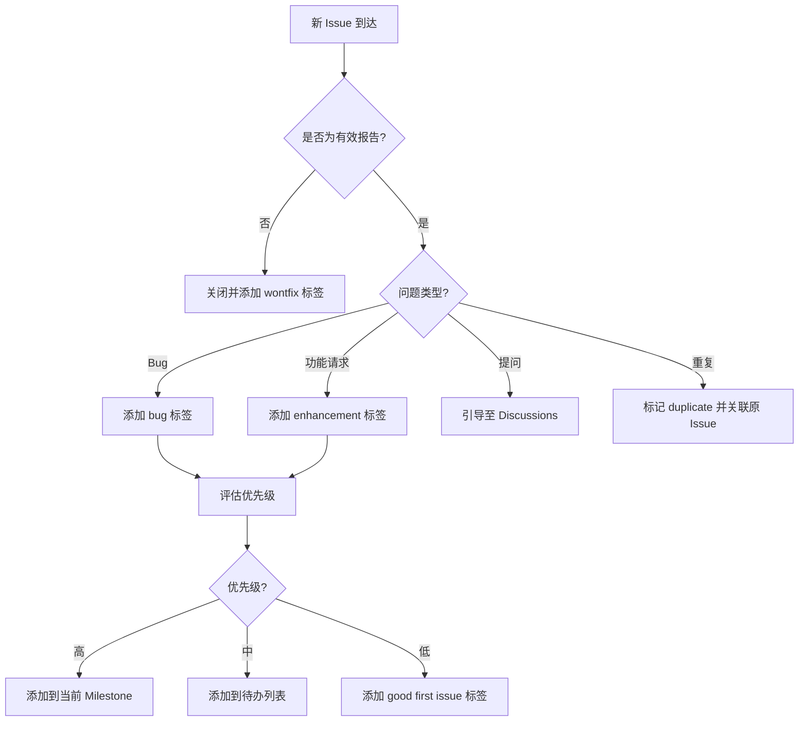

# 开源项目维护指南

> 从零运营一个开源项目——社区建设、Issue 分流、Release 管理的全流程实战。

## 概述

场景：你刚在 GitHub 上发布了一个开源工具库，收到了第一个 Star 和第一份 Issue。兴奋之余，你需要思考如何让这个项目从"个人作品"成长为"可信的开源项目"。开源维护不仅仅是写代码，更是一项涉及社区运营、文档维护、版本管理和持续沟通的系统工程。

GitHub 提供了一整套工具来支撑开源项目的日常维护：Issue 模板帮你结构化地收集反馈，Discussion 为社区提供交流空间，Release 和 Tag 帮你管理版本发布，而 GitHub Actions 则可以自动化大量重复工作。掌握这些工具的组合使用，是成为一名合格 Maintainer 的必经之路。

> [!NOTE]
> 开源（Open Source）不仅仅是"代码公开"。一个真正的开源项目需要明确的许可证、贡献指南、行为准则和持续的维护承诺。根据 Open Source Initiative 的定义，只有满足开源定义的许可证才能被称为"开源许可证"。在开始之前，请确保你已经为仓库选择了合适的许可证。

本指南将按照一个开源项目的典型生命周期，带你完成从项目初始化到社区运营再到版本发布的完整实践。每个步骤都对应你在前面章节学过的具体能力。

## 核心操作

### 项目初始化：搭建健康的基础设施

一个开源项目的"门面"决定了潜在用户和贡献者的第一印象。以下文件是开源项目的必备基础设施：

**1. 选择并添加许可证**

没有许可证的代码在法律上等同于"保留所有权利"，其他人无法合法使用。访问 [Choose a License](https://choosealicense.com/) 根据项目需求选择：

- **MIT** —— 最宽松，适合大多数工具库和框架，允许任何人自由使用、修改和分发。
- **Apache-2.0** —— 类似 MIT，但包含专利授权条款，适合企业级项目。
- **GPL-3.0** —— 要求衍生作品同样开源，适合希望防止闭源商业化的项目。

```bash
# 使用 GitHub CLI 添加 MIT 许可证
gh api repos/{owner}/{repo}/license \
  --method PUT \
  -f license_template=mit
```

**2. 创建 CONTRIBUTING.md**

贡献指南告诉社区如何参与项目。它应该包含：开发环境搭建步骤、代码规范、提交信息格式、PR 流程说明。

```markdown
# 贡献指南

感谢你对本项目的关注！请阅读以下指南来参与贡献。

## 开发环境

1. Fork 并克隆仓库
2. 安装依赖：`npm install`
3. 运行测试：`npm test`

## 提交规范

使用 Conventional Commits 格式：

- `feat:` 新功能
- `fix:` 修复 Bug
- `docs:` 文档变更
- `chore:` 构建/工具变更

## PR 流程

1. 从 `main` 创建功能分支
2. 确保所有测试通过
3. 提交 PR 并填写 PR 模板
4. 等待至少一位 Maintainer 审查
```

**3. 添加 CODE_OF_CONDUCT.md**

行为准则为社区设定基本礼仪底线，对所有参与者一视同仁。GitHub 提供模板：

1. 进入仓库的 **Settings > Code of conduct**。
2. 选择 **Contributor Covenant**（最常用的模板）。
3. 填写联系方式后提交。

**4. 配置 Issue 模板和 PR 模板**

结构化的模板能大幅降低沟通成本。参考 [Issue 完整指南](../02-协作与工作流/01-Issue-完整指南) 中关于模板的详细说明，至少创建以下三种 Issue 模板：

- **Bug Report** —— 包含复现步骤、期望行为、实际行为。
- **Feature Request** —— 包含使用场景、期望方案。
- **Question** —— 简化的问答模板。

```bash
# 创建 Issue 模板目录
mkdir -p .github/ISSUE_TEMPLATE

# 创建 Bug 报告模板
cat > .github/ISSUE_TEMPLATE/bug_report.yml << 'EOF'
name: Bug 报告
description: 报告一个 Bug 以帮助我们改进
labels: ["bug", "triage"]
body:
  - type: textarea
    id: description
    attributes:
      label: 问题描述
      description: 清晰描述你遇到的问题
    validations:
      required: true
  - type: textarea
    id: steps
    attributes:
      label: 复现步骤
      description: 告诉我们如何复现这个问题
      placeholder: |
        1. 打开 ...
        2. 点击 ...
        3. 出现 ...
  - type: textarea
    id: expected
    attributes:
      label: 期望行为
    validations:
      required: true
EOF
```

**5. 启用 Discussions**

参考 [Discussions 社区](../05-文档与知识管理/03-Discussions社区) 中的详细操作，为项目启用 Discussions 功能。建议至少配置以下分类：

- **Announcements** —— 版本发布公告、重要通知。
- **Q&A** —— 使用问题，支持标记最佳回答。
- **Ideas** —— 功能建议和改进讨论。
- **Show and Tell** —— 社区作品展示。

### Issue 分流与日常管理

项目发布后，Issue 会陆续涌入。有效的分流（Triage）流程是开源维护的核心技能。



**建立 Label 体系：**

参考 [标签与里程碑](../02-协作与工作流/02-标签与里程碑) 中的做法，为项目创建一套清晰的 Label 分类：

| Label 类别 | 示例 | 用途 |
|-----------|------|------|
| 类型 | `bug`、`enhancement`、`documentation` | 标识 Issue 类型 |
| 优先级 | `priority: high`、`priority: low` | 标识紧急程度 |
| 状态 | `in progress`、`blocked`、`needs triage` | 标识处理状态 |
| 难度 | `good first issue`、`help wanted` | 吸引新贡献者 |
| 模块 | `module: auth`、`module: ui` | 标识涉及的模块 |

> [!TIP]
> `good first issue` 标签是吸引新贡献者的利器。GitHub 会在项目首页展示带有该标签的 Issue 列表，让新手快速找到可以上手的工作。一个活跃的开源项目通常有 5-10 个 `good first issue` 处于开放状态。

**每日分流流程：**

1. 打开仓库的 **Issues** 页面，筛选带有 `needs triage` 标签的 Issue。
2. 阅读内容，判断是否为有效报告。
3. 添加合适的类型、优先级和模块标签。
4. 如果是重复问题，标记 `duplicate` 并评论引用原 Issue：`Duplicate of #123`。
5. 如果是提问，引导用户到 Discussions 并礼貌关闭 Issue。
6. 对于确认的 Bug 或功能请求，评估优先级并分配到对应的 Milestone。

### 处理 Pull Request

当社区开始提交 PR 时，你需要一套高效的审查和合并流程。这与 [PR 完整生命周期](../02-协作与工作流/03-PR-完整生命周期) 中描述的内部团队流程类似，但有额外的开源考量。

**PR 审查清单：**

1. **许可证检查** —— 确认贡献者已签署 CLA（Contributor License Agreement）或 DCO（Developer Certificate of Origin）。
2. **代码质量** —— 运行 Linter 和测试，确保 CI 通过。
3. **变更范围** —— PR 应该只做一件事，避免混合多种不相关的修改。
4. **文档更新** —— 如果涉及 API 变更，检查是否同步更新了文档。
5. **测试覆盖** —— 新功能是否有对应的测试用例。

**使用 GitHub CLI 批量管理 PR：**

```bash
# 查看待审查的 PR
gh pr list --state open --reviewer @me

# 快速审查
gh pr review 42 --approve --body "代码质量良好，测试覆盖充分。合并吧！"

# 请求修改
gh pr review 42 --request-changes --body "请补充单元测试覆盖边界情况。"

# 合并 PR
gh pr merge 42 --squash --delete-branch
```

> [!WARNING]
> 对于来自外部贡献者的 PR，务必在合并前运行完整的 CI 检查。不要仅凭代码审查就合并来自 Fork 的 PR，因为恶意代码可能隐藏在依赖变更或构建脚本中。配置 Branch Protection 强制要求 CI 通过后再合并，参考 [分支保护与规则集](../04-代码质量与安全/04-分支保护与规则集)。

### Release 管理

版本发布是开源项目维护的里程碑事件。良好的 Release 管理能让用户安心升级，也能降低你的维护负担。

**1. 使用语义化版本（Semantic Versioning）**

语义化版本格式为 `MAJOR.MINOR.PATCH`：

- **MAJOR** —— 不兼容的 API 变更。
- **MINOR** —— 向后兼容的功能新增。
- **PATCH** —— 向后兼容的 Bug 修复。

**2. 维护 CHANGELOG.md**

每个版本都应该有一份清晰的变更记录。在 [README 与文档最佳实践](../05-文档与知识管理/04-README与文档最佳实践) 中提到的项目文档体系中，CHANGELOG 是不可或缺的一部分。

```markdown
# Changelog

## [1.2.0] - 2025-01-15

### Added
- 支持自定义主题配色（#89）
- 新增批量导入 API（#92）

### Fixed
- 修复移动端布局错位问题（#95）
- 修复并发请求时的竞态条件（#97）

### Changed
- 最低支持 Node.js 18（#90）

## [1.1.0] - 2024-12-01
...
```

**3. 创建 GitHub Release**

```bash
# 使用 CLI 创建 Release
gh release create v1.2.0 \
  --title "v1.2.0 - 主题支持与性能优化" \
  --notes "$(cat CHANGELOG.md | sed -n '/## \[1.2.0\]/,/## \[1.1.0\]/p')" \
  --target main

# 上传构建产物
gh release upload v1.2.0 ./dist/*.zip
```

**4. 启用自动生成 Release Notes**

GitHub 支持基于合并的 PR 自动生成 Release Notes：

1. 进入仓库的 **Releases** 页面，点击 **Draft a new release**。
2. 输入 Tag 版本号（如 `v1.3.0`）。
3. 点击 **Generate release notes** 按钮。
4. GitHub 会自动根据 PR 标签分类生成本次版本的变更摘要。
5. 审阅并补充手动修改后发布。

## 进阶技巧

### 使用 GitHub Sponsors 获取资助

如果你投入了大量时间维护开源项目，可以通过 GitHub Sponsors 接受社区资助：

1. 访问 [GitHub Sponsors](https://github.com/sponsors) 页面。
2. 点击 **Get started** 完成申请（需要审核）。
3. 设置赞助 tiers（金额等级），为不同金额提供不同的回报。
4. 在 README 中添加 Sponsor 按钮：

```markdown
## 支持本项目

如果你的公司使用了本项目，请考虑赞助支持持续维护：

[](https://github.com/sponsors/<your-username>)
```

### 自动化 Stale Issue 清理

长时间未活动的 Issue 会增加维护负担。使用 `actions/stale` 自动标记和清理：

```yaml
# .github/workflows/stale.yml
name: Mark stale issues
on:
  schedule:
    - cron: "0 0 * * *"  # 每天UTC零点运行

jobs:
  stale:
    runs-on: ubuntu-latest
    steps:
      - uses: actions/stale@v9
        with:
          repo-token: ${{ secrets.GITHUB_TOKEN }}
          stale-issue-message: "此 Issue 已 30 天无活动，将在 7 天后自动关闭。如有更新请移除 stale 标签。"
          stale-pr-message: "此 PR 已 30 天无活动，将在 7 天后自动关闭。如仍在处理中请移除 stale 标签。"
          days-before-stale: 30
          days-before-close: 7
          stale-issue-label: "stale"
          exempt-issue-labels: "pinned,security"
```

### 配置 Community Health Files

如果你维护多个开源项目，可以使用 `.github` 仓库作为默认社区健康文件的来源。当某个仓库缺少特定文件时，GitHub 会自动从你的 `<username>/.github` 仓库中读取。

推荐放入 `.github` 仓库的文件：

- `CODE_OF_CONDUCT.md`
- `CONTRIBUTING.md`
- `SECURITY.md`
- `FUNDING.yml`
- `ISSUE_TEMPLATE/` 目录
- `PULL_REQUEST_TEMPLATE.md`

### 项目退役（Sunsetting）

当项目不再积极维护时，应该以透明的方式告知社区：

1. 在 README 顶部添加归档说明。
2. 归档仓库（Settings > Archive repository），归档后无法再创建 Issue 和 PR。
3. 如果有继任项目，在 README 中明确指向。
4. 保持已有 Issue 和 PR 的可见性，方便用户查阅历史讨论。

```markdown
> **⚠️ 项目已归档**
> 本项目已于 2025-06-01 归档，不再接受新的 Issue 和 PR。
> 如果你希望接手维护，请在 Fork 中继续开发。
> 推荐替代方案：[新项目链接]
```

## 常见问题

### Q: 如何处理不友善或恶意的 Issue？

保持冷静和专业。引用行为准则，必要时隐藏违规评论。对于反复违规的用户，可以在仓库 Settings 中屏蔽。不要卷入公开争论——你的回应会永久保留在项目历史中，代表项目的社区形象。

### Q: 贡献者提交了低质量 PR，如何拒绝？

使用建设性的反馈，指出具体问题和改进方向。即使拒绝也要感谢贡献者的时间投入。模板示例："感谢你的贡献！这个方向很有价值，但目前的实现还需要调整。建议参考 xxx 来优化。如果你愿意改进，我很乐意继续审查。"

### Q: 如何吸引更多贡献者？

保持 Issue 列表干净有序，多用 `good first issue` 标签标记适合新手的任务。在 CONTRIBUTING.md 中提供清晰的开发环境搭建指南。及时回复 Issue 和 PR，让贡献者感到被重视。活跃的 Discussions 社区也能有效吸引新贡献者。

### Q: 如何处理安全漏洞报告？

在仓库根目录创建 `SECURITY.md` 文件，说明安全漏洞的报告流程。推荐使用 GitHub 的 Private Security Reporting 功能（Settings > Code security > Private vulnerability reporting），允许安全研究者私下报告漏洞，避免公开披露。

### Q: 需要多久回复一次 Issue？

没有硬性要求，但建议至少每周查看一次。可以在 README 中说明预期的回复时间，例如"我们会在 5 个工作日内回复新 Issue"。定期进行 Triage 比实时响应更可持续。

### Q: 如何管理多个版本的并行维护？

为每个主要版本创建长期维护分支（如 `v1.x`、`v2.x`），使用 Milestone 追踪每个版本的待办事项。安全修复应该同时向后移植到仍在维护的旧版本分支，并分别发布 Patch Release。

### Q: CLA 和 DCO 应该选哪个？

CLA（Contributor License Agreement）是正式的法律协议，通常由大型项目或商业公司使用（如 CNCF 项目）。DCO（Developer Certificate of Origin）更轻量，只需要贡献者在提交信息中加上 `Signed-off-by:` 即可。对于大多数中小型项目，DCO 已经足够。

### Q: 项目大了以后如何分配维护权限？

随着项目成长，可以考虑将活跃贡献者提升为 Collaborator。建议设置 CODEOWNERS 文件，按模块分配审查权限。对于核心模块，要求至少两位 Maintainer 共同审查才能合并。也可以参考 [项目管理看板](../02-协作与工作流/06-项目管理看板) 来可视化管理维护任务。

## 参考链接

| 标题 | 说明 |
|------|------|
| [Open Source Guides](https://opensource.guide/) | GitHub 官方开源项目维护指南 |
| [How to Contribute to Open Source](https://opensource.guide/how-to-contribute/) | 开源贡献入门指南 |
| [Licensing a repository](https://docs.github.com/articles/licensing-a-repository) | GitHub 仓库许可证配置文档 |
| [Choose an open source license](https://choosealicense.com/) | 开源许可证选择工具 |
| [Creating a default community health file](https://docs.github.com/en/communities/setting-up-your-project-for-healthy-contributions/creating-a-default-community-health-file) | 默认社区健康文件配置 |
| [GitHub Sponsors](https://github.com/open-source/sponsors) | 开源项目资助平台 |
| [Dos and don'ts when sunsetting projects](https://github.blog/open-source/maintainers/dos-and-donts-when-sunsetting-open-source-projects/) | 项目退役的最佳实践 |
| [Hosting Open Source Projects](https://www.linuxfoundation.org/research/hosting-os-projects-on-github) | Linux Foundation 托管开源项目指南 |
