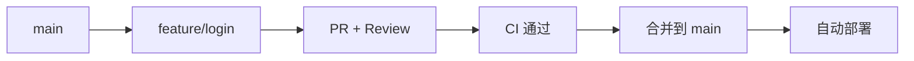
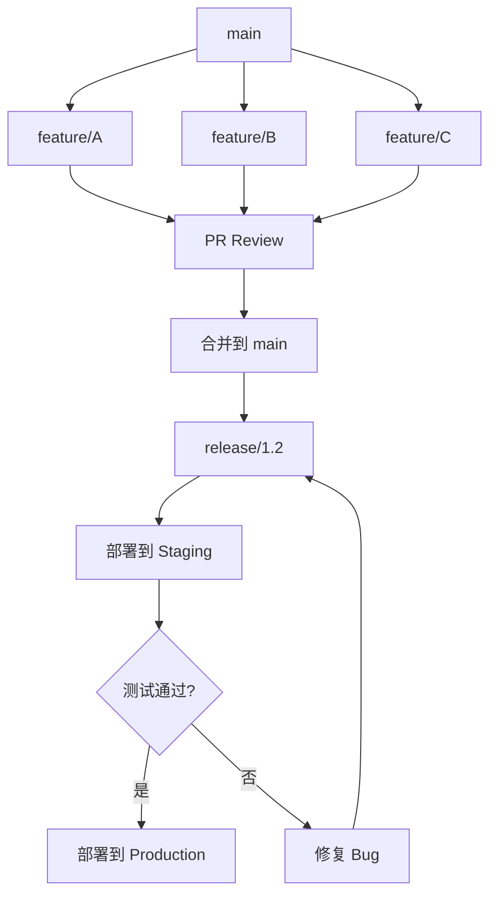

# 团队协作最佳实践

> 从分支策略到 Code Review 流程——建立可扩展的团队工程协作体系。

## 概述

场景：你刚加入一个 8 人开发团队，接手了一个已经迭代了两年、有 200 多个分支的项目。合并冲突频发，PR 堆积如山，测试时灵时不灵，上线经常延期。这不是个例——大多数团队在规模增长时都会遇到协作瓶颈。

团队协作的核心矛盾在于：个体的开发效率与整体的代码质量之间的平衡。一个人写代码不需要 Code Review，三个人需要，八个人就需要一整套工程化体系。GitHub 提供了 Branch Protection、Code Review、GitHub Actions、Project Boards 等工具，但工具本身不会解决问题——你需要一套将工具组合起来的协作规范。

> [!NOTE]
> 本指南假设你已经熟悉 GitHub 的基本操作（仓库管理、分支、提交），以及 [PR 完整生命周期](../02-协作与工作流/03-PR-完整生命周期) 和 [代码审查](../02-协作与工作流/04-代码审查) 的核心概念。这里重点讲解的是如何将这些能力系统化地整合到团队工作流中。

本指南将围绕分支策略、PR 规范、自动化检查和团队沟通四个维度，提供一套可以直接落地的团队协作方案。所有建议都基于真实的团队工程实践，而非理论模型。

## 核心操作

### 确立分支策略

分支策略是团队协作的基石。参考 [分支策略与Git-Flow](../02-协作与工作流/05-分支策略与Git-Flow) 中的详细分析，这里给出针对不同团队规模的推荐方案。

**小型团队（2-5 人）：GitHub Flow**

最简单的策略，适合持续部署的项目：



规则很简单：

1. `main` 分支始终可部署。
2. 所有开发从 `main` 创建功能分支。
3. 功能分支完成后发起 PR。
4. 至少一人审查通过且 CI 通过后合并。
5. 合并后自动部署到生产环境。

**中型团队（6-15 人）：Release Flow**

在 GitHub Flow 基础上增加 Release 分支，适合需要版本管理的项目：



核心差异：

- 功能分支只合并到 `main`。
- 定期从 `main` 创建 `release/*` 分支。
- Release 分支用于预发布测试和 Hotfix。
- `main` 始终接收功能开发，Release 分支负责稳定化。

**大型团队（15 人以上）：Trunk-Based Development**

大型团队的核心挑战是减少合并冲突。Trunk-Based Development 要求：

- 功能分支存活时间不超过 2 天。
- 使用 Feature Flag 控制未完成功能的可见性。
- 频繁向 `main` 提交小粒度的变更。
- 自动化测试覆盖率要求高（至少 80%）。

### 建立 PR 规范

PR 是团队协作的核心节点。好的 PR 规范能显著提升审查效率和代码质量。

**PR 模板配置：**

在仓库中创建 `.github/pull_request_template.md`：

```markdown
## 变更描述

<!-- 简要描述本次 PR 的目的和实现方式 -->

## 变更类型

- [ ] 新功能（feat）
- [ ] Bug 修复（fix）
- [ ] 重构（refactor）
- [ ] 文档更新（docs）
- [ ] 测试（test）
- [ ] 构建/工具（chore）

## 关联 Issue

<!-- 使用 closes #xxx 或 fixes #xxx 关联 Issue -->

## 测试方案

<!-- 描述如何验证本次变更 -->

- [ ] 单元测试已通过
- [ ] 集成测试已通过
- [ ] 手动测试已通过

## 检查清单

- [ ] 代码遵循项目编码规范
- [ ] 新代码有对应的测试覆盖
- [ ] 文档已同步更新（如适用）
- [ ] 无硬编码的敏感信息
- [ ] 向后兼容（或已在 Issue 中说明 Breaking Change）
```

> [!TIP]
> 可以在 `.github/PULL_REQUEST_TEMPLATE/` 目录下创建多个模板，用于不同类型的 PR。例如 `feature.md`、`bugfix.md`、`hotfix.md`。在创建 PR 时，GitHub 会让你选择使用哪个模板。

**PR 尺寸指南：**

| 尺寸 | 变更行数 | 审查时间 | 建议 |
|------|---------|---------|------|
| XS | < 50 行 | < 10 分钟 | 日常修复、文档变更 |
| S | 50-200 行 | 10-30 分钟 | 小功能、简单重构 |
| M | 200-500 行 | 30-60 分钟 | 中等功能，需要仔细审查 |
| L | 500-1000 行 | 1-2 小时 | 建议拆分为多个小 PR |
| XL | > 1000 行 | > 2 小时 | 强制要求拆分 |

**提交信息规范（Conventional Commits）：**

```bash
# 格式
<type>(<scope>): <subject>

# 示例
feat(auth): 添加 OAuth2 登录支持
fix(api): 修复分页查询偏移量计算错误
docs(readme): 更新安装说明
refactor(utils): 提取日期格式化为独立函数
chore(deps): 升级依赖至最新版本
```

### 配置自动化检查

手动审查容易遗漏问题，自动化检查是代码质量的第一道防线。结合 [分支保护与规则集](../04-代码质量与安全/04-分支保护与规则集) 中的保护规则，以下是推荐的自动化检查配置。

**1. CI 基础检查（GitHub Actions）：**

```yaml
# .github/workflows/ci.yml
name: CI
on:
  pull_request:
    branches: [main]

jobs:
  lint:
    runs-on: ubuntu-latest
    steps:
      - uses: actions/checkout@v4
      - uses: actions/setup-node@v4
        with:
          node-version: 20
          cache: npm
      - run: npm ci
      - run: npm run lint

  test:
    runs-on: ubuntu-latest
    steps:
      - uses: actions/checkout@v4
      - uses: actions/setup-node@v4
        with:
          node-version: 20
          cache: npm
      - run: npm ci
      - run: npm test -- --coverage
      - uses: codecov/codecov-action@v4
        with:
          token: ${{ secrets.CODECOV_TOKEN }}

  type-check:
    runs-on: ubuntu-latest
    steps:
      - uses: actions/checkout@v4
      - uses: actions/setup-node@v4
        with:
          node-version: 20
          cache: npm
      - run: npm ci
      - run: npm run type-check
```

**2. 配置 Branch Protection 强制执行：**

进入 **Settings > Branches > Branch protection rules**，为 `main` 分支配置：

- 勾选 **Require status checks to pass before merging**。
- 选中上面 CI workflow 中定义的所有 job（`lint`、`test`、`type-check`）。
- 勾选 **Require branches to be up to date before merging**。
- 勾选 **Require a pull request before merging**。
- 勾选 **Require approvals**（至少 1 人）。

> [!WARNING]
> 不要把所有检查都配置为 Required，否则任何一个不相关的检查失败都会阻塞合并。只将核心检查（lint、test）设为 Required，辅助检查（如代码覆盖率报告）设为非阻塞。

**3. 自动化 Code Review 辅助：**

```yaml
# .github/workflows/review.yml
name: Auto Review
on:
  pull_request:
    types: [opened, synchronize]

jobs:
  auto-assign:
    runs-on: ubuntu-latest
    steps:
      # 自动分配审查人
      - uses: kentaro-m/auto-assign-action@v2
        with:
          configuration-path: .github/auto-assign.yml

  size-label:
    runs-on: ubuntu-latest
    steps:
      # 根据 PR 尺寸自动添加标签
      - uses: pascalgn/size-label-action@v0.5.5
        env:
          GITHUB_TOKEN: ${{ secrets.GITHUB_TOKEN }}
```

### 建立团队沟通规范

工具和规范只是协作的骨架，沟通才是让团队高效运转的血液。

**Issue 和 PR 的沟通规范：**

1. **Issue 标题使用统一前缀** —— `[Bug]`、`[Feature]`、`[Discussion]`，让团队成员一眼看出类型。
2. **PR 描述必须关联 Issue** —— 使用 `closes #xxx` 或 `fixes #xxx`，参考 [Issue 完整指南](../02-协作与工作流/01-Issue-完整指南) 中的自动关闭机制。
3. **Code Review 评论使用约定前缀** —— `nit:`（小建议，可忽略）、`question:`（疑问，需回复）、`issue:`（必须修改）、`praise:`（值得表扬的代码）。
4. **使用 Slack/Teams 集成** —— 配置 GitHub 通知到团队聊天工具，让 PR 状态变更实时可见。

**使用 Project Board 管理迭代：**

参考 [项目管理看板](../02-协作与工作流/06-项目管理看板)，为每个迭代创建看板：

| 列名 | 用途 | 卡片类型 |
|------|------|---------|
| Backlog | 待规划的需求 | Issue |
| Sprint Todo | 本迭代待开始 | Issue（关联 Milestone） |
| In Progress | 开发中 | Issue（关联 Assignee） |
| In Review | PR 审查中 | Pull Request |
| Done | 已完成 | 已关闭的 Issue/PR |

**使用 GitHub Discussions 进行团队决策：**

参考 [Discussions 社区](../05-文档与知识管理/03-Discussions社区)，在仓库中启用 Discussions 用于：

- 技术方案讨论（替代冗长的 Issue 评论）。
- 架构决策记录（ADR）。
- 团队规范讨论和投票。

## 进阶技巧

### 使用 CODEOWNERS 分配审查责任

在仓库根目录创建 `CODEOWNERS` 文件，自动为涉及特定文件的 PR 分配审查人：

```bash
# CODEOWNERS
# 全局默认审查人
* @tech-lead

# 按模块分配
/src/auth/ @auth-team
/src/api/ @backend-team
/src/ui/ @frontend-team

# 关键配置文件需要多人审查
.github/workflows/ @tech-lead @devops-lead
package.json @tech-lead
```

这确保了每个模块的变更都能被对应的领域专家审查。

### 配置 Reusable Workflow 复用 CI

如果你的组织有多个仓库，可以将通用的 CI 步骤抽取为 Reusable Workflow：

```yaml
# .github/workflows/reusable-ci.yml（在共享仓库中）
on:
  workflow_call:
    inputs:
      node-version:
        required: false
        type: string
        default: "20"

jobs:
  lint-and-test:
    runs-on: ubuntu-latest
    steps:
      - uses: actions/checkout@v4
      - uses: actions/setup-node@v4
        with:
          node-version: ${{ inputs.node-version }}
      - run: npm ci
      - run: npm run lint
      - run: npm test
```

```yaml
# 其他仓库中引用
jobs:
  ci:
    uses: <org>/.github/.github/workflows/reusable-ci.yml@main
    with:
      node-version: "20"
```

### 设置合并队列（Merge Queue）

对于活跃项目，多个 PR 同时合并可能导致 CI 反复重跑。GitHub 的 Merge Queue 功能可以解决此问题：

1. 进入仓库 **Settings > General > Pull Requests**。
2. 勾选 **Require merge queue**。
3. 配置合并策略（Merge、Squash 或 Rebase）。

启用后，PR 审查通过后不会直接合并，而是进入队列，GitHub 会依次合并并验证每个 PR，确保 `main` 分支始终处于可部署状态。

### 利用 Draft PR 进行早期沟通

鼓励团队成员在开发初期就创建 Draft PR：

- 让审查者提前了解开发方向，避免大方向偏离。
- 通过 PR 评论讨论技术方案，讨论过程被完整记录。
- 使用 [PR 完整生命周期](../02-协作与工作流/03-PR-完整生命周期) 中提到的 Draft PR 功能，明确标识开发状态。

## 常见问题

### Q: 团队成员经常忘记关联 Issue 怎么办？

在 Branch Protection 中配置 PR 标题必须包含 Issue 编号。也可以在 CI 中添加检查脚本，要求 PR 描述中包含 `closes #` 或 `fixes #`。对于无需关联 Issue 的小修复，可以定义例外标签（如 `hotfix`）跳过检查。

### Q: PR 审查太慢，经常阻塞开发怎么办？

设定审查 SLA（如 24 小时内完成首次审查）。使用 GitHub 的 Slack 集成发送审查提醒。指定备份审查人，当主要审查人忙碌时自动转交。控制 PR 尺寸（建议不超过 400 行变更），小 PR 审查更快。

### Q: 合并冲突太多怎么解决？

根本原因是功能分支存活时间太长。要求功能分支在 2 天内完成开发和合并。频繁从 `main` 合并最新变更到功能分支（每天至少一次）。对于大型功能，使用 Feature Flag 拆分，将已完成的部分先合并。

### Q: 如何处理紧急 Hotfix？

创建专门的 `hotfix/*` 分支，从 `main` 创建。跳过常规的迭代排期，但仍然要求 Code Review 和 CI 通过。合并后同步到当前开发分支。在 Branch Protection 中可以为 `hotfix/*` 分支设置更宽松的规则（如只要求 1 人审查）。

### Q: 多人同时修改同一文件怎么办？

短期方案：提前在团队群中沟通，协调开发顺序。中期方案：将大文件拆分为多个小模块，减少冲突面。长期方案：引入模块化架构，使用 CODEOWNERS 按模块分配责任，减少跨模块修改。

### Q: 如何衡量团队协作效率？

使用 GitHub Insights（仓库的 **Insights** 标签页）关注以下指标：PR 平均合并时间（目标 < 48 小时）、PR 审查轮数（目标 < 3 轮）、首次审查响应时间（目标 < 24 小时）、CI 成功率（目标 > 95%）。定期在团队会议中回顾这些指标。

### Q: 开源贡献者参与内部项目时如何管理？

为外部贡献者创建专门的 Team，使用 CODEOWNERS 限制其审查范围。在 Branch Protection 中设置不同的审查要求（内部贡献者 1 人审查，外部贡献者 2 人审查）。所有外部贡献通过 Fork + PR 的方式提交，不允许直接推送。

### Q: 如何处理不同时区团队的协作？

减少同步依赖：所有决策通过 Issue 和 PR 异步进行，而非实时会议。在 PR 中使用 @mention 替代即时消息通知。将 CI 配置为非阻塞模式（仅阻止合并，不阻止开发），让不同时区的成员都能持续推进。设置 Branch Protection 的 Auto-merge，当所有检查通过后自动合并。

## 参考链接

| 标题 | 说明 |
|------|------|
| [How to review code effectively](https://github.blog/developer-skills/github/how-to-review-code-effectively-a-github-staff-engineers-philosophy/) | GitHub 工程师的代码审查哲学 |
| [pull-request-review-guide](https://github.com/mawrkus/pull-request-review-guide) | PR 审查最佳实践指南 |
| [GitHub Discussions](https://github.com/features/discussions) | GitHub 官方 Discussions 功能介绍 |
| [How five communities use Discussions](https://github.blog/open-source/how-five-open-source-communities-are-using-github-discussions/) | 五个开源社区的 Discussions 使用案例 |
