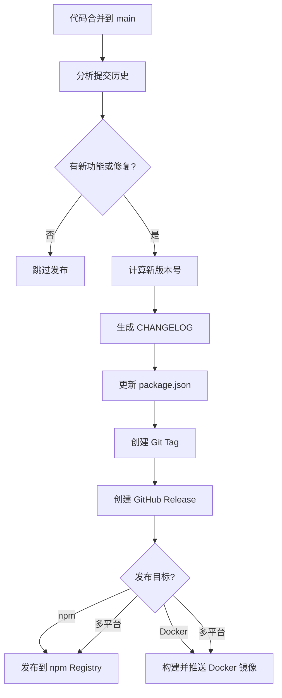

# 自动化发布流水线

> 从提交代码到用户手中的全自动之路——语义版本、Changelog 生成、多平台发布的完整 DevOps 实践。

## 概述

场景：你的团队正在维护一个 npm 包，每周发布 2-3 次更新。每次发布都需要手动修改版本号、更新 Changelog、打 Tag、创建 Release、发布到 npm、推送 Docker 镜像——整个过程耗时 30 分钟且容易出错。有一次你忘了更新版本号，导致 npm 上的版本与 Git Tag 不一致，用户反馈混乱。

手动发布流程的每一个步骤都是潜在的故障点。自动化发布流水线的目标是将这些重复性操作交给机器执行：开发者只需要按照规范提交代码，系统自动判断版本号、生成变更记录、创建 Release 并发布到目标平台。这不仅消除了人为错误，还将发布时间从 30 分钟缩短到 3 分钟。

> [!NOTE]
> 本指南将综合运用前面章节中关于 GitHub Actions、Release 管理和 Packages 的知识。自动化发布的根基是规范的提交信息和可靠的 CI 流水线——如果这两项还没到位，建议先回顾 [CI/CD 实战](../03-自动化与CI-CD/04-CI-CD实战.md) 中的 CI 配置方法。

## 核心操作

### 基于 Conventional Commits 的版本管理

自动化发布的前提是提交信息的规范化。Conventional Commits 是一套轻量的提交信息约定，让机器能够自动判断版本号和变更类型。

**提交信息格式：**

```
<type>(<scope>): <subject>

<body>

BREAKING CHANGE: <description>
```

**类型与语义化版本的对应关系：**

| 提交类型 | 语义化版本变更 | 示例 |
|---------|-------------|------|
| `feat:` | MINOR（+0.1.0） | `feat(api): 添加批量删除接口` |
| `fix:` | PATCH（+0.0.1） | `fix(auth): 修复 Token 过期判断逻辑` |
| `feat:` + `BREAKING CHANGE` | MAJOR（+1.0.0） | `feat(db): 迁移至新 ORM\n\nBREAKING CHANGE: 查询接口返回格式变更` |
| `docs:` | 无版本变更 | `docs: 更新 API 文档` |
| `chore:`、`test:`、`refactor:` | 无版本变更 | `chore(deps): 升级 devDependencies` |

**配置 Commitlint 强制执行规范：**

```yaml
# .github/workflows/commitlint.yml
name: Lint Commit Messages
on:
  pull_request:
    types: [opened, synchronize]

jobs:
  commitlint:
    runs-on: ubuntu-latest
    steps:
      - uses: actions/checkout@v4
        with:
          fetch-depth: 0
      - uses: wagoid/commitlint-github-action@v6
        with:
          configFile: .commitlintrc.yml
```

```yaml
# .commitlintrc.yml
extends:
  - "@commitlint/config-conventional"
rules:
  type-enum:
    - 2
    - always
    - - feat
      - fix
      - docs
      - style
      - refactor
      - perf
      - test
      - build
      - ci
      - chore
      - revert
  scope-case:
    - 2
    - always
    - lowercase
  subject-max-length:
    - 2
    - always
    - 72
```

### 搭建自动化发布 Workflow

以下是完整的自动化发布 Workflow，它会在 `main` 分支有新合并时自动执行。

```yaml
# .github/workflows/release.yml
name: Release
on:
  push:
    branches: [main]

permissions:
  contents: write
  pull-requests: write

jobs:
  release:
    runs-on: ubuntu-latest
    steps:
      # 1. 检出代码（完整历史）
      - uses: actions/checkout@v4
        with:
          fetch-depth: 0
          token: ${{ secrets.GITHUB_TOKEN }}

      # 2. 配置环境
      - uses: actions/setup-node@v4
        with:
          node-version: 20
          cache: npm

      - run: npm ci

      # 3. 运行测试（安全网）
      - run: npm test

      # 4. 使用 semantic-release 执行发布
      - name: Release
        env:
          GITHUB_TOKEN: ${{ secrets.GITHUB_TOKEN }}
          NPM_TOKEN: ${{ secrets.NPM_TOKEN }}
        run: npx semantic-release
```

**semantic-release 的执行流程：**



**配置 semantic-release：**

```json
{
  "release": {
    "branches": [
      "main",
      {
        "name": "beta",
        "prerelease": true
      }
    ],
    "plugins": [
      "@semantic-release/commit-analyzer",
      "@semantic-release/release-notes-generator",
      "@semantic-release/changelog",
      "@semantic-release/npm",
      "@semantic-release/github",
      [
        "@semantic-release/git",
        {
          "assets": [
            "package.json",
            "package-lock.json",
            "CHANGELOG.md"
          ],
          "message": "chore(release): ${nextRelease.version} [skip ci]\n\n${nextRelease.notes}"
        }
      ]
    ]
  }
}
```

> [!TIP]
> 提交信息中包含 `[skip ci]` 标记可以防止 Release 提交再次触发 CI Workflow，避免无限循环。这是 semantic-release 的 Git 插件自动处理的，你不需要手动添加。

### 手动触发发布（备选方案）

如果你希望保留手动控制发布的权力，可以使用手动触发模式：

```yaml
# .github/workflows/manual-release.yml
name: Manual Release
on:
  workflow_dispatch:
    inputs:
      release_type:
        description: "发布类型"
        required: true
        default: "auto"
        type: choice
        options:
          - auto
          - patch
          - minor
          - major
      prerelease:
        description: "是否为预发布版本"
        type: boolean
        default: false

jobs:
  release:
    runs-on: ubuntu-latest
    steps:
      - uses: actions/checkout@v4
        with:
          fetch-depth: 0

      - uses: actions/setup-node@v4
        with:
          node-version: 20

      - run: npm ci
      - run: npm test

      - name: 确定版本号
        id: version
        run: |
          if [ "${{ inputs.release_type }}" = "auto" ]; then
            # 自动根据提交判断
            npx standard-version --dry-run
          else
            echo "bump=${{ inputs.release_type }}" >> $GITHUB_OUTPUT
          fi

      - name: 执行版本升级
        run: |
          npx standard-version --release-as ${{ steps.version.outputs.bump || inputs.release_type }}
          git push --follow-tags origin main

      - name: 创建 GitHub Release
        env:
          GH_TOKEN: ${{ secrets.GITHUB_TOKEN }}
        run: |
          VERSION=$(node -p "require('./package.json').version")
          gh release create "v${VERSION}" \
            --title "v${VERSION}" \
            --generate-notes \
            ${{ inputs.prerelease && '--prerelease' || '' }}
```

### 自动生成 Release Notes

GitHub 内置了基于 PR 标签的自动 Release Notes 生成功能。如果你不想引入 semantic-release 的完整体系，这是更轻量的方案。

**配置分类规则：**

在仓库根目录创建 `.github/release.yml`：

```yaml
# .github/release.yml
changelog:
  exclude:
    labels:
      - ignore-for-release
      - dependencies
  categories:
    - title: "🚀 新功能"
      labels:
        - feature
        - enhancement
    - title: "🐛 Bug 修复"
      labels:
        - bug
        - fix
    - title: "⚡ 性能优化"
      labels:
        - performance
    - title: "📝 文档更新"
      labels:
        - documentation
    - title: "🔧 维护"
      labels:
        - chore
        - refactor
```

配置后，在创建 Release 时点击 **Generate release notes**，GitHub 会自动根据已合并 PR 的标签生成分类的变更记录。

### Docker 镜像自动发布

如果你的项目需要发布 Docker 镜像，可以在 Release Workflow 中集成构建和推送步骤。

```yaml
# .github/workflows/docker-release.yml
name: Docker Release
on:
  release:
    types: [published]

jobs:
  docker:
    runs-on: ubuntu-latest
    steps:
      - uses: actions/checkout@v4

      - name: 设置 Docker Buildx
        uses: docker/setup-buildx-action@v3

      - name: 登录 GitHub Container Registry
        uses: docker/login-action@v3
        with:
          registry: ghcr.io
          username: ${{ github.actor }}
          password: ${{ secrets.GITHUB_TOKEN }}

      - name: 登录 Docker Hub
        uses: docker/login-action@v3
        with:
          username: ${{ secrets.DOCKERHUB_USERNAME }}
          password: ${{ secrets.DOCKERHUB_TOKEN }}

      - name: 提取版本元数据
        id: meta
        uses: docker/metadata-action@v5
        with:
          images: |
            <dockerhub-user>/<image-name>
            ghcr.io/${{ github.repository }}
          tags: |
            type=semver,pattern={{version}}
            type=semver,pattern={{major}}.{{minor}}
            type=semver,pattern={{major}}
            type=sha

      - name: 构建并推送
        uses: docker/build-push-action@v6
        with:
          context: .
          push: true
          tags: ${{ steps.meta.outputs.tags }}
          labels: ${{ steps.meta.outputs.labels }}
          cache-from: type=gha
          cache-to: type=gha,mode=max
```

> [!WARNING]
> Docker 镜像中不要包含敏感信息（环境变量、密钥文件）。使用 `.dockerignore` 排除 `.env`、`*.key` 等文件。构建时通过 `--build-arg` 传递的非敏感参数，在运行时通过环境变量注入敏感配置。

### npm 包自动发布

将 npm 包发布集成到 Release 流水线中：

```yaml
# 在 release workflow 中添加 npm 发布步骤
- name: 发布到 npm
  run: npm publish
  env:
    NODE_AUTH_TOKEN: ${{ secrets.NPM_TOKEN }}
```

发布前需要配置：

1. 在 npm 网站上创建 Automation Token（Access Tokens > Generate New Token > Automation）。
2. 在 GitHub 仓库的 **Settings > Secrets > Actions** 中添加 `NPM_TOKEN`。
3. 在 `package.json` 中确认 `publishConfig` 配置正确：

```json
{
  "publishConfig": {
    "registry": "https://registry.npmjs.org/",
    "access": "public"
  }
}
```

## 进阶技巧

### 多平台同步发布

对于需要同时发布到多个平台的项目（如 npm + Docker + GitHub Packages），使用 Reusable Workflow 分离关注点：

```yaml
# .github/workflows/release-coordinator.yml
name: Release Coordinator
on:
  push:
    branches: [main]

jobs:
  prepare:
    runs-on: ubuntu-latest
    outputs:
      should_release: ${{ steps.check.outputs.should_release }}
      version: ${{ steps.check.outputs.version }}
    steps:
      - uses: actions/checkout@v4
        with:
          fetch-depth: 0
      - id: check
        run: |
          # 检查是否有需要发布的提交
          npx semantic-release --dry-run 2>&1 | tee release.log
          if grep -q "The next release version is" release.log; then
            echo "should_release=true" >> $GITHUB_OUTPUT
          else
            echo "should_release=false" >> $GITHUB_OUTPUT
          fi

  npm-publish:
    needs: prepare
    if: needs.prepare.outputs.should_release == 'true'
    uses: ./.github/workflows/reusable-npm.yml
    secrets: inherit

  docker-publish:
    needs: prepare
    if: needs.prepare.outputs.should_release == 'true'
    uses: ./.github/workflows/reusable-docker.yml
    secrets: inherit

  notify:
    needs: [npm-publish, docker-publish]
    if: always()
    runs-on: ubuntu-latest
    steps:
      - name: 通知发布结果
        run: |
          echo "发布流程完成"
          # 可以集成 Slack/Teams 通知
```

### 预发布版本管理

在 `beta` 或 `next` 分支上发布预发布版本，让用户提前试用新功能：

```yaml
# .github/workflows/prerelease.yml
name: Pre-release
on:
  push:
    branches: [beta]

jobs:
  prerelease:
    runs-on: ubuntu-latest
    steps:
      - uses: actions/checkout@v4
        with:
          fetch-depth: 0

      - uses: actions/setup-node@v4
        with:
          node-version: 20

      - run: npm ci
      - run: npm test

      - name: 发布预发布版本
        env:
          GITHUB_TOKEN: ${{ secrets.GITHUB_TOKEN }}
          NPM_TOKEN: ${{ secrets.NPM_TOKEN }}
        run: npx semantic-release
```

在 semantic-release 配置中，`beta` 分支会自动发布为 `x.y.z-beta.n` 格式的预发布版本，并在 GitHub 上标记为 Pre-release。

### 使用 GitHub Packages 管理内部依赖

参考 [Packages 与发布](../06-高级功能与生态/06-GitHub-Packages与发布.md) 的相关内容，对于组织内部的包管理，GitHub Packages 提供了无需额外注册的方案：

```yaml
# 发布到 GitHub Packages
- name: 发布到 GitHub Packages
  run: npm publish
  env:
    NODE_AUTH_TOKEN: ${{ secrets.GITHUB_TOKEN }}
```

```json
{
  "publishConfig": {
    "registry": "https://npm.pkg.github.com",
    "access": "restricted"
  },
  "repository": {
    "type": "git",
    "url": "git://github.com/<org>/<repo>.git"
  }
}
```

消费方需要配置 `.npmrc`：

```bash
# .npmrc
@<org>:registry=https://npm.pkg.github.com
//npm.pkg.github.com/:_authToken=<YOUR_GITHUB_TOKEN>
```

### 回滚发布的版本

当发布出现问题时，快速回滚至关重要：

```bash
# npm 包回滚（弃用有问题的版本，不删除）
npm deprecate <package>@<version> "存在严重 Bug，请升级到 <fixed-version>"

# 发布修复版本
# 1. 在代码中修复问题
# 2. 提交修复
git commit -m "fix: 修复 <问题>"
git push origin main
# 3. 自动化流水线会发布新的 PATCH 版本
```

> [!WARNING]
> 永远不要从 npm registry 中删除已发布的版本，即使它有 Bug。已删除的版本号不能重新使用，且可能破坏依赖锁定的用户。正确做法是使用 `npm deprecate` 标记有问题版本，然后发布修复版本。

## 常见问题

### Q: semantic-release 和 standard-version 应该选哪个？

`semantic-release` 是全自动方案——它会自动判断版本号、生成 Changelog、创建 Release、发布到目标平台，完全不需要人工干预。适合成熟的、有明确规范的团队。`standard-version` 是半自动方案——它在本地执行版本升级和 Changelog 生成，你仍然需要手动 push 和创建 Release。适合希望保留控制权的小团队。

### Q: 如何处理发布流水线失败？

首先查看 Actions 日志定位失败步骤。常见原因：npm Token 过期、Docker 登录凭证失效、测试未通过。修复后重新运行失败的 Workflow（Actions 页面点击 Re-run failed jobs）。对于已经创建了 Tag 但未成功发布的版本，需要先删除 Tag 后重试。

### Q: 如何确保发布前所有测试都通过？

在 Release Workflow 中添加测试步骤作为前置条件。如果使用 semantic-release，它会在发布前自动执行 `npm test`。也可以将 Release Workflow 配置为只在其他 CI Workflow 全部通过后才触发。使用 [分支保护与规则集](../04-代码质量与安全/04-分支保护与规则集.md) 中的 Status Check 要求，确保所有合并到 `main` 的代码都已通过 CI。

### Q: 多个包的 Monorepo 如何管理发布？

使用 `changesets` 或 `lerna` 来管理 Monorepo 中的多包发布。`changesets` 会在 PR 中自动添加变更记录文件，合并后自动执行版本升级和发布。semantic-release 也有 Monorepo 支持插件。关键是确保包之间的依赖关系在版本升级时同步更新。

### Q: 如何处理紧急修复的快速发布？

Hotfix 分支的发布可以复用主发布流水线。创建 `hotfix/*` 分支修复问题后，合并到 `main` 触发正常的自动发布流程。如果时间紧迫，可以使用 Workflow Dispatch 手动触发发布，跳过部分非关键检查。修复版本发布后，同步将修复回溯到当前开发分支。

### Q: Changelog 中包含太多依赖更新信息怎么办？

在 `.github/release.yml` 的 `exclude` 中排除 `dependencies` 标签。对于 semantic-release，配置 `@semantic-release/commit-analyzer` 的 `releaseRules` 忽略 `chore(deps)` 类型的提交。也可以使用 Dependabot 的 `commit-message` 配置将其提交标记为跳过发布。

### Q: 如何验证发布是否成功？

在 Release Workflow 的末尾添加验证步骤：检查 npm registry 上的版本号是否已更新、Docker 镜像是否能正常拉取、GitHub Release 页面是否已创建。也可以添加一个 Smoke Test 步骤，安装刚发布的包并运行基本功能验证。

### Q: 发布频率应该是多少？

遵循"持续发布"原则——每次有有意义的变更合并到 `main` 时都触发发布。对于活跃项目，通常每周 1-3 次 PATCH 或 MINOR 版本发布。MAJOR 版本应该提前规划并通过 Pre-release 渠道收集反馈。发布频率过低会导致每次发布的变更量过大，增加回滚风险。

## 参考链接

| 标题 | 说明 |
|------|------|
| [semantic-release](https://github.com/semantic-release/semantic-release) | 全自动语义化发布工具 |
| [Automatically generated release notes](https://docs.github.com/en/repositories/releasing-projects-on-github/automatically-generated-release-notes) | GitHub 自动生成 Release Notes 文档 |
| [Automating releases with Conventional Commits](https://blog.openreplay.com/automating-releases-in-github-with-conventional-commits/) | Conventional Commits 自动发布教程 |
| [Publishing Docker images](https://docs.github.com/actions/guides/publishing-docker-images) | GitHub Actions 发布 Docker 镜像指南 |
| [docker/build-push-action](https://github.com/docker/build-push-action) | Docker 构建推送 Action |
| [Publishing and installing packages with Actions](https://docs.github.com/en/packages/managing-github-packages-using-github-actions-workflows/publishing-and-installing-a-package-with-github-actions) | GitHub Packages 自动发布文档 |
| [Full automation of release](https://www.asyncapi.com/blog/automated-releases) | AsyncAPI 项目的全自动发布实践 |
| [GitHub Actions CI/CD Best Practices](https://github.com/github/awesome-copilot/blob/main/instructions/github-actions-ci-cd-best-practices.instructions.md) | GitHub Actions CI/CD 最佳实践 |
| [Reuse workflows](https://docs.github.com/en/actions/how-tos/reuse-automations/reuse-workflows) | GitHub Reusable Workflow 文档 |
